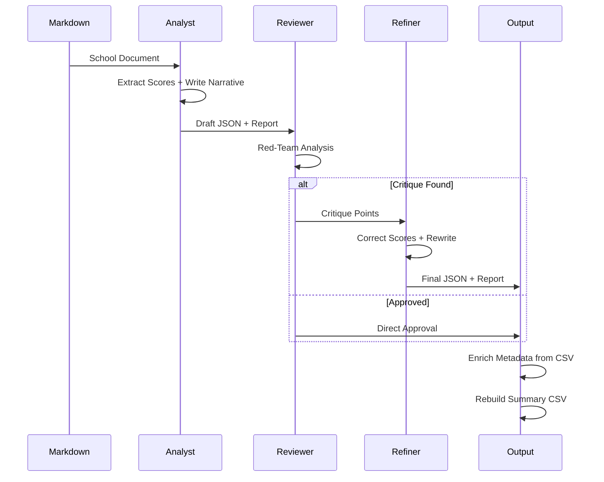

# Workflow Diagram

## Pipeline Overview

```mermaid
flowchart TD
    subgraph Input["📥 Input Phase"]
        PDF[("PTOF PDF Files<br/>ptof_inbox/")]
        CONVERT["convert_pdfs_to_md.py"]
        MD[("Markdown Files<br/>ptof_md/")]
    end

    subgraph Metadata["📋 Metadata Sources"]
        REGISTRY[("School Registry<br/>SchoolDatabase")]
        COMUNI[("Comuni Database<br/>comuni_italiani.json")]
    end

    subgraph Agents["🤖 3-Agent Pipeline"]
        ANALYST["🔍 Analyst<br/>(gemma3:27b)"]
        REVIEWER["⚖️ Reviewer<br/>(qwen3:32b)"]
        REFINER["✨ Refiner<br/>(gemma3:27b)"]
    end

    subgraph Output["📤 Output Phase"]
        JSON[("Analysis JSON<br/>analysis_results/")]
        REPORT[("MD Report<br/>analysis_results/")]
        CSV[("Summary CSV<br/>data/")]
        DASH["📊 Dashboard<br/>localhost:8501"]
    end

    PDF --> CONVERT --> MD
    MD --> ANALYST
    ANALYST --> |"Draft"| REVIEWER
    REVIEWER --> |"Critique"| REFINER
    REFINER --> JSON
    REFINER --> REPORT
    
    REGISTRY --> JSON
    COMUNI --> JSON
    
    JSON --> |"autofill_region_from_comuni.py"| JSON
    JSON --> |"rebuild_csv_clean.py"| CSV
    CSV --> DASH
```

## Agent Flow Detail

## Scoring Dimensions

| Code | Dimension | Sub-indicators |
|------|-----------|----------------|
| 2.1 | Sezione Dedicata | Presenza, Chiarezza |
| 2.2 | Partnership | Partner nominati, Count |
| 2.3 | Finalità | Attitudini, Interessi, Progetto Vita, Transizioni, Capacità |
| 2.4 | Obiettivi | Abbandono, Continuità, NEET, Lifelong |
| 2.5 | Governance | Coordinamento, Dialogo, Genitori, Monitoraggio, Inclusione |
| 2.6 | Didattica | Esperienza, Laboratoriale, Flessibilità, Interdisciplinare |
| 2.7 | Opportunità | Culturali, Espressive, Ricreative, Volontariato, Sport |
