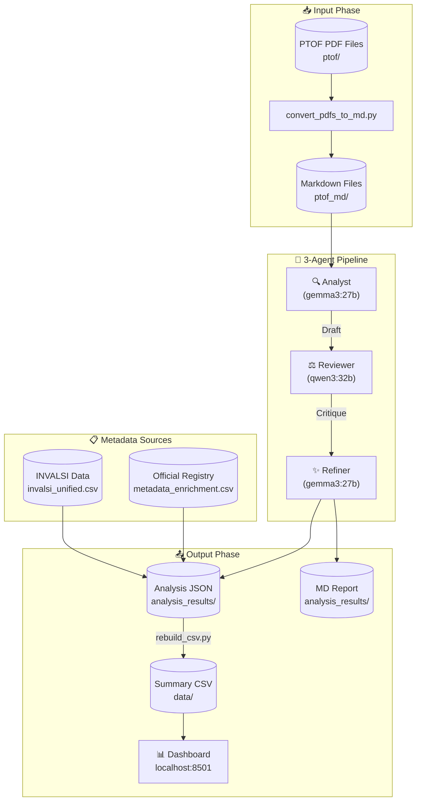
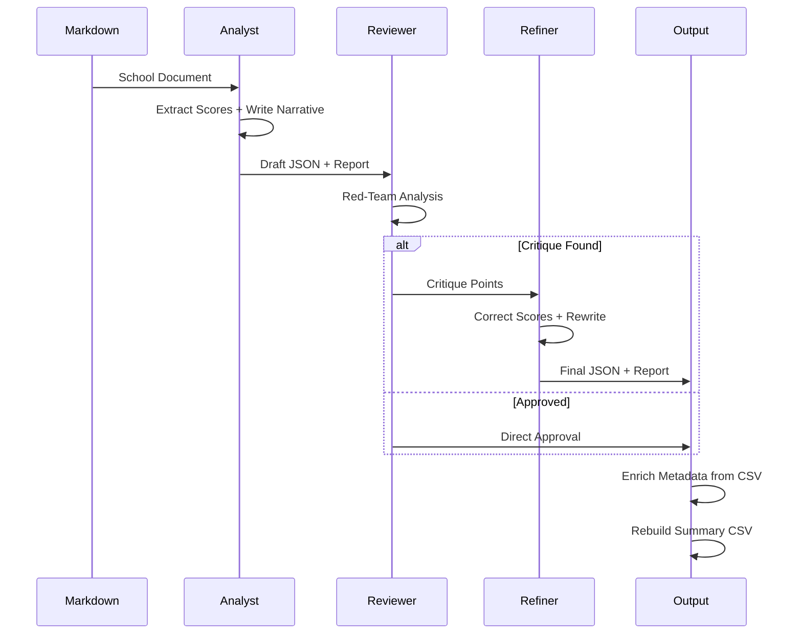

# Workflow Diagram

## Pipeline Overview

## Agent Flow Detail

## Scoring Dimensions

| Code | Dimension | Sub-indicators |
|------|-----------|----------------|
| 2.1 | Sezione Dedicata | Presenza, Chiarezza |
| 2.2 | Partnership | Partner nominati, Count |
| 2.3 | Finalità | Attitudini, Interessi, Progetto Vita, Transizioni, Capacità |
| 2.4 | Obiettivi | Abbandono, Continuità, NEET, Lifelong |
| 2.5 | Governance | Coordinamento, Dialogo, Genitori, Monitoraggio, Inclusione |
| 2.6 | Didattica | Esperienza, Laboratoriale, Flessibilità, Interdisciplinare |
| 2.7 | Opportunità | Culturali, Espressive, Ricreative, Volontariato, Sport |
