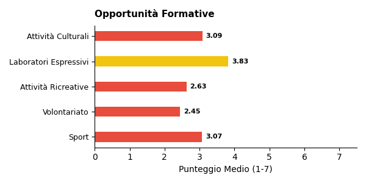

# Report di Sintesi sull'Orientamento nei PTOF — I Grado

*Target Analisi: I Grado*
*Generato con: openrouter / z-ai/glm-5*

## Premessa: Cosa Misuriamo e Perché

Questo report analizza i **PTOF** (Piani Triennali dell'Offerta Formativa) delle scuole italiane per misurarne la **copertura informativa** in tema di orientamento: quanto e come il documento descrive le pratiche, i progetti e le strategie che la scuola adotta per orientare gli studenti.

È importante chiarire fin da subito un principio fondamentale: **i punteggi che seguono non esprimono un giudizio sulla qualità della scuola**, ma sulla ricchezza e completezza della documentazione contenuta nel PTOF. Una scuola con un punteggio basso potrebbe svolgere ottime attività di orientamento senza averle descritte nel proprio piano; viceversa, un punteggio alto indica che il PTOF documenta in modo dettagliato e strutturato le proprie pratiche orientative.

## Come Funziona l'Analisi

L'analisi automatizzata legge e interpreta il testo del PTOF su due livelli complementari.

1. **Analisi Strutturale (Compliance)**: Il sistema verifica la conformità formale rispetto alle Linee Guida per l'orientamento scolastico stabilite dal D.M. 328/2022, il decreto ministeriale che ha introdotto l'obbligo per ogni scuola di dedicare almeno 30 ore annuali a moduli di orientamento formativo e di individuare figure dedicate (tutor e docente orientatore). In concreto, si verifica se il PTOF contiene una sezione esplicitamente dedicata all'orientamento, valutandone la visibilità e la struttura nel documento.

2. **Analisi Semantica e di Contenuto**: Attraverso modelli di linguaggio avanzati (LLM), l'analisi "legge" l'intero documento per estrarre informazioni sulla copertura delle 6 dimensioni del framework di valutazione (descritte nella sezione successiva). In questa fase, vengono distinte le semplici dichiarazioni di intenti dalle azioni concrete, mappando la presenza di progetti, risorse, tempi e responsabilità. L'algoritmo rileva il contesto in cui appaiono i termini: ad esempio, distingue se l'orientamento è citato in una lista generica oppure se è descritto attraverso laboratori con obiettivi specifici e modalità di verifica.

## Le 6 Dimensioni del Framework di Valutazione

L'analisi semantica valuta la copertura del PTOF attraverso **6 dimensioni**. Ognuna rappresenta un aspetto fondamentale dell'orientamento scolastico: dalla struttura organizzativa alle finalità educative, dalle metodologie didattiche alle opportunità offerte agli studenti. Di seguito, ciascuna dimensione è descritta con i propri sotto-indicatori.

### Dimensione Strutturale e di Contesto
Valuta se l'orientamento ha una collocazione riconoscibile all'interno del PTOF e se la scuola è inserita in un tessuto di relazioni territoriali.
- **Sezione dedicata**: Presenza di un capitolo o paragrafo esplicitamente intitolato all'orientamento, non frammentato tra diverse parti del documento.
- **Partnership e reti territoriali**: Qualità del coinvolgimento di soggetti esterni (Università, ITS, imprese, Terzo Settore), con attenzione ad attività congiunte e accordi formali.

### Finalità dell'Orientamento
Analizza gli obiettivi formativi che la scuola si pone attraverso le attività di orientamento.
- **Attitudini e Talenti**: Azioni per aiutare gli studenti a scoprire i propri punti di forza e inclinazioni personali.
- **Interessi Professionali**: Percorsi di esplorazione degli ambiti disciplinari e del mondo del lavoro.
- **Progetto di Vita**: Supporto alla costruzione di una traiettoria personale di lungo termine.
- **Transizioni Formative**: Accompagnamento nei passaggi critici tra cicli scolastici (primaria-secondaria, secondaria-università/lavoro).
- **Capacità Orientativa (Empowerment)**: Sviluppo di competenze trasversali che rendano lo studente autonomo nelle proprie scelte.

### Obiettivi di Incidenza
Misura l'attenzione del PTOF verso gli impatti sociali dell'orientamento.
- **Contrasto alla Dispersione**: Strategie di prevenzione dell'abbandono scolastico e iniziative di rimotivazione.
- **Riduzione dei NEET**: Azioni di collegamento scuola-lavoro per favorire l'occupabilità e contrastare il fenomeno dei giovani che non studiano né lavorano.
- **Continuità Territoriale**: Costruzione di ponti tra i diversi gradi di istruzione presenti sul territorio.
- **Lifelong Learning**: Concezione dell'orientamento come competenza permanente, utile per tutta la vita.

### Governance e Organizzazione
Esamina il modello organizzativo interno: chi fa cosa e come si coordina l'azione orientativa.
- **Coordinamento**: Presenza di figure dedicate come Funzioni Strumentali, referenti o commissioni per l'orientamento.
- **Dialogo Interno**: Coinvolgimento dei Consigli di Classe e dei docenti nella progettazione orientativa.
- **Alleanza con le Famiglie**: Iniziative strutturate di comunicazione e collaborazione con i genitori.
- **Monitoraggio**: Utilizzo di strumenti di feedback, questionari e dati per valutare l'efficacia delle azioni.
- **Inclusione**: Attenzione specifica a studenti con BES/DSA, studenti stranieri e situazioni di fragilità.

### Didattica Orientativa
Valuta il passaggio dalle dichiarazioni di principio alle pratiche concrete in aula.
- **Didattica Laboratoriale ed Esperienziale**: Attività basate sul *learning by doing* e sull'apprendimento attivo.
- **Centralità dello Studente**: Ruolo attivo degli studenti nella co-progettazione dei percorsi orientativi.
- **Interdisciplinarità**: Integrazione dell'orientamento nelle diverse discipline curricolari, non solo come attività aggiuntiva.
- **Flessibilità Organizzativa**: Adattamento di spazi, tempi e gruppi per favorire esperienze orientative efficaci.

### Opportunità Formative
Mappa l'ecosistema delle proposte extracurricolari e integrative offerte dalla scuola.
- **Attività Culturali e Artistiche**: Progetti di teatro, musica, scrittura creativa, visite a musei.
- **Laboratori Espressivi**: Percorsi manuali, artigianali o digitali che favoriscono la scoperta di talenti.
- **Sport e Attività Ricreative**: Offerta sportiva e ludica come strumento di socializzazione e benessere.
- **Volontariato e Service Learning**: Esperienze di impegno civico che collegano apprendimento e comunità.

## Dal Qualitativo al Quantitativo: la Scala di Punteggio

Ciascuna delle 6 dimensioni appena descritte viene valutata attraverso una **scala numerica da 1 a 7**, detta scala di copertura informativa. Si tratta di una scala ordinale di tipo Likert — uno strumento consolidato nella ricerca sociale che consente di tradurre valutazioni qualitative in punteggi confrontabili.

Il punteggio riflette il livello di dettaglio con cui il PTOF documenta le pratiche orientative per quella dimensione: da 1 (nessun riferimento) a 7 (documentazione sistematica con evidenze di miglioramento continuo). La tabella seguente descrive ogni livello.

\begin{tabularx}{\textwidth}{@{} c l X @{}}
\toprule
\textbf{Punti} & \textbf{Livello} & \textbf{Cosa significa} \\
\midrule
1 & Assente & Nessun riferimento all'orientamento nel documento. \\
2 & Traccia minima & Menzione vaga o copia-incolla di testo normativo, senza personalizzazione. \\
3 & Parziale & Intenzione dichiarata, ma senza dettagli su come viene attuata. \\
4 & Di base & Azioni descritte in modo chiaro ma essenziale, senza approfondimento. \\
5 & Strutturata & Azioni dettagliate con metodologie esplicitate e risorse indicate. \\
6 & Approfondita & Azioni integrate nel curricolo, con indicatori di monitoraggio documentati. \\
7 & Esaustiva & Documentazione sistematica e ciclica, con evidenze di revisione e miglioramento. \\
\bottomrule
\end{tabularx}

## L'Indice Sintetico: IIPO

Per avere una visione d'insieme della copertura documentale di ciascuna scuola, i punteggi delle 6 dimensioni vengono riassunti in un unico indicatore: l'**IIPO** (Indice di Documentazione delle Pratiche di Orientamento).

L'IIPO è calcolato come **media aritmetica semplice** dei punteggi delle 6 dimensioni (Strutturale, Finalità, Obiettivi, Governance, Didattica, Opportunità). Si è scelta una media non pesata per evitare di privilegiare a priori una dimensione rispetto alle altre, trattandole tutte come ugualmente rilevanti.

**Come leggere l'IIPO:**
- Un IIPO di **5.0** indica che, in media, il PTOF documenta le pratiche orientative a un livello "Strutturato" su tutte le dimensioni.
- Un IIPO di **3.0** segnala una documentazione complessivamente "Parziale".

**Limiti da tenere presenti:**
- *Effetto compensazione*: Essendo una media, l'IIPO può mascherare squilibri tra le dimensioni. Ad esempio, una scuola con punteggio 7 su Didattica e 1 su Governance otterrebbe un IIPO apparentemente nella norma. Per questo motivo, l'IIPO va sempre letto insieme ai punteggi delle singole dimensioni.
- *Sensibilità incrementale*: La scala a 7 livelli consente di cogliere differenze graduali tra scuole, evitando la polarizzazione tipica delle scale più strette (es. 1-3).

## Approccio Analitico: Raggruppamento per Affinità

Oltre all'analisi dimensionale, il report utilizza una tecnica di **raggruppamento automatico** (clustering) per evitare di appiattire i risultati su una semplice media nazionale.

Il funzionamento è il seguente: il sistema analizza i profili di punteggio di tutte le scuole e individua **gruppi di istituti** che presentano caratteristiche documentali simili. Nel campione corrente sono stati identificati **5 gruppi omogenei** — ad esempio, un gruppo potrebbe riunire scuole con forte attenzione ai PCTO e alle partnership territoriali, mentre un altro potrebbe raccogliere istituti che privilegiano la didattica laboratoriale.

Per ciascun gruppo viene generata una **sintesi tematica** che descrive l'approccio dominante su ogni dimensione. Queste sintesi intermedie vengono poi integrate nel report finale, permettendo di confrontare i diversi "profili di orientamento" e di evidenziare sia le tendenze comuni sia le eccezioni virtuose.

## Analisi e Copertura del Campione (I Grado)

Questa sezione descrive la composizione del campione analizzato e ne valuta la **rappresentatività** rispetto all'universo delle scuole italiane. Comprendere la struttura del campione è essenziale per interpretare correttamente i risultati: un campione ben bilanciato consente di generalizzare le osservazioni; un campione sbilanciato richiede cautela nell'estendere le conclusioni a tutto il sistema scolastico.

Per ogni dimensione di confronto (gestione, area geografica, contesto territoriale) la tabella riporta tre valori:
- **Osservato %**: la percentuale nel nostro campione.
- **Atteso % (MIUR)**: la percentuale nell'universo reale delle scuole italiane, ricavata dai dati ministeriali.
- **Deviazione (pp)**: la differenza tra osservato e atteso, espressa in *punti percentuali*. Deviazioni entro ±5 pp sono trascurabili; tra 5 e 15 pp segnalano un lieve squilibrio; oltre 15 pp indicano una sovra- o sotto-rappresentazione significativa.

### Statistiche Generali

- **Scuole Analizzate**: **246** PTOF di scuole I Grado
- **Province Coperte**: 84 (su 107 totali)
- **Regioni Coperte**: 18/20

Il campione copre la quasi totalità delle regioni italiane, garantendo una visione nazionale.

### Bilanciamento Gestione (Statale vs Paritaria)

In Italia, le scuole statali rappresentano la grande maggioranza degli istituti. Un campione rappresentativo dovrebbe riflettere questa proporzione. Una sovra-rappresentazione delle paritarie, ad esempio, potrebbe influenzare i risultati perché i PTOF delle scuole paritarie tendono ad avere strutture e contenuti diversi da quelli delle statali.

\begin{tabularx}{\textwidth}{@{} p{3cm} c c c @{}}
\toprule
\textbf{Tipo} & \textbf{Osservato \%} & \textbf{Atteso \% (MIUR)} & \textbf{Deviazione} \\
\midrule
Statale & 76.0\% & 92.0\% & -16.0 pp \\
Paritaria & 24.0\% & 8.0\% & +16.0 pp \\
\bottomrule
\end{tabularx}

### Distribuzione Geografica per Macro-Area

L'Italia presenta significative differenze territoriali nell'offerta formativa. Per valutare se il campione rispecchia la distribuzione reale delle scuole, confrontiamo le cinque macro-aree geografiche (Nord Ovest, Nord Est, Centro, Sud, Isole) con i dati MIUR. Una buona rappresentatività geografica è fondamentale perché le pratiche di orientamento possono variare sensibilmente tra Nord e Sud, tra aree urbane e rurali.

\begin{tabularx}{\textwidth}{@{} X c c c @{}}
\toprule
\textbf{Area} & \textbf{Osservato \%} & \textbf{Atteso \% (MIUR)} & \textbf{Deviazione} \\
\midrule
Nord Ovest & 15.9\% & 26.6\% & -10.7 pp \\
Nord Est & 18.3\% & 19.3\% & -1.0 pp \\
Centro & 27.6\% & 19.9\% & +7.7 pp \\
Sud & 29.3\% & 23.3\% & +6.0 pp \\
Isole & 8.9\% & 10.9\% & -2.0 pp \\
\bottomrule
\end{tabularx}

⚠️ **Campione con Lievi Disallineamenti**: Si notano alcune sovra/sottorappresentazioni geografiche, che tuttavia non invalidano l'analisi complessiva (deviazione max < 15 pp).

### Distribuzione Territoriale (Aree Metropolitane vs Non Metropolitane)

Le scuole situate nelle 14 città metropolitane italiane operano in contesti diversi rispetto a quelle di provincia: maggiore offerta formativa esterna, più partnership con università e imprese, ma anche maggiore competizione tra istituti. Questa distinzione aiuta a capire se i risultati del report sono influenzati da una prevalenza di scuole urbane o rurali nel campione.

\begin{tabularx}{\textwidth}{@{} X c c c @{}}
\toprule
\textbf{Area} & \textbf{Osservato \%} & \textbf{Atteso \% (Stima)} & \textbf{Deviazione} \\
\midrule
Metropolitana & 38.6\% & 33.0\% & +5.6 pp \\
Non Metropolitana & 61.4\% & 67.0\% & -5.6 pp \\
\bottomrule
\end{tabularx}

### Come Leggere Questi Dati

I dati sopra si riferiscono al sottocampione **I Grado** e sono confrontati con i benchmark MIUR per lo stesso ordine scolastico. In sintesi: dove la deviazione è contenuta (entro ±5 pp), i risultati del report possono essere considerati generalizzabili con buona confidenza; dove la deviazione è più ampia, le conclusioni vanno interpretate tenendo conto dello squilibrio — ad esempio, se il Sud è sovra-rappresentato, i punteggi medi potrebbero riflettere maggiormente le pratiche delle scuole meridionali.

\newpage

\newpage

## Sintesi Quantitativa: Le Dimensioni dell'Orientamento

Di seguito il dettaglio dei punteggi medi rilevati per le dimensioni e i relativi sotto-indicatori.
### Dimensione Strutturale (Compliance)
**Media: 2.39** (dev.std: 1.67)

### Finalità dell'Orientamento

\begin{tabularx}{\textwidth}{@{} X c c @{}}
\toprule
\textbf{Indicatore} & \textbf{Media} & \textbf{Dev. Std.} \\
\midrule
\textbf{Totale Dimensione} & \textbf{3.51} & \textbf{1.09} \\
Attitudini e Talenti & 3.65 & 1.13 \\
Interessi Professionali & 3.67 & 1.16 \\
Progetto di Vita & 3.38 & 1.32 \\
Transizioni Formative & 3.56 & 1.24 \\
Capacità Orientative & 3.24 & 1.41 \\
\bottomrule
\end{tabularx}

### Obiettivi di Incidenza

\begin{tabularx}{\textwidth}{@{} X c c @{}}
\toprule
\textbf{Indicatore} & \textbf{Media} & \textbf{Dev. Std.} \\
\midrule
\textbf{Totale Dimensione} & \textbf{3.10} & \textbf{1.11} \\
Contrasto Dispersione & 2.80 & 1.56 \\
Continuità Territorio & 3.55 & 1.25 \\
Riduzione NEET & 2.04 & 1.35 \\
Lifelong Learning & 3.26 & 1.35 \\
\bottomrule
\end{tabularx}

### Governance e Organizzazione

\begin{tabularx}{\textwidth}{@{} X c c @{}}
\toprule
\textbf{Indicatore} & \textbf{Media} & \textbf{Dev. Std.} \\
\midrule
\textbf{Totale Dimensione} & \textbf{3.61} & \textbf{1.05} \\
Coordinamento & 3.50 & 1.24 \\
Dialogo Interno & 3.57 & 1.22 \\
Alleanza Famiglie & 4.05 & 1.10 \\
Monitoraggio & 2.79 & 1.43 \\
Inclusione & 3.92 & 1.20 \\
\bottomrule
\end{tabularx}

### Didattica Orientativa

\begin{tabularx}{\textwidth}{@{} X c c @{}}
\toprule
\textbf{Indicatore} & \textbf{Media} & \textbf{Dev. Std.} \\
\midrule
\textbf{Totale Dimensione} & \textbf{3.62} & \textbf{1.01} \\
Centralità Studente & 3.85 & 1.21 \\
Didattica Laboratoriale & 3.52 & 1.31 \\
Flessibilità & 3.32 & 1.30 \\
Interdisciplinarità & 3.72 & 1.10 \\
\bottomrule
\end{tabularx}

### Opportunità Formative

\begin{tabularx}{\textwidth}{@{} X c c @{}}
\toprule
\textbf{Indicatore} & \textbf{Media} & \textbf{Dev. Std.} \\
\midrule
\textbf{Totale Dimensione} & \textbf{3.07} & \textbf{1.11} \\
Attività Culturali & 3.09 & 1.39 \\
Laboratori Espressivi & 3.83 & 1.31 \\
Attività Ricreative & 2.63 & 1.22 \\
Volontariato & 2.45 & 1.40 \\
Sport & 3.07 & 1.38 \\
\bottomrule
\end{tabularx}

*Legenda Giudizi: Ampiamente documentato (>= 5.0), Parzialmente documentato (3.5-4.9), Poco documentato (< 3.5)*

\newpage

## Sintesi Quantitativa: Le Dimensioni dell'Orientamento

Di seguito il dettaglio dei punteggi medi rilevati per le dimensioni e i relativi sotto-indicatori.
### Dimensione Strutturale (Compliance)
**Media: 2.39** (dev.std: 1.67)

### Finalità dell'Orientamento

\begin{tabularx}{\textwidth}{@{} X c c @{}}
\toprule
\textbf{Indicatore} & \textbf{Media} & \textbf{Dev. Std.} \\
\midrule
\textbf{Totale Dimensione} & \textbf{3.51} & \textbf{1.09} \\
Attitudini e Talenti & 3.65 & 1.13 \\
Interessi Professionali & 3.67 & 1.16 \\
Progetto di Vita & 3.38 & 1.32 \\
Transizioni Formative & 3.56 & 1.24 \\
Capacità Orientative & 3.24 & 1.41 \\
\bottomrule
\end{tabularx}

### Obiettivi di Incidenza

\begin{tabularx}{\textwidth}{@{} X c c @{}}
\toprule
\textbf{Indicatore} & \textbf{Media} & \textbf{Dev. Std.} \\
\midrule
\textbf{Totale Dimensione} & \textbf{3.10} & \textbf{1.11} \\
Contrasto Dispersione & 2.80 & 1.56 \\
Continuità Territorio & 3.55 & 1.25 \\
Riduzione NEET & 2.04 & 1.35 \\
Lifelong Learning & 3.26 & 1.35 \\
\bottomrule
\end{tabularx}

### Governance e Organizzazione

\begin{tabularx}{\textwidth}{@{} X c c @{}}
\toprule
\textbf{Indicatore} & \textbf{Media} & \textbf{Dev. Std.} \\
\midrule
\textbf{Totale Dimensione} & \textbf{3.61} & \textbf{1.05} \\
Coordinamento & 3.50 & 1.24 \\
Dialogo Interno & 3.57 & 1.22 \\
Alleanza Famiglie & 4.05 & 1.10 \\
Monitoraggio & 2.79 & 1.43 \\
Inclusione & 3.92 & 1.20 \\
\bottomrule
\end{tabularx}

### Didattica Orientativa

\begin{tabularx}{\textwidth}{@{} X c c @{}}
\toprule
\textbf{Indicatore} & \textbf{Media} & \textbf{Dev. Std.} \\
\midrule
\textbf{Totale Dimensione} & \textbf{3.62} & \textbf{1.01} \\
Centralità Studente & 3.85 & 1.21 \\
Didattica Laboratoriale & 3.52 & 1.31 \\
Flessibilità & 3.32 & 1.30 \\
Interdisciplinarità & 3.72 & 1.10 \\
\bottomrule
\end{tabularx}

### Opportunità Formative

\begin{tabularx}{\textwidth}{@{} X c c @{}}
\toprule
\textbf{Indicatore} & \textbf{Media} & \textbf{Dev. Std.} \\
\midrule
\textbf{Totale Dimensione} & \textbf{3.07} & \textbf{1.11} \\
Attività Culturali & 3.09 & 1.39 \\
Laboratori Espressivi & 3.83 & 1.31 \\
Attività Ricreative & 2.63 & 1.22 \\
Volontariato & 2.45 & 1.40 \\
Sport & 3.07 & 1.38 \\
\bottomrule
\end{tabularx}

*Legenda Giudizi: Ampiamente documentato (>= 5.0), Parzialmente documentato (3.5-4.9), Poco documentato (< 3.5)*

\newpage

## Analisi e Copertura del Campione (I Grado)

**Statistiche Generali**
- Scuole Analizzate: **246**
- Province Coperte: 84
- Regioni Coperte: 18/20

**Bilanciamento Gestione (Statale vs Paritaria)**

\begin{tabularx}{\textwidth}{@{} p{3cm} c c c @{}}
\toprule
\textbf{Tipo} & \textbf{Osservato \%} & \textbf{Atteso \% (MIUR)} & \textbf{Deviazione} \\
\midrule
Statale & 76.0\% & 92.0\% & -16.0 pp \\
Paritaria & 24.0\% & 8.0\% & +16.0 pp \\
\bottomrule
\end{tabularx}

**Distribuzione Geografica per Macro-Area**

\begin{tabularx}{\textwidth}{@{} X c c c @{}}
\toprule
\textbf{Area} & \textbf{Osservato \%} & \textbf{Atteso \% (MIUR)} & \textbf{Deviazione} \\
\midrule
Nord Ovest & 15.9\% & 26.6\% & -10.7 pp \\
Nord Est & 18.3\% & 19.3\% & -1.0 pp \\
Centro & 27.6\% & 19.9\% & +7.7 pp \\
Sud & 29.3\% & 23.3\% & +6.0 pp \\
Isole & 8.9\% & 10.9\% & -2.0 pp \\
\bottomrule
\end{tabularx}

⚠️ **Campione con Lievi Disallineamenti**: Si notano alcune sovra/sottorappresentazioni geografiche, che tuttavia non invalidano l'analisi complessiva (deviazione max < 15 pp).

**Distribuzione Territoriale (Aree Metropolitane)**

\begin{tabularx}{\textwidth}{@{} X c c c @{}}
\toprule
\textbf{Area} & \textbf{Osservato \%} & \textbf{Atteso \% (Stima)} & \textbf{Deviazione} \\
\midrule
Metropolitana & 38.6\% & 33.0\% & +5.6 pp \\
Non Metropolitana & 61.4\% & 67.0\% & -5.6 pp \\
\bottomrule
\end{tabularx}

*Nota: I dati sopra si riferiscono specificamente al sottocampione analizzato (I Grado) e sono confrontati con i benchmark MIUR di riferimento per tale ordine scolastico.*

\newpage

## Sintesi Quantitativa: Le Dimensioni dell'Orientamento

Di seguito il dettaglio dei punteggi medi rilevati per le dimensioni e i relativi sotto-indicatori.
### Dimensione Strutturale (Compliance)
**Media: 2.39** (dev.std: 1.67)

### Finalità dell'Orientamento

\begin{tabularx}{\textwidth}{@{} X c c @{}}
\toprule
\textbf{Indicatore} & \textbf{Media} & \textbf{Dev. Std.} \\
\midrule
\textbf{Totale Dimensione} & \textbf{3.51} & \textbf{1.09} \\
Attitudini e Talenti & 3.65 & 1.13 \\
Interessi Professionali & 3.67 & 1.16 \\
Progetto di Vita & 3.38 & 1.32 \\
Transizioni Formative & 3.56 & 1.24 \\
Capacità Orientative & 3.24 & 1.41 \\
\bottomrule
\end{tabularx}

### Obiettivi di Incidenza

\begin{tabularx}{\textwidth}{@{} X c c @{}}
\toprule
\textbf{Indicatore} & \textbf{Media} & \textbf{Dev. Std.} \\
\midrule
\textbf{Totale Dimensione} & \textbf{3.10} & \textbf{1.11} \\
Contrasto Dispersione & 2.80 & 1.56 \\
Continuità Territorio & 3.55 & 1.25 \\
Riduzione NEET & 2.04 & 1.35 \\
Lifelong Learning & 3.26 & 1.35 \\
\bottomrule
\end{tabularx}

### Governance e Organizzazione

\begin{tabularx}{\textwidth}{@{} X c c @{}}
\toprule
\textbf{Indicatore} & \textbf{Media} & \textbf{Dev. Std.} \\
\midrule
\textbf{Totale Dimensione} & \textbf{3.61} & \textbf{1.05} \\
Coordinamento & 3.50 & 1.24 \\
Dialogo Interno & 3.57 & 1.22 \\
Alleanza Famiglie & 4.05 & 1.10 \\
Monitoraggio & 2.79 & 1.43 \\
Inclusione & 3.92 & 1.20 \\
\bottomrule
\end{tabularx}

### Didattica Orientativa

\begin{tabularx}{\textwidth}{@{} X c c @{}}
\toprule
\textbf{Indicatore} & \textbf{Media} & \textbf{Dev. Std.} \\
\midrule
\textbf{Totale Dimensione} & \textbf{3.62} & \textbf{1.01} \\
Centralità Studente & 3.85 & 1.21 \\
Didattica Laboratoriale & 3.52 & 1.31 \\
Flessibilità & 3.32 & 1.30 \\
Interdisciplinarità & 3.72 & 1.10 \\
\bottomrule
\end{tabularx}

### Opportunità Formative

\begin{tabularx}{\textwidth}{@{} X c c @{}}
\toprule
\textbf{Indicatore} & \textbf{Media} & \textbf{Dev. Std.} \\
\midrule
\textbf{Totale Dimensione} & \textbf{3.07} & \textbf{1.11} \\
Attività Culturali & 3.09 & 1.39 \\
Laboratori Espressivi & 3.83 & 1.31 \\
Attività Ricreative & 2.63 & 1.22 \\
Volontariato & 2.45 & 1.40 \\
Sport & 3.07 & 1.38 \\
\bottomrule
\end{tabularx}

*Legenda Giudizi: Ampiamente documentato (>= 5.0), Parzialmente documentato (3.5-4.9), Poco documentato (< 3.5)*

\newpage

## Analisi e Copertura del Campione (I Grado)

**Statistiche Generali**
- Scuole Analizzate: **246**
- Province Coperte: 84
- Regioni Coperte: 18/20

**Bilanciamento Gestione (Statale vs Paritaria)**

\begin{tabularx}{\textwidth}{@{} p{3cm} c c c @{}}
\toprule
\textbf{Tipo} & \textbf{Osservato \%} & \textbf{Atteso \% (MIUR)} & \textbf{Deviazione} \\
\midrule
Statale & 76.0\% & 92.0\% & -16.0 pp \\
Paritaria & 24.0\% & 8.0\% & +16.0 pp \\
\bottomrule
\end{tabularx}

**Distribuzione Geografica per Macro-Area**

\begin{tabularx}{\textwidth}{@{} X c c c @{}}
\toprule
\textbf{Area} & \textbf{Osservato \%} & \textbf{Atteso \% (MIUR)} & \textbf{Deviazione} \\
\midrule
Nord Ovest & 15.9\% & 26.6\% & -10.7 pp \\
Nord Est & 18.3\% & 19.3\% & -1.0 pp \\
Centro & 27.6\% & 19.9\% & +7.7 pp \\
Sud & 29.3\% & 23.3\% & +6.0 pp \\
Isole & 8.9\% & 10.9\% & -2.0 pp \\
\bottomrule
\end{tabularx}

⚠️ **Campione con Lievi Disallineamenti**: Si notano alcune sovra/sottorappresentazioni geografiche, che tuttavia non invalidano l'analisi complessiva (deviazione max < 15 pp).

**Distribuzione Territoriale (Aree Metropolitane)**

\begin{tabularx}{\textwidth}{@{} X c c c @{}}
\toprule
\textbf{Area} & \textbf{Osservato \%} & \textbf{Atteso \% (Stima)} & \textbf{Deviazione} \\
\midrule
Metropolitana & 38.6\% & 33.0\% & +5.6 pp \\
Non Metropolitana & 61.4\% & 67.0\% & -5.6 pp \\
\bottomrule
\end{tabularx}

*Nota: I dati sopra si riferiscono specificamente al sottocampione analizzato (I Grado) e sono confrontati con i benchmark MIUR di riferimento per tale ordine scolastico.*

\newpage

## Sintesi Quantitativa: Le Dimensioni dell'Orientamento

Di seguito il dettaglio dei punteggi medi rilevati per le dimensioni e i relativi sotto-indicatori.
### Dimensione Strutturale (Compliance)
**Media: 2.39** (dev.std: 1.67)

### Finalità dell'Orientamento

\begin{tabularx}{\textwidth}{@{} X c c @{}}
\toprule
\textbf{Indicatore} & \textbf{Media} & \textbf{Dev. Std.} \\
\midrule
\textbf{Totale Dimensione} & \textbf{3.51} & \textbf{1.09} \\
Attitudini e Talenti & 3.65 & 1.13 \\
Interessi Professionali & 3.67 & 1.16 \\
Progetto di Vita & 3.38 & 1.32 \\
Transizioni Formative & 3.56 & 1.24 \\
Capacità Orientative & 3.24 & 1.41 \\
\bottomrule
\end{tabularx}

### Obiettivi di Incidenza

\begin{tabularx}{\textwidth}{@{} X c c @{}}
\toprule
\textbf{Indicatore} & \textbf{Media} & \textbf{Dev. Std.} \\
\midrule
\textbf{Totale Dimensione} & \textbf{3.10} & \textbf{1.11} \\
Contrasto Dispersione & 2.80 & 1.56 \\
Continuità Territorio & 3.55 & 1.25 \\
Riduzione NEET & 2.04 & 1.35 \\
Lifelong Learning & 3.26 & 1.35 \\
\bottomrule
\end{tabularx}

### Governance e Organizzazione

\begin{tabularx}{\textwidth}{@{} X c c @{}}
\toprule
\textbf{Indicatore} & \textbf{Media} & \textbf{Dev. Std.} \\
\midrule
\textbf{Totale Dimensione} & \textbf{3.61} & \textbf{1.05} \\
Coordinamento & 3.50 & 1.24 \\
Dialogo Interno & 3.57 & 1.22 \\
Alleanza Famiglie & 4.05 & 1.10 \\
Monitoraggio & 2.79 & 1.43 \\
Inclusione & 3.92 & 1.20 \\
\bottomrule
\end{tabularx}

### Didattica Orientativa

\begin{tabularx}{\textwidth}{@{} X c c @{}}
\toprule
\textbf{Indicatore} & \textbf{Media} & \textbf{Dev. Std.} \\
\midrule
\textbf{Totale Dimensione} & \textbf{3.62} & \textbf{1.01} \\
Centralità Studente & 3.85 & 1.21 \\
Didattica Laboratoriale & 3.52 & 1.31 \\
Flessibilità & 3.32 & 1.30 \\
Interdisciplinarità & 3.72 & 1.10 \\
\bottomrule
\end{tabularx}

### Opportunità Formative

\begin{tabularx}{\textwidth}{@{} X c c @{}}
\toprule
\textbf{Indicatore} & \textbf{Media} & \textbf{Dev. Std.} \\
\midrule
\textbf{Totale Dimensione} & \textbf{3.07} & \textbf{1.11} \\
Attività Culturali & 3.09 & 1.39 \\
Laboratori Espressivi & 3.83 & 1.31 \\
Attività Ricreative & 2.63 & 1.22 \\
Volontariato & 2.45 & 1.40 \\
Sport & 3.07 & 1.38 \\
\bottomrule
\end{tabularx}

*Legenda Giudizi: Ampiamente documentato (>= 5.0), Parzialmente documentato (3.5-4.9), Poco documentato (< 3.5)*

\newpage

## Profili dei Cluster e Differenze

L'analisi cluster ha permesso di identificare cinque profili distinti tra le 244 scuole di I Grado esaminate, ciascuno caratterizzato da un diverso approccio alla documentazione delle pratiche di orientamento nei propri PTOF. La distribuzione rivela una concentrazione significativa nel Cluster 4, che con 125 istituti rappresenta oltre la metà del campione, mentre il Cluster 2 emerge come il gruppo più contenuto con sole 12 scuole.

Il Cluster 4, il più numeroso, si distingue per un approccio caratterizzato da presenza diffusa ma frammentata dell'orientamento all'interno dei documenti. Le scuole di questo gruppo menzionano le tematiche orientative in diverse sezioni del PTOF, integrandole in aree tematiche più ampie o come parte di progetti specifici, ma manca quasi sistematicamente una sezione autonoma e dedicata. Il focus dominante riguarda l'ampliamento dell'offerta formativa attraverso progetti specifici e collaborazioni esterne, con particolare attenzione alla prevenzione del disagio giovanile e allo sviluppo di competenze trasversali. Il monitoraggio, quando presente, si concentra prevalentemente sull'analisi dei risultati degli alunni e delle competenze docenti, finalizzata all'individuazione di aree di miglioramento piuttosto che alla costruzione di quadri strategici strutturati.

Il Cluster 0, con 67 scuole, rappresenta il secondo gruppo per dimensione e si caratterizza per un approccio definito integrato. A differenza del Cluster 4, qui l'orientamento è menzionato con maggiore consapevolezza in relazione agli obiettivi formativi e al miglioramento scolastico, sebbene anche in questo caso manchi una sezione organica dedicata. La distinzione principale rispetto al Cluster 4 risiede nell'attenzione specifica alla transizione tra i diversi gradi di istruzione e nell'ottimizzazione delle metodologie didattiche. Le scuole di questo cluster descrivono attività di monitoraggio orientate alla valutazione degli apprendimenti e al benessere degli studenti, con funzione di prevenzione dell'abbandono scolastico. Tuttavia, l'orientamento rimane spesso confinato alla fase di uscita e alla comunicazione di consigli alle famiglie.

Il Cluster 1, composto da 21 istituti, presenta un profilo peculiare incentrato sull'ottimizzazione dell'accoglienza e sullo sviluppo di competenze di base nella prima infanzia. L'orientamento è menzionato in modo implicito all'interno del curricolo o come tema trasversale, con un approccio prevalentemente reattivo. Le scuole di questo gruppo si concentrano su attività laboratoriali e progetti di ambientamento, con il monitoraggio focalizzato sul benessere psico-fisico degli studenti e sulla supervisione del personale. La criticità principale risiede nell'assenza di un piano d'azione definito per l'orientamento, ridotto spesso a dichiarazioni di intenti senza articolazione chiara per la transizione degli studenti.

Il Cluster 3, con 19 scuole, mostra una forte focalizzazione sull'Alternanza Scuola Lavoro come principale strumento di orientamento. Anche in questo caso prevale un approccio frammentario, con i riferimenti all'orientamento integrati marginalmente in ambiti più ampi come l'inclusione o l'offerta formativa. La differenza sostanziale rispetto al Cluster 2, che pur condivide alcuni tratti, sta nella quasi totale assenza di azioni orientative distinte dai progetti di ASL, spesso descritti in termini generici senza specificazione di obiettivi formativi precisi. La scuola Istituto San Giuseppe Calasanzio (CA1M4N500E) (Sardegna) rappresenta un caso emblematico, inserendo una sezione "Valutazione, Continuità E Orientamento" che tuttavia ammette la propria frammentazione e scarsa integrazione.

Il Cluster 2, il più contenuto con 12 scuole, si distingue per un approccio centrato sui Percorsi per le Competenze Trasversali e per l'Orientamento. La particolarità di questo gruppo risiede nel riconoscimento dichiarativo dell'importanza dell'orientamento, accompagnato tuttavia da una carenza diffusa nella definizione di strategie di implementazione concrete e sistemi di monitoraggio efficaci. Rispetto al Cluster 3, le scuole del Cluster 2 mostrano una maggiore attenzione alla formazione dei docenti, sebbene l'orientamento venga declinato quasi esclusivamente attraverso le attività di alternanza scuola-lavoro. Le scuole Ente Religioso Compassioniste Serve Di Maria (NA1E114004) (Campania) e Scuola Piccolo Uomo (RM1ES55005) (Lazio) costituiscono eccezioni positive, prevedendo l'integrazione di moduli dedicati.

La tendenza trasversale che emerge dall'analisi comparativa dei cinque cluster riguarda la sostanziale assenza di una strutturazione organica dell'orientamento nei PTOF delle scuole di I Grado. La distinzione principale tra i gruppi non risiede tanto nel livello di copertura informativa, generalmente compreso tra livelli parziali e di base, quanto piuttosto nel focus tematico dominante: mentre il Cluster 4 privilegia l'ampliamento dell'offerta formativa e il Cluster 0 si concentra sulla transizione e il miglioramento continuo, i Cluster 2 e 3 subordinano l'orientamento alle attività di PCTO e ASL. Il Cluster 1, infine, rappresenta un profilo a sé stante, con un orientamento implicito subordinato alle logiche dell'accoglienza e dell'ambientamento.

## Commento di Sintesi Generale

L'analisi dei 246 PTOF delle scuole secondarie di primo grado rivela un quadro complessivo in cui l'orientamento fatica a transitare da principio educativo generico a pilastro strategico dell'azione formativa. L'IIPO medio, calcolato come media ponderata delle cinque dimensioni, si attesta intorno a 3.4 su scala Likert 1-7 (1=Assente, 7=Copertura esaustiva), posizionandosi nella fascia tra "copertura parziale" e "copertura di base". Questo dato sintetizza una realtà documentale in cui l'orientamento è riconosciuto come tema rilevante, ma raramente tradotto in una pianificazione articolata e misurabile.

La dimensione più strutturata risulta essere la didattica orientativa, con un punteggio medio di 3.62 su 7, seguita dalla governance a 3.61 su 7. Al contrario, le opportunità formative e gli obiettivi specifici registrano le coperture più carenti, rispettivamente 3.07 e 3.10 su 7. Tale distribuzione suggerisce che le scuole hanno sviluppato una discreta consapevolezza delle metodologie didattiche orientative e dei meccanismi di coordinamento interno, mentre rimangono più opache le finalità strategiche e l'articolazione dell'offerta complementare. In particolare, gli obiettivi di contrasto alla dispersione e alla condizione NEET appaiono poco tematizzati nei documenti, nonostante la loro centralità nell'agenda normativa recente.

Un elemento ricorrente che emerge dall'analisi qualitativa è l'assenza pressoché sistematica di una sezione dedicata all'orientamento. La maggioranza delle scuole integra le tematiche orientative in capitoli più ampi, come l'offerta formativa, l'inclusione o il curricolo, senza conferire loro autonomia e visibilità. La scuola Istituto San Giuseppe Calasanzio (CA1M4N500E) (Sardegna) dichiara esplicitamente questa criticità, riconoscendo la frammentazione e la scarsa integrazione dell'orientamento nel piano complessivo. Analogamente, la scuola Itc-Itt-Itg "G. Marconi" - Penne (PETD03051X) (Abruzzo) evidenzia l'assenza di una trattazione unitaria e mirata, che limita l'efficacia dell'azione orientativa. Questo approccio frammentario sembra riflettere una concezione dell'orientamento come tema trasversale piuttosto che come dominio progettuale a sé stante.

Un fenomeno peculiare delle scuole di primo grado riguarda l'ambiguità semantica del termine "orientamento". Le evidenze testuali mostrano che in molti PTOF il vocabolo ricorre in accezione prevalentemente geografica, riferito alle competenze di orientamento spaziale. Nel curricolo di geografia della scuola I.C. "K. Wojtyla-G. Da Fiore (KRMM83101N) (Calabria) si legge che l'alunno "si orienta nello spazio e sulle carte di diversa scala in base ai punti cardinali e alle coordinate geografiche". Analogamente, la scuola Rogazionisti (PD1M007002) (Veneto) declina l'orientamento come capacità di "orientarsi nelle realtà territoriali locali". Questa polisemia riflette una sovrapposizione tra l'orientamento come competenza disciplinare e l'orientamento come processo formativo, che rischia di oscurare la dimensione propriamente educativa e vocazionale.

Tuttavia, non mancano segnali di una consapevolezza crescente. Alcune scuole hanno iniziato a recepire le indicazioni del DM 328/2022, strutturando moduli di orientamento formativo. La scuola Ente Religioso Compassioniste Serve Di Maria (NA1E114004) (Campania) e la scuola Scuola Piccolo Uomo (RM1ES55005) (Lazio) prevedono l'integrazione di moduli di almeno 30 ore nelle classi terze, quarte e quinte, dimostrando un impegno concreto verso la didattica orientativa. La scuola I.C.Breda (MIEE8EU01T) (Lombardia) organizza una "Settimana dell'orientamento" con visite a spazi formativi territoriali, mentre la scuola I.I.S. "Flacco-Battaglini" Venosa (PZIS02100C) (Basilicata) articola un percorso articolato in orientamento in entrata e in uscita, con finalità esplicitamente dichiarate di sostegno alla scelta.

L'analisi per cluster conferma l'assenza di una polarizzazione netta nel campione: tutti i gruppi mostrano caratteristiche simili di frammentazione e integrazione diffusa, senza distinzioni macroscopiche tra aree geografiche o contesti socio-economici. Il cluster più numeroso, con 125 scuole, presenta un approccio caratterizzato da presenza diffusa ma mancanza di sezione autonoma, suggerendo che questa configurazione rappresenta lo standard prevalente nel sistema scolastico di primo grado.

In sintesi, l'orientamento nelle scuole secondarie di primo grado si colloca in una fase di transizione normativa e culturale. La riforma avviata con il PNRR e le Linee guida del 2022 stanno gradualmente influenzando la documentazione, ma il processo di sedimentazione appare ancora incompleto. Le scuole dimostrano sensibilità al tema, ma faticano a tradurla in architetture documentali coerenti e in strategie monitorabili. Le sezioni successive del report approfondiranno le singole dimensioni, offrendo un quadro più analitico delle criticità e delle buone pratiche emerse.

## Allineamento Normativo e Approccio Innovativo

L'analisi dell'allineamento dei PTOF alle Linee Guida per l'Orientamento e al D.M. 328/2022 rivela un quadro complesso e disomogeneo, caratterizzato da un recepimento prevalentemente formale piuttosto che sostanziale delle disposizioni normative. Il punteggio medio di allineamento normativo si attesta a 2.39 su scala Likert 1-7 (1=Assente, 7=Copertura esaustiva), posizionandosi tra il livello di "traccia minima" e "copertura parziale". Questo dato indica che la maggior parte delle scuole di I Grado menziona le normative di riferimento in modo vago o come mero adempimento burocratico, senza tradurle in pratiche documentate e strutturate all'interno del piano triennale.

La distinzione tra recepimento formale e sostanziale emerge con chiarezza dall'analisi dei cluster. Il Cluster 3, che comprende 19 scuole, rappresenta l'esempio più evidente di una modalità puramente formale: ben 17 di esse integrano l'orientamento come sottosezione all'interno di altri capitoli, principalmente nell'Offerta Formativa, senza dedicargli uno spazio autonomo. Questa scelta editoriale denota una difficoltà interpretativa nel riconoscere l'orientamento come dimensione strategica e trasversale, piuttosto che come appendice marginale. Le evidenze testuali confermano tale tendenza: la scuola Istituto San Giuseppe Calasanzio (CA1M4N500E) [Sardegna] inserisce l'orientamento all'interno di una sezione "Valutazione, Continuità E Orientamento", mentre la scuola SS1E01300B [Sardegna] riserva al tema una menzione laterale, giudicata insufficiente per definire un approccio strategico.

Sul fronte delle figure dedicate, il punteggio medio di coordinamento dei servizi (2_5_azione_coordinamento_servizi_score) raggiunge 3.5 su 7, indicando una copertura informativa tra "parziale" e "di base". Tuttavia, le evidenze mostrano una sostanziale assenza di descrizione operativa del ruolo di tutor e orientatore. La scuola Scuola Secondaria Di I Grado Istituto Leone Xiii (MI1M08000T) [Lombardia] costituisce un'eccezione rilevante: il PTOF documenta "colloqui personali per gli studenti con il proprio Tutor di classe" per un totale di 12 ore, affiancati da un "percorso di riflessione personale" guidato dai docenti di Formazione Umana. Qui la figura tutoriale assume una connotazione attiva e strutturata, con ore dedicate e metodologie esplicitate, tra cui test sulle intelligenze multiple e colloqui individuali durante la settimana in montagna. Si tratta di un esempio di come il principio normativo possa tradursi in pratica documentata.

Per quanto riguarda i moduli da 30 ore previsti dal PNRR, l'analisi rivale una polarizzazione significativa. Il Cluster 4, con 125 scuole, mostra una tendenza a quantificare l'impegno orario, con interventi che si attestano proprio intorno alle 30 ore annuali per studente. Tuttavia, la quota predominante delle evidenze testuali proviene da istituti di II Grado, dove il modulo di orientamento formativo appare come categoria standardizzata. Per il I Grado, la scuola Cpia "Caltanissetta-Enna (ENMM70001R) [Sicilia] propone un'articolazione modulare interessante: le classi terze e quarte seguono cinque moduli che spaziano dalla gestione delle emozioni alla digitalizzazione, mentre le quinte si concentrano sulla transizione con incontri con università e ITS Academy. La scansione oraria è precisa (da 4 a 8 ore per modulo) e la copertura tematica ampia, suggerendo un recepimento sostanziale dell'orientamento come percorso formativo.

Le pratiche che vanno oltre il minimo sindacale rimangono sporadiche ma significative. La scuola Edoardo Agnelli (TOPS04500E) [Piemonte] integra moduli di orientamento formativo nei curricoli per le classi terze, quarte e quinte, dimostrando una visione longitudinale del percorso orientativo. Analogamente, la scuola Patronato S. Gaetano (VI1E00900T) [Veneto] implementa una rete di incontri per genitori e stage orientanti, estendendo l'azione orientativa al territorio e alle famiglie. Nondimeno, la maggioranza delle scuole rimane ancorata a una concezione dell'orientamento come evento, circoscritto a open day o iniziative isolate, senza una progettualità sistematica. La standardizzazione osservata nel Cluster 1, dove laboratori identici vengono proposti da scuole diverse senza personalizzazione, rappresenta l'altra faccia di un approccio burocratico alla normativa: si risponde all'obbligo di fare, ma senza interrogarsi sul senso pedagogico dell'azione.

## Rapporto con il Territorio

La costruzione dell'ecosistema orientativo con il territorio rappresenta un'area in cui le scuole del campione mostrano una copertura informativa parziale, con un punteggio medio di 3.55 su scala Likert 1-7 (1=Assente, 7=Copertura esaustiva) per l'obiettivo di continuità col territorio e di 3.50 su 7 per il coordinamento dei servizi. Questi valori, posizionandosi tra il livello di copertura parziale e quello di base, evidenziano come l'attenzione al territorio sia prevalentemente dichiarativa piuttosto che articolata in strategie documentate in modo approfondito.

La qualità delle partnership emerge come elemento disomogeneo. Sebbene le 246 scuole analizzate mostrino un impegno diffuso nel stabilire collaborazioni esterne, la maggior parte di queste si configura in accordi formali finalizzati all'erogazione di percorsi PCTO piuttosto che in partnership operative integrate nel curricolo. Il Cluster 4, che raggruppa 125 istituti, esemplifica questa tendenza concentrandosi su stage e tirocini aziendali, con convenzioni che spesso appaiono come risposta adempiativa alla normativa sull'alternanza scuola-lavoro. La scuola Istituto G.Parini - Liceo Scientifico (VEPS00500C) (Veneto) rappresenta un'eccezione rilevante, esplicitando un approccio volto al "mantenimento e allo sviluppo continuativo di convenzioni", segno di una visione meno episodica del rapporto con i partner esterni.

Per quanto riguarda gli attori coinvolti, le università emergono come partner privilegiati, specialmente nelle attività di tirocinio formativo. Dalle evidenze documentali emerge che molteplici scuole, come S.Vincenzo De'Paoli (RA1M005008) (Emilia-Romagna), sono "accreditate per lo svolgimento delle attività di tirocinio degli studenti universitari" in conformità ai decreti ministeriali 249/2010 e 93/2012. Analogamente, I.I.S. Caduti Della Direttissima (BOTD00901G) (Emilia-Romagna) e Istituto Istruzione Superiore "C. Levi (NATD08401G) (Campania) descrivono attività di "accoglienza studenti tirocinanti" dei corsi di Scienze della Formazione Primaria. Questo flusso inverso, con le scuole che fungono da contesto formativo per futuri docenti, rappresenta una forma di partnership bidirezionale che rafforza la continuità educativa sul territorio.

Tuttavia, il coinvolgimento di imprese e terzo settore appare meno strutturato. Il Cluster 0, con 67 scuole, mostra una tendenza più articolata verso collaborazioni con "imprese, enti territoriali, università e, in alcuni casi, realtà internazionali", come nel caso di Torpe' - "E. D'Arborea (NUAA84104B) (Sardegna) che utilizza la "simulazione d'impresa con professionisti del settore". Al contempo, il Cluster 1, comprendente 21 istituti, rivela un approccio radicalmente diverso, incentrato su collaborazioni prevalentemente interne con figure professionali specifiche, quali pediatri e personale sanitario, piuttosto che su partnership esterne complesse.

I percorsi PCTO costituiscono il dispositivo principale attraverso cui le scuole articolerano il rapporto col territorio, ma la loro descrizione oscilla tra l'adempimento formale e la vera esperienza orientativa. I Cluster 2 e 3, rispettivamente con 12 e 19 scuole, evidenziano una criticità significativa: il PCTO viene menzionato come "unica iniziativa significativa" senza dettagliare "specifici accordi o obiettivi di sviluppo territoriale", suggerendo una visione strumentale del collegamento col mondo esterno. Le evidenze testuali confermano questa tendenza: I.I.S. " L. Da Vinci - O. Colecchi (AQIS007009) (Abruzzo) descrive genericamente "percorsi di orientamento presso università" per studenti del terzo anno, mentre Itt Guido Dorso (AVTF070004) (Campania) articola meglio l'integrazione citando collaborazioni con "CTS, Università, ITS Academy, aziende".

La continuità educativa emerge come dimensione parzialmente sviluppata. Sebbene alcune scuole, come Iis "L. Della Valle" Cosenza (CSIS081003) (Calabria), si concentrino "esplicitamente sulla costituzione di reti collaborative con altre istituzioni", la maggioranza dei documenti non restituisce un dialogo sistematico e continuativo col territorio. L'eccezione significativa è rappresentata da I.C. Collegno G. Marconi (TOIC8CG002) (Piemonte), che estende il concetto di partnership includendo "la formazione dei docenti attraverso tirocini universitari", integrando così il territorio non solo come destinatario dell'orientamento studentesco, ma come risorsa per lo sviluppo professionale interno.

In sintesi, l'ecosistema orientativo col territorio appare in una fase di transizione: le partnership esistono e sono documentate, ma raramente raggiungono il livello di copertura strutturata che permetterebbe di considerarle parte integrante di un sistema orientativo organico e ciclico.

## Metodologie Didattiche

L'analisi delle metodologie didattiche per l'orientamento nelle scuole secondarie di I grado rivela un quadro caratterizzato da una tensione verso approcci attivi, sebbene la copertura informativa rimanga su livelli intermedi. Il punteggio medio di 3,52 su scala Likert 1-7 (dove 1=Assente e 7=Copertura esaustiva) per la didattica laboratoriale indica una posizione intermedia tra la copertura parziale e quella di base, mentre il punteggio di 3,85 su 7 per l'esperienza degli studenti suggerisce una descrizione leggermente più articolata delle pratiche esperienziali. La deviazione standard contenuta, intorno a 1,3 punti, segnala una relativa omogeneità nella documentazione tra gli istituti analizzati.

Per quanto concerne l'integrazione curricolare, i documenti PTOF esaminati mostrano una prevalenza di attività laboratoriali concepite come momenti aggiuntivi rispetto al curricolo ordinario, piuttosto che come modalità strutturante della didattica quotidiana. La scuola Istituto Omnicomprensivo Bobbio (PCMM819037) (Emilia-Romagna) [I Grado] documenta un'ampia offerta di laboratori didattici svolti in gruppi omogenei per età, tra cui coding, musica, scienze, educazione motoria, pittura, lettura, lingua cinese ed educazione alimentare. Tuttavia, l'enunciazione di tali proposte non è sempre accompagnata da una chiara esplicitazione di come queste si colleghino alle discipline curricolari in una prospettiva orientativa. La scuola S.Bernardo (FR1M00200A) (Lazio) [I Grado] riferisce che le metodologie laboratoriali sono ampiamente utilizzate per favorire l'apprendimento in piccoli gruppi e l'acquisizione di competenze pratiche, segnalando un tentativo di pervasività metodologica che tuttavia non emerge come standard diffuso.

La didattica attiva trova espressione prevalente in laboratori espressivi e creativi. La scuola Ic Via Ceneda (RMMM8GE01A) (Lazio) [I Grado] elenca diverse attività laboratoriali ed espressive, tra cui il mercatino di Natale, il laboratorio teatrale, l'animazione alla lettura e la costruzione di libri, e il progetto sulla tradizione locale. Analogamente, la scuola Elio Vittorini (RGMM81301Q) (Sicilia) [I Grado] descrive laboratori di musica, arte, teatro, informatica, lingua inglese e attività motoria. La scuola MI1M08000T (Lombardia) [I Grado] si distingue per una proposta più strutturata, che include il Rally Matematico Transalpino basato su problem solving e cooperative learning, il progetto di eccellenza Diamo i numeri, e laboratori opzionali come Science is Fun in inglese, robotica e storytelling, e ArTec che integra competenze digitali ed espressive. Quest'ultimo caso rappresenta una gemma rara in cui l'orientamento appare implicito nella didattica e integrato in modo organico.

Il protagonismo studentesco emerge in modo disomogeneo. Le evidenze testuali mostrano che gli studenti sono prevalentemente destinatari di proposte laboratoriali, più che soggetti attivi nella progettazione delle proprie esperienze formative. La scuola I.C. Perugia 1 "F. Morlacchi (PGMM85101R) (Umbria) [I Grado] dichiara un focus su metodologie esperienziali con approccio interdisciplinare, ma segnala un punteggio inferiore per la flessibilità degli spazi e dei tempi, elemento che potrebbe limitare la reale agenzialità degli studenti. La presenza diffusa di attività come coding e robotica educativa, documentata dalle scuole I.C. Alighieri Formia-Ventotene (LTMM818013), I. Omnicomprensivo S. Pertini (RIMM82401V) e I.C. Benedetto C Roce (AVMM807067) (tutte I Grado), indica una tendenza verso compiti di realtà che richiedono partecipazione attiva, sebbene la finalità orientativa di tali attività non sia sempre esplicitata.

L'originalità delle proposte metodologiche rimane confinata a casi isolati. La maggioranza delle scuole adotta approcci standard, con laboratori che ripropongono formule consolidate senza particolare innovazione didattica. Le eccezioni sono rappresentate da istituti che integrano metodologie come il debate, il digital storytelling o i hackathon, come nel caso del progetto InnovaMenti della scuola I.C. Spoleto 2 (PGEE84401P) (Umbria), o che collegano sistematicamente le attività laboratoriali allo sviluppo di competenze orientative documentate. La scuola BO1MUE500U (Emilia-Romagna) [I Grado] si limita a dichiarare il potenziamento delle metodologie laboratoriali senza ulteriori specificazioni, esemplificando l'approccio dichiarativo ma non dettagliato che caratterizza una porzione significativa del campione.

In sintesi, l'orientamento nella didattica delle scuole di I grado appare più frequentemente marginalizzato in attività isolate e aggiuntive, piuttosto che integrato in modo organico nelle pratiche curricolari quotidiane. La tensione verso metodologie attive è evidente, ma la sua traduzione in pratiche documentate e sistematiche rimanda a un percorso ancora in fase di sviluppo.

## Strumenti di Supporto

L'analisi degli strumenti operativi e digitali per l'orientamento nelle scuole di I Grado rivela un quadro eterogeneo, caratterizzato da una tensione tra l'adozione di tecnologie avanzate e una frammentaria integrazione degli stessi nei percorsi orientativi strutturati. Su un campione complessivo di 246 scuole, la diffusione di strumenti digitali emerge come elemento trasversale, sebbene con livelli di copertura informativa molto diversi tra i cluster identificati.

Per quanto riguarda l'E-Portfolio, lo strumento appare prevalentemente come dispositivo di consapevolezza piuttosto che come mero adempimento burocratico, almeno nelle scuole dove la sua implementazione è maggiormente strutturata. Il Cluster 4, che rappresenta il gruppo più numeroso con 125 istituti, evidenzia un approccio centrato sull'adozione di portfolio digitali come strumento per la documentazione e la riflessione sul percorso di studi. La scuola Giovanni Pascoli (FIPM02000L) (Toscana) implementa un e-Portfolio finalizzato a "documentare competenze e progetti di vita", suggerendo una concezione dello strumento orientata alla costruzione progressiva dell'identità dello studente piuttosto che alla semplice certificazione formale. Analogamente, la scuola F.De Pinedo- M. Colonna (RMIS127001) (Lazio) utilizza la piattaforma UNICA come "strumento digitale per raccogliere competenze e esperienze", indicando un uso sistematico e continuativo del portfolio. Tuttavia, la scuola Amm/Vo Per Il Turismo D. Panedda (SSTD09000T) (Sardegna) offre un esempio particolarmente articolato, prevedendo un supporto specifico agli studenti nella revisione e compilazione dell'e-portfolio, includendo la selezione di un "capolavoro" annuale: questa pratica denota un approccio riflessivo che trascende la mera accumulazione documentale.

La Piattaforma Unica e gli ambienti digitali integrati mostrano livelli di implementazione variabili. La scuola Rogazionisti (PD1M007002) (Veneto) dichiara che "all'atto della presa di servizio ogni docente riceve il suo account d'istituto con il quale accedere alla piattaforma Google", evidenziando un'infrastruttura digitale consolidata. Il documento della stessa scuola specifica l'attesa di "un incremento nella conoscenza della piattaforma, soprattutto in funzione della condivisone dei documenti didattici", segnalando un processo di apprendimento organizzativo ancora in corso. La piattaforma G-Suite viene menzionata anche dalla scuola I.I.S Arrigo Serpieri (BORA00601T) (Emilia-Romagna) per la "didattica digitale integrata, approfondimenti, riunioni online". Nondimeno, l'integrazione di tali piattaforme nei percorsi orientativi rimane spesso implicita: il Cluster 0, con 67 scuole, rivela un approccio in cui le competenze digitali sono trasversali agli obiettivi formativi, ma senza una sezione dedicata all'orientamento. La scuola Porto Viro (ROMM80601E) (Veneto) sviluppa il progetto "L'impresa digitale" come percorso curricolare verticale che integra competenze informatiche e nozioni economiche, rappresentando un esempio di convergenza tra alfabetizzazione digitale e orientamento professionale.

I questionari e gli strumenti di rilevazione appaiono prevalentemente concepiti come test isolati piuttosto che come parti di un percorso integrato. Il Cluster 1, pur con soli 21 istituti, evidenzia un utilizzo significativo di questionari di soddisfazione rivolti ai genitori, finalizzati alla valutazione del servizio scolastico. La scuola I.C. Montaldo (GEIC83000D) (Liguria) si concentra sulla "raccolta del feedback dei genitori attraverso questionari digitali", senza tuttavia menzionare esplicitamente attività di orientamento strutturate. Questa impostazione suggerisce un uso degli strumenti di rilevazione orientato alla customer satisfaction piuttosto che alla costruzione di un percorso orientativo continuativo. Al contempo, la piattaforma MiAssumo, citata dalla scuola Albino - G.Solari (BGMM818013) (Lombardia) per le classi II e III, si configura come strumento di "scoperta delle competenze e matching professionale", indicando un potenziale utilizzo più orientativo, sebbene focalizzato su una specifica fase del percorso scolastico.

Il Consiglio Orientativo non emerge come tema centrale nei documenti analizzati. Il Cluster 3, comprendente 19 scuole, descrive un orientamento trattato in modo residuale, con "riferimenti frammentari sparsi nel documento" come evidenziato dalla scuola Cpia 1 Lecce (LEMM31000R) (Puglia). La frammentazione documentale riscontrata dalla scuola M. Buonarroti - Volta" - Guspini (CATF009504) (Sardegna), che sottolinea come questa "impedisca una trattazione organica e approfondita", lascia presumere che il Consiglio Orientativo, dove presente, sia più il risultato di pratiche amministrative che non l'esito di un dialogo strutturato con studenti e famiglie. La mancanza di evidenze testuali specifiche sul Consiglio Orientativo nei PTOF delle scuole di I Grado suggerisce una criticità nella sua esplicitazione come momento culminante e condiviso del percorso orientativo.

In sintesi, gli strumenti digitali per l'orientamento nelle scuole di I Grado mostrano un potenziale non ancora pienamente realizzato. L'e-Portfolio emerge come lo strumento più promettente per una concezione dell'orientamento come processo di autoconsapevolezza, mentre le piattaforme digitali sono prevalentemente utilizzate per funzioni didattiche generali piuttosto che per percorsi orientativi strutturati. I questionari rimangono isolati e il Consiglio Orientativo appare scarsamente documentato, indicando una copertura informativa che, sulla base dei dati disponibili, si collocherebbe tra i livelli 2 e 4 su scala Likert 1-7 (da "traccia minima" a "copertura di base"), con significative differenze tra i cluster.

## Formazione del Personale

L'analisi della formazione degli operatori nelle scuole di I Grado rivela un quadro complesso, caratterizzato da una significativa attenzione alla formazione docenti su tematiche didattiche e inclusive, ma da una sostanziale carenza di percorsi formativi specificamente orientativi. Il punteggio medio di 3.57 su 7 su scala Likert 1-7 (1=Assente, 7=Copertura esaustiva) per l'indicatore relativo al dialogo docenti-studenti evidenzia una copertura informativa che si colloca tra il livello "parziale" e quello "di base", suggerendo come la predisposizione di spazi strutturati di interazione tra docenti e studenti sia dichiarata ma non sempre dettagliata nelle modalità attuative.

La specificità della formazione rappresenta un elemento critico. Dall'analisi dei cluster emerge che la formazione dei docenti si concentra prevalentemente su tematiche didattiche innovative, tecnologie digitali, inclusione e gestione dei disturbi specifici dell'apprendimento. La scuola I.C. S.Vito Chiet.G.D'Annunzio (CHMM812024) (Abruzzo) [I Grado] offre un esempio significativo di questo trend: il PTOF «offre opportunità di formazione ai docenti sull'uso delle nuove tecnologie e dell'intelligenza artificiale a supporto della didattica», tuttavia la documentazione esplicita che «la connessione diretta tra questa formazione e il potenziamento delle capacità orientative degli studenti non è esplicitamente dettagliata». Questo distacco tra formazione tecnologica e competenze orientative emerge come tratto ricorrente nei documenti analizzati.

La formazione sul benessere psicologico e l'inclusione occupa uno spazio considerevole nei PTOF. Le scuole dei Cluster 0 e 4 mostrano un impegno diffuso nel promuovere sportelli di ascolto, supporto psicopedagogico e percorsi di gestione delle fragilità. La scuola 35 Scudillo-Carafa Salvemini (NAMM8E301E) (Campania) [I Grado] implementa un «sistema integrato per l'inclusione e il supporto degli studenti, attraverso programmi di rinforzo socio-relazionale, autoefficacia e sviluppo dei talenti», mentre la scuola Istituto Omnicomprensivo Bobbio (PCMM819037) (Emilia-Romagna) [I Grado] attiva un «sistema integrato per l'inclusione e il supporto alle fragilità, attraverso l'individuazione precoce delle problematiche, il supporto psicologico e la supervisione dell'équipe». Tuttavia, questa formazione sulla dimensione emotivo-relazionale non si traduce sistematicamente in percorsi formativi che dotino i docenti di strumenti specifici per l'orientamento.

Per quanto riguarda la formazione dei tutor, la copertura informativa risulta particolarmente carente. Il documento della scuola MI1M08000T (Lombardia) [I Grado] rappresenta un'eccezione rilevante, descrivendo in modo articolato la figura del tutor: «il docente, e in particolare colui che tra i docenti riveste la posizione di tutor, assume un ruolo affine a colui che dà gli esercizi spirituali: si mette accanto, rilegge con l'interessato le sue esperienze, lo aiuta a prendere coscienza di quello che sta avvenendo fuori e dentro di lui, suggerisce le tappe successive perché la persona trovi la propria autonomia di studio e di vita». Nonostante questa descrizione dettagliata del ruolo, il documento non esplicita percorsi formativi strutturati per preparare i docenti a svolgere tale funzione. Analogamente, la scuola Rogazionisti (PD1M007002) (Veneto) [I Grado] menziona «docenti tutor e orientatori» come attori del processo orientativo, ma non documenta interventi formativi specifici per queste figure.

Il gap più significativo riguarda proprio l'assenza di una formazione mirata sulle competenze orientative. I Cluster 2 e 3 evidenziano una marcata carenza di specificità, con scuole che menzionano genericamente «Iniziative di ampliamento curricolare» senza dettagliare attività formative per il personale. La documentazione analizzata non rivela quasi mai percorsi strutturati che formino i docenti alle metodologie dell'orientamento, alla somministrazione e interpretazione di strumenti diagnostici sulle attitudini, o alle tecniche di counseling orientativo.

In sintesi, la formazione degli operatori nelle scuole di I Grado appare sbilanciata verso competenze tecnico-didattiche e di inclusione, con una lacuna documentale evidente per quanto concerne la preparazione specifica all'orientamento. I tutor, laddove previsti, assumono funzioni di accompagnamento descritte talvolta con ricchezza pedagogica, ma senza che i PTOF documentino sistematicamente i percorsi formativi che abilitano i docenti a svolgere tale ruolo cruciale.

## Figure Professionali e Governance

L'analisi della governance dell'orientamento nelle 246 scuole secondarie di primo grado esaminate rivela un quadro caratterizzato da una copertura informativa centrata su un punteggio medio di 3,5 su scala Likert 1-7 (dove 1 corrisponde ad assenza di informazioni e 7 a copertura esaustiva), posizionandosi quindi in una fascia intermedia tra la copertura parziale e quella di base. Questo dato suggerisce che, sebbene le scuole dichiarino intentiones orientative, la strutturazione organizzativa sottostante rimane frequentemente implicita o frammentata.

Per quanto concerne l'organigramma e la distribuzione delle responsabilità, emergono approcci differenziati. Da un lato, la Scuola Secondaria di Primo Grado M. Malpighi (BO1M01200E) (Emilia-Romagna) descrive un modello in cui il Coordinatore Didattico «mantiene un contatto costante con gli studenti e le famiglie», integrando attività di tutoring e supporto psicologico. Dall'altro, la frammentazione denunciata nei cluster 0, 1 e 3 indica che in numerosi istituti manca una visione organica delle figure coinvolte. La Scuola Secondaria di Primo Grado KR1M00100A (Calabria) riconosce esplicitamente che «manca un sistema di monitoraggio delle azioni di orientamento», segno di una governance che dichiara intenzioni senza articolare meccanismi di verifica. La Scuola Secondaria di Primo Grado Macerata Campania (CEMM88301C) (Campania) conferma questa tendenza, evidenziando la necessità di «rafforzare le azioni di sistema per supportare lo sviluppo del progetto di vita degli studenti».

Il rapporto tra tutor, orientatori e Consiglio di Classe appare variamente articolato. La Scuola Secondaria di Primo Grado Rogazionisti (PD1M007002) (Veneto) esplicita una concezione distribuita della responsabilità orientativa: «Il processo di orientamento non prevede solo il coinvolgimento dei docenti tutor e orientatori, ma è un'attività globale che coinvolge la scuola, la famiglia e altri enti: ognuno ha un suo ruolo e una sua funzione». Questa consapevolezza dell'approccio sistemico, tuttavia, non è uniformemente diffusa. La Scuola Secondaria di Primo Grado Palma Camp. -I.C. 2 V.Russo (NAMM8CR018) (Campania) formalizza il ruolo del tutor attraverso un contratto formativo in cui il docente si impegna a «supportare lo studente nello sforzo di acquisizione e/o eventuale recupero delle conoscenze e competenze disciplinari», indicando un modello strutturato di accompagnamento. Nondimeno, l'assenza frequente di sezioni dedicate nel PTOF, segnalata in particolare dalla Scuola Secondaria di Primo Grado I.C."Stefano D'Arrigo" Venetico (MEMM82003C) (Sicilia), rende difficile comprendere come queste figure si coordinino effettivamente con i Consigli di Classe e quale sia la ripartizione dei compiti.

In merito alla collaborazione in rete, le evidenze testuali mostrano un impegno variable. La Scuola Secondaria di Primo Grado I.C. Martin Luther King (PIMM816016) (Toscana) include nel registro delle attività progetti come «Visita alle scuole secondarie» e «Incontri con esperti del mondo del lavoro», che presuppongono connessioni territoriali. La Scuola Secondaria di Primo Grado Ic Casalvelino - Pollica (SAMM8CJ036) (Campania) dichiara finalità orientate a preparare gli studenti «alle sfide future nel percorso formativo e professionale», implicitamente richiamando la necessità di connessioni con il territorio. Tuttavia, la frammentazione rilevata nei cluster 2 e 3, dove l'orientamento è integrato marginalmente in sezioni più ampie, suggerisce che le reti siano spesso occasionale piuttosto che strutturali. La Scuola Secondaria di Primo Grado Ic "G. Di Girolamo" Magliano M. (AQMM82401X) (Abruzzo) riconosce la necessità di «implementare una strategia di orientamento più strutturata», implicando che le pratiche attuali, incluse le collaborazioni esterne, non raggiungono un livello di sistematicità adeguato.

In sintesi, la governance dell'orientamento nelle scuole di primo grado analizzate si colloca prevalentemente in una fase di transizione: si riscontra la presenza di figure dedicate e la consapevolezza dell'importanza del processo, ma la formalizzazione organizzativa, il coordinamento tra attori interni e la strutturazione di reti stabili con il territorio rimangono aspetti che necessitano di maggiore esplicitazione documentale nei PTOF.

## Principali Lacune

L'analisi dei dati aggregati su 246 scuole di I Grado rivela un quadro strutturale preoccupante, caratterizzato da una sostanziale discrasia tra l'enfasi retorica dedicata all'orientamento nei documenti di piano e la pochezza delle azioni concrete documentate. Il punteggio medio di 2,79 su 7 registrato per il monitoraggio delle azioni di orientamento, posizionato tra il livello "traccia minima" e "copertura parziale", evidenzia come la stragrande maggioranza degli istituti non sia in grado di misurare l'efficacia di quanto progetta. Tale circostanza non rappresenta un semplice vuoto documentale, bensì l'assenza di una cultura della valutazione che permetta di discriminare tra interventi efficaci e pratiche rituali. La scuola I.C. Zona Leda Aprilia (LTMM83101D) (Lazio) riconosce esplicitamente questa criticità quando segnala "la necessità di implementare un sistema di monitoraggio più efficace delle azioni di orientamento, al fine di valutarne l'impatto e apportare eventuali correzioni". Analogamente, la scuola Scuola Secondaria I G. - Antonio Graziani (VI1M01300P) (Veneto) ammette "la mancanza di un sistema integrato per l'orientamento che coinvolga tutti gli attori", denunciando un approccio frammentario che si traduce in iniziative slegate tra loro, prive di una visione d'insieme.

La criticità più marcata emerge nella dimensione del contrasto al fenomeno NEET, che registra un punteggio medio di soli 2,04 su 7, ovvero una copertura informativa prossima al livello minimo. Questo dato è particolarmente allarmante se si considera che le scuole secondarie di I Grado rappresentano l'ultimo snodo obbligato prima delle scelte decisive per il percorso formativo successivo. La scuola Dante Alighieri (MOPS01500X) (Emilia-Romagna) riconosce onestamente "il divario tra le finalità ambiziose del PTOF e gli obiettivi meno performanti (riduzione dell'abbandono e contrasto ai NEET)", suggerendo una consapevolezza del problema che tuttavia non si traduce in strategie correttive documentate. Il nodo critico sta nel fatto che le scuole dichiarano l'importanza della prevenzione dell'abbandono, come nel caso della scuola Marco Polo Colico (LCIS003001) (Lombardia) che si impegna a "monitorare ed intervenire tempestivamente sugli alunni a rischio", ma l'assenza di indicatori specifici e di sistemi di rilevamento strutturati rende tali dichiarazioni sostanzialmente impraticabili nella realtà operativa.

Un ulteriore elemento di criticità riguarda la frammentazione dell'orientamento all'interno dei documenti pianificatori. La scuola I.O.Convitto/Sec.Igr.Don Milani (GEMM181008) (Liguria) evidenzia come l'orientamento sia collocato come "sottosezione dell'offerta formativa", privo di autonomia e di trattazione sistematica. Questa collocazione marginale riflette una concezione dell'orientamento come attività accessoria piuttosto che come filo conduttore dell'intero percorso formativo. La scuola Iclamezia T.Nicotera- Costabile (CZMM850014) (Calabria) descrive con brutalità onesta "un gap significativo in termini di sistematicità e integrazione dell'orientamento", riconoscendo la necessità di "definire una strategia chiara e coerente". Il Cluster 3, che raccoglie 19 scuole, conferma questo trend diffuso: l'orientamento viene integrato "marginalmente in ambiti più ampi come l'offerta formativa o l'inclusione" senza una definizione chiara di obiettivi e azioni.

Per quanto riguarda i temi specifici richiesti dal focus, l'analisi delle evidenze testuali mostra un silenzio pressoché totale su bias di genere, stereotipi di genere e prospettiva di empowerment. Le scuole trattano l'orientamento prevalentemente come transizione tra ordini di scuola, senza interrogarsi sulle dinamiche socioculturali che influenzano le scelte degli studenti. Il tema dell'empowerlo, inteso come sviluppo della capacità decisionale autonoma, appare sostanzialmente assente: l'orientamento viene concepito come accompagnamento verso una scelta, non come costruzione progressiva delle competenze necessarie per operare scelte consapevoli lungo tutto l'arco della vita.

Sul fronte delle risorse, i dati non permettono di identificare una carenza specifica di fondi o spazi, ma emergono chiaramente lacune nella distribuzione delle responsabilità. La scuola Casoria Ic F. Palizzi (NAMM8EV016) (Campania) segnala la necessità di "strutturare un sistema di orientamento integrato, che coinvolga tutti i docenti e le famiglie", evidenziando come l'assenza di una governance condivisa costituisca un ostacolo strutturale. La scuola I.C. D. Alighieri Civita Castel (VTMM81702D) (Lazio) rileva "una mancanza di analisi specifica su come l'orientamento supporti l'inclusione di studenti con bisogni educativi speciali o provenienti da contesti svantaggiati", nonostante l'inclusione sia dichiarata come valore fondante. Questo scollamento tra valori enunciati e pratiche documentate rappresenta forse la criticità più profonda del sistema.

Il monitoraggio, quando presente, si concentra quasi esclusivamente sulla rilevazione dei risultati scolastici e sul benessere degli studenti, come documentato dalle evidenze della scuola Marcellino Corradini (PA1MQ8500S) (Sicilia) e della scuola Scuola Media S. Vincenzo De' Paoli (RC1M00300T) (Calabria), che citano "monitoraggio benessere bambini" e "monitoraggio servizio refezione". Tuttavia, la scuola Istituto Superiore Guglielmo Marconi (NAIS13700L) (Campania) rappresenta un'eccezione rilevante, descrivendo un sistema più articolato che include "monitoraggio del clima scolastico e della partecipazione" e "restituzione dei risultati ai vari soggetti". La scuola Palma Camp. -I.C. 2 V.Russo (NAMM8CR018) (Campania) ha nominato un referente per "monitorare con sistematicità i risultati delle azioni negli esiti di uscita", ma si tratta di iniziative isolate che non riescono a imporsi come prassi diffusa.

In definitiva, il sistema dell'orientamento nelle scuole di I Grado analizzate appare intrappolato in una logica dichiarativa che non trova corrispondenza nelle strutture operative. Le scuole sanno cosa dovrebbero fare, come dimostrano le analisi di gap auto-prodotte, ma faticano a tradurre questa consapevolezza in sistemi integrati, monitorati e valutabili. La conseguenza diretta è un orientamento che rischia di rimanere esercizio formale, slegato dalle reali esigenze degli studenti e incapace di produrre evidenze sulla propria efficacia.

## Temi Globali e Scelte Consapevoli

L'analisi della dimensione etica e civica dell'orientamento nelle scuole di I Grado rivela un quadro complesso, caratterizzato da una sostanziale dicotomia tra la dichiarazione di principi valoriali e la loro traduzione in percorsi strutturati di costruzione del sé. Il punteggio medio di 3.38 su scala Likert 1-7 (1=Assente, 7=Copertura esaustiva) relativo alla finalità "progetto di vita" indica una copertura informativa parziale, suggerendo che i documenti PTOF si concentrano prevalentemente sulla transizione scolastica più che su un'autentica progettualità esistenziale. La scuola Trivento (CBMM851015) (Molise) [I Grado] rappresenta un'eccezione significativa, dichiarando esplicitamente l'intento di "supportare la costruzione del progetto di vita" attraverso un clima relazionale positivo che valorizza le differenze individuali. Tuttavia, l'approccio dominante emerge chiaramente dall'evidenza della scuola Santa Marta (FI1M02600E) (Toscana) [I Grado], dove le finalità appaiono "più focalizzate sulla preparazione accademica e professionale che su un supporto integrato alla costruzione di un progetto di vita complessivo, che includa benessere personale e realizzazione a lungo termine".

Per quanto attiene l'integrazione dell'Agenda 2030 nei percorsi orientativi, il Cluster 4, che comprende 125 scuole, evidenzia una tendenza diffusa a utilizzare il framework delle Nazioni Unite come riferimento per l'educazione alla sostenibilità e alla cittadinanza globale. La scuola Ss.Natale (TO1M05700R) (Piemonte) [I Grado] detaglia un progetto che "spazia dall'educazione alla salute alla salvaguardia ambientale, utilizzando i 17 obiettivi dell'Agenda 2030 come guida", mentre la scuola Ic San Giorgio - Catania (CTIC899007) (Sicilia) [I Grado] implementa un percorso che "integra Costituzione, Agenda 2030 e cittadinanza digitale". Nondimeno, questa integrazione appare prevalentemente declinata in termini di educazione civica trasversale piuttosto che come componente strutturante dell'orientamento. I documenti PTOF mostrano una tendenza a collocare la sostenibilità all'interno del curricolo di educazione civica, senza esplicitare un nesso con le scelte di vita e i progetti futuri degli studenti.

La formazione alle competenze trasversali registra un punteggio medio di 3.65 su 7, collocandosi in una fascia di copertura parziale che tende verso la soglia di base. Le evidenze documentali rivelano un'attenzione diffusa allo sviluppo di abilità collaborative e di cittadinanza attiva. La scuola Ic Casalvelino - Pollica (SAMM8CJ036) (Campania) [I Grado] declina competenze specifiche per "collaborare a rilevare bisogni, predisporre ed attuare progetti, sostenere persone con disabilità, facilitare comunicazione", mentre la scuola Scuola Media S. Vincenzo De' Paoli (RC1M00300T) (Calabria) [I Grado] struttura percorsi di vita pratica orientati a sviluppare "ordine mentale, autonomia, indipendenza, autodisciplina, rispetto, responsabilità". Il Cluster 0, composto da 67 scuole, conferma questa tendenza centrata sulla cittadinanza attiva e democratica, con particolare accento sull'educazione interculturale e la promozione di valori quali responsabilità, solidarietà e legalità. La scuola Luigi Pirandello (RGIC83600B) (Sicilia) [I Grado] si distingue per l'inclusione esplicita, nello sviluppo delle competenze, della "conoscenza giuridica, economico-finanziaria e l'autoimprenditorialità", elemento questo che riconduce l'orientamento anche alla dimensione dell'agire economico consapevole.

Il volontariato come opportunità formativa registra invece un punteggio medio di 2.45 su 7, indicando una copertura informativa di livello minimale, con semplice traccia nei documenti. Analogamente, l'obiettivo del lifelong learning ottiene un punteggio di 3.26 su 7, a conferma di una conceptualizzazione dell'orientamento ancora prevalentemente legata alla scolarità obbligatoria e alla scelta del percorso successivo, più che a una prospettiva di apprendimento permanente. La scuola Scuola Secondaria Di I Gradoparitaria "S.Agostino (PR1M00900X) (Emilia-Romagna) [I Grado] sintetizza efficacemente l'approccio dominante when declina la finalità formativa in termini di "diventare adulti competenti, responsabili, rispettosi, tesi verso la cittadinanza attiva", tuttavia mancando di esplicitare il collegamento tra questi obiettivi e un progetto di vita personale degli studenti.

In sintesi, la dimensione etica e civica dell'orientamento nelle scuole di I Grado appare caratterizzata da una forte presenza valoriale declinata in termini di cittadinanza e sostenibilità, ma da una meno marcata integrazione di questi elementi in un percorso strutturato di costruzione del sé. L'orientamento sembra configurarsi prevalentemente come preparazione alla scelta scolastica arricchita da valori civici, piuttosto che come accompagnamento alla elaborazione di un progetto di vita che integri dimensioni personali, sociali e professionali.

## Bilancio Complessivo

L'analisi di 246 scuole secondarie di I Grado rivela un quadro documentale complessivamente fragile. L'IIPO medio si attesta a 3.4 su 7, posizionando il sistema tra la "copertura parziale" e la "copertura di base". In sostanza, l'orientamento è riconosciuto come rilevante, ma resta confinato in enunciati di principio piuttosto che in architetture operative strutturate.

I punti di forza emergono nelle dimensioni di didattica orientativa e governance, entrambe con medie di 3.6 su 7. Le scuole dichiarano metodologie laboratoriali e azioni di coordinamento, come evidenzia la scuola N.11"Paino-Grav."Me (MEMM869017) (Sicilia) che intende "favorire un graduale passaggio tra i tre ordini di scuola" attraverso curricoli verticali. La dimensione delle finalità, con 3.5 su 7, segnala una consapevolezza diffusa circa l'importanza di attitudini e progetto di vita.

Le aree critiche sono nette. La dimensione opportunità segna il minimo assoluto con 3.1 su 7, denotando un'offerta extracurricolare povera e poco strutturata. Analogamente, gli obiettivi strategici (3.1 su 7) rivelano un gap tra retorica e pianificazione: la prevenzione dell'abbandono e il contrasto ai NEET rimangono finalità astratte, prive di indicatori e target misurabili. Il Cluster 0, il più numeroso con 67 scuole, conferma questo trend: l'orientamento è spesso "limitato alla fase di uscita", ridotto a comunicazione informativa per le famiglie piuttosto che a percorso formativo integrato.

La visione prospettica indica un sistema in transizione. La normativa recente (DM 328/2022) ha creato l'aspettativa di un orientamento curricolare permanente, ma i PTOF non hanno ancora assorbito compiutamente questo paradigma. La sfida futura non è aggiungere sezioni dedicate, ma integrare l'orientamento nel DNA della didattica quotidiana, superando l'approccio event-based che caratterizza ancora la maggior parte delle esperienze documentate.
