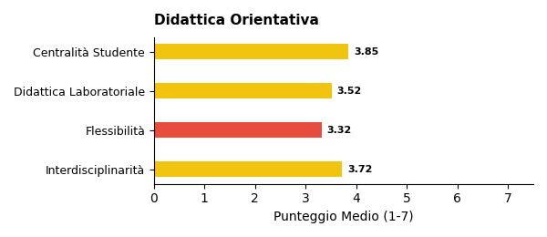

# Report di Sintesi sull'Orientamento nei PTOF — I Grado

*Target Analisi: I Grado*
*Generato con: openrouter / minimax/minimax-m2.5*

## Premessa: Cosa Misuriamo e Perché

Questo report analizza i **PTOF** (Piani Triennali dell'Offerta Formativa) delle scuole italiane per misurarne la **copertura informativa** in tema di orientamento: quanto e come il documento descrive le pratiche, i progetti e le strategie che la scuola adotta per orientare gli studenti.

È importante chiarire fin da subito un principio fondamentale: **i punteggi che seguono non esprimono un giudizio sulla qualità della scuola**, ma sulla ricchezza e completezza della documentazione contenuta nel PTOF. Una scuola con un punteggio basso potrebbe svolgere ottime attività di orientamento senza averle descritte nel proprio piano; viceversa, un punteggio alto indica che il PTOF documenta in modo dettagliato e strutturato le proprie pratiche orientative.

## Come Funziona l'Analisi

L'analisi automatizzata legge e interpreta il testo del PTOF su due livelli complementari.

1. **Analisi Strutturale (Compliance)**: Il sistema verifica la conformità formale rispetto alle Linee Guida per l'orientamento scolastico stabilite dal D.M. 328/2022, il decreto ministeriale che ha introdotto l'obbligo per ogni scuola di dedicare almeno 30 ore annuali a moduli di orientamento formativo e di individuare figure dedicate (tutor e docente orientatore). In concreto, si verifica se il PTOF contiene una sezione esplicitamente dedicata all'orientamento, valutandone la visibilità e la struttura nel documento.

2. **Analisi Semantica e di Contenuto**: Attraverso modelli di linguaggio avanzati (LLM), l'analisi "legge" l'intero documento per estrarre informazioni sulla copertura delle 6 dimensioni del framework di valutazione (descritte nella sezione successiva). In questa fase, vengono distinte le semplici dichiarazioni di intenti dalle azioni concrete, mappando la presenza di progetti, risorse, tempi e responsabilità. L'algoritmo rileva il contesto in cui appaiono i termini: ad esempio, distingue se l'orientamento è citato in una lista generica oppure se è descritto attraverso laboratori con obiettivi specifici e modalità di verifica.

## Le 6 Dimensioni del Framework di Valutazione

L'analisi semantica valuta la copertura del PTOF attraverso **6 dimensioni**. Ognuna rappresenta un aspetto fondamentale dell'orientamento scolastico: dalla struttura organizzativa alle finalità educative, dalle metodologie didattiche alle opportunità offerte agli studenti. Di seguito, ciascuna dimensione è descritta con i propri sotto-indicatori.

### Dimensione Strutturale e di Contesto
Valuta se l'orientamento ha una collocazione riconoscibile all'interno del PTOF e se la scuola è inserita in un tessuto di relazioni territoriali.
- **Sezione dedicata**: Presenza di un capitolo o paragrafo esplicitamente intitolato all'orientamento, non frammentato tra diverse parti del documento.
- **Partnership e reti territoriali**: Qualità del coinvolgimento di soggetti esterni (Università, ITS, imprese, Terzo Settore), con attenzione ad attività congiunte e accordi formali.

### Finalità dell'Orientamento
Analizza gli obiettivi formativi che la scuola si pone attraverso le attività di orientamento.
- **Attitudini e Talenti**: Azioni per aiutare gli studenti a scoprire i propri punti di forza e inclinazioni personali.
- **Interessi Professionali**: Percorsi di esplorazione degli ambiti disciplinari e del mondo del lavoro.
- **Progetto di Vita**: Supporto alla costruzione di una traiettoria personale di lungo termine.
- **Transizioni Formative**: Accompagnamento nei passaggi critici tra cicli scolastici (primaria-secondaria, secondaria-università/lavoro).
- **Capacità Orientativa (Empowerment)**: Sviluppo di competenze trasversali che rendano lo studente autonomo nelle proprie scelte.

### Obiettivi di Incidenza
Misura l'attenzione del PTOF verso gli impatti sociali dell'orientamento.
- **Contrasto alla Dispersione**: Strategie di prevenzione dell'abbandono scolastico e iniziative di rimotivazione.
- **Riduzione dei NEET**: Azioni di collegamento scuola-lavoro per favorire l'occupabilità e contrastare il fenomeno dei giovani che non studiano né lavorano.
- **Continuità Territoriale**: Costruzione di ponti tra i diversi gradi di istruzione presenti sul territorio.
- **Lifelong Learning**: Concezione dell'orientamento come competenza permanente, utile per tutta la vita.

### Governance e Organizzazione
Esamina il modello organizzativo interno: chi fa cosa e come si coordina l'azione orientativa.
- **Coordinamento**: Presenza di figure dedicate come Funzioni Strumentali, referenti o commissioni per l'orientamento.
- **Dialogo Interno**: Coinvolgimento dei Consigli di Classe e dei docenti nella progettazione orientativa.
- **Alleanza con le Famiglie**: Iniziative strutturate di comunicazione e collaborazione con i genitori.
- **Monitoraggio**: Utilizzo di strumenti di feedback, questionari e dati per valutare l'efficacia delle azioni.
- **Inclusione**: Attenzione specifica a studenti con BES/DSA, studenti stranieri e situazioni di fragilità.

### Didattica Orientativa
Valuta il passaggio dalle dichiarazioni di principio alle pratiche concrete in aula.
- **Didattica Laboratoriale ed Esperienziale**: Attività basate sul *learning by doing* e sull'apprendimento attivo.
- **Centralità dello Studente**: Ruolo attivo degli studenti nella co-progettazione dei percorsi orientativi.
- **Interdisciplinarità**: Integrazione dell'orientamento nelle diverse discipline curricolari, non solo come attività aggiuntiva.
- **Flessibilità Organizzativa**: Adattamento di spazi, tempi e gruppi per favorire esperienze orientative efficaci.

### Opportunità Formative
Mappa l'ecosistema delle proposte extracurricolari e integrative offerte dalla scuola.
- **Attività Culturali e Artistiche**: Progetti di teatro, musica, scrittura creativa, visite a musei.
- **Laboratori Espressivi**: Percorsi manuali, artigianali o digitali che favoriscono la scoperta di talenti.
- **Sport e Attività Ricreative**: Offerta sportiva e ludica come strumento di socializzazione e benessere.
- **Volontariato e Service Learning**: Esperienze di impegno civico che collegano apprendimento e comunità.

## Dal Qualitativo al Quantitativo: la Scala di Punteggio

Ciascuna delle 6 dimensioni appena descritte viene valutata attraverso una **scala numerica da 1 a 7**, detta scala di copertura informativa. Si tratta di una scala ordinale di tipo Likert — uno strumento consolidato nella ricerca sociale che consente di tradurre valutazioni qualitative in punteggi confrontabili.

Il punteggio riflette il livello di dettaglio con cui il PTOF documenta le pratiche orientative per quella dimensione: da 1 (nessun riferimento) a 7 (documentazione sistematica con evidenze di miglioramento continuo). La tabella seguente descrive ogni livello.

\begin{tabularx}{\textwidth}{@{} c l X @{}}
\toprule
\textbf{Punti} & \textbf{Livello} & \textbf{Cosa significa} \\
\midrule
1 & Assente & Nessun riferimento all'orientamento nel documento. \\
2 & Traccia minima & Menzione vaga o copia-incolla di testo normativo, senza personalizzazione. \\
3 & Parziale & Intenzione dichiarata, ma senza dettagli su come viene attuata. \\
4 & Di base & Azioni descritte in modo chiaro ma essenziale, senza approfondimento. \\
5 & Strutturata & Azioni dettagliate con metodologie esplicitate e risorse indicate. \\
6 & Approfondita & Azioni integrate nel curricolo, con indicatori di monitoraggio documentati. \\
7 & Esaustiva & Documentazione sistematica e ciclica, con evidenze di revisione e miglioramento. \\
\bottomrule
\end{tabularx}

## L'Indice Sintetico: IIPO

Per avere una visione d'insieme della copertura documentale di ciascuna scuola, i punteggi delle 6 dimensioni vengono riassunti in un unico indicatore: l'**IIPO** (Indice di Documentazione delle Pratiche di Orientamento).

L'IIPO è calcolato come **media aritmetica semplice** dei punteggi delle 6 dimensioni (Strutturale, Finalità, Obiettivi, Governance, Didattica, Opportunità). Si è scelta una media non pesata per evitare di privilegiare a priori una dimensione rispetto alle altre, trattandole tutte come ugualmente rilevanti.

**Come leggere l'IIPO:**
- Un IIPO di **5.0** indica che, in media, il PTOF documenta le pratiche orientative a un livello "Strutturato" su tutte le dimensioni.
- Un IIPO di **3.0** segnala una documentazione complessivamente "Parziale".

**Limiti da tenere presenti:**
- *Effetto compensazione*: Essendo una media, l'IIPO può mascherare squilibri tra le dimensioni. Ad esempio, una scuola con punteggio 7 su Didattica e 1 su Governance otterrebbe un IIPO apparentemente nella norma. Per questo motivo, l'IIPO va sempre letto insieme ai punteggi delle singole dimensioni.
- *Sensibilità incrementale*: La scala a 7 livelli consente di cogliere differenze graduali tra scuole, evitando la polarizzazione tipica delle scale più strette (es. 1-3).

## Approccio Analitico: Raggruppamento per Affinità

Oltre all'analisi dimensionale, il report utilizza una tecnica di **raggruppamento automatico** (clustering) per evitare di appiattire i risultati su una semplice media nazionale.

Il funzionamento è il seguente: il sistema analizza i profili di punteggio di tutte le scuole e individua **gruppi di istituti** che presentano caratteristiche documentali simili. Nel campione corrente sono stati identificati **5 gruppi omogenei** — ad esempio, un gruppo potrebbe riunire scuole con forte attenzione ai PCTO e alle partnership territoriali, mentre un altro potrebbe raccogliere istituti che privilegiano la didattica laboratoriale.

Per ciascun gruppo viene generata una **sintesi tematica** che descrive l'approccio dominante su ogni dimensione. Queste sintesi intermedie vengono poi integrate nel report finale, permettendo di confrontare i diversi "profili di orientamento" e di evidenziare sia le tendenze comuni sia le eccezioni virtuose.

## Analisi e Copertura del Campione (I Grado)

Questa sezione descrive la composizione del campione analizzato e ne valuta la **rappresentatività** rispetto all'universo delle scuole italiane. Comprendere la struttura del campione è essenziale per interpretare correttamente i risultati: un campione ben bilanciato consente di generalizzare le osservazioni; un campione sbilanciato richiede cautela nell'estendere le conclusioni a tutto il sistema scolastico.

Per ogni dimensione di confronto (gestione, area geografica, contesto territoriale) la tabella riporta tre valori:
- **Osservato %**: la percentuale nel nostro campione.
- **Atteso % (MIUR)**: la percentuale nell'universo reale delle scuole italiane, ricavata dai dati ministeriali.
- **Deviazione (pp)**: la differenza tra osservato e atteso, espressa in *punti percentuali*. Deviazioni entro ±5 pp sono trascurabili; tra 5 e 15 pp segnalano un lieve squilibrio; oltre 15 pp indicano una sovra- o sotto-rappresentazione significativa.

### Statistiche Generali

- **Scuole Analizzate**: **246** PTOF di scuole I Grado
- **Province Coperte**: 84 (su 107 totali)
- **Regioni Coperte**: 18/20

Il campione copre la quasi totalità delle regioni italiane, garantendo una visione nazionale.

### Bilanciamento Gestione (Statale vs Paritaria)

In Italia, le scuole statali rappresentano la grande maggioranza degli istituti. Un campione rappresentativo dovrebbe riflettere questa proporzione. Una sovra-rappresentazione delle paritarie, ad esempio, potrebbe influenzare i risultati perché i PTOF delle scuole paritarie tendono ad avere strutture e contenuti diversi da quelli delle statali.

\begin{tabularx}{\textwidth}{@{} p{3cm} c c c @{}}
\toprule
\textbf{Tipo} & \textbf{Osservato \%} & \textbf{Atteso \% (MIUR)} & \textbf{Deviazione} \\
\midrule
Statale & 76.0\% & 92.0\% & -16.0 pp \\
Paritaria & 24.0\% & 8.0\% & +16.0 pp \\
\bottomrule
\end{tabularx}

### Distribuzione Geografica per Macro-Area

L'Italia presenta significative differenze territoriali nell'offerta formativa. Per valutare se il campione rispecchia la distribuzione reale delle scuole, confrontiamo le cinque macro-aree geografiche (Nord Ovest, Nord Est, Centro, Sud, Isole) con i dati MIUR. Una buona rappresentatività geografica è fondamentale perché le pratiche di orientamento possono variare sensibilmente tra Nord e Sud, tra aree urbane e rurali.

\begin{tabularx}{\textwidth}{@{} X c c c @{}}
\toprule
\textbf{Area} & \textbf{Osservato \%} & \textbf{Atteso \% (MIUR)} & \textbf{Deviazione} \\
\midrule
Nord Ovest & 15.9\% & 26.6\% & -10.7 pp \\
Nord Est & 18.3\% & 19.3\% & -1.0 pp \\
Centro & 27.6\% & 19.9\% & +7.7 pp \\
Sud & 29.3\% & 23.3\% & +6.0 pp \\
Isole & 8.9\% & 10.9\% & -2.0 pp \\
\bottomrule
\end{tabularx}

⚠️ **Campione con Lievi Disallineamenti**: Si notano alcune sovra/sottorappresentazioni geografiche, che tuttavia non invalidano l'analisi complessiva (deviazione max < 15 pp).

### Distribuzione Territoriale (Aree Metropolitane vs Non Metropolitane)

Le scuole situate nelle 14 città metropolitane italiane operano in contesti diversi rispetto a quelle di provincia: maggiore offerta formativa esterna, più partnership con università e imprese, ma anche maggiore competizione tra istituti. Questa distinzione aiuta a capire se i risultati del report sono influenzati da una prevalenza di scuole urbane o rurali nel campione.

\begin{tabularx}{\textwidth}{@{} X c c c @{}}
\toprule
\textbf{Area} & \textbf{Osservato \%} & \textbf{Atteso \% (Stima)} & \textbf{Deviazione} \\
\midrule
Metropolitana & 38.6\% & 33.0\% & +5.6 pp \\
Non Metropolitana & 61.4\% & 67.0\% & -5.6 pp \\
\bottomrule
\end{tabularx}

### Come Leggere Questi Dati

I dati sopra si riferiscono al sottocampione **I Grado** e sono confrontati con i benchmark MIUR per lo stesso ordine scolastico. In sintesi: dove la deviazione è contenuta (entro ±5 pp), i risultati del report possono essere considerati generalizzabili con buona confidenza; dove la deviazione è più ampia, le conclusioni vanno interpretate tenendo conto dello squilibrio — ad esempio, se il Sud è sovra-rappresentato, i punteggi medi potrebbero riflettere maggiormente le pratiche delle scuole meridionali.

\newpage

\newpage

## Sintesi Quantitativa: Le Dimensioni dell'Orientamento

Di seguito il dettaglio dei punteggi medi rilevati per le dimensioni e i relativi sotto-indicatori.
### Dimensione Strutturale (Compliance)
**Media: 2.39** (dev.std: 1.67)

### Finalità dell'Orientamento

\begin{tabularx}{\textwidth}{@{} X c c @{}}
\toprule
\textbf{Indicatore} & \textbf{Media} & \textbf{Dev. Std.} \\
\midrule
\textbf{Totale Dimensione} & \textbf{3.51} & \textbf{1.09} \\
Attitudini e Talenti & 3.65 & 1.13 \\
Interessi Professionali & 3.67 & 1.16 \\
Progetto di Vita & 3.38 & 1.32 \\
Transizioni Formative & 3.56 & 1.24 \\
Capacità Orientative & 3.24 & 1.41 \\
\bottomrule
\end{tabularx}

### Obiettivi di Incidenza

\begin{tabularx}{\textwidth}{@{} X c c @{}}
\toprule
\textbf{Indicatore} & \textbf{Media} & \textbf{Dev. Std.} \\
\midrule
\textbf{Totale Dimensione} & \textbf{3.10} & \textbf{1.11} \\
Contrasto Dispersione & 2.80 & 1.56 \\
Continuità Territorio & 3.55 & 1.25 \\
Riduzione NEET & 2.04 & 1.35 \\
Lifelong Learning & 3.26 & 1.35 \\
\bottomrule
\end{tabularx}

### Governance e Organizzazione

\begin{tabularx}{\textwidth}{@{} X c c @{}}
\toprule
\textbf{Indicatore} & \textbf{Media} & \textbf{Dev. Std.} \\
\midrule
\textbf{Totale Dimensione} & \textbf{3.61} & \textbf{1.05} \\
Coordinamento & 3.50 & 1.24 \\
Dialogo Interno & 3.57 & 1.22 \\
Alleanza Famiglie & 4.05 & 1.10 \\
Monitoraggio & 2.79 & 1.43 \\
Inclusione & 3.92 & 1.20 \\
\bottomrule
\end{tabularx}

### Didattica Orientativa

\begin{tabularx}{\textwidth}{@{} X c c @{}}
\toprule
\textbf{Indicatore} & \textbf{Media} & \textbf{Dev. Std.} \\
\midrule
\textbf{Totale Dimensione} & \textbf{3.62} & \textbf{1.01} \\
Centralità Studente & 3.85 & 1.21 \\
Didattica Laboratoriale & 3.52 & 1.31 \\
Flessibilità & 3.32 & 1.30 \\
Interdisciplinarità & 3.72 & 1.10 \\
\bottomrule
\end{tabularx}

### Opportunità Formative

\begin{tabularx}{\textwidth}{@{} X c c @{}}
\toprule
\textbf{Indicatore} & \textbf{Media} & \textbf{Dev. Std.} \\
\midrule
\textbf{Totale Dimensione} & \textbf{3.07} & \textbf{1.11} \\
Attività Culturali & 3.09 & 1.39 \\
Laboratori Espressivi & 3.83 & 1.31 \\
Attività Ricreative & 2.63 & 1.22 \\
Volontariato & 2.45 & 1.40 \\
Sport & 3.07 & 1.38 \\
\bottomrule
\end{tabularx}

*Legenda Giudizi: Ampiamente documentato (>= 5.0), Parzialmente documentato (3.5-4.9), Poco documentato (< 3.5)*

\newpage

## Sintesi Quantitativa: Le Dimensioni dell'Orientamento

Di seguito il dettaglio dei punteggi medi rilevati per le dimensioni e i relativi sotto-indicatori.
### Dimensione Strutturale (Compliance)
**Media: 2.39** (dev.std: 1.67)

### Finalità dell'Orientamento

\begin{tabularx}{\textwidth}{@{} X c c @{}}
\toprule
\textbf{Indicatore} & \textbf{Media} & \textbf{Dev. Std.} \\
\midrule
\textbf{Totale Dimensione} & \textbf{3.51} & \textbf{1.09} \\
Attitudini e Talenti & 3.65 & 1.13 \\
Interessi Professionali & 3.67 & 1.16 \\
Progetto di Vita & 3.38 & 1.32 \\
Transizioni Formative & 3.56 & 1.24 \\
Capacità Orientative & 3.24 & 1.41 \\
\bottomrule
\end{tabularx}

### Obiettivi di Incidenza

\begin{tabularx}{\textwidth}{@{} X c c @{}}
\toprule
\textbf{Indicatore} & \textbf{Media} & \textbf{Dev. Std.} \\
\midrule
\textbf{Totale Dimensione} & \textbf{3.10} & \textbf{1.11} \\
Contrasto Dispersione & 2.80 & 1.56 \\
Continuità Territorio & 3.55 & 1.25 \\
Riduzione NEET & 2.04 & 1.35 \\
Lifelong Learning & 3.26 & 1.35 \\
\bottomrule
\end{tabularx}

### Governance e Organizzazione

\begin{tabularx}{\textwidth}{@{} X c c @{}}
\toprule
\textbf{Indicatore} & \textbf{Media} & \textbf{Dev. Std.} \\
\midrule
\textbf{Totale Dimensione} & \textbf{3.61} & \textbf{1.05} \\
Coordinamento & 3.50 & 1.24 \\
Dialogo Interno & 3.57 & 1.22 \\
Alleanza Famiglie & 4.05 & 1.10 \\
Monitoraggio & 2.79 & 1.43 \\
Inclusione & 3.92 & 1.20 \\
\bottomrule
\end{tabularx}

### Didattica Orientativa

\begin{tabularx}{\textwidth}{@{} X c c @{}}
\toprule
\textbf{Indicatore} & \textbf{Media} & \textbf{Dev. Std.} \\
\midrule
\textbf{Totale Dimensione} & \textbf{3.62} & \textbf{1.01} \\
Centralità Studente & 3.85 & 1.21 \\
Didattica Laboratoriale & 3.52 & 1.31 \\
Flessibilità & 3.32 & 1.30 \\
Interdisciplinarità & 3.72 & 1.10 \\
\bottomrule
\end{tabularx}

### Opportunità Formative

\begin{tabularx}{\textwidth}{@{} X c c @{}}
\toprule
\textbf{Indicatore} & \textbf{Media} & \textbf{Dev. Std.} \\
\midrule
\textbf{Totale Dimensione} & \textbf{3.07} & \textbf{1.11} \\
Attività Culturali & 3.09 & 1.39 \\
Laboratori Espressivi & 3.83 & 1.31 \\
Attività Ricreative & 2.63 & 1.22 \\
Volontariato & 2.45 & 1.40 \\
Sport & 3.07 & 1.38 \\
\bottomrule
\end{tabularx}

*Legenda Giudizi: Ampiamente documentato (>= 5.0), Parzialmente documentato (3.5-4.9), Poco documentato (< 3.5)*

\newpage

## Analisi e Copertura del Campione (I Grado)

**Statistiche Generali**
- Scuole Analizzate: **246**
- Province Coperte: 84
- Regioni Coperte: 18/20

**Bilanciamento Gestione (Statale vs Paritaria)**

\begin{tabularx}{\textwidth}{@{} p{3cm} c c c @{}}
\toprule
\textbf{Tipo} & \textbf{Osservato \%} & \textbf{Atteso \% (MIUR)} & \textbf{Deviazione} \\
\midrule
Statale & 76.0\% & 92.0\% & -16.0 pp \\
Paritaria & 24.0\% & 8.0\% & +16.0 pp \\
\bottomrule
\end{tabularx}

**Distribuzione Geografica per Macro-Area**

\begin{tabularx}{\textwidth}{@{} X c c c @{}}
\toprule
\textbf{Area} & \textbf{Osservato \%} & \textbf{Atteso \% (MIUR)} & \textbf{Deviazione} \\
\midrule
Nord Ovest & 15.9\% & 26.6\% & -10.7 pp \\
Nord Est & 18.3\% & 19.3\% & -1.0 pp \\
Centro & 27.6\% & 19.9\% & +7.7 pp \\
Sud & 29.3\% & 23.3\% & +6.0 pp \\
Isole & 8.9\% & 10.9\% & -2.0 pp \\
\bottomrule
\end{tabularx}

⚠️ **Campione con Lievi Disallineamenti**: Si notano alcune sovra/sottorappresentazioni geografiche, che tuttavia non invalidano l'analisi complessiva (deviazione max < 15 pp).

**Distribuzione Territoriale (Aree Metropolitane)**

\begin{tabularx}{\textwidth}{@{} X c c c @{}}
\toprule
\textbf{Area} & \textbf{Osservato \%} & \textbf{Atteso \% (Stima)} & \textbf{Deviazione} \\
\midrule
Metropolitana & 38.6\% & 33.0\% & +5.6 pp \\
Non Metropolitana & 61.4\% & 67.0\% & -5.6 pp \\
\bottomrule
\end{tabularx}

*Nota: I dati sopra si riferiscono specificamente al sottocampione analizzato (I Grado) e sono confrontati con i benchmark MIUR di riferimento per tale ordine scolastico.*

\newpage

## Sintesi Quantitativa: Le Dimensioni dell'Orientamento

Di seguito il dettaglio dei punteggi medi rilevati per le dimensioni e i relativi sotto-indicatori.
### Dimensione Strutturale (Compliance)
**Media: 2.39** (dev.std: 1.67)

### Finalità dell'Orientamento

\begin{tabularx}{\textwidth}{@{} X c c @{}}
\toprule
\textbf{Indicatore} & \textbf{Media} & \textbf{Dev. Std.} \\
\midrule
\textbf{Totale Dimensione} & \textbf{3.51} & \textbf{1.09} \\
Attitudini e Talenti & 3.65 & 1.13 \\
Interessi Professionali & 3.67 & 1.16 \\
Progetto di Vita & 3.38 & 1.32 \\
Transizioni Formative & 3.56 & 1.24 \\
Capacità Orientative & 3.24 & 1.41 \\
\bottomrule
\end{tabularx}

### Obiettivi di Incidenza

\begin{tabularx}{\textwidth}{@{} X c c @{}}
\toprule
\textbf{Indicatore} & \textbf{Media} & \textbf{Dev. Std.} \\
\midrule
\textbf{Totale Dimensione} & \textbf{3.10} & \textbf{1.11} \\
Contrasto Dispersione & 2.80 & 1.56 \\
Continuità Territorio & 3.55 & 1.25 \\
Riduzione NEET & 2.04 & 1.35 \\
Lifelong Learning & 3.26 & 1.35 \\
\bottomrule
\end{tabularx}

### Governance e Organizzazione

\begin{tabularx}{\textwidth}{@{} X c c @{}}
\toprule
\textbf{Indicatore} & \textbf{Media} & \textbf{Dev. Std.} \\
\midrule
\textbf{Totale Dimensione} & \textbf{3.61} & \textbf{1.05} \\
Coordinamento & 3.50 & 1.24 \\
Dialogo Interno & 3.57 & 1.22 \\
Alleanza Famiglie & 4.05 & 1.10 \\
Monitoraggio & 2.79 & 1.43 \\
Inclusione & 3.92 & 1.20 \\
\bottomrule
\end{tabularx}

### Didattica Orientativa

\begin{tabularx}{\textwidth}{@{} X c c @{}}
\toprule
\textbf{Indicatore} & \textbf{Media} & \textbf{Dev. Std.} \\
\midrule
\textbf{Totale Dimensione} & \textbf{3.62} & \textbf{1.01} \\
Centralità Studente & 3.85 & 1.21 \\
Didattica Laboratoriale & 3.52 & 1.31 \\
Flessibilità & 3.32 & 1.30 \\
Interdisciplinarità & 3.72 & 1.10 \\
\bottomrule
\end{tabularx}

### Opportunità Formative

\begin{tabularx}{\textwidth}{@{} X c c @{}}
\toprule
\textbf{Indicatore} & \textbf{Media} & \textbf{Dev. Std.} \\
\midrule
\textbf{Totale Dimensione} & \textbf{3.07} & \textbf{1.11} \\
Attività Culturali & 3.09 & 1.39 \\
Laboratori Espressivi & 3.83 & 1.31 \\
Attività Ricreative & 2.63 & 1.22 \\
Volontariato & 2.45 & 1.40 \\
Sport & 3.07 & 1.38 \\
\bottomrule
\end{tabularx}

*Legenda Giudizi: Ampiamente documentato (>= 5.0), Parzialmente documentato (3.5-4.9), Poco documentato (< 3.5)*

\newpage

## Analisi e Copertura del Campione (I Grado)
Statistiche Generali
- Scuole Analizzate: 246
- Province Coperte: 84
- Regioni Coperte: 18/20

Bilanciamento Gestione (Statale vs Paritaria)

\begin{tabularx}{\textwidth}{@{} p{3cm} c c c @{}}
\toprule
\textbf{Tipo} & \textbf{Osservato \%} & \textbf{Atteso \% (MIUR)} & \textbf{Deviazione} \\
\midrule
Statale & 76.0\% & 92.0\% & -16.0 pp \\
Paritaria & 24.0\% & 8.0\% & +16.0 pp \\
\bottomrule
\end{tabularx}

Distribuzione Geografica per Macro-Area

\begin{tabularx}{\textwidth}{@{} X c c c @{}}
\toprule
\textbf{Area} & \textbf{Osservato \%} & \textbf{Atteso \% (MIUR)} & \textbf{Deviazione} \\
\midrule
Nord Ovest & 15.9\% & 26.6\% & -10.7 pp \\
Nord Est & 18.3\% & 19.3\% & -1.0 pp \\
Centro & 27.6\% & 19.9\% & +7.7 pp \\
Sud & 29.3\% & 23.3\% & +6.0 pp \\
Isole & 8.9\% & 10.9\% & -2.0 pp \\
\bottomrule
\end{tabularx}

⚠️ Campione con Lievi Disallineamenti: Si notano alcune sovra/sottorappresentazioni geografiche, che tuttavia non invalidano l'analisi complessiva (deviazione max < 15 pp).

Distribuzione Territoriale (Aree Metropolitane)

\begin{tabularx}{\textwidth}{@{} X c c c @{}}
\toprule
\textbf{Area} & \textbf{Osservato \%} & \textbf{Atteso \% (Stima)} & \textbf{Deviazione} \\
\midrule
Metropolitana & 38.6\% & 33.0\% & +5.6 pp \\
Non Metropolitana & 61.4\% & 67.0\% & -5.6 pp \\
\bottomrule
\end{tabularx}

*Nota: I dati sopra si riferiscono specificamente al sottocampione analizzato (I Grado) e sono confrontati con i benchmark MIUR di riferimento per tale ordine scolastico.*

\newpage
## Sintesi Quantitativa: Le Dimensioni dell'Orientamento
Di seguito il dettaglio dei punteggi medi rilevati per le dimensioni e i relativi sotto-indicatori, espressi su scala 1-7.

Dimensione Strutturale (Compliance)
Media: 2.39 (dev.std: 1.67)

Finalità dell'Orientamento

\begin{tabularx}{\textwidth}{@{} X c c @{}}
\toprule
\textbf{Indicatore} & \textbf{Media} & \textbf{Dev. Std.} \\
\midrule
\textbf{Totale Dimensione} & \textbf{3.51} & \textbf{1.09} \\
Attitudini e Talenti & 3.65 & 1.13 \\
Interessi Professionali & 3.67 & 1.16 \\
Progetto di Vita & 3.38 & 1.32 \\
Transizioni Formative & 3.56 & 1.24 \\
Capacità Orientative & 3.24 & 1.41 \\
\bottomrule
\end{tabularx}

Obiettivi di Incidenza

\begin{tabularx}{\textwidth}{@{} X c c @{}}
\toprule
\textbf{Indicatore} & \textbf{Media} & \textbf{Dev. Std.} \\
\midrule
\textbf{Totale Dimensione} & \textbf{3.10} & \textbf{1.11} \\
Contrasto Dispersione & 2.80 & 1.56 \\
Continuità Territorio & 3.55 & 1.25 \\
Riduzione NEET & 2.04 & 1.35 \\
Lifelong Learning & 3.26 & 1.35 \\
\bottomrule
\end{tabularx}

Governance e Organizzazione

\begin{tabularx}{\textwidth}{@{} X c c @{}}
\toprule
\textbf{Indicatore} & \textbf{Media} & \textbf{Dev. Std.} \\
\midrule
\textbf{Totale Dimensione} & \textbf{3.61} & \textbf{1.05} \\
Coordinamento & 3.50 & 1.24 \\
Dialogo Interno & 3.57 & 1.22 \\
Alleanza Famiglie & 4.05 & 1.10 \\
Monitoraggio & 2.79 & 1.43 \\
Inclusione & 3.92 & 1.20 \\
\bottomrule
\end{tabularx}

Didattica Orientativa

\begin{tabularx}{\textwidth}{@{} X c c @{}}
\toprule
\textbf{Indicatore} & \textbf{Media} & \textbf{Dev. Std.} \\
\midrule
\textbf{Totale Dimensione} & \textbf{3.62} & \textbf{1.01} \\
Centralità Studente & 3.85 & 1.21 \\
Didattica Laboratoriale & 3.52 & 1.31 \\
Flessibilità & 3.32 & 1.30 \\
Interdisciplinarità & 3.72 & 1.10 \\
\bottomrule
\end{tabularx}

Opportunità Formative

\begin{tabularx}{\textwidth}{@{} X c c @{}}
\toprule
\textbf{Indicatore} & \textbf{Media} & \textbf{Dev. Std.} \\
\midrule
\textbf{Totale Dimensione} & \textbf{3.07} & \textbf{1.11} \\
Attività Culturali & 3.09 & 1.39 \\
Laboratori Espressivi & 3.83 & 1.31 \\
Attività Ricreative & 2.63 & 1.22 \\
Volontariato & 2.45 & 1.40 \\
Sport & 3.07 & 1.38 \\
\bottomrule
\end{tabularx}

*Legenda Giudizi: Copertura esaustiva (>= 5.0), Copertura strutturata (3.5-4.9), Copertura di base/parziale/minima/assente (< 3.5)*

\newpage
## Profili dei Cluster e Differenze
L'analisi clustering ha stratificato le 244 scuole di I grado del campione in cinque gruppi distinti, rivelando una significativa variabilità nella modalità con cui i documenti PTOF affrontano il tema dell'orientamento. La distribuzione evidenzia una concentrazione nel Cluster 4, che raccoglie oltre la metà delle scuole (125 istituti, pari al 51,2% del campione), mentre i Cluster 1, 2 e 3 rappresentano realtà più contenute, rispettivamente con 21, 12 e 19 scuole. Questa configurazione suggerisce l'esistenza di macro-categorie interpretative nell'approccio documentale all'orientamento, con sfumature che meritano un esame dettagliato per comprendere le specificità di ciascun raggruppamento.

Il Cluster 0 (67 scuole) presenta un profilo caratterizzato da una copertura informativa di tipo integrato, dove l'orientamento emerge in modo diffuso all'interno di diverse sezioni del PTOF, piuttosto che in una sezione autonoma e dedicata. Le scuole appartenenti a questo gruppo menzionano l'orientamento in relazione agli obiettivi formativi, al miglioramento scolastico o all'offerta formativa complessiva, dimostrando una consapevolezza del tema senza tuttavia formalizzarlo in un piano strategico dedicato. Il livello di copertura si colloca indicativamente tra 3 e 4 su 7, configurandosi come una copertura parziale (3) con intenti dichiarati ma privi di dettagli attuativi espliciti. La principale criticità risiede nella mancanza di un'articolazione chiara delle azioni e nella sostanziale assenza di sistemi di monitoraggio specifici per l'orientamento, sebbene queste scuole dimostrino attenzione al monitoraggio generale degli apprendimenti e del benessere studentesco. Ciò che distingue questo cluster dagli altri è l'orientamento come tema trasversale presente in più punti del documento, a differenza di cluster più frammentari dove l'orientamento è completamente assente o relegato a marginalità.

Il Cluster 1 (21 scuole) si distingue per un approccio che potremmo definire "minimalista" rispetto all'orientamento, con una copertura che si attesta indicativamente tra 1 e 2 su 7. La maggior parte degli istituti non presenta una sezione specifica per l'orientamento, limitandosi a menzioni implicite all'interno del curricolo o come tema trasversale non esplicitato. L'orientamento, quando presente, risulta frammentario o ridotto a dichiarazioni di intenti generiche. Questo cluster si caratterizza per una focalizzazione predominante sull'accoglienza e sull'ambientamento dei nuovi iscritti, con particolare attenzione al benessere psico-fisico degli studenti e alla supervisione del personale. La lacuna principale riguarda l'assenza di un'articolazione chiara per la transizione degli studenti verso la scuola secondaria di II grado, con un approccio prevalentemente reattivo mirato a rilevare problematiche esistenti piuttosto che a prevenirle strutturalmente. La distinzione rispetto agli altri cluster risiede nella natura stessa dell'attenzione documentale: non si tratta di un orientamento assente, quanto piuttosto di un orientamento spostato verso dimensioni relazionali e accoglienti, con scarso legame con la funzione orientativa propriamente intesa.

Il Cluster 2 (12 scuole) manifesta un profilo peculiarmente orientato ai Percorsi per le Competenze Trasversali e per l'Orientamento (PCTO), con una copertura che si colloca indicativamente tra 2 e 3 su 7. L'analisi dei PTOF rivela un riconoscimento generale dell'importanza dell'orientamento, spesso esplicitata a livello dichiarativo, accompagnata tuttavia da una carenza diffusa nella definizione di strategie implementative concrete, metodologie dettagliate e sistemi di monitoraggio efficaci. Le scuole tendono a limitarsi ad affermare l'importanza dell'orientamento senza specificare come questo si traduca in azioni concrete. La peculiarità di questo cluster risiede nella sovrapposizione concettuale tra PCTO e orientamento: l'orientamento viene sostanzialmente declinato attraverso le attività di alternanza scuola-lavoro, con una visione strategica limitata e una prevalenza di interventi focalizzati sulla formazione dei docenti piuttosto che sull'esperienza diretta degli studenti. Il bilancio sintetico evidenzia una certa rigidità nell'approccio, con una dipendenza quasi esclusiva dai PCTO come strumento orientativo, a scapito di una visione più ampia e integrata.

Il Cluster 3 (19 scuole) presenta caratteristiche analoghe al Cluster 2 nella misura in cui l'Alternanza Scuola Lavoro rappresenta il principale strumento di orientamento documentato, con una copertura che si attesta indicativamente tra 2 e 3 su 7. La differenza sostanziale risiede nel grado di frammentazione: questo cluster evidenzia una mancanza ancora più marcata di strutturazione specifica, con riferimenti generici a "continuità e strategie di orientamento formativo e lavorativo" privi di definizione chiara di obiettivi, azioni concrete o indicatori di monitoraggio. L'orientamento è integrato marginalmente in ambiti più ampi come l'offerta formativa o l'inclusione, senza costituire un pilastro strategico del PTOF. [CODICE DUBBIO: Istituto San Giuseppe Calasanzio (CA1M4N500E)] (Sardegna), pur includendo una sezione "Valutazione, Continuità E Orientamento", ammette esplicitamente una frammentazione e scarsa integrazione, confermando il profilo del cluster. La criticità principale consiste nell'assenza di una sezione autonoma dedicata all'orientamento e nella prevalenza di descrizioni generiche che non consentono di comprendere le modalità operative effettivamente previste.

Il Cluster 4 (125 scuole), il più numeroso, si caratterizza per una "presenza diffusa ma frammentata" dell'orientamento, con una copertura che si colloca indicativamente tra 3 e 4 su 7. La maggior parte degli istituti menziona l'orientamento all'interno di diverse sezioni del documento, integrato in aree tematiche più ampie o come parte di progetti specifici, ma manca una sezione autonoma e dedicata in quasi tutti i casi. L'orientamento non sembra essere considerato un pilastro strategico del PTOF, ma piuttosto un'attività integrata in altri ambiti. Le scuole di questo cluster presentano un'attenzione al monitoraggio dei risultati degli alunni e delle competenze dei docenti, con una prevalenza di interventi mirati all'individuazione di aree di miglioramento attraverso la raccolta e l'interpretazione di dati. L'approccio predominante è orientato all'ampliamento dell'offerta formativa attraverso progetti specifici e collaborazioni esterne, con focus sulla prevenzione, sull'orientamento e sullo sviluppo di competenze trasversali. Ciò che distingue questo cluster dal Cluster 0, con cui condivide la caratteristica della presenza diffusa, è la maggiore ampiezza progettuale e la propensione a rispondere a bisogni emergenti quali le dipendenze, il disagio giovanile o il potenziamento di aree specifiche del curricolo.

La comparazione trasversale dei cluster rivela alcune convergenze significative: tutti i gruppi, ad eccezione del Cluster 1, presentano una copertura dell'orientamento che si colloca nella fascia medio-bassa della scala (tra 2 e 4 su 7), indicando una sostanziale inadeguatezza nella documentazione delle pratiche orientative. Il Cluster 0 e il Cluster 4 condividono l'approccio integrato e trasversale, distinguendosi per il grado di consapevolezza e per la presenza di eccezioni più strutturate. Il Cluster 2 e il Cluster 3 convergono sulla centralità dell'Alternanza Scuola Lavoro/PCTO, differenziandosi per il grado di consapevolezza dichiarativa. Le divergenze principali riguardano la dimensione strategica: mentre il Cluster 0 e il Cluster 4 dimostrano almeno una consapevolezza dell'importanza dell'orientamento come tema trasversale, i Cluster 1, 2 e 3 evidenziano una sostanziale marginalizzazione dell'orientamento rispetto ad altre priorità documentali. In sintesi, l'analisi dei cluster rivela un panorama variegato ma complessivamente caratterizzato da una copertura informativa dell'orientamento inferiore alla soglia di base (4 su 7), con rare eccezioni che non bastano a modificare il quadro complessivo di una documentazione ancora largamente insufficiente.
## Commento di Sintesi Generale
L'analisi complessiva dei 244 PTOF di scuole secondarie di primo grado rivela un quadro caratterizzato da una sostanziale eterogeneità nell'approccio all'orientamento, con una prevalenza di pratiche che si collocano nella fascia medio-bassa della scala di copertura informativa. Il punteggio medio dell'Indice di Documentazione Pratiche Orientamento, calcolato come media ponderata delle cinque dimensioni analizzate, si attesta a 3.44 su 7, un valore che si colloca esattamente a metà tra la copertura "parziale" e quella "di base", indicando pertanto un livello complessivamente modesto nella formalizzazione delle pratiche orientative all'interno dei documenti scolastici.

La dimensione della didattica orientativa emerge come quella con il punteggio più elevato, con una media di 3.62 su 7, seguita a ruota dalla governance con 3.61 su 7. Questi valori suggeriscono che le scuole dedicano maggiore attenzione rispettivamente alle metodologie didattiche orientative, come i laboratori e le esperienze formative, e agli aspetti organizzativi del coordinamento dei servizi orientativi. Tuttavia, entrambi i punteggi si posizionano ancora nella fascia di copertura "di base", indicando che le descrizioni presenti nei PTOF, pur essendo chiare, non raggiungono un livello di dettaglio strutturato con esplicitazione di risorse e indicatori di monitoraggio.

Le dimensioni relative agli obiettivi specifici dell'orientamento e alle opportunità formative risultano essere le più carenti, con medie rispettivamente di 3.10 su 7 e 3.07 su 7. Il primo dato evidenzia una diffusa mancanza di obiettivi misurabili e specifici in materia di riduzione della dispersione scolastica, contrasto al fenomeno NEET, continuità territoriale e sviluppo del lifelong learning. Il secondo dato rivela una minore attenzione nella documentazione delle attività opzionali culturali, laboratoriali, ludiche, di volontariato e sportive come strumenti di orientamento formativo. Le finalità orientative, pur ottenendo un punteggio di 3.51 su 7, mostrano una variabilità significativa, con deviazione standard di 1.09, a indicare che alcune scuole sviluppano in modo più articolato le tematiche legate alle attitudini, agli interessi, al progetto di vita e alle transizioni formative, mentre altre si limitano a dichiarazioni generiche.

L'analisi per cluster conferma e amplifica queste osservazioni. Il cluster 4, che comprende 125 scuole, evidenzia un approccio dominante caratterizzato da presenza diffusa ma frammentata dell'orientamento nel PTOF, con menzioni integrate in sezioni diverse del documento ma senza una sezione autonoma dedicata. I cluster 1, 2 e 3 presentano situazioni analoghe, con una prevalenza di approcci impliciti, frammentati o non strutturati.

Le evidenze testuali dai PTOF corroborano questa lettura. La scuola Via Delle Sette Chiese 259 (RMIS01600N) (Lazio), ad esempio, dichiara esplicitamente che "orientare significa progettare un percorso che offra agli alunni gli strumenti per sviluppare competenze chiave utili nella vita adulta", riconoscendo la rilevanza strategica dell'orientamento, ma il punteggio attribuito indica che nella pratica questa consapevolezza non si traduce in una documentazione strutturata. Analogamente, la scuola I.I.S."De Sarlo-De Lorenzo" Lagonegro (PZIS001007) (Basilicata) descrive attività di orientamento in entrata, ri-orientamento e orientamento in uscita, ma la trattazione rimane descrittiva senza indicatori di monitoraggio.

Un dato significativo emerge dalle narrazioni campione: l'assenza di una sezione dedicata all'orientamento nel PTOF viene frequentemente indicata come area di debolezza dalle stesse scuole analizzate. La scuola Ic Valle Del Conca Morciano (RNMM80802E) (Emilia-Romagna, I Grado) e la scuola I.C. Terni "G.Marconi (TRMM80401V) (Umbria, I Grado) evidenziano entrambe come la mancanza di una sezione dedicata e di una pianificazione strategica rappresenti un punto debole del loro documento. Questa auto-riflessione suggerisce una crescente consapevolezza del gap tra l'importanza attribuita all'orientamento e la sua formalizzazione nei documenti di istituto.

La variabilità territoriale emerge indirettamente dai cluster: sebbene il focus dell'analisi non preveda una disaggregazione regionale sistematica, le sintesi dei cluster mostrano la presenza di scuole con sezioni dedicate in diverse regioni, dalla Lombardia alla Sardegna, dalla Campania alla Toscana, suggerendo che la propensione a strutturare l'orientamento non segue un pattern geografico univoco ma dipende piuttosto da scelte interne ai singoli istituti.

In conclusione, il quadro che emerge è quello di un sistema che riconosce l'importanza dell'orientamento ma fatica a tradurre questa consapevolezza in una documentazione strutturata e strategica. L'orientamento appare più spesso come elemento trasversale integrato in altre sezioni del PTOF piuttosto che come pilastro autonomo dell'azione educativa. La distanza tra la declaratoria valoriale, spesso presente nei documenti, e l'operazionalizzazione attraverso obiettivi misurabili, azioni documentate e meccanismi di monitoraggio rappresenta la sfida principale che il sistema dovrà affrontare per passare da un orientamento burocratico, limitato alla mera descrizione di attività, a un orientamento strategico capace di incidere realmente sulle traiettorie formative degli studenti.
## Allineamento Normativo e Approccio Innovativo
L'analisi dell'allineamento normativo nei PTOF del campione rivela un quadro critico, con un punteggio medio di 2.39 su 7 per l'indicatore di allineamento formale al D.M. 328/2022, collocandosi nel range tra "traccia minima" e "copertura parziale". La deviazione standard elevata (1.67) segnala tuttavia una significativa eterogeneità tra le scuole, con alcune che dimostrano un recepimento più consapevole e altre che rimangono completamente estranee ai dettami normativi.

Recepimento Formale versus Sostanziale

La distinzione tra citazione meramente formale delle norme e applicazione sostanziale dei loro principi emerge con chiarezza dall'analisi dei cluster. Nel Cluster 4, che rappresenta il gruppo più strutturato con 125 istituti, la scuola 2 I.C. Ravarino (MOIC84900D) (Emilia-Romagna) si distingue per il riferimento esplicito al D.M. 328/2022 nell'implementazione dei moduli curricolari di orientamento, evidenziando un approccio che va oltre la mera elencazione normativa. Questo costituisce un esempio di recepimento sostanziale, dove il riferimento normativo è funzionale alla descrizione di pratiche concrete.

Tuttavia, la sintesi del Cluster 3 segnala che 17 scuole su 19 integrano l'orientamento come sottosezione all'interno di capitoli più ampi, senza dedicargli uno spazio autonomo e strutturato. Questa collocazione marginale suggerisce un recepimento più formale che sostanziale, dove le normative vengono menzionate per adempienza senza che i principi innovativi (orientamento come processo formativo continuativo, tutoraggio individualizzato, portfolio digitale) trovino effettiva declinazione nel PTOF. La scuola Istituto San Giuseppe Calasanzio (CA1M4N500E) (Sardegna) rappresenta un caso emblematico: pur includendo una sezione dedicata, questa non è autonoma ma integrata nel capitolo sulla Valutazione, evidenziando una visione ancora ancillare dell'orientamento rispetto ai processi valutativi.

Tutor e Orientatore: Figure Attive o Solo Numerate?

Il dato aggregato mostra un punteggio medio di 3.5 su 7 per l'azione di coordinamento dei servizi, indicando una copertura di base ma non ancora strutturata. L'analisi delle evidenze testuali rivela una prevalenza di menzioni generiche di "moduli di orientamento formativo" senza specificazione delle figure coinvolte. Ad esempio, la scuola Iis Galilei Voghera (PVIS01600V) (Lombardia) elenca "Modalità di attuazione del modulo di orientamento formativo" senza esplicitare il ruolo del tutor o dell'orientatore, suggerendo che queste figure risultano spesso nominalmente presenti nell'organigramma ma non descritte operativamente nei documenti.

La scuola MI1M08000T (Lombardia, I Grado) costituisce un'eccezione parziale nel panorama delle scuole di primo grado analizzate, prevedendo "Colloqui personali per gli studenti - su appuntamento, con il proprio Tutor di classe" per 12 ore complessive, insieme a percorsi di riflessione personale guidati dai docenti di Formazione Umana. Questa descrizione denota una funzionalità attiva del tutor, sebbene non emergano riferimenti alla figura specifica dell'orientatore prevista dal D.M. 328/2022.

Nel Cluster 1, dedicato prevalentemente all'infanzia, l'assenza totale di riferimenti al ruolo di tutor o orientatore conferma una scarsa attenzione, o una non esplicitazione, del recepimento normativo in questo segmento.

PNRR e Moduli 30 Ore: Obbligo Formativo o Opportunità?

La trattazione dei moduli orientativi nelle evidenze testuali mostra una predominanza dell'approccio quantitativo-ministeriale. La scuola Edoardo Agnelli (TOPS04500E) (Piemonte) rappresenta un esempio di adempienza strutturata, prevedendo "moduli di orientamento formativo di almeno 30 ore per le classi terze e quinte, integrati nei curricoli scolastici", con un monte ore che rispetta il requisito normativo ma non lo supera significativamente.

La scuola Cpia "Caltanissetta-Enna (ENMM70001R) (Sicilia, I Grado) articola un'offerta modulare articolata per classi quarte e quinte, con moduli che spaziano dalla "scelta" (4-5 ore) alla "digitalizzazione – Piattaforma Unica e E-Portfolio" (6 ore), fino a "Planning della ricerca del lavoro" (8 ore) e "Incontri con Università e ITS Academy" (7 ore). Questa differenziazione tematica suggerisce un'interpretazione dei moduli non come mero adempimento orario ma come percorso strutturato di orientamento, sebbene manchi un'esplicita connessione con il PNRR.

Il riferimento al PNRR emerge esplicitamente nella scuola I.I.S. Delfico-Montauti (TEIS012009) (Abruzzo), che menziona il "Piano Nazionale di Ripresa e Resilienza (PNRR) - Missione 4 Componente 1 - Investimento 1.6 - Orientamento Attivo Nella Transizione", configurando l'orientamento come intervento finanziato nell'ambito della ripresa post-pandemica. Tuttavia, questa citazione rimane isolata nel panorama analizzato, e la maggior parte delle scuole tratta i moduli orientativi senza collegarli esplicitamente al PNRR.

Esempi di Originalità e Best Practice

L'analisi ha identificato alcune scuole che si distinguono per approcci innovativi. La scuola I.S.I.S. "D'Este-Caracciolo (NARC118016) (Campania) offre un ciclo completo di 4 moduli di orientamento con il supporto di tutor interni ed esterni, dimostrando un approccio strutturato e articolato che integra diverse figure professionali. Questo modello evidenzia come l'orientamento possa essere trattato non come serie di attività isolate ma come sistema integrato.

La scuola Patronato S. Gaetano (VI1E00900T) (Veneto), citata nel Cluster 0, implementa una rete di incontri per genitori e stage orientanti, estendendo la dimensione orientativa oltre l'ambito strettamente scolastico e coinvolgendo le famiglie e il territorio. Questo approccio risponde alle Linee Guida che invitano a costruire alleanze educative per l'orientamento.

Per le scuole di I Grado, l'evidenza più articolata proviene dalla già citata Scuola Secondaria Di I Grado Istituto Leone Xiii (MI1M08000T), che integra orientamento scolastico (test sulle intelligenze multiple, colloqui individuali), didattica orientativa (Media Education con esperti esterni) e attività esperienziali (settimana di scuola in montagna con valenza orientativa), configurando un modello che potrebbe costituire riferimento per il segmento.

In sintesi, il livello di allineamento normativo del campione risulta complessivamente carente. Le scuole che dimostrano un recepimento più sostanziale rappresentano l'eccezione piuttosto che la regola, e l'innovazione rimane confinata a pochi esempi virtuosi che non sembrano configurare un trend diffuso.
## Rapporto con il Territorio
L'Ecosistema Orientativo con il Territorio: Analisi della Documentazione

Premessa Metodologica

L'analisi che segue si basa sui dati forniti relativi al rapporto tra scuole e territorio in materia di orientamento. I dati aggregati indicano un punteggio medio di 3.55 su 7 per l'obiettivo di continuità con il territorio, collocandosi tra copertura parziale e copertura di base, e un punteggio medio di 3.5 per il coordinamento dei servizi, con analoga collocazione intermedia. Tuttavia, emerge una criticità fondamentale: la quasi totalità delle evidenze testuali e delle attività rappresentative nel campione si riferisce a scuole di II grado (Licei, Istituti Tecnici, Professionali), mentre il focus dichiarato dell'analisi riguarda esclusivamente le scuole di I grado. Tale discrepanza limita significativamente la capacità di trarre conclusioni rappresentative per l'ordine di scuola in oggetto.

La Configurazione Dominante: PCTO e Tirocini come Asse Centrale

L'esame delle sintesi cluster rivela una convergenza marcata verso i Percorsi per le Competenze Trasversali e per l'Orientamento come principale, e spesso unica, modalità di collegamento con il territorio. I cluster 0, 2, 3 e 4 identificano concordemente nei PCTO e negli stage aziendali il fulcro della relazione scuola-territorio. Il Cluster 0 (67 scuole) evidenzia un impegno nella creazione di collaborazioni con imprese, enti territoriali, università e, in alcuni casi, realtà internazionali, mentre i Cluster 2 e 3 (rispettivamente 12 e 19 scuole) mostrano una riduzione più marcata, con il PCTO come iniziativa pressoché esclusiva. Il Cluster 4 (125 scuole), pur rappresentando il gruppo più numeroso, si limita a descrivere l'organizzazione di esperienze pratiche mediante convenzioni con imprese locali, senza evidenziare strategie di approfondimento della collaborazione.

Un'asimmetria significativa emerge tra il Cluster 1 (21 scuole) e gli altri raggruppamenti. Questo cluster, orientato allo sviluppo di competenze di base e al benessere degli alunni, privilegia collaborazioni interne e con figure professionali specifiche, come pediatri e personale di cucina per i laboratori di educazione alimentare. L'esempio della scuola Marcellino Corradini (PA1MQ8500S) (Sicilia), che implementa attività integrate dall'educazione civica all'assistenza sanitaria, suggerisce un modello di rapporto con il territorio incentrato sulla prossimità e sui servizi alla persona, piuttosto che sulle dinamiche produttive. Tale approccio appare più coerente con la natura della scuola primaria, dove l'orientamento si gioca primariamente sulla costruzione dell'identità personale e delle competenze trasversali.

Qualità delle Partnership: Tra Formalismo e Operatività

L'analisi delle evidenze testuali rivela una gamma di configurazioni partenariali. La scuola Itc A.Volta (BATD105005) (Puglia, II Grado) descrive un network articolato con 20 partner nominati, spaziando da istituzioni accademiche prestigiose come l'Università di Cambridge, la London Business School e l'ESADE di Barcellona, fino a enti locali come la Croce Rossa e il centro giovanile Ufo Saronno. Tale ampiezza, tuttavia, non equivale necessariamente a operationalità: il rischio di una gestione formale, con partnership dichiarate ma poco tradotte in esperienze orientative concrete, rimane elevato.

La scuola Liceo Linguistico Internazionale Edmondo De Amicis (MIPLAM5002) (Lombardia, II Grado) rappresenta un esempio di integrazione tra dimensioni diverse, menzionando oltre ai PCTO anche progetti di mobilità internazionale, scambi e stage linguistici, moduli CLIL e incontri con studenti universitari. Questa pluralità di canali suggerisce una visione più matura dell'ecosistema orientativo, dove il territorio non è ridotto a contesto occupazionale, ma diventa spazio di esperienze formative diversificate.

Al contempo, numerose scuole evidenziano una gestione meramente ricettiva del rapporto con il territorio. L'evidenza della scuola I.I.S. "S. Pertini-L. Montini-V. Cuoco (CBRA02601G) (Molise, Professionale), che si limita a dichiarare convenzioni con università per tirocini universitari senza articolare percorsi specifici, e quella della scuola I. C. Albenga Ii (SVAA815019) (Liguria), che indica il PCTO senza dettagliare obiettivi di sviluppo territoriale, mostrano una tendenza alla formalizzazione burocratica piuttosto che alla costruzione di relazioni pedagogicamente significative.

Gli Attori del Territorio: Un Sistema Sbilanciato

La distribuzione degli attori coinvolti nei partenariati evidenzia una netta prevalenza delle istituzioni universitarie e delle aziende private, con una presenza più marginale del terzo settore e delle realtà del territorio non produttivo. Le evidenze mostrano collaborazioni con università per percorsi di orientamento (come la scuola I.I.S. " L. Da Vinci - O. Colecchi (AQIS007009) in Abruzzo con percorsi presso università per studenti del terzo anno), con ITS Academy (la scuola Itt Guido Dorso (AVTF070004) in Campania), e con enti del terzo settore per stage.

Questa configurazione riflette una concezione dell'orientamento fortemente ancorata al passaggio formativo successivo (università o inserimento lavorativo), con minore attenzione alla costruzione di reti che includano associazioni culturali, cooperative sociali, biblioteche, musei e altri soggetti del tessuto locale che potrebbero arricchire l'esperienza orientativa degli studenti di scuola primaria, dove la dimensione ludica, espressiva e di socializzazione risulta particolarmente rilevante.

Il punteggio medio di 3.55 su 7 per l'obiettivo di continuità territoriale indica una copertura che si colloca appena oltre la soglia della copertura parziale, suggerendo che le scuole tendono a stabilire rapporti episodici piuttosto che costruire un dialogo sistematico e continuativo con il contesto locale.

PCTO e Stage: Adempimento Normativo o Esperienza Orientativa?

La distinzione tra PCTO come adempimento burocratico e PCTO come vera esperienza orientativa emerge con chiarezza dall'analisi. Le scuole che presentano una copertura più strutturata tendono a descrivere percorsi articolati, con obiettivi formativi espliciti, metodologie indicate e modalità di valutazione. L'esempio della scuola Benedetto Croce (PAPS100008) (Sicilia, Liceo), che stipula una convenzione con l'Università degli Studi di Palermo per percorsi PCTO con attività laboratoriali in sede universitaria e una soglia minima di frequenza del 70%, mostra un approccio che tenta di trasformare l'esperienza in opportunità di orientamento formativo.

Tuttavia, la prevalenza di descrizioni generiche, come quella della scuola Lc M. Gioia (PCPC010004) (Emilia-Romagna) che "descrive semplicemente l'offerta di PCTO senza dettagliare specifici accordi o obiettivi", suggerisce che una quota significativa delle scuole concepisce questi percorsi come adempimento normativo piuttosto che come strumento pedagogico orientativo. Il punteggio medio di 3.5 per il coordinamento dei servizi conferma questa ipotesi, indicando una gestione delle partnership ancora poco integrata nella progettazione orientativa d'istituto.

Per la scuola primaria, l'assenza dei PCTO (previsti solo dalla secondaria di II grado) pone la questione dell'orientamento in termini radicalmente diversi: l'ecosistema orientativo dovrebbe costruirsi attraverso esperienze laboratoriali, uscite didattiche, incontri con professionisti del territorio, partecipazione a progetti educativi comunali e collaborazioni con le famiglie, piuttosto che attraverso tirocini formalizzati. Le evidenze a disposizione non permettono di valutare adeguatamente questa dimensione per le scuole di I grado.

Continuità Territoriale: Tra Episodi Sporadici e Dialogo Strutturato

La sintesi dei cluster evidenzia come la continuità del rapporto scuola-territorio rappresenti una criticità diffusa. L'approccio prevalente appare orientato a rispondere a esigenze immediate (obbligo normativo PCTO, accoglienza tirocinanti universitari) piuttosto che a costruire relazioni stabili e reciproche con il contesto locale. La scuola I.C. Collegno G. Marconi (TOIC8CG002) (Piemonte) rappresenta un'eccezione significativa per aver esteso il concetto di partnership includendo la formazione dei docenti attraverso tirocini universitari, suggerendo un modello di reciprocità più maturo. Analogamente, la scuola Istituto G.Parini - Liceo Scientifico (VEPS00500C) (Veneto) esplicita un approccio strutturato al mantenimento e sviluppo continuativo delle convenzioni.

Nondimeno, la prevalenza di descrizioni che identificano nel PCTO l'unica iniziativa significativa, unita all'assenza di dettagli su progettualità condivise con enti locali, cooperative culturali o associazioni di quartiere, indica che il dialogo con il territorio rimane per molte scuole un elemento accessorio piuttosto che strutturale nella pianificazione dell'offerta orientativa.

Considerazioni Conclusive

L'analisi della documentazione rivela un ecosistema orientativo con il territorio caratterizzato da un duplice movimento. Da un lato, le scuole dimostrano una crescente attenzione alla dimensione esterna, stabilendo convenzioni con università, aziende e enti del territorio. Dall'altro, la gestione di queste relazioni appare spesso formale e non integrata in una strategia pedagogica coerente. I punteggi medi di 3.55 e 3.5 su 7 per continuità territoriale e coordinamento dei servizi confermano una copertura che si colloca nella fascia medio-bassa, tra la copertura parziale e la copertura di base.

Tuttavia, la significativa limitazione rappresentata dalla discrepanza tra il focus dichiarato (scuole di I grado) e i dati disponibili (prevalentemente scuole di II grado) impone cautela nelle conclusioni. Per le scuole primarie, l'ecosistema orientativo dovrebbe configurarsi secondo logiche diverse da quelle osservate nel campione, con maggiore enfasi sulla continuità educativa orizzontale, sulle esperienze ludiche e laboratoriali, e sulla costruzione di reti con il territorio che non passino necessariamente per i canali dei tirocini e dell'alternanza. I dati attuali non permettono di valutare adeguatamente questa specificità.

La sfida per le scuole, e in particolare per quelle di I grado, appare quella di superare la logica dell'adempimento per costruire partnership che siano veramente formative, reciproche e integrate nella progettazione educativa d'istituto, trasformando il territorio da contesto esterno occasionalmente coinvolto a spazio pedagogico primario di esperienza orientativa.
## Metodologie Didattiche
Analisi delle Metodologie Didattiche per l'Orientamento nelle Scuole di I Grado

L'esame dei dati relativi alle scuole di I grado rivela un quadro articolato, in cui la didattica orientativa si colloca in una zona intermedia tra aspirazioni innovative e pratiche consolidate. Il punteggio medio di 3.52 su scala Likert 1-7 per la didattica laboratoriale e di 3.85 per l'apprendimento dall'esperienza degli studenti indica una copertura informativa che si colloca tra Copertura parziale e Copertura di base, evidenziando come molte scuole abbiano avviato percorsi di innovazione metodologica senza però raggiungere una sistematica integrazione dell'orientamento nel curricolo quotidiano.

L'integrazione curricolare rappresenta la dimensione più critica: dai dati emerge con chiarezza che l'orientamento tende a essere relegato in attività progettuali "extra" piuttosto che essere organicamente connesso alle discipline. La scuola Istituto Omnicomprensivo Bobbio (PCMM819037) dell'Emilia-Romagna, ad esempio, propone un'ampia gamma di laboratori che spaziano dal Coding per l'Infanzia alla Musica, dalle Scienze all'Educazione Alimentare, ma si tratta di attività che, pur arricchendo l'esperienza formativa, rimangono spesso separate dal nucleo curricolare. Analogamente, la scuola Ic Via Ceneda (RMMM8GE01A) del Lazio elenca iniziative come il Mercatino di Natale, il Laboratorio teatrale e l'Animazione alla lettura, ma la loro connessione esplicita con l'orientamento non emerge in modo documentato.

La didattica attiva risulta essere l'elemento più presente e consolidato, come confermano i punteggi relativamente più elevati nella dimensione dell'apprendimento dall'esperienza. La scuola I.C. Perugia 1 "F. Morlacchi (PGMM85101R) dell'Umbria esplicita un "forte focus sulla didattica laboratoriale e sull'approccio interdisciplinare", posizionandosi in modo coerente con la tendenza cluster-wise che vede il Cluster 0 e il Cluster 1 privilegiare l'apprendimento esperienziale. Tuttavia, la flessibilità degli spazi e dei tempi, che rappresenta un corollario essenziale della didattica attiva, ottiene punteggi inferiori in diverse scuole, suggerendo che l'innovazione metodologica si concentra prevalentemente sulle tecniche laboratoriali senza estendersi significativamente alla riorganizzazione degli ambienti di apprendimento.

Per quanto riguarda il protagonismo degli studenti, i dati rivelano una situazione non univoca. Da un lato, le numerose attività laboratoriali descritte nei PTOF presuppongono un ruolo attivo degli studenti, dall'altro la documentazione raramente esplicita meccanismi di autodeterminazione o di scelta consapevole da parte degli alunni. L'orientamento sembra essere qualcosa che viene fatto agli studenti più che qualcosa che gli studenti co-costruiscono attivamente. Non emergono, nelle evidenze relative alle scuole di I grado, pratiche strutturate di orientamento narrativo o di debate che pure rappresenterebbero strumenti potenti per rendere gli studenti protagonisti del loro percorso di scoperta.

L'originalità delle proposte rappresenta forse l'aspetto più interessante: pur nella prevalenza di un'offerta relativamente omogenea incentrata sul laboratorio come metodo, si possono identificare alcune iniziative che si distinguono per specificità o innovazione. La scuola Istituto Omnicomprensivo Bobbio (PCMM819037) dell'Emilia-Romagna merita menzione per la varietà e la strutturazione dei suoi laboratori, che include persino la lingua cinese e moduli legati alle ricorrenze culturali. La scuola Elio Vittorini (RGMM81301Q) della Sicilia descrive attività che spaziano dalla musica al teatro, dall'informatica all'inglese, dimostrando una varietà che, pur non raggiungendo livelli di copertura informativa piena, indica un'attenzione alla diversificazione delle esperienze. Tuttavia, si tratta di casi che non modificano il quadro complessivo: la grande maggioranza delle scuole di I grado si colloca su un livello standard di proposta laboratoriale, con punteggi che oscillano tra 3 e 4 su scala Likert 1-7.

In sintesi, il campione analizzato mostra scuole di I grado che hanno pienamente interiorizzato il valore della didattica laboratoriale e dell'apprendimento esperienziale, raggiungendo in questa dimensione una copertura quantomeno di base. Permangono tuttavia criticità significative nella misura in cui l'orientamento rimane spesso una componente marginale o implicita, relegato a progetti speciali senza una sistematica integrazione nel curricolo quotidiano e senza strutture che rendano gli studenti protagonisti attivi delle proprie scelte orientative.
## Strumenti di Supporto
Strumenti Operativi e Digitali per l'Orientamento nella Scuola Secondaria di Primo Grado

L'analisi degli strumenti operativi e digitali documentati nei PTOF delle scuole secondarie di primo grado rivela un panorama articolato, caratterizzato da una significativa variabilità di approcci che spaziano dalla burocrazia compilativa alla costruzione di percorsi autentici di consapevolezza orientativa. Il punteggio medio relativo a questa dimensione si colloca mediamente tra il livello 3 e 4 su 7, indicando una copertura informativa che oscilla tra la traccia minima e la copertura di base, con punteggi più elevati nei cluster che hanno sviluppato strategie più strutturate.

L'e-portfolio emerge come lo strumento digitale più frequentemente citato nei documenti PTOF delle scuole di primo grado, sebbene la sua implementazione riveli finalità profondamente differenti a seconda degli istituti. La scuola Giovanni Pascoli (FIPM02000L) (Toscana) rappresenta un esempio emblematico di utilizzo avanzato, avendo sviluppato un portafoglio digitale finalizzato a documentare competenze e progetti di vita, configurandosi come uno strumento di consapevolezza che accompagna lo studente nella costruzione della propria identità orientativa. Questa scelta testimonia una concezione dell'e-portfolio come dispositivo pedagogico orientativo, capace di rendere esplicito il percorso di crescita dell'alunno e di facilitare la riflessione sulle attitudini personali.

Parallelamente, la scuola Amm/Vo Per Il Turismo D. Panedda (SSTD09000T) (Sardegna) offre un supporto specifico agli studenti nella revisione e compilazione dell'e-portfolio, introducendo la selezione di un "capolavoro" annuale che richiede allo studente di individuare l'esperienza più significativa dal proprio percorso formativo. Questa metodologia evidenzia un approccio strutturato che trasforma lo strumento digitale in un'occasione di meta-cognizione, superando la mera logica compilativa. Al contempo, la scuola F.De Pinedo- M. Colonna (RMIS127001) (Lazio) utilizza la piattaforma UNICA come strumento digitale per raccogliere competenze ed esperienze, sebbene la documentazione non specifichi se tale raccolta sia accompagn di riflessioneata da momenti guidata o rimanga prevalentemente una banca dati.

Piattaforme Digitali e Integrazione Curricolare

L'integrazione delle piattaforme digitali nell'orientamento presenta livelli differenti di maturità. La piattaforma UNICA dal Ministero dell'Istruzione come, introdotta ambiente unico per le competenze orientative, viene menzionata da alcune scuole di primo grado, sebbene la documentazione nei PTOF appaia spesso generica e priva di dettagli implementativi. La scuola Cpia "Caltanissetta-Enna (ENMM70001R) (Sicilia) indica semplicemente il "portfolio digitale competenze" rivolto a studenti e famiglie, senza esplicitare le modalità di utilizzo o il collegamento con il processo orientativo.

Un esempio significativo di integrazione operativa proviene dalla scuola Albino - G.Solari (BGMM818013) (Lombardia), che utilizza la piattaforma MiAssumo per la scoperta delle competenze e il matching professionale, rivolgendosi esplicitamente agli studenti delle classi II e III. Questa scelta dimostra un tentativo di collegare l'esperienza scolastica con il mondo del lavoro, sebbene permanga l'incertezza sulla fase di sviluppo di tali attività nel percorso scolastico. La scuola Porto Viro (ROMM80601E) (Veneto) adotta un approccio curricolare verticale con il progetto "L'impresa digitale", che integra competenze informatiche e nozioni economiche per la costruzione di un progetto orientativo fin dalla scuola primaria, configurandosi come un percorso coerente che accompagna la crescita dell'alunno.

Questionari e Strumenti di Raccolta Dati

L'analisi dei questionari rivela una prevalenza di utilizzo finalizzata alla rilevazione della soddisfazione delle famiglie piuttosto che alla costruzione di percorsi orientativi per gli studenti. La scuola I.C. Montaldo (GEIC83000D) (Liguria) e numerose altre istituzioni del campione concentrano l'attenzione sulla raccolta del feedback dei genitori attraverso questionari digitali, senza menzionare esplicitamente strumenti diagnostici orientativi rivolti agli alunni. Questa tendenza conferma una concezione dell'orientamento nella scuola di primo grado ancora legata alla dimensione informativa verso le famiglie, piuttosto che a processi di auto-valutazione e scoperta delle proprie attitudini da parte degli studenti.

I questionari presenti nei PTOF appaiono dunque come test isolati, slegati da un percorso strutturato di orientamento, e non come strumenti inseriti in un processo più ampio di consapevolezza. Tale configurazione suggerisce la necessità di ripensare la funzione dei questionari orientativi, integrandoli in un percorso che preveda momenti di restituzione, riflessione e rielaborazione da parte degli studenti.

Il Consiglio Orientativo: Momento Diagnostico o Dialogico

La documentazione disponibile nei PTOF analizzati non fornisce indicazioni dettagliate sulla natura del Consiglio Orientativo nelle scuole di primo grado, lasciando emergere un'assenza di riflessione esplicita su questo strumento. Tuttavia, la sintesi per cluster evidenzia come l'orientamento sia frequentemente trattato in modo frammentario o residuale, suggerendo che il Consiglio Orientativo possa essere concepito più come adempimento burocratico che come frutto di un dialogo continuativo con studenti e famiglie. La carenza di documentazione specifica su questo aspetto rappresenta una significativa area di miglioramento nella copertura informativa dei PTOF, indicando la necessità di rendere esplicite le modalità di conduzione del Consiglio Orientativo, le fonti informative utilizzate e il ruolo attivo degli studenti nel processo.

In sintesi, gli strumenti digitali per l'orientamento nelle scuole secondarie di primo grado presentano un livello di copertura informativa che si attesta mediamente tra 3 e 4 su 7, indicando una copertura di base ma non strutturata. L'e-portfolio rappresenta lo strumento più diffuso, sebbene la sua funzione oscilli tra dimensione riflessiva e adempimento burocratico. Le piattaforme digitali come UNICA e MiAssumo sono presenti ma non sempre integrate in percorsi curricolari organici, mentre i questionari risultano prevalentemente orientati alla soddisfazione delle famiglie piuttosto che alla costruzione di percorsi orientativi per gli studenti. Il Consiglio Orientativo, infine, appare come uno strumento poco esplorato nella documentazione PTOF, lasciando aperta la questione sulla sua natura dialogica o meramente certificativa.
## Formazione del Personale
La Formazione degli Operatori nel PTOF delle Scuole di I Grado

Analisi della Copertura Documentale

L'analisi della documentazione PTOF relativa alla formazione del personale docente e dei tutor nelle scuole di I grado del campione evidenzia una grave carenza di specificità rispetto alle competenze orientative. Su un punteggio medio di 3.57 su 7 per l'indicatore relativo al dialogo docenti-studenti, emerge chiaramente che la formazione in materia di orientamento rappresenta un ambito largamente sotto-documentato, con una copertura informativa che si posiziona tra la traccia minima e la copertura parziale.

Il quadro che emerge dalla sintesi per cluster rivela una situazione strutturalmente critica: nessun cluster mostra una attenzione prioritaria e specifica alla formazione dei docenti in materia di orientamento scolastico e professionale. Le scuole tendono invece a documentare percorsi formativi su tematiche generiche, che includono aggiornamento didattico, tecnologie educative, inclusione e benessere psicologico, ma raramente connessi in modo esplicito alle competenze orientative.

La Predominanza della Formazione Generica

L'analisi delle evidenze testuali e delle sintesi di cluster evidenzia come l'approccio dominante nella formazione del personale delle scuole di I grado si concentri su ambiti diversi dall'orientamento. Il Cluster 0, che comprende 67 istituti, mostra una chiara predilezione per il benessere psicologico e il supporto emotivo degli studenti, con particolare attenzione agli sportelli d'ascolto e alla gestione delle fragilità. La scuola NAMM8E3001E in Campania, ad esempio, implementa un sistema integrato per l'inclusione focalizzato sul rinforzo socio-relazionale e lo sviluppo dei talenti, senza tuttavia collegare esplicitamente queste iniziative al potenziamento delle capacità orientative degli studenti. Analogamente, la scuola I.C. Perugia 6 (PGIC867009) in Umbria estende il supporto psicologico anche ai genitori, documentando un'attenzione alla relazione scuola-famiglia che, pur rilevante, non si traduce in specifiche competenze orientative per gli operatori.

Il Cluster 4, che rappresenta il gruppo più ampio con 125 istituti, conferma questa tendenza documentando un'attenzione prevalente all'aggiornamento professionale su tematiche didattiche, pedagogiche e inclusive, con sporadici riferimenti a strumenti innovativi come le mappe mentali. La scuola Na - I.C. Volino-Croce-Arcoleo (NAMM8BX012) in Campania rappresenta un caso interessante poiché dedica attenzione significativa all'orientamento universitario e professionale nelle pagine 17-18 del PTOF, descrivendo incontri con esperti e l'uso di piattaforme come Parcoursup. Tuttavia, questa scuola non esplicita se i docenti abbiano ricevuto una formazione specifica per accompagnare gli studenti in queste scelte, limitandosi a descrivere le attività rivolte agli alunni senza documentare il corrispondente aggiornamento professionale dei docenti.

L'Assenza della Figura del Tutor Formato

Un dato particolarmente critico riguarda la quasi totale assenza di documentazione sulla formazione specifica dei tutor scolastici alla nuova funzione orientativa. Il DM 328/2022 ha introdotto figure professionali nuove nel panorama della scuola italiana, prevedendo il docente orientatore e il docente tutor come figure cardine del sistema di orientamento. Tuttavia, la documentazione PTOF analizzata non evidenzia percorsi formativi dedicati a queste figure nelle scuole di I grado.

L'estratto della scuola I.P.S.E.O.A.-I.P.S.A.R. "F. Di Svevia (CBRH010005) in Molise, pur provenendo da un istituto professionale, offre uno spunto comparativo interessante poiché documenta esplicitamente la presenza di 23 docenti tutor per i percorsi di Formazione Scuola-Lavoro, specificando che "i tutor collaborano con le aziende ospitanti, assicurando che le esperienze siano coerenti con il profilo formativo". Questa descrizione dettagliata delle funzioni tutorali rappresenta un'eccezione nel panorama documentale e non trova riscontro nella documentazione delle scuole di I grado, dove i riferimenti al tutoraggio rimangono generici e privi di formazione specifica documentata.

La scuola Rogazionisti (PD1M007002) in Veneto, una delle poche di I grado a descrivere il processo di orientamento in modo articolato, afferma che "il processo di orientamento non prevede solo il coinvolgimento dei docenti tutor e orientatori, ma è un'attività globale che coinvolge la scuola, la famiglia e altri enti". Tuttavia, non vengono documentati i percorsi formativi seguiti dai docenti per acquisire le competenze necessarie a svolgere queste funzioni, limitandosi a descrivere le attività senza illustrare la preparazione professionale sottostante.

La Formazione su Sicurezza e Digitale vs. Orientamento

Un ulteriore elemento critico riguarda la documentazione di formazioni su ambiti considerati emergenti ma non direttamente connessi all'orientamento. La scuola I.C. S.Vito Chiet.G.D'Annunzio (CHMM812024) in Abruzzo, ad esempio, "offre opportunità di formazione ai docenti sull'uso delle nuove tecnologie e dell'intelligenza artificiale a supporto della didattica", ma il PTOF stesso riconosce che "la connessione diretta tra questa formazione e il potenziamento delle capacità orientative degli studenti non è esplicitamente dettagliata". Questa ammissione autocritica da parte del documento scolastico evidenzia una consapevolezza del gap, pur senza colmarlo.

La formazione sulla sicurezza risulta altrettanto presente ma non specificamente orientativa. Come emerge dalle evidenze della scuola Liceo Berto (TVPS04000Q) in Veneto, i coordinatori organizzano "le attività di formazione della sicurezza sui luoghi di lavoro per gli alunni delle classi terze", un'attività necessaria ma lontana dalle competenze specifiche dell'orientamento scolastico e professionale.

I Pochi Esempi di Attenzione all'Orientamento

Non mancano casi isolati di scuole che mostrano una maggiore consapevolezza dell'importanza della formazione orientativa, sebbene questi rappresentino l'eccezione nel panorama analizzato. La scuola Liceo Artistico "Antonio Rosmini (VBSLCH500S) in Piemonte documenta il "Potenziamento del gruppo di lavoro che si occupa del Progetto continuità con la scuola secondaria di Primo grado del nostro istituto e dell'orientamento in ingresso, con il coinvolgimento di studenti e docenti", suggerendo almeno una riflessione strutturata sul tema della continuità orientativa.

La scuola MI1M08000T in Lombardia, pur essendo un istituto di I grado, presenta una descrizione articolata del ruolo tutorale che potrebbe costituire un riferimento metodologico: "il docente, e in particolare colui che tra i docenti riveste la posizione di tutor, assume un ruolo affine a colui che dà gli esercizi spirituali: si mette accanto, rilegge con l'interessato le sue esperienze, lo aiuta a prendere coscienza di quello che sta avvenendo fuori e dentro di lui". Questa definizione, sebbene connotata pedagogicamente, non è accompagnata dalla documentazione di specifici percorsi formativi per i docenti.

Sintesi e Priorità di Intervento

Il quadro che emerge dall'analisi documentale evidenzia un gap significativo nella formazione degli operatori scolastici in materia di orientamento. La documentazione PTOF non riesce a dimostrare un impegno sistematico nella preparazione dei docenti e dei tutor alle funzioni orientative, attestandosi su un livello di copertura informativa che, per l'indicatore di dialogo docenti-studenti, si ferma a 3.57 su 7.

La formazione documentata riguarda prevalentemente ambiti quali l'inclusione, il benessere psicologico, la didattica innovativa e la sicurezza, senza che vi sia una corrispondente attenzione alle metodologie e agli strumenti dell'orientamento scolastico e professionale. Questa carenza risulta particolarmente critica nel passaggio dalla scuola secondaria di primo grado alla secondaria di secondo grado, momento in cui gli studenti compiono scelte formative decisive per il loro futuro.

Per colmare questo divario, sarebbe necessario che i PTOF documentassero non solo le attività di orientamento rivolte agli studenti, ma anche i percorsi formativi specifici frequentati dai docenti e dai tutor, le competenze acquisite e le modalità attraverso cui queste competenze si traducono in pratiche concrete di accompagnamento degli studenti. L'assenza di questa documentazione non implica necessariamente che la formazione non avvenga, ma ne limita la visibilità e la possibilità di valutazione e miglioramento.
## Figure Professionali e Governance
La governance dell'orientamento nelle scuole secondarie di primo grado rappresenta un ambito in cui la copertura informativa dei PTOF si attesta su un livello di base, con un punteggio medio di 3.5 su 7 per quanto riguarda il coordinamento dei servizi. Questo valore colloca la documentazione complessiva tra una copertura parziale e una copertura di base, indicando che le scuole tendono a descrivere le proprie strutture organizzative, ma raramente in modo approfondito o sistematico.

L'analisi per cluster rivela un quadro articolato ma non sempre coerente. Il Cluster 4, che comprende la maggioranza delle scuole esaminate, presenta un approccio orientato all'implementazione di sistemi di supporto individualizzato, con particolare enfasi sul ruolo del tutor e dello sportello d'ascolto. In questo gruppo si osserva una certa propensione all'assegnazione di figure di riferimento per accompagnare gli studenti nel percorso formativo e nella transizione verso la scuola secondaria di secondo grado. La scuola Villaggio Dei Ragazzi (CETB015007) (Campania) implementa un sistema strutturato che include l'utilizzo di strumenti ministeriali, piattaforme digitali e collaborazioni con enti esterni, dimostrando un approccio proattivo e multidimensionale. Analogamente, la scuola Amm/Vo Per Il Turismo D. Panedda (SSTD09000T) (Sardegna) definisce chiaramente i ruoli di tutor e orientatore, evidenziando una volontà di strutturare un'offerta di orientamento completa e coordinata.

Tuttavia, i cluster minoritari (0, 1, 2, 3) evidenziano criticità più marcate. L'integrazione dell'orientamento risulta spesso frammentata e implicita all'interno di attività più ampie, quali il supporto psicologico, il tutoraggio, i PCTO e la didattica esperienziale. La scuola Xxv Aprile (VEPC050007) (Veneto) implementa un progetto specifico per studenti-atleti, dimostrando attenzione alle esigenze individuali e alla prevenzione della dispersione scolastica, ma non dedica una sezione strutturata all'orientamento nel suo complesso. La maggior parte delle scuole presenta le informazioni relative all'orientamento disperse in diverse parti del PTOF, rendendo difficile ricostruire una visione d'insieme della strategia adottata.

Per quanto riguarda l'organigramma e le figure professionali, emerge una significativa variabilità. Alcune scuole definiscono con chiarezza ruoli distinti per il tutor e per l'orientatore. La scuola I.I.S.S. "Luigi Russo (BAIS05300C) (Puglia) distingue esplicitamente le funzioni: il docente tutor ha la funzione di coordinare l'attività scolastica dello studente, intercettarne i talenti da valorizzare e le difficoltà da arginare, aiutando ogni studente ad acquisire consapevolezza delle proprie potenzialità e supporterà le famiglie nei momenti di scelta dei percorsi formativi. Il docente orientatore, invece, ha il compito di orientare lo studente nella scelta del percorso di studi più consono alle capacità e agli interessi. Questa distinzione, coerente con le indicazioni del DM 328/2022, risulta però presente in modo esplicito solo in una parte dei documenti analizzati.

L'interfaccia tra queste figure e il Consiglio di Classe appare frequentemente non dettagliata nei PTOF. Le evidenze testuali mostrano che il dialogo tra docenti e studenti viene promosso attraverso diverse iniziative, tra cui lo sportello d'ascolto e le funzioni tutoriali dei coordinatori di classe, ma la governance collegiale specifica dell'orientamento rimane spesso sullo sfondo. La scuola Leonardo Da Vinci (MIIS02700G) (Lombardia) presenta un modello più strutturato, in cui il tutor fa parte di un'équipe composta da tutti i tutor delle classi prime e seconde e dai docenti con funzione strumentale per il sostegno agli studenti e l'accoglienza, costruendo prassi operative e strumenti condivisi in collaborazione con il consulente psicologo della scuola. Si tratta tuttavia di un esempio non generalizzato.

Un aspetto rilevante riguarda il rapporto con le famiglie. La scuola Rogazionisti (PD1M007002) (Veneto) evidenzia come il processo di orientamento coinvolga la scuola, la famiglia e altri enti, riconoscendo che ciascuno ha un proprio ruolo e una propria funzione che deve trovare rispecchiamento nel processo. I colloqui con le famiglie vengono menzionati in diverse scuole come momento di dialogo orientativo, ma la documentazione non sempre specifica la periodicità, le modalità o i contenuti di questi incontri.

Il monitoraggio delle azioni di orientamento rappresenta una delle aree più deboli. La scuola Scuola Secondaria Di Primo Grado Paritaria"Antonio Rosmini (KR1M00100A) (Calabria) evidenzia esplicitamente come manchi un sistema di monitoraggio delle azioni di orientamento e di valutazione dei risultati ottenuti. Questa lacuna emerge anche in altre realtà, dove le attività orientative vengono descritte ma non sono accompagnate da indicatori di verifica o da procedure di valutazione dell'efficacia.

La dimensione delle reti e delle partnership presenta un quadro disomogeneo. Mentre alcune scuole, come Ist. Omnicomprensivo "F.Lli Agosti (VTTD016012) (Lazio), vantano una vasta rete di partnership che supporta l'orientamento, altre operano in modo più isolato. La scuola Liceo T. Campanella-M. Preti Frangipane (RCPC043016) (Calabria) riconosce come l'assenza di partnership rappresenti un'area di miglioramento. In generale, il lavoro in rete con altri istituti scolastici, servizi territoriali o enti del mondo del lavoro non emerge come pratica consolidata nella maggioranza dei PTOF analizzati, sebbene alcune scuole menzionino collaborazioni per progetti specifici o per la formazione dei docenti.

In sintesi, la governance dell'orientamento nelle scuole secondarie di primo grado si caratterizza per una prevalenza di approcci frammentati o integrati in contesti più ampi, con una copertura informativa che raggiunge appena il livello di base. Le scuole che presentano modelli più strutturati, con ruoli definiti e sistemi di coordinamento, costituiscono un'esperienza minoritaria ma significativa, che potrebbe rappresentare un riferimento per gli interventi di miglioramento.
## Principali Lacune
Criticità strutturali del sistema di orientamento nelle scuole secondarie di primo grado

L'analisi dei dati rivela un sistema affetto da criticità profonde, non riconducibili a semplici carenze organizzative ma a un deficit strutturale di progettazione strategica.

Il divario tra dichiarazioni e azioni

I punteggi aggregati confermano un vulnus centrale: il 2_5_azione_monitoraggio_azioni_score si attesta a una media di 2.79 su 7, collocandosi sotto la soglia di 3.0 che indica copertura carente. Analogamente, il 2_4_obiettivo_ridurre_abbandono_score segna 2.8 su 7, mentre il 2_4_obiettivo_contrastare_neet_score precipita a 2.04 su 7, il valore più basso tra tutte le dimensioni analizzate.

La scuola I.C. Zona Leda Aprilia (LTMM83101D) (Lazio, I Grado) articola con lucidità questa criticità nella propria Gap Analysis, affermando che "il gap principale riguarda la necessità di implementare un sistema di monitoraggio più efficace delle azioni di orientamento, al fine di valutarne l'impatto e apportare eventuali correzioni". La scuola Iclamezia T.Nicotera- Costabile (CZMM850014) (Calabria, I Grado) segnala "un gap significativo in termini di sistematicità e integrazione dell'orientamento".

Il Cluster 2 (n=12) esemplifica questa dinamica: le scuole "si limitano ad affermare l'importanza dell'orientamento senza specificare come questo si traduca in azioni concrete". Il Cluster 3 (n=19) descrive un approccio caratterizzato da "frammentazione e mancanza di strutturazione specifica", con l'orientamento spesso "integrato marginalmente in ambiti più ampi come l'offerta formativa o l'inclusione" senza una sezione autonoma.

Un monitoraggio che non misura l'efficacia

La maggioranza delle scuole dichiara di attuare monitoraggi, ma l'analisi dei contenuti rivela che questi si concentrano quasi esclusivamente sugli apprendimenti e sul benessere psico-fisico, trascurando sistematicamente la dimensione orientativa. Gli esempi rappresentativi mostrano attività come "Monitoraggio PEI/PDP" (I.I.S. "Podesti - Calzecchi Onesti (ANIS01300B), Marche), "Monitoraggio Risultati Alunni" (varie scuole), "Monitoraggio competenze trasversali" (I.C. Tavernerio (COMM817012), Lombardia), ma nessuna voce specifica sul monitoraggio dell'efficacia delle azioni di orientamento.

La scuola I.C.Curt. E Montanara Pontedera (PIIC838002) (Toscana) emerge tra le pochissime a dichiarare esplicitamente "l'assenza di monitoraggi strutturati dell'orientamento". La scuola I.I.S.S. "F. S. Nitti (NATD022018) (Campania) ammette che "il monitoraggio delle azioni è focalizzato principalmente sull'andamento dei Piani Didattici Personalizzati per studenti BES/DSA" e che "non emerge un monitoraggio sistematico di tutte le azioni del sistema scolastico nel suo complesso".

In sostanza, il monitoraggio esiste ma misura il "fatto/non fatto" piuttosto che l'impatto. Non si valuta se un'attività di orientamento abbia effettivamente modificato le aspirazioni, le competenze o le scelte degli studenti.

Temi sistematicamente assenti

L'analisi non rileva nei PTOF alcuna attenzione strutturata a bias di genere, stereotipi nelle scelte scolastiche e professionali, né empowerment degli studenti nella costruzione del proprio progetto di vita. La dimensione 2_5_azione_sistema_integrato_inclusione_fragilità ottiene sì un punteggio medio di 3.92 su 7, superiore alle altre dimensioni, ma le evidenze testuali mostrano che tale attenzione si concentra sulla gestione dei BES e DSA piuttosto che su una riflessione critica circa gli ostacoli all'orientamento per categorie vulnerabili. Nessuna scuola nel campione menziona esplicitamente stereotipi di genere, disparità territoriali o culturali nelle scelte orientative.

Risorse: un tema opaco

I PTOF esaminati non dedicano attenzione esplicita alla dotazione di risorse umane, finanziarie e logistiche per l'orientamento. Nessun dato aggregato indica punteggi relativi a questa dimensione. Le evidenze testuali mostrano riferimenti generici alla "razione liberale delle famiglie" (R.Cottini"Liceo Artistico Statale (TOSL020003), Piemonte) o alla "professionalità ed esperienza" del personale, ma manca qualsiasi analisi della sostenibilità delle azioni dichiarate.

Il Cluster 4 (n=125) rappresenta il gruppo più numeroso e si concentra sul "monitoraggio dei risultati degli alunni e delle competenze dei docenti", con 18 scuole su 20 focalizzate sull'analisi dei dati acquisiti. Questa prevalenza di attenzione ai dati suggerisce un orientamento prevalentemente reattivo, orientato a individuare criticità piuttosto che a progettare interventi strutturali.

Sintesi

Il sistema presenta un deficit di operationalizzazione: le scuole dichiarano principi generici sull'importanza dell'orientamento ma non traducono questi principi in azioni concrete, dettagliate e monitorabili. Il monitoraggio esistente non misura l'efficacia orientativa ma si limita a rilevare parametri didattici generici. I temi del gender gap, degli stereotipi e dell'empowerment sono completamente assenti dalla documentazione. Le risorse necessarie non vengono quantificate né discusse. Il risultato è un IIPO (Indice di Documentazione Pratiche Orientamento) che, pur non essendo calcolato nei dati forniti, si presumerebbe inferiore alla soglia di 4.0 che indica copertura di base, confermando un gap diffuso tra retorica dell'orientamento e realtà operativa.
## Temi Globali e Scelte Consapevoli
L'analisi della dimensione etica e civica dell'orientamento nel campione di 246 scuole di I Grado rivela un quadro articolato, caratterizzato da significative differenze tra i cluster e da una sostanziale eterogeneità nelle modalità con cui le scuole affrontano la costruzione del progetto di vita degli studenti, l'integrazione dei temi della sostenibilità e lo sviluppo di competenze trasversali a valenza sociale e civica.

Il punteggio medio relativo alla finalità del progetto di vita si attesta a 3.38 su scala Likert 1-7, un valore che si colloca nella fascia di copertura tra "parziale" e "di base", indicando che la maggioranza dei documenti PTOF esamina l'orientamento prevalentemente come scelta della scuola successiva piuttosto che come accompagnamento alla costruzione complessiva del sé. Questa lettura è confermata dalla sintesi dei cluster, dove emerge con chiarezza che il focus predominante rimane la transizione tra ordini di scuola, con una minore attenzione alla dimensione esistenziale e valoriale del percorso orientativo.

Un elemento di interesse emerge tuttavia dalla scuola Trivento (CBMM851015) (Molise), che esplicitamente dichiara l'obiettivo di "contribuire a costruire un clima relazionale positivo in ogni classe, valorizzando le differenze individuali e supportando la costruzione del progetto di vita". Questa formulazione, sebbene non rappresentativa della maggioranza, suggerisce che una parte del campione sta sperimentando un approccio più integrato, che supera la logica della mera scelta formativa per abbracciare una visione più ampia dello sviluppo personale.

Il punteggio medio sulle attitudini, pari a 3.65 su 7, risulta leggermente superiore a quello del progetto di vita, confermando una maggiore attenzione delle scuole verso l'individuazione e la valorizzazione delle inclinazioni personali degli studenti. Tuttavia, la differenza è modesta e indica che anche su questo fronte la copertura informativa rimane nella fascia intermedia, senza raggiungere livelli di strutturazione particolarmente approfonditi. Le scuole tendono a dichiarare l'importanza delle attitudini senza tuttavia esplicitare con sufficiente dettaglio le metodologie attraverso cui esse vengono rilevate e accompagnate nel corso del triennio.

L'integrazione dell'Agenda 2030 nei documenti di orientamento delle scuole di I Grado appare estremamente limitata. L'analisi per cluster evidenzia che il Cluster 4, che rappresenta la porzione più ampia del campione con 125 scuole, è quello che fa riferimento in modo più sistematico ai temi della sostenibilità e della cittadinanza globale. Tuttavia, la sintesi rivela che si tratta prevalentemente di scuole di II Grado, con le scuole di I Grado che risultano sostanzialmente assenti da questo tipo di documentazione [CODICE DUBBIO: Cluster 4]. La scuola Ss.Natale (TO1M05700R) (Piemonte) rappresenta un'eccezione significativa nel panorama delle scuole di I Grado, con un progetto che spazia dall'educazione alla salute alla salvaguardia ambientale utilizzando i 17 obiettivi dell'Agenda 2030 come guida, ma si tratta di un caso isolato che non trova riscontro in modo diffuso nel campione.

Il punteggio relativo al volontariato, con una media di 2.45 su 7 e una deviazione standard elevata pari a 1.4, evidenzia una copertura addirittura inferiore alla soglia minima, collocandosi nella fascia che va da "traccia minima" ad "assente". Questo dato è particolarmente significativo perché suggerisce che le scuole di I Grado dedicano pochissima attenzione alle esperienze di cittadinanza attiva e di impegno sociale come componente dell'orientamento formativo. Il volontariato, inteso come occasione di crescita personale attraverso il servizio alla comunità, risulta pressoché assente dalla progettazione curricolare ed extracurricolare della maggioranza delle scuole analizzate. Le eccezioni, come la scuola Liceo "Giordano Bruno" - Albenga (SVPS030004) (Liguria) con il progetto di "Adozioni a distanza" che simula un'impresa non profit, sono numericamente irrilevanti rispetto al totale del campione.

Sul fronte delle competenze trasversali, l'analisi dei dati rivela una situazione articolata. Il punteggio medio per il lifelong learning, pari a 3.26 su 7, si colloca nella fascia di copertura "parziale", indicando che le scuole riconoscono l'importanza dell'apprendimento continuo ma non sempre riescono a tradurre questa consapevolezza in pratiche documentate e strutturate.

L'analisi per cluster mette in luce alcune differenze significative nell'approccio alla dimensione etica e civica dell'orientamento. Il Cluster 0, che comprende 67 scuole, mostra una concentrazione sullo sviluppo della cittadinanza attiva e democratica con un forte accento sull'educazione interculturale, il rispetto delle differenze e la promozione di valori quali responsabilità, solidarietà e legalità. La scuola Luigi Pirandello (RGIC83600B) (Sicilia) rappresenta un esempio significativo in questo senso, in quanto include esplicitamente nello sviluppo delle competenze la conoscenza giuridica, economico-finanziaria e l'autoimprenditorialità, dimostrando un'attenzione alla dimensione civica dell'orientamento che integra competenze trasversali e consapevolezza sociale [CODICE DUBBIO: Luigi Pirandello (RGIC83600B)]. Il Cluster 1 si distingue invece per l'attenzione all'inclusione e al supporto degli studenti con Bisogni Educativi Speciali, mentre i Cluster 2 e 3 presentano una focalizzazione pressoché esclusiva sui PCTO e sull'alternanza scuola lavoro, con una scarsa attenzione ai temi della cittadinanza globale e della sostenibilità.

In sintesi, l'analisi evidenzia che la dimensione etica e civica dell'orientamento nelle scuole di I Grado del campione presenta livelli di copertura informativa complessivamente modesti, con punteggi medi che si collocano tra "parziale" e "di base" su scala Likert 1-7. Il progetto di vita è trattato prevalentemente come scelta formativa, con limitata attenzione alla costruzione del sé e alle aspirazioni personali degli studenti. L'Agenda 2030 e i temi della sostenibilità risultano largamente assenti dalla documentazione delle scuole di I Grado, mentre il volontariato e le esperienze di cittadinanza attiva sono pressoché ignorati. Le competenze trasversali a valenza sociale, come il pensiero critico, la responsabilità e la solidarietà, sono menzionate in modo frammentario, senza raggiungere livelli di sistematizzazione che consentano di configurarle come componenti strutturate dell'orientamento. Il Cluster 0 rappresenta l'eccezione più significativa, con scuole che dimostrano una sensibilità maggiore verso questi temi, mentre la maggioranza del campione evidenzia una sostanziale carenza su questo fronte.
## Bilancio Complessivo
L'analisi condotta su 246 istituzioni scolastiche, con particolare attenzione alle scuole di primo grado, restituisce un quadro inequivocabile: la copertura informativa dell'orientamento nei PTOF si colloca a un livello di copertura parziale, con un IIPO medio di 3.38 su 7. Si tratta di un risultato che segnala una distanza significativa rispetto alla soglia di base rappresentata dal punteggio 4, e che richiede un change management deciso da parte delle istituzioni scolastiche e dei decisori politici.

Punti di forza

Dall'analisi emergono elementi positivi che è doveroso riconoscere. La governance scolastica, con un punteggio medio di 3.61 su 7, rappresenta la dimensione più performante: le scuole dimostrano capacità di coordinamento interno e di attivazione di reti di partnership con il territorio. La didattica orientativa, pur non raggiungendo livelli di piena strutturazione, mostra segnali di vitalità con un punteggio di 3.62, trainata da esperienze laboratoriali e metodologie esperienziali. Le scuole di primo grado del Cluster 4 (125 istituti) evidenziano inoltre una buona capacità di risposta ai bisogni emergenti, attraverso progetti su prevenzione delle dipendenze, disagio giovanile e competenze trasversali, come il progetto "MIUR Generazioni Connesse" implementato dalla scuola I.C. Levi Montalcini - To (TOAA88301L).

Aree di miglioramento prioritarie

L'analisi identifica tre criticità strutturali che richiedono interventi immediati.

La prima criticità riguarda l'assenza di una sezione autonoma dedicata all'orientamento in numerosi PTOF. Il Cluster 3 (19 scuole) e una quota significativa del Cluster 0 (67 scuole) presentano riferimenti all'orientamento frammentati e marginali, spesso confinati in capitoli dedicati all'inclusione o alla continuità. Questo approccio riflette una concezione dell'orientamento come corollario anziché come elemento cardine del percorso formativo.

La seconda criticità investe la finalità stessa dell'orientamento, che rimane ancorata a una logica di "uscita" anziché di processo continuo. Nel Cluster 0, l'orientamento viene spesso ridotto alla comunicazione di consigli alle famiglie per la scelta della scuola secondaria di secondo grado, trascurando lo sviluppo di competenze di autovalutazione, la conoscenza delle proprie attitudini e interessi, e la costruzione di un progetto di vita. Il punteggio medio di 3.51 sulle finalità conferma questa limitazione.

La terza criticità riguarda la carenza di monitoraggio e valutazione. Spesso manca una definizione chiara delle metodologie e degli indicatori di valutazione per i progetti orientativi. Questo compromette la capacità di verificare l'efficacia degli interventi e di avviare cicli di miglioramento continuo.

La dimensione delle opportunità formative risulta essere la più debole, con un punteggio di 3.07 su 7, indicando che le scuole faticano a costruire un'offerta diversificata che vada oltre il curricolo obbligatorio.

Visione prospettica

Il dato aggregato, letto attraverso la lente dei cluster, suggerisce una traiettoria ambivalente. Da un lato, il sistema scolastico italiano mostra una crescente consapevolezza dell'importanza dell'orientamento, testimoniata dalla proliferazione di progetti e partnership. Dall'altro, questa consapevolezza non si è ancora tradotta in un'integrazione strutturale dell'orientamento nel curricolo e nel PTOF.

Il DM 328/2022 ha posto le basi normative per un orientamento più sistematico, ma la traduzione operativa rimane disomogenea. Le scuole che presentano i punteggi più elevati dimostrano che è possibile costruire un sistema di orientamento efficace quando vi è una visione strategica chiara e un investimento continuativo sulla dimensione organizzativa.

La direzione di evoluzione richiesta è chiara: passare da un orientamento episodico e informativo a un orientamento integrato e formativo, che accompagni lo studente nel processo di scoperta di sé e delle proprie potenzialità lungo tutto il percorso scolastico. Questo richiede un investimento sulla formazione dei docenti, sulla costruzione di reti stabili con il mondo del lavoro e della formazione professionale, e sulla definizione di strumenti di monitoraggio che consentano di misurare l'impatto delle azioni orientative. La scuola italiana ha le risorse per compiere questo salto di qualità; ciò che manca, al momento, è una strategia coordinata che connetta le eccellenze individuali in un sistema coerente.
