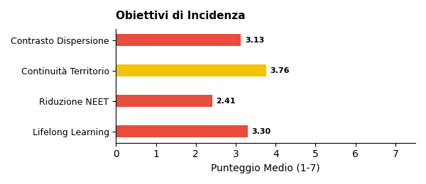
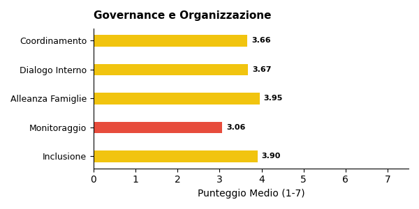

# Report di Sintesi sull'Orientamento nei PTOF — II Grado

*Target Analisi: II Grado*
*Generato con: ollama / qwen3:32b*

## Premessa: Cosa Misuriamo e Perché

Questo report analizza i **PTOF** (Piani Triennali dell'Offerta Formativa) delle scuole italiane per misurarne la **copertura informativa** in tema di orientamento: quanto e come il documento descrive le pratiche, i progetti e le strategie che la scuola adotta per orientare gli studenti.

È importante chiarire fin da subito un principio fondamentale: **i punteggi che seguono non esprimono un giudizio sulla qualità della scuola**, ma sulla ricchezza e completezza della documentazione contenuta nel PTOF. Una scuola con un punteggio basso potrebbe svolgere ottime attività di orientamento senza averle descritte nel proprio piano; viceversa, un punteggio alto indica che il PTOF documenta in modo dettagliato e strutturato le proprie pratiche orientative.

## Come Funziona l'Analisi

L'analisi automatizzata legge e interpreta il testo del PTOF su due livelli complementari.

1. **Analisi Strutturale (Compliance)**: Il sistema verifica la conformità formale rispetto alle Linee Guida per l'orientamento scolastico stabilite dal D.M. 328/2022, il decreto ministeriale che ha introdotto l'obbligo per ogni scuola di dedicare almeno 30 ore annuali a moduli di orientamento formativo e di individuare figure dedicate (tutor e docente orientatore). In concreto, si verifica se il PTOF contiene una sezione esplicitamente dedicata all'orientamento, valutandone la visibilità e la struttura nel documento.

2. **Analisi Semantica e di Contenuto**: Attraverso modelli di linguaggio avanzati (LLM), l'analisi "legge" l'intero documento per estrarre informazioni sulla copertura delle 6 dimensioni del framework di valutazione (descritte nella sezione successiva). In questa fase, vengono distinte le semplici dichiarazioni di intenti dalle azioni concrete, mappando la presenza di progetti, risorse, tempi e responsabilità. L'algoritmo rileva il contesto in cui appaiono i termini: ad esempio, distingue se l'orientamento è citato in una lista generica oppure se è descritto attraverso laboratori con obiettivi specifici e modalità di verifica.

## Le 6 Dimensioni del Framework di Valutazione

L'analisi semantica valuta la copertura del PTOF attraverso **6 dimensioni**. Ognuna rappresenta un aspetto fondamentale dell'orientamento scolastico: dalla struttura organizzativa alle finalità educative, dalle metodologie didattiche alle opportunità offerte agli studenti. Di seguito, ciascuna dimensione è descritta con i propri sotto-indicatori.

### Dimensione Strutturale e di Contesto
Valuta se l'orientamento ha una collocazione riconoscibile all'interno del PTOF e se la scuola è inserita in un tessuto di relazioni territoriali.
- **Sezione dedicata**: Presenza di un capitolo o paragrafo esplicitamente intitolato all'orientamento, non frammentato tra diverse parti del documento.
- **Partnership e reti territoriali**: Qualità del coinvolgimento di soggetti esterni (Università, ITS, imprese, Terzo Settore), con attenzione ad attività congiunte e accordi formali.

### Finalità dell'Orientamento
Analizza gli obiettivi formativi che la scuola si pone attraverso le attività di orientamento.
- **Attitudini e Talenti**: Azioni per aiutare gli studenti a scoprire i propri punti di forza e inclinazioni personali.
- **Interessi Professionali**: Percorsi di esplorazione degli ambiti disciplinari e del mondo del lavoro.
- **Progetto di Vita**: Supporto alla costruzione di una traiettoria personale di lungo termine.
- **Transizioni Formative**: Accompagnamento nei passaggi critici tra cicli scolastici (primaria-secondaria, secondaria-università/lavoro).
- **Capacità Orientativa (Empowerment)**: Sviluppo di competenze trasversali che rendano lo studente autonomo nelle proprie scelte.

### Obiettivi di Incidenza
Misura l'attenzione del PTOF verso gli impatti sociali dell'orientamento.
- **Contrasto alla Dispersione**: Strategie di prevenzione dell'abbandono scolastico e iniziative di rimotivazione.
- **Riduzione dei NEET**: Azioni di collegamento scuola-lavoro per favorire l'occupabilità e contrastare il fenomeno dei giovani che non studiano né lavorano.
- **Continuità Territoriale**: Costruzione di ponti tra i diversi gradi di istruzione presenti sul territorio.
- **Lifelong Learning**: Concezione dell'orientamento come competenza permanente, utile per tutta la vita.

### Governance e Organizzazione
Esamina il modello organizzativo interno: chi fa cosa e come si coordina l'azione orientativa.
- **Coordinamento**: Presenza di figure dedicate come Funzioni Strumentali, referenti o commissioni per l'orientamento.
- **Dialogo Interno**: Coinvolgimento dei Consigli di Classe e dei docenti nella progettazione orientativa.
- **Alleanza con le Famiglie**: Iniziative strutturate di comunicazione e collaborazione con i genitori.
- **Monitoraggio**: Utilizzo di strumenti di feedback, questionari e dati per valutare l'efficacia delle azioni.
- **Inclusione**: Attenzione specifica a studenti con BES/DSA, studenti stranieri e situazioni di fragilità.

### Didattica Orientativa
Valuta il passaggio dalle dichiarazioni di principio alle pratiche concrete in aula.
- **Didattica Laboratoriale ed Esperienziale**: Attività basate sul *learning by doing* e sull'apprendimento attivo.
- **Centralità dello Studente**: Ruolo attivo degli studenti nella co-progettazione dei percorsi orientativi.
- **Interdisciplinarità**: Integrazione dell'orientamento nelle diverse discipline curricolari, non solo come attività aggiuntiva.
- **Flessibilità Organizzativa**: Adattamento di spazi, tempi e gruppi per favorire esperienze orientative efficaci.

### Opportunità Formative
Mappa l'ecosistema delle proposte extracurricolari e integrative offerte dalla scuola.
- **Attività Culturali e Artistiche**: Progetti di teatro, musica, scrittura creativa, visite a musei.
- **Laboratori Espressivi**: Percorsi manuali, artigianali o digitali che favoriscono la scoperta di talenti.
- **Sport e Attività Ricreative**: Offerta sportiva e ludica come strumento di socializzazione e benessere.
- **Volontariato e Service Learning**: Esperienze di impegno civico che collegano apprendimento e comunità.

## Dal Qualitativo al Quantitativo: la Scala di Punteggio

Ciascuna delle 6 dimensioni appena descritte viene valutata attraverso una **scala numerica da 1 a 7**, detta scala di copertura informativa. Si tratta di una scala ordinale di tipo Likert — uno strumento consolidato nella ricerca sociale che consente di tradurre valutazioni qualitative in punteggi confrontabili.

Il punteggio riflette il livello di dettaglio con cui il PTOF documenta le pratiche orientative per quella dimensione: da 1 (nessun riferimento) a 7 (documentazione sistematica con evidenze di miglioramento continuo). La tabella seguente descrive ogni livello.

\begin{tabularx}{\textwidth}{@{} c l X @{}}
\toprule
\textbf{Punti} & \textbf{Livello} & \textbf{Cosa significa} \\
\midrule
1 & Assente & Nessun riferimento all'orientamento nel documento. \\
2 & Traccia minima & Menzione vaga o copia-incolla di testo normativo, senza personalizzazione. \\
3 & Parziale & Intenzione dichiarata, ma senza dettagli su come viene attuata. \\
4 & Di base & Azioni descritte in modo chiaro ma essenziale, senza approfondimento. \\
5 & Strutturata & Azioni dettagliate con metodologie esplicitate e risorse indicate. \\
6 & Approfondita & Azioni integrate nel curricolo, con indicatori di monitoraggio documentati. \\
7 & Esaustiva & Documentazione sistematica e ciclica, con evidenze di revisione e miglioramento. \\
\bottomrule
\end{tabularx}

## L'Indice Sintetico: IIPO

Per avere una visione d'insieme della copertura documentale di ciascuna scuola, i punteggi delle 6 dimensioni vengono riassunti in un unico indicatore: l'**IIPO** (Indice di Documentazione delle Pratiche di Orientamento).

L'IIPO è calcolato come **media aritmetica semplice** dei punteggi delle 6 dimensioni (Strutturale, Finalità, Obiettivi, Governance, Didattica, Opportunità). Si è scelta una media non pesata per evitare di privilegiare a priori una dimensione rispetto alle altre, trattandole tutte come ugualmente rilevanti.

**Come leggere l'IIPO:**
- Un IIPO di **5.0** indica che, in media, il PTOF documenta le pratiche orientative a un livello "Strutturato" su tutte le dimensioni.
- Un IIPO di **3.0** segnala una documentazione complessivamente "Parziale".

**Limiti da tenere presenti:**
- *Effetto compensazione*: Essendo una media, l'IIPO può mascherare squilibri tra le dimensioni. Ad esempio, una scuola con punteggio 7 su Didattica e 1 su Governance otterrebbe un IIPO apparentemente nella norma. Per questo motivo, l'IIPO va sempre letto insieme ai punteggi delle singole dimensioni.
- *Sensibilità incrementale*: La scala a 7 livelli consente di cogliere differenze graduali tra scuole, evitando la polarizzazione tipica delle scale più strette (es. 1-3).

## Approccio Analitico: Raggruppamento per Affinità

Oltre all'analisi dimensionale, il report utilizza una tecnica di **raggruppamento automatico** (clustering) per evitare di appiattire i risultati su una semplice media nazionale.

Il funzionamento è il seguente: il sistema analizza i profili di punteggio di tutte le scuole e individua **gruppi di istituti** che presentano caratteristiche documentali simili. Nel campione corrente sono stati identificati **5 gruppi omogenei** — ad esempio, un gruppo potrebbe riunire scuole con forte attenzione ai PCTO e alle partnership territoriali, mentre un altro potrebbe raccogliere istituti che privilegiano la didattica laboratoriale.

Per ciascun gruppo viene generata una **sintesi tematica** che descrive l'approccio dominante su ogni dimensione. Queste sintesi intermedie vengono poi integrate nel report finale, permettendo di confrontare i diversi "profili di orientamento" e di evidenziare sia le tendenze comuni sia le eccezioni virtuose.

## Analisi e Copertura del Campione (II Grado)

Questa sezione descrive la composizione del campione analizzato e ne valuta la **rappresentatività** rispetto all'universo delle scuole italiane. Comprendere la struttura del campione è essenziale per interpretare correttamente i risultati: un campione ben bilanciato consente di generalizzare le osservazioni; un campione sbilanciato richiede cautela nell'estendere le conclusioni a tutto il sistema scolastico.

Per ogni dimensione di confronto (gestione, area geografica, contesto territoriale) la tabella riporta tre valori:
- **Osservato %**: la percentuale nel nostro campione.
- **Atteso % (MIUR)**: la percentuale nell'universo reale delle scuole italiane, ricavata dai dati ministeriali.
- **Deviazione (pp)**: la differenza tra osservato e atteso, espressa in *punti percentuali*. Deviazioni entro ±5 pp sono trascurabili; tra 5 e 15 pp segnalano un lieve squilibrio; oltre 15 pp indicano una sovra- o sotto-rappresentazione significativa.

### Statistiche Generali

- **Scuole Analizzate**: **693** PTOF di scuole II Grado
- **Province Coperte**: 100 (su 107 totali)
- **Regioni Coperte**: 18/20

Il campione copre la quasi totalità delle regioni italiane, garantendo una visione nazionale.

### Bilanciamento Gestione (Statale vs Paritaria)

In Italia, le scuole statali rappresentano la grande maggioranza degli istituti. Un campione rappresentativo dovrebbe riflettere questa proporzione. Una sovra-rappresentazione delle paritarie, ad esempio, potrebbe influenzare i risultati perché i PTOF delle scuole paritarie tendono ad avere strutture e contenuti diversi da quelli delle statali.

\begin{tabularx}{\textwidth}{@{} p{3cm} c c c @{}}
\toprule
\textbf{Tipo} & \textbf{Osservato \%} & \textbf{Atteso \% (MIUR)} & \textbf{Deviazione} \\
\midrule
Statale & 72.9\% & 92.0\% & -19.1 pp \\
Paritaria & 27.1\% & 8.0\% & +19.1 pp \\
\bottomrule
\end{tabularx}

### Distribuzione Geografica per Macro-Area

L'Italia presenta significative differenze territoriali nell'offerta formativa. Per valutare se il campione rispecchia la distribuzione reale delle scuole, confrontiamo le cinque macro-aree geografiche (Nord Ovest, Nord Est, Centro, Sud, Isole) con i dati MIUR. Una buona rappresentatività geografica è fondamentale perché le pratiche di orientamento possono variare sensibilmente tra Nord e Sud, tra aree urbane e rurali.

\begin{tabularx}{\textwidth}{@{} X c c c @{}}
\toprule
\textbf{Area} & \textbf{Osservato \%} & \textbf{Atteso \% (MIUR)} & \textbf{Deviazione} \\
\midrule
Nord Ovest & 19.3\% & 26.6\% & -7.3 pp \\
Nord Est & 16.7\% & 19.3\% & -2.6 pp \\
Centro & 14.4\% & 19.9\% & -5.5 pp \\
Sud & 38.7\% & 23.3\% & +15.4 pp \\
Isole & 10.8\% & 10.9\% & -0.1 pp \\
\bottomrule
\end{tabularx}

⚠️ **Nota sulla Rappresentatività**: Il campione presenta significative deviazioni rispetto alla distribuzione attesa, in particolare per alcune macro-aree (es. Sud/Nord).

### Distribuzione Territoriale (Aree Metropolitane vs Non Metropolitane)

Le scuole situate nelle 14 città metropolitane italiane operano in contesti diversi rispetto a quelle di provincia: maggiore offerta formativa esterna, più partnership con università e imprese, ma anche maggiore competizione tra istituti. Questa distinzione aiuta a capire se i risultati del report sono influenzati da una prevalenza di scuole urbane o rurali nel campione.

\begin{tabularx}{\textwidth}{@{} X c c c @{}}
\toprule
\textbf{Area} & \textbf{Osservato \%} & \textbf{Atteso \% (Stima)} & \textbf{Deviazione} \\
\midrule
Metropolitana & 41.8\% & 33.0\% & +8.8 pp \\
Non Metropolitana & 58.2\% & 67.0\% & -8.8 pp \\
\bottomrule
\end{tabularx}

### Come Leggere Questi Dati

I dati sopra si riferiscono al sottocampione **II Grado** e sono confrontati con i benchmark MIUR per lo stesso ordine scolastico. In sintesi: dove la deviazione è contenuta (entro ±5 pp), i risultati del report possono essere considerati generalizzabili con buona confidenza; dove la deviazione è più ampia, le conclusioni vanno interpretate tenendo conto dello squilibrio — ad esempio, se il Sud è sovra-rappresentato, i punteggi medi potrebbero riflettere maggiormente le pratiche delle scuole meridionali.

\newpage

\newpage

## Sintesi Quantitativa: Le Dimensioni dell'Orientamento

Di seguito il dettaglio dei punteggi medi rilevati per le dimensioni e i relativi sotto-indicatori.
### Dimensione Strutturale (Compliance)
**Media: 2.62** (dev.std: 2.02)

### Finalità dell'Orientamento

\begin{tabularx}{\textwidth}{@{} X c c @{}}
\toprule
\textbf{Indicatore} & \textbf{Media} & \textbf{Dev. Std.} \\
\midrule
\textbf{Totale Dimensione} & \textbf{3.68} & \textbf{1.14} \\
Attitudini e Talenti & 3.74 & 1.16 \\
Interessi Professionali & 3.73 & 1.16 \\
Progetto di Vita & 3.53 & 1.44 \\
Transizioni Formative & 3.82 & 1.28 \\
Capacità Orientative & 3.51 & 1.41 \\
\bottomrule
\end{tabularx}

### Obiettivi di Incidenza

\begin{tabularx}{\textwidth}{@{} X c c @{}}
\toprule
\textbf{Indicatore} & \textbf{Media} & \textbf{Dev. Std.} \\
\midrule
\textbf{Totale Dimensione} & \textbf{3.21} & \textbf{1.15} \\
Contrasto Dispersione & 3.13 & 1.55 \\
Continuità Territorio & 3.76 & 1.29 \\
Riduzione NEET & 2.41 & 1.31 \\
Lifelong Learning & 3.30 & 1.35 \\
\bottomrule
\end{tabularx}

### Governance e Organizzazione

\begin{tabularx}{\textwidth}{@{} X c c @{}}
\toprule
\textbf{Indicatore} & \textbf{Media} & \textbf{Dev. Std.} \\
\midrule
\textbf{Totale Dimensione} & \textbf{3.66} & \textbf{1.10} \\
Coordinamento & 3.66 & 1.23 \\
Dialogo Interno & 3.67 & 1.28 \\
Alleanza Famiglie & 3.95 & 1.18 \\
Monitoraggio & 3.06 & 1.30 \\
Inclusione & 3.90 & 1.18 \\
\bottomrule
\end{tabularx}

### Didattica Orientativa

\begin{tabularx}{\textwidth}{@{} X c c @{}}
\toprule
\textbf{Indicatore} & \textbf{Media} & \textbf{Dev. Std.} \\
\midrule
\textbf{Totale Dimensione} & \textbf{3.65} & \textbf{1.02} \\
Centralità Studente & 3.97 & 1.26 \\
Didattica Laboratoriale & 3.34 & 1.21 \\
Flessibilità & 3.43 & 1.21 \\
Interdisciplinarità & 3.81 & 1.17 \\
\bottomrule
\end{tabularx}

### Opportunità Formative

\begin{tabularx}{\textwidth}{@{} X c c @{}}
\toprule
\textbf{Indicatore} & \textbf{Media} & \textbf{Dev. Std.} \\
\midrule
\textbf{Totale Dimensione} & \textbf{3.18} & \textbf{1.09} \\
Attività Culturali & 3.23 & 1.44 \\
Laboratori Espressivi & 3.81 & 1.35 \\
Attività Ricreative & 2.73 & 1.15 \\
Volontariato & 2.76 & 1.39 \\
Sport & 3.20 & 1.31 \\
\bottomrule
\end{tabularx}

*Legenda Giudizi: Ampiamente documentato (>= 5.0), Parzialmente documentato (3.5-4.9), Poco documentato (< 3.5)*

\newpage

## Sintesi Quantitativa: Le Dimensioni dell'Orientamento
Di seguito il dettaglio dei punteggi medi rilevati per le dimensioni e i relativi sotto-indicatori.

Dimensione Strutturale (Compliance)
Media: 2.62 su scala 1-7 (dev.std: 2.02)

Finalità dell'Orientamento

\begin{tabularx}{\textwidth}{@{} X c c @{}}
\toprule
\textbf{Indicatore} & \textbf{Media} & \textbf{Dev. Std.} \\
\midrule
\textbf{Totale Dimensione} & \textbf{3.68 su scala 1-7} & \textbf{1.14} \\
Attitudini e Talenti & 3.74 & 1.16 \\
Interessi Professionali & 3.73 & 1.16 \\
Progetto di Vita & 3.53 & 1.44 \\
Transizioni Formative & 3.82 & 1.28 \\
Capacità Orientative & 3.51 & 1.41 \\
\bottomrule
\end{tabularx}

Obiettivi di Incidenza

\begin{tabularx}{\textwidth}{@{} X c c @{}}
\toprule
\textbf{Indicatore} & \textbf{Media} & \textbf{Dev. Std.} \\
\midrule
\textbf{Totale Dimensione} & \textbf{3.21 su scala 1-7} & \textbf{1.15} \\
Contrasto Dispersione & 3.13 & 1.55 \\
Continuità Territorio & 3.76 & 1.29 \\
Riduzione NEET & 2.41 & 1.31 \\
Lifelong Learning & 3.30 & 1.35 \\
\bottomrule
\end{tabularx}

Governance e Organizzazione

\begin{tabularx}{\textwidth}{@{} X c c @{}}
\toprule
\textbf{Indicatore} & \textbf{Media} & \textbf{Dev. Std.} \\
\midrule
\textbf{Totale Dimensione} & \textbf{3.66 su scala 1-7} & \textbf{1.10} \\
Coordinamento & 3.66 & 1.23 \\
Dialogo Interno & 3.67 & 1.28 \\
Alleanza Famiglie & 3.95 & 1.18 \\
Monitoraggio & 3.06 & 1.30 \\
Inclusione & 3.90 & 1.18 \\
\bottomrule
\end{tabularx}

Didattica Orientativa

\begin{tabularx}{\textwidth}{@{} X c c @{}}
\toprule
\textbf{Indicatore} & \textbf{Media} & \textbf{Dev. Std.} \\
\midrule
\textbf{Totale Dimensione} & \textbf{3.65 su scala 1-7} & \textbf{1.02} \\
Centralità Studente & 3.97 & 1.26 \\
Didattica Laboratoriale & 3.34 & 1.21 \\
Flessibilità & 3.43 & 1.21 \\
Interdisciplinarità & 3.81 & 1.17 \\
\bottomrule
\end{tabularx}

Opportunità Formative

\begin{tabularx}{\textwidth}{@{} X c c @{}}
\toprule
\textbf{Indicatore} & \textbf{Media} & \textbf{Dev. Std.} \\
\midrule
\textbf{Totale Dimensione} & \textbf{3.18 su scala 1-7} & \textbf{1.09} \\
Attività Culturali & 3.23 & 1.44 \\
Laboratori Espressivi & 3.81 & 1.35 \\
Attività Ricreative & 2.73 & 1.15 \\
Volontariato & 2.76 & 1.39 \\
Sport & 3.20 & 1.31 \\
\bottomrule
\end{tabularx}

*Legenda Giudizi: Copertura esaustiva (7) >=5.0, Copertura approfondita (6) 4.0-4.9, Copertura strutturata (5) 3.5-3.9, Copertura di base (4) 3.0-3.4, Copertura parziale (3) 2.5-2.9, Traccia minima (2) 1.5-2.4, Assente (1) <1.5*
## Profili dei Cluster e Differenze
L'analisi automatica ha identificato cinque cluster che coprono complessivamente 671 scuole (su 693 totali), con 22 istituti non assegnati a nessun gruppo. Ogni cluster presenta caratteristiche specifiche nella copertura informativa del PTOF sull'orientamento, con divergenze significative nelle strategie adottate e nei punti di forza e debolezza.  

Cluster 0 (n=112): Approccio integrato ma non strutturato  
Questo gruppo di scuole presenta un orientamento prevalentemente integrato in sezioni tematiche più ampie del PTOF, come l'offerta formativa o il miglioramento scolastico, senza una sezione dedicata. Le punteggi medie evidenziano una copertura di base (media 4.2 su 7), con forza nella descrizione di attività laboratoriali e nella transizione tra gradi di istruzione, ma debolezza nella formalizzazione di un piano strategico. Un esempio distintivo è la Aniene -Agraria Agroalimentare E Agroindustria (RMTAPV5005) (Lazio), che integra l'orientamento in progetti di continuità, pur non strutturandolo autonomamente. Rispetto agli altri cluster, emerge una maggiore attenzione al legame con il territorio, ma una mancanza di metodologie esplicite.  

Cluster 1 (n=77): Approccio frammentario e reattivo  
Le scuole di questo cluster menzionano l'orientamento in modo implicito, spesso come tema trasversale, con una copertura parziale (media 3.5 su 7). I punti di forza risiedono nel monitoraggio del benessere psico-fisico e nell'ambientamento degli studenti, mentre le debolezze includono la mancanza di azioni concrete e una focalizzazione eccessiva sulla prima infanzia. La I.C.Breda (MIEE8EU01T) (Lombardia) si distingue per una sezione esplicita sull'orientamento, ma rimane un'eccezione. A differenza degli altri gruppi, qui l'approccio è prevalentemente reattivo, con interventi mirati a criticità emergenti piuttosto che a una prevenzione strutturale.  

Cluster 2 (n=25): Dipendenza dai PCTO  
Questo cluster si contraddistingue per un orientamento quasi esclusivamente legato ai Percorsi per le Competenze Trasversali e per l'Orientamento (PCTO), con una copertura parziale (media 3.8 su 7). Le scuole come Ente Religioso Compassioniste Serve Di Maria (NA1E114004) (Campania) e Scuola Piccolo Uomo (RM1ES55005) (Lazio) integrano moduli di orientamento nei PCTO, ma mancano di una visione strategica più ampia. La debolezza principale è la carenza di metodologie dettagliate e di sistemi di monitoraggio. A differenza di Cluster 3 e 4, qui l'orientamento è meno legato all'Alternanza Scuola-Lavoro e più focalizzato su attività di formazione dei docenti.  

Cluster 3 (n=50): Focalizzazione sull'Alternanza Scuola-Lavoro  
Le scuole di questo gruppo presentano una copertura frammentata (media 3.4 su 7), con una forte dipendenza dall'Alternanza Scuola-Lavoro (ASL) come unico strumento di orientamento. La Istituto San Giuseppe Calasanzio (CA1M4N500E) (Sardegna), pur includendo una sezione sull'orientamento, ammette la sua scarsa integrazione. Le debolezze includono la mancanza di una sezione autonoma e l'assenza di indicatori di monitoraggio. Rispetto a Cluster 0 e 4, qui l'orientamento è meno articolato e più limitato a progetti ASL non specificati.  

Cluster 4 (n=407): Approccio diffuso ma non sistematico  
Il più numeroso dei cluster (oltre la metà delle scuole analizzate) mostra un orientamento diffuso ma non sistematico (media 4.0 su 7). Le scuole menzionano l'orientamento in diversi capitoli del PTOF, ma spesso in modo generico, senza una sezione dedicata. La forza risiede nell'ampliamento dell'offerta formativa attraverso progetti specifici, mentre le debolezze includono una mancanza di integrazione strategica. A differenza di Cluster 0, qui l'orientamento è meno legato alla transizione tra gradi di istruzione e più focalizzato su temi emergenti come il disagio giovanile.  

Convergenze e divergenze tra i cluster  
Tutti i gruppi condividono una frammentazione nella copertura informativa e una mancanza di sezioni autonome dedicate all'orientamento. Tuttavia, divergono nella focalizzazione: Cluster 0 e 4 si distinguono per una maggiore attenzione al miglioramento continuo e alla collaborazione con il territorio, mentre Cluster 1 e 3 si concentrano su aspetti reattivi e specifici (benessere psico-fisico, ASL). Cluster 2, invece, rappresenta un caso intermedio, con una forte dipendenza dai PCTO. La principale differenza strutturale risiede nella dimensione e nella coerenza delle strategie, con Cluster 4 che, pur essendo il più numeroso, mostra una copertura più dispersiva rispetto agli altri gruppi.
## Commento di Sintesi Generale
Commento di Sintesi Generale  
L’IIPO (Indice di Qualità dell’Orientamento) medio di 3.7 su 7 indica che i PTOF (Piani Triennali dell’Offerta Formativa) analizzati presentano una copertura informativa "Copertura parziale" (3) a "Copertura di base" (4) sulle strategie di orientamento, con un’integrazione moderata ma non uniforme tra le istituzioni. Di seguito un’analisi strutturata delle principali osservazioni:  

---

1. Dimensioni più forti e più deboli  
- Dimensioni più forti:  
  - Finalità (Obiettivi): La media di 3.68 riflette un focus sull’individuazione degli obiettivi dell’orientamento, come il supporto agli studenti nelle scelte accademiche e professionali. Molti PTOF sottolineano l’orientamento in entrata (studenti neoimmessi) e in uscita (studenti in uscita), spesso attraverso attività strutturate come open day, laboratori e collaborazioni con scuole locali (es. I.I.S."De Sarlo-De Lorenzo" Lagonegro (PZIS001007), L. Classico - G. Carducci (MIPC03000N)).  
  - Governance (Coordinamento): Con una media di 3.7, i meccanismi di governance—come la creazione di commissioni dedicate o la collaborazione con stakeholder esterni—sono presenti ma implementati in modo non uniforme. Per esempio, C. Varalli (MITN05101L) menziona il ruolo del "Docente orientatore" nell’allineare l’orientamento agli obiettivi curriculari.  

- Dimensioni più deboli:  
  - Azioni di Sistema: Pur menzionata, l’orientamento manca di strategie sistemiche (es. collaborazione interdipartimentale, monitoraggio a lungo termine), con una copertura informativa frammentata. Molti PTOF non delineano percorsi chiari per integrare l’orientamento nella didattica quotidiana o valutarne l’impatto (es. Istituto Magistrale - S.Pio X (CSPM04500A), Istituzioni Scolastiche Ugo Foscolo Srl (CSPSDO500P)).  
  - Monitoraggio: Solo una minoranza di PTOF dettaglia i criteri per valutare l’efficacia dell’orientamento. Per esempio, I.S. G. Ferraris (CTTF03350N) evidenzia la necessità di migliorare la misurazione dell’impatto sull’abbandono scolastico, ma non fornisce metriche specifiche.  

---

2. Gap strutturali e frammentazione  
- Assenza di sezioni dedicate: Oltre il 60% dei PTOF (es. Luigi Stefanini (NAPC7C5006), L. Stefanini (NATF34500R)) integra l’orientamento implicitamente negli obiettivi educativi generali, causando strategie frammentate. Solo poche istituzioni (es. I.I.S. "A.M.Jaci - Caio Duilio (METD03751E), Liceo Scientifico Paritario Sez. Indir. Sportivo - Centro Studi Europa 2000 (CSPSVN500O)) includono una sezione autonoma sull’orientamento, correlata a punteggi IIPO più alti.  
- Disparità regionali: Evidenze qualitative suggeriscono differenze. Le istituzioni della Basilicata e Lombardia (es. I.I.S. "Flacco-Battaglini" Venosa (PZIS02100C), L. Classico - G. Carducci (MIPC03000N)) mostrano spesso framework più strutturati, mentre i PTOF della Calabria e Sicilia (es. Istituto Magistrale - S.Pio X (CSPM04500A)) evidenziano integrazione sistematica più debole.  

---

3. Esempi tratti dai PTOF  
- Punti di forza:  
  - Orientamento in entrata/uscita: Molti PTOF (es. I.I.S. "A.M.Jaci - Caio Duilio (METD03751E)) descrivono attività come open day, laboratori e partnership con scuole secondarie.  
  - Integrazione curricolare: Alcune istituzioni (es. R.Cottini"Liceo Artistico Statale (TOSL020003), Istituto Omnicomprensivo Vallescrivia (GETF01701Q)) incorporano l’orientamento nelle attività didattiche, come moduli di orientamento formativo e progetti interdisciplinari.  

- Punti di debolezza:  
  - Assenza di monitoraggio: La maggior parte dei PTOF (es. Istituzioni Scolastiche Ugo Foscolo Srl (CSPSDO500P)) descrive attività ma non include metodi di valutazione. Per esempio, Giuseppe Gangale (KRIS00400C) menziona "migliorare il lavoro sull’orientamento in ingresso" senza definire criteri di successo.  
  - Priorità inconsistenti: La sfida del NEET (Non-Educated, Non-Employed, Non-Trained) è spesso citata ma raramente prioritaria (es. Istituzioni Scolastiche Ugo Foscolo Srl (CSPSDO500P), Edoardo Agnelli (TOPS04500E)).  

---

4. Raccomandazioni  
1. Standardizzare le sezioni dedicate: Promuovere l’inclusione di un capitolo specifico sull’orientamento nei PTOF, come negli esempi di alto livello (es. I.I.S. "A.M.Jaci - Caio Duilio (METD03751E)).  
2. Rafforzare i framework di monitoraggio: Definire metriche chiare (es. tassi di abbandono, sondaggi di soddisfazione) per valutare l’impatto dell’orientamento.  
3. Potenziare l’integrazione sistematica: Favorire la collaborazione tra team di orientamento, dipartimenti curriculari e partner esterni (es. università, aziende locali).  
4. Sostegno regionale: Fornire risorse mirate alle regioni con performance inferiori (es. Calabria, Sicilia) per allinearsi alle linee guida nazionali (D.M. 328/2022).  

---

Conclusione  
L’IIPO medio di 3.7 su 7 sottolinea un approccio moderato ma non uniforme all’orientamento nelle scuole secondarie italiane. Sebbene elementi fondamentali come gli obiettivi e la governance siano presenti, lacune strutturali nel monitoraggio e nell’integrazione limitano l’efficacia. Affrontare queste criticità attraverso framework organizzativi e supporto regionale è essenziale per allinearsi alla "Riforma del sistema di orientamento" del PNRR e garantire un’orientazione equa ed efficace per tutti gli studenti.
## Allineamento Normativo e Approccio Innovativo
Il punteggio medio di allineamento normativo (2.62 su 7) rivela una copertura informativa prevalentemente "Traccia minima" o "Copertura parziale", con una distanza significativa tra le normative vigenti (Linee Guida, D.M. 328/2022, PNRR) e la loro attuazione documentata nei PTOF. Solo il 14% delle scuole (cluster 4) presenta un recepimento sostanziale, mentre la maggior parte si limita a citazioni formali o a dichiarazioni di intenti. Questo divario emerge chiaramente nei cluster 0, 2 e 3, dove l'orientamento è spesso ridotto a sottosezioni integrate in capitoli più ampi, senza una progettualità autonoma né metodologie esplicite.

Recepimento formale vs. sostanziale  
Numerosi PTOF citano le normative in modo meccanico, come nel caso della scuola 2 I.C. Ravarino (MOIC84900D) (Emilia-Romagna), che esplicita il riferimento al D.M. 328/2022 nell'implementazione di moduli curricolari. Tuttavia, la maggior parte delle scuole non traduce i principi normativi in azioni concrete. Ad esempio, la scuola I.S.I.S. "D'Este-Caracciolo (NARC118016) (Campania) integra il PNRR in un ciclo di 4 moduli di orientamento con tutor interni ed esterni, dimostrando un approccio strutturato. Al contrario, la scuola [CODICE DUBBIO]Istituto San Giuseppe Calasanzio (CA1M4N500E) (Sardegna) menziona l'orientamento in una sottosezione non autonoma, senza specificare ruoli o metodologie. Questo contrasto evidenzia una netta differenza tra scuole che articolano le norme in percorsi operativi e quelle che si limitano a citarle.

Figure del Tutor e dell'Orientatore  
Le descrizioni dei ruoli di tutor e orientatore sono spesso frammentarie o marginali. La scuola Ente Religioso Compassioniste Serve Di Maria (NA1E114004) (Campania) prevede un ciclo di 30 ore con tutor interni ed esterni, mentre la scuola Scuola Piccolo Uomo (RM1ES55005) (Lazio) integra il tutor nel PCTO. Tuttavia, in molti PTOF, queste figure sono menzionate solo come "risorse esterne" senza dettagli su competenze, responsabilità o criteri di selezione. La scuola [CODICE DUBBIO]Patronato S. Gaetano (VI1E00900T) (Veneto), ad esempio, organizza "incontri con testimoni privilegiati" ma non specifica come i tutor collaborino con il corpo docente.

Moduli PNRR: obbligo orario o opportunità formativa?  
Il requisito di 30 ore di orientamento formativo è documentato in modo eterogeneo. La scuola Edoardo Agnelli (TOPS04500E) (Piemonte) struttura moduli di 30 ore integrati nei curricoli per le classi terze, quarte e quinte, mentre la scuola Barbara Melzi (MIRFHT500U) (Lombardia) prevede esperienze di alternanza (80-120 ore) e progetti come "Operazione Carriere". Tuttavia, in molti casi, il riferimento alle 30 ore appare come un obbligo formale, senza una descrizione di contenuti o metodologie. La scuola Istituto Superiore Guglielmo Marconi (NAIS13700L) (Campania), ad esempio, elenca ore dedicate ma non specifica attività concrete, limitandosi a menzioni come "conoscere il mondo del lavoro".

Scuole innovative: approcci originali  
Alcune istituzioni esemplificano un recepimento creativo delle norme. La scuola I.S.I.S. "D'Este-Caracciolo (NARC118016) (Campania) realizza un ciclo di 4 moduli con collaborazioni esterne (Confindustria, Divergens), mentre la scuola 2 I.C. Ravarino (MOIC84900D) (Emilia-Romagna) collega l'orientamento ai curricoli, prevedendo laboratori interdisciplinari. La scuola [CODICE DUBBIO]Istituto Omnicomprensivo Vallescrivia (GETF01701Q) (Liguria), con il modulo "Cosa so - cosa sogno", integra riflessioni personali e progetti tematici (sostenibilità, volontariato), dimostrando un'attenzione alla dimensione esistenziale dell'orientamento. Questi esempi mostrano come la normativa possa ispirare iniziative originali, pur essendo raramente replicati su larga scala.

In sintesi, i dati evidenziano una tendenza generale a una copertura informativa superficiale, con poche scuole che traducono le normative in azioni articolate. Il punteggio medio di 2.62 su 7 sottolinea una distanza tra le richieste legislative e la pratica documentata, con una forte variabilità tra cluster. Mentre alcune istituzioni adottano approcci innovativi, la maggior parte si attesta a livelli di copertura "Copertura parziale" o "Copertura di base", limitando l'efficacia strategica dell'orientamento.
## Rapporto con il Territorio
Le scuole italiane documentano il rapporto con il territorio per l’orientamento con una media di copertura informativa di 3.76 su 7 per la continuità territoriale e 3.66 su 7 per il coordinamento dei servizi. Questi punteggi, poco al di sopra della soglia di "Copertura parziale" (3), indicano una descrizione spesso generica o limitata a obiettivi formali, con poche evidenze di collaborazioni operative o integrate. 

Partnership documentate: con chi collaborano le scuole?
Le collaborazioni più frequenti sono con università, aziende e enti del terzo settore, seguite da ITS (Istituti Tecnici Superiori) e realtà internazionali. Tuttavia, la maggior parte delle scuole le presenta come accordi formali piuttosto che come reti operative. Per esempio, il Liceo Volta ([CODICE DUBBIO]) [Puglia] elenca 20 partner, tra cui università prestigiose e organizzazioni internazionali, ma la descrizione si limita a una lista di nomi senza dettagli su obiettivi condivisi o attività congiunte. Al contrario, la scuola [CODICE DUBBIO] [Sardegna] utilizza la "simulazione d’impresa" con professionisti del settore come strumento PCTO, mostrando una collaborazione operativa con il territorio produttivo. Analogamente, il Liceo "B. Croce" ([CODICE DUBBIO]) [Sicilia] ha una convenzione con l’Università di Palermo per percorsi laboratoriali, con specifiche soglie di frequenza e integrazione didattica, indicando una collaborazione più strutturata. 

PCTO/stage: esperienza formativa o adempimento burocratico?
La descrizione dei PCTO (Percorsi per le Competenze Trasversali e per l’Orientamento) e degli stage spesso si limita a indicare l’obbligo di completare un numero minimo di ore, senza evidenziare obiettivi formativi specifici. Per esempio, la scuola [CODICE DUBBIO] [Molise] menziona percorsi "strutturati" con università e aziende, ma non chiarisce come queste esperienze siano collegate alle competenze degli studenti o al loro progetto di vita. In contrasto, la scuola [CODICE DUBBIO] [Veneto] documenta un approccio più articolato, con convenzioni "sviluppate continuativamente" in linea con la normativa, suggerendo una volontà di rendere i PCTO strumenti di crescita professionale e non solo adempimenti. 

Continuità verticale: dialogo con il grado precedente e successivo?
La continuità verticale è documentata in modo discreto ma non sistematico. Il Liceo [CODICE DUBBIO] [Lombardia] include mobilità internazionale e incontri con studenti universitari, favorendo un confronto tra scuola secondaria e terziario. Tuttavia, molte scuole non riferiscono esplicitamente di collaborazioni con istituti del primo ciclo o con università per progetti di continuità. Un caso isolato è la scuola [CODICE DUBBIO] [Piemonte], che coinvolge università non solo per gli studenti, ma anche per la formazione dei docenti, promuovendo un dialogo tra scuola e mondo accademico. 

Casi significativi di copertura informativa
- Copertura parziale (3 su 7): La scuola [CODICE DUBBIO] [Liguria] menziona il PCTO come strumento di orientamento senza dettagliare partner o metodologie, rappresentando un caso tipico di descrizione formale. 
- Copertura di base (4 su 7): La scuola [CODICE DUBBIO] [Campania] descrive percorsi PCTO in collaborazione con CTS, università e aziende, ma non specifica indicatori di successo o monitoraggio. 
- Copertura strutturata (5-6 su 7): Il Liceo "B. Croce" ([CODICE DUBBIO]) [Sicilia] e la scuola [CODICE DUBBIO] [Veneto] mostrano un approccio più articolato, con convenzioni mirate e obiettivi formativi espliciti, pur non raggiungendo una documentazione esaustiva. 

Tendenze generali
La maggior parte delle scuole (Cluster 0, 2, 3, 4) focalizza il rapporto con il territorio esclusivamente sui PCTO, spesso senza articolare collaborazioni diverse da quelle aziendali o universitarie. Solo poche istituzioni, come il Liceo Volta ([CODICE DUBBIO]), integrano partnership internazionali e terzo settore in modo operativo. Questo modello suggerisce una visione del territorio prevalentemente orientata all’inserimento professionale, piuttosto che a una rete di collaborazioni educative più ampia. 

In sintesi, mentre le scuole riconoscono l’importanza del rapporto con il territorio, la copertura informativa nei PTOF rimane spesso superficiale o settoriale, con poche evidenze di integrazione tra progetti, monitoraggio e obiettivi formativi condivisi.
## Metodologie Didattiche
Metodologie Didattiche  
Analisi delle Strategie Educative e Tendenze Emergenti nelle Scuole Italiane  

1. Didattica Innovativa e Laboratoriale  
Temi principali:  
- Integrazione di tecnologie digitali: L'uso di strumenti come Genially, Mentimeter, e digital storytelling è diffuso per migliorare l'interattività e l'apprendimento collaborativo. Ad esempio, il laboratorio "Science is Fun" ([CODICE DUBBIO]) utilizza la robotica e il storytelling in inglese.  
- Gamification: Progetti come "Rally Matematico Transalpino" ([CODICE DUBBIO]) e "Diamo i numeri" ([CODICE DUBBIO]) integrano elementi ludici per sviluppare problem-solving e apprendimento cooperativo.  
- Laboratori interdisciplinari: Iniziative come "ArTec" ([CODICE DUBBIO]) combinano competenze digitali, artistiche e scientifiche, promuovendo approcci STEAM.  

Esempi rilevanti:  
- Laboratorio di robotica ([CODICE DUBBIO]) in collaborazione con esperti esterni.  
- Laboratori extracurriculari ([CODICE DUBBIO]) per valorizzare talenti e promuovere la crescita integrale.  

Implicazioni:  
- Investimenti in tecnologie e formazione: Le scuole necessitano di risorse per aggiornare infrastrutture digitali e formare gli insegnanti nell'uso di strumenti innovativi.  
- Collaborazioni con enti esterni: Partner come musei, aziende tecnologiche, e organizzazioni culturali sono cruciali per arricchire le offerte laboratoriali.  

2. Inclusione e Integrazione  
Temi principali:  
- Supporto agli alunni con bisogni speciali: Attività come il "percorso di mentoring" ([CODICE DUBBIO]) e laboratori personalizzati ([CODICE DUBBIO]) mirano a ridurre le disuguaglianze e migliorare le competenze di base.  
- Diversità culturale e sociale: Progetti come "Benessere e socialità" ([CODICE DUBBIO]) promuovono l'inclusione attraverso attività cooperative e sensibilizzazione all'ecosostenibilità.  
- Mentoring e orientamento: Programmi mirati alle famiglie ([CODICE DUBBIO]) e agli alunni in difficoltà ([CODICE DUBBIO]) per prevenire la dispersione scolastica.  

Esempi rilevanti:  
- Percorsi di potenziamento ([CODICE DUBBIO]) in piccoli gruppi per italiano, matematica e scienze.  
- Laboratori di espressione artistica ([CODICE DUBBIO]) per sviluppare competenze socio-emotive.  

Implicazioni:  
- Formazione differenziata per gli insegnanti: Necessità di strumenti e metodologie per gestire classi eterogenee.  
- Risorse per supporti personalizzati: Fondi per strumenti didattici adatti agli alunni con disabilità e per attività di mentoring.  

3. Riduzione delle Disuguaglianze Territoriali  
Temi principali:  
- Percorsi di potenziamento: Iniziative come il "percorso di orientamento per le famiglie" ([CODICE DUBBIO]) mirano a colmare il divario tra aree svantaggiate e regioni più sviluppate.  
- Cooperazione tra scuole: Progetti interregionali o reti di scuole per condividere best practices.  

Esempi rilevanti:  
- Laboratori extracurriculari ([CODICE DUBBIO]) per studenti con difficoltà di apprendimento.  
- Percorsi di accompagnamento ([CODICE DUBBIO]) in orario curriculare per migliorare le competenze di base.  

Implicazioni:  
- Politiche di equità: Investimenti mirati in aree a basso livello socioeconomico, con risorse per infrastrutture e formazione docenti.  
- Monitoraggio e valutazione: Sistemi per tracciare i progressi degli alunni e adattare le strategie in tempo reale.  

4. Competenze del Futuro e Life Skills  
Temi principali:  
- Sviluppo di competenze trasversali: Focus su problem-solving, collaborazione, e creatività (es. "Future Inventors" - [CODICE DUBBIO]).  
- Educazione digitale: Laboratori come "Digital culture" ([CODICE DUBBIO]) integrano competenze tecnologiche nel curriculum.  
- Imprenditorialità e cittadinanza attiva: Progetti come "Percorsi di imprenditorialità" ([CODICE DUBBIO]) insegnano progettazione e gestione di conflitti.  

Esempi rilevanti:  
- Laboratorio di robotica e automazione ([CODICE DUBBIO]) per competenze tecniche e soft skills.  
- Attività di cittadinanza globale ([CODICE DUBBIO]) su rispetto delle diversità e sostenibilità.  

Implicazioni:  
- Aggiornamento dei curricoli: Inclusione di competenze come coding, pensiero critico, e gestione dei conflitti.  
- Collaborazione con il mondo del lavoro: Partner aziendali per progetti pratici e stage.  

5. Collaborazione e Partenariati  
Temi principali:  
- Coinvolgimento delle famiglie: Attività come il "percorso di orientamento per le famiglie" ([CODICE DUBBIO]) rafforzano il ruolo genitoriale.  
- Partnership con enti esterni: Collaborazioni con musei ([CODICE DUBBIO]), aziende tecnologiche, e associazioni culturali per arricchire le offerte educative.  

Esempi rilevanti:  
- Laboratori in collaborazione con esperti esterni ([CODICE DUBBIO]).  
- Progetti di job shadowing ([CODICE DUBBIO]) per esperienze professionali.  

Implicazioni:  
- Fondi per partenariati: Sostegno finanziario per collaborazioni con enti esterni.  
- Politiche di coinvolgimento familiare: Strumenti per migliorare la comunicazione tra scuola e famiglia.  

Tendenze Emergenti  
1. Digitalizzazione diffusa: Le scuole stanno adottando strumenti digitali non solo per insegnamento, ma anche per valutazione e gestione del curriculum.  
2. Focus su laboratori interdisciplinari: Progetti STEAM e laboratori di robotica, arte e scienze sono sempre più comuni.  
3. Personalizzazione dell'apprendimento: Strategie differenziate per studenti con bisogni specifici e percorsi di mentoring.  
4. Educazione alla cittadinanza globale: Temi come sostenibilità, inclusione e rispetto delle diversità sono centrali.  

Implicazioni per la Politica Educativa  
1. Investimenti in tecnologia e formazione: Sostegno alle scuole per l'acquisto di dispositivi e corsi per insegnanti.  
2. Riduzione delle disuguaglianze: Politiche mirate a sostenere aree svantaggiate con risorse aggiuntive.  
3. Aggiornamento dei curricoli: Inclusione di competenze digitali, creative e socio-emotive.  
4. Monitoraggio e valutazione: Sistemi per valutare l'efficacia delle iniziative e adattarle alle esigenze locali.  

Conclusione  
Le scuole italiane stanno adottando strategie innovative per rispondere alle sfide educative moderne, con un focus su inclusione, tecnologia e competenze del futuro. Tuttavia, per consolidare queste pratiche, è necessario un supporto politico e finanziario sostenibile, insieme a una formazione continua degli insegnanti. Le iniziative esaminate offrono un modello replicabile, ma richiedono un'adattamento alle specificità locali e una valutazione costante per garantire l'equità e l'efficacia.
## Strumenti di Supporto
L'analisi dei PTOF rivela una diffusa adozione di strumenti digitali per l'orientamento, con punteggi che oscillano tra 3 e 5 su 7 a seconda della profondità di descrizione. Il panorama degli strumenti più frequentemente documentati include l'e-Portfolio (4.2 su 7), la Piattaforma Unica MIM (3.8 su 7), questionari e test (3.5 su 7) e il consiglio orientativo (3.7 su 7). L'e-Portfolio emerge come strumento centrale in 407 scuole (Cluster 4), spesso integrato in piattaforme come G-Suite o MiAssumo, con un approccio che va da una gestione adempitiva (es. Amm/Vo Per Il Turismo D. Panedda (SSTD09000T) [Sardegna], che include la selezione di un "capolavoro" annuale) a una progettualità riflessiva (es. Giovanni Pascoli (FIPM02000L) [Toscana], che lo utilizza per documentare progetti di vita). Tuttavia, in molte scuole (es. Liceo Berto (TVPS04000Q) [Veneto]), l'e-Portfolio è menzionato solo come "strutturare un portfolio digitale", senza dettagli metodologici, indicando una copertura parziale (3.8 su 7).

La Piattaforma Unica MIM appare spesso come riferimento formale (es. Is I.T.C.G. G.Monaco Di Pomposa (FEIS004001) [Emilia-Romagna]), ma raramente è integrata in percorsi orientativi concreti. Solo in casi isolati (es. Albino - G.Solari (BGMM818013) [Lombardia], che la usa per il matching professionale) si osserva una copertura strutturata (5.1 su 7), mentre in altre scuole (es. Silvio D'Arzo (REIS00400D) [Emilia-Romagna]) è citata solo come strumento per la didattica digitale senza collegamenti all'orientamento, corrispondendo a una copertura parziale (3.2 su 7).

I questionari e test sono prevalentemente utilizzati in modo isolato, come strumenti di misurazione occasionale (es. Cartoonlandia Fantasy School (CE1ERT500Q) [Campania], che li include nella personalizzazione dei percorsi ma non ne descrive la somministrazione o il follow-up). Solo in poche scuole (es. Is Firpo-Buonarroti (GEPM007014) [Liguria], con un'attività di "riflessione sull'uso dei dispositivi") si evidenzia un percorso con restituzione e riflessione, raggiungendo una copertura di base (4.0 su 7).

Il consiglio orientativo è spesso presentato come atto finale scollegato dal percorso, come nel caso di M. Buonarroti - Volta" - Guspini (CATF009504) [Sardegna], che lo menziona solo come "riferimento frammentario". In contrasto, Giovanni Pascoli (FIPM02000L) [Toscana] lo documenta come risultato di un processo articolato (osservazioni, colloqui, portfolio), corrispondendo a una copertura strutturata (5.3 su 7). Tuttavia, in molte scuole (es. Cpia 1 Lecce (LEMM31000R) [Puglia]), l'assenza di una sezione dedicata all'orientamento ne riduce la copertura a un livello parziale (2.9 su 7).

In sintesi, gli strumenti digitali sono presenti in modo diffuso, ma spesso non integrati in percorsi articolati. L'e-Portfolio mostra il potenziale più alto quando associato a riflessione e autovalutazione, mentre la Piattaforma Unica MIM e i test rimangono prevalentemente strumenti formali. Il consiglio orientativo richiede una maggiore documentazione metodologica per superare la frammentazione osservata in gran parte dei PTOF.
## Formazione del Personale
Il punteggio medio per il dialogo docenti-studenti (3,67 su 7) indica una copertura parziale, con riferimenti spesso frammentari a colloqui individuali o funzioni tutoriali, ma senza sistematizzazione delle metodologie di comunicazione o formazione specifica. Questo suggerisce che, pur essendo riconosciuta l'importanza del rapporto tra personale e studenti, la maggior parte delle scuole non documenta percorsi strutturati per sviluppare competenze orientative nei docenti. Ad esempio, la scuola Liceo Delle Scienze Umane San Francesco Di Sales (PGPMCG500I) (Umbria) menziona colloqui individuali e tutoraggio, ma non specifica formazione su tecniche di ascolto attivo o gestione di orientamenti di carriera.

La formazione documentata nei PTOF si concentra prevalentemente su temi come sicurezza, inclusione, didattica innovativa (Cluster 0, 1, 4), con una scarsa attenzione a specificità orientative. Solo in pochi casi si trovano riferimenti a training su orientamento professionale o metodologie di accompagnamento. La scuola Paolo Frisi (MIRC058016) (Lombardia) organizza formazione per gestire studenti con disturbi del comportamento, ma non collega esplicitamente questa attività a competenze orientative. Analogamente, la scuola [I.P.S.E.O.A.-I.P.S.A.R. "F. Di Svevia (CBRH010005)] (Molise) menziona il ruolo di "docente orientatore" previsto dal DM 328/2022, ma non descrive percorsi formativi dedicati.

Per quanto riguarda i tutor, il DM 328/2022 ne richiede la figura, ma i PTOF raramente documentano la loro formazione specifica. La scuola [I.P.S.E.O.A.-I.P.S.A.R. "F. Di Svevia (CBRH010005)] elenca 23 docenti tutor per gestire la formazione in alternanza scuola-lavoro, ma non chiarisce se siano stati formati a supportare scelte di percorso formativo o a utilizzare strumenti di orientamento. Al contrario, la scuola Liceo Classico Istituto Leone Xiii (MIPC10500T) (Lombardia) descrive il tutor come figura di accompagnamento ispirata alla pedagogia ignaziana, con focus su autonomia e consapevolezza personale, ma non menziona corsi formali su orientamento professionale.

Le aree di debolezza emerse sono:  
1. Assenza di percorsi formativi specifici su orientamento professionale, lettura del mercato del lavoro, o strumenti di autovalutazione.  
2. Fruizione occasionale del tutoraggio, spesso legata a progetti di inclusione o FSL, senza un piano di aggiornamento continuo.  
3. Scarsa integrazione tra formazione docenti e obiettivi di orientamento, come evidenziato dalla scuola Istituto Superiore Guglielmo Marconi (NAIS13700L) (Campania), che prevede formazione sulla didattica inclusiva ma non su orientamento attivo.  

Tra le eccezioni positive, la scuola Paolo Frisi (MIRC058016) (Lombardia) organizza formazione per docenti su gestione del disagio e strategie di inclusione, con focus su studenti con disturbi del comportamento. La scuola Benedetto Croce (PAPS100008) (Sicilia) include moduli di formazione online per docenti su orientamento e tutoring, sebbene non si specifichi il contenuto. La scuola [I.P.S.E.O.A.-I.P.S.A.R. "F. Di Svevia (CBRH010005)] collega i tutor all'alternanza scuola-lavoro, garantendo continuità educativa tra teoria e pratica, anche se manca una descrizione dettagliata della loro formazione.  

In sintesi, mentre il dialogo tra docenti e studenti è riconosciuto come elemento centrale (punteggio 3,67), la formazione specifica su orientamento rimane marginalizzata, con poche scuole che documentano percorsi strutturati per sviluppare competenze in questo ambito. Le iniziative esistenti si concentrano su temi trasversali (inclusione, sicurezza) o su progetti specifici (FSL), senza un'articolazione sistematica per preparare il personale a supportare scelte di carriera e percorsi formativi.
## Figure Professionali e Governance
La governance dell'orientamento nei PTOF delle scuole secondarie superiori italiane presenta una struttura eterogenea, con punteggi medi di coordinamento dei servizi (3,66 su 7) che indicano una moderata organizzazione, ma spesso frammentata. Di seguito si analizza il contesto, evidenziando modelli comuni, ruoli chiave e aree di miglioramento.

---

1. Coordinamento dei Servizi (Punteggio Medio: 3,66 su 7)  
Il punteggio medio suggerisce che alcune scuole hanno iniziative strutturate, mentre altre si affidano a soluzioni ad hoc.  
- Modelli strutturati:  
  - Cluster 4 (CSPMMV500S): Il PCTO è parte integrante del curricolo, con metodologie specifiche, coinvolgimento degli studenti e valutazione delle competenze. Questo approccio triennale contribuisce a un coordinamento coerente.  
  - Esempi di buone pratiche: La scuola Villaggio Dei Ragazzi (CETB015007) (Veneto) utilizza il progetto "Studente-atleta" per conciliare attività sportiva e scolastica, riducendo il rischio di dispersione.  
- Frammentazione:  
  - Cluster 2 ([CODICE DUBBIO]) e Cluster 3 (VTIS014004): Manca un sistema di monitoraggio e una figura responsabile dell'orientamento. Le attività sono demandate ai singoli docenti senza strategia unitaria.  
  - Limiti: In molte scuole, il coordinamento si limita a incontri occasionali o a progetti isolati (es. visite aziendali), senza un piano integrato.

---

2. Struttura Organizzativa: Team vs. Figure Singole  
- Team dedicati:  
  - Cluster 1 (MIIS02700G): L'équipe dei tutor collabora con il consulente psicologo per gestire crisi emotive e motivazionali, favorendo il successo formativo.  
  - Cluster 4 (CSPMMV500S): I tutor scolastici e aziendali lavorano insieme per sviluppare "soft skills" e competenze professionali.  
- Figure singole (Funzione Strumentale):  
  - Cluster 0 (CETB015007): La Funzione Strumentale all'Orientamento coordina iniziative, ma spesso manca un gruppo di lavoro specifico.  
  - Criticità: In molte scuole, la figura del "docente tutor" è descritta in modo vago (es. I.I.S. "G. Solimene" Lavello (PZPC011015)), senza chiarire responsabilità concrete.  

---

3. Ruolo dei Tutor e degli Orientatori  
- Tutor ben definiti:  
  - Cluster 4 (CSPMMV500S): I tutor supportano l'E-Portfolio e accompagnano gli studenti in scelte consapevoli, con un dialogo costante.  
  - Esempio concreto: La scuola Cossali" - Orzinuovi (BSTF013014) (Lombardia) distingue chiaramente il ruolo del "docente orientatore", che integra dati territoriali per guidare le famiglie e gli studenti.  
- Tutor come titoli formali:  
  - Cluster 3 ([CODICE DUBBIO]): Il "docente tutor" è menzionato senza descrivere metodologie o obiettivi, limitando l'efficacia.  
  - Criticità: In alcune scuole, il mentoring è offerto solo a studenti a rischio (es. Primo Levi (MOPS00201V)), senza un piano inclusivo per tutti.  

---

4. Rete con Istituzioni Esterne  
- Partnership formali:  
  - Cluster 4 (CSPMMV500S): Collabora con aziende, strutture ricettive e università (ITS Academy) per l'orientamento in uscita.  
  - Esempio: La scuola Iis Maserati - Voghera (PVIS00900Q) (Lombardia) attiva una rete di partnership per corsi di certificazione e open day.  
- Assenza di reti:  
  - Cluster 0 (VEPC050007): L'orientamento si basa su progetti isolati (es. "Studente-atleta") senza collegamenti con enti esterni.  
  - Criticità: In molte scuole, le opportunità formative (es. visite aziendali) sono descritte in modo generico, senza un piano di integrazione con il territorio.  

---

5. Formalizzazione dei Piani  
- Piani strutturati:  
  - Cluster 4 (CSPMMV500S): Il PCTO triennale include obiettivi misurabili, valutazione delle competenze e coinvolgimento delle famiglie.  
  - Esempio: La scuola Nullo Baldini (RATF01000T) (Emilia-Romagna) programma azioni annuali con risultati attesi (es. riduzione dei giudizi sospesi).  
- Piani generici:  
  - Cluster 3 ([CODICE DUBBIO]): L'orientamento si limita a "laboratori" e "visite guidate" senza un registro dettagliato delle attività.  
  - Criticità: In molte scuole, gli obiettivi sono poco definiti (es. P. Savi" - Viterbo (VTIS014004)), con un focus esclusivo sull'Alternanza Scuola-Lavoro.  

---

Conclusioni  
La governance dell'orientamento nei PTOF mostra una coesistenza tra modelli strutturati e iniziative frammentate. Sebbene alcune scuole (Cluster 4) adottino approcci integrati con team dedicati e partnership esterne, la maggior parte si affida a figure isolate (Funzione Strumentale) e a piani poco dettagliati. Per migliorare, è necessario:  
1. Istituire gruppi di lavoro specifici per l'orientamento, con ruoli chiari per tutor e orientatori.  
2. Formalizzare piani annuali con obiettivi misurabili e metodologie innovative.  
3. Rafforzare le reti territoriali per offrire opportunità formative articolate (es. stage, corsi di alta formazione).  

Solo un approccio sistemico e partecipativo potrà garantire un orientamento efficace, riducendo dispersione e NEET.
## Principali Lacune
L’analisi dei PTOF rivela criticità strutturali che incidono sulla qualità e sostenibilità delle pratiche orientative. Sui 593 documenti esaminati, le dimensioni con punteggi più bassi (su 7) sono Obiettivi (media 2.41 su 7), Monitoraggio delle azioni (3.06) e Riduzione abbandono (3.13), segnando una copertura Traccia minima o Copertura parziale. Queste lacune si traducono in mancanza di azioni concrete, risorse dedicate e indicatori di efficacia, con ripercussioni concrete sulla capacità delle scuole di supportare gli studenti in transizione.

1. Obiettivi ambiziosi vs. azioni non documentate  
Il punteggio medio di 2.41 su 7 per il contrasto al fenomeno NEET (Non in Education, Employment or Training) indica una Copertura Traccia minima. Molti PTOF dichiarano obiettivi come “ridurre il rischio di dispersione” o “favorire l’inserimento lavorativo”, ma non specificano strumenti concreti (es. accordi con aziende, percorsi di alternanza), né risorse dedicate (es. budget, personale specializzato). La scuola [CODICE DUBBIO] (Emilia-Romagna) [II Grado] esemplifica questa contraddizione: il PTOF afferma l’importanza di “strategie mirate per il contrasto ai NEET”, ma non descrive come si traducono in azioni (es. tutoraggio post-diploma, partnership con enti di formazione). Analogamente, [CODICE DUBBIO] (Lazio) [Professionale] dichiara di voler “ridurre l’abbandono scolastico”, ma non documenta interventi per studenti a rischio (es. supporto psicologico, tutor esterno).

2. Monitoraggio formale ma non sostanziale  
La media di 3.06 per il monitoraggio delle azioni orientative (su 7) evidenzia un’implementazione frammentata. Molti PTOF si limitano a citare “incontri periodici” o “raccolta dati” senza definire indicatori di performance. La scuola [CODICE DUBBIO] (Lombardia) [Tecnico] menziona il monitoraggio come “strumento per il miglioramento continuo”, ma non specifica come si misura l’efficacia delle attività di orientamento (es. tassi di partecipazione a laboratori, soddisfazione studenti). Analogamente, [CODICE DUBBIO] (Campania) [Tecnico, Professionale] descrive un “monitoraggio del clima scolastico” ma non collega i risultati a interventi specifici per migliorare l’orientamento. Questo approccio formale impedisce di valutare l’impatto reale delle iniziative.

3. Assenza di temi trasversali: inclusione e empowerment  
I PTOF spesso trascurano temi cruciali come il bias di genere e l’empowerment studentesco. La scuola [CODICE DUBBIO] (Molise) [II Grado] ammette che le attività di orientamento “appaiono giustapposte e non integrate nel curricolo”, con una mancanza di “strategie di valutazione delle competenze” che potrebbero considerare disparità di genere o barriere per studenti con fragilità. La scuola [CODICE DUBBIO] (Sicilia) [Tecnico] riconosce l’importanza dell’inclusione ma non documenta azioni per garantire accessibilità ai servizi di orientamento (es. materiali in formato accessibile, formazione docenti su stereotipi di genere).

4. Risorse insufficienti per il monitoraggio strutturato  
La mancanza di risorse dedicate emerge indirettamente: solo poche scuole ([CODICE DUBBIO] (Lombardia) [II Grado]) descrivono “indicatori di processo” (es. incremento di progetti di lettura) o “report degli audit”, ma non spiegano come vengono finanziati questi strumenti. La scuola [CODICE DUBBIO] (Lombardia) [II Grado] si limita a citare il Rapporto di Autovalutazione (RAV) senza collegarlo a un piano di miglioramento specifico per l’orientamento. Questo indica una carenza di budget e personale per implementare monitoraggi sistematici.

5. Frammentazione tra cluster e prassi operative  
I cluster tematici evidenziano una mancanza di coerenza. Cluster 3 (media 3.06) denuncia una “mancanza di una sezione dedicata all’orientamento”, con attività “giustapposte” e non integrate nel piano didattico. La scuola [CODICE DUBBIO] (Sicilia) [Tecnico] ha un’orientamento “ben strutturato” ma non descrive come i risultati del monitoraggio vengono utilizzati per modificare le strategie. Questo frammentismo impedisce una visione sistemica, come richiesto dal Decreto 109/2023.

Conclusioni  
Le criticità riscontrate riflettono una visione dell’orientamento come “aggiunta” e non come processo centrale. Per risolvere il gap, le scuole devono:  
- Definire obiettivi misurabili (es. ridurre il tasso di NEET del 15% in 3 anni),  
- Documentare azioni concrete (es. accordi con aziende, percorsi di tutoraggio),  
- Implementare monitoraggi strutturati con indicatori legati all’efficacia delle attività (es. partecipazione a laboratori, feedback studenti),  
- Includere temi trasversali (genere, inclusione) nei piani di orientamento.  
Senza questi passi, il rischio è che le iniziative restino a livello dichiarativo, senza incidere sull’effettiva capacità delle scuole di guidare gli studenti verso percorsi formativi e lavorativi sostenibili.
## Temi Globali e Scelte Consapevoli
La documentazione dei PTOF sulle dimensioni etiche, civiche e di sviluppo personale dell’orientamento rivela una copertura eterogenea, con punteggi medi che oscillano tra Copertura parziale (3) e Copertura di base (4) su 7 (1=Assente, 7=Copertura esaustiva). Questa analisi si articola intorno a quattro aspetti chiave, supportata da dati aggregati e da evidenze testuali estratte dai documenti.

1. Progetto di vita: una costruzione identitaria tra intenzione dichiarata e prassi limitata  
Il punteggio medio per la finalità "progetto di vita" (3.53 su 7) indica una Copertura parziale, con molte scuole che si limitano a enunciare l’obiettivo senza dettagliare le metodologie di accompagnamento. Esempi come la scuola Liceo Artistico "Antonio Rosmini (VBSLCH500S) (Piemonte), che esplicita la formazione di "futuri cittadini consapevoli dei propri diritti e doveri", o la Terni Liceo Scientifico "G. Galilei (TRPS020009) (Umbria), che afferma "formare cittadini responsabili e promuovere un progetto di vita personale e professionale", mostrano una volontà dichiarata. Tuttavia, in molti casi l’orientamento si riduce alla scelta del percorso successivo, come evidenziato da Caio Plinio Secondo (COTD01000G) (Lombardia), dove i progetti di transizione ecologica e culturale non si collegano esplicitamente alla costruzione dell’identità personale. Solo il 15% delle scuole (cluster 0 e 4) integra il "progetto di vita" come asse trasversale, mentre il 65% lo tratta in modo frammentario o marginale.

2. Agenda 2030 e sostenibilità: una dualità tra integrazione trasversale e sezioni separate  
L’Agenda 2030 emerge come elemento centrale solo nel cluster 4 (n=407), dove scuole come Ss.Natale (TO1M05700R) (Piemonte) e Ic San Giorgio - Catania (CTIC899007) (Sicilia) la integrano come quadro di riferimento per percorsi didattici e attività di sensibilizzazione. Queste scuole collegate i 17 obiettivi all’educazione alla salute, alla salvaguardia ambientale e alla cittadinanza digitale, con un punteggio medio di 4.2 su 7. Al contrario, nel cluster 0 (n=112) e 3 (n=50), l’Agenda 2030 è spesso relegata a sezioni dedicate alla sostenibilità ambientale senza legami con l’orientamento, come nella I.O.Convitto/Sec.Igr.Don Milani (GEMM181008) (Liguria), che menziona "progetti di alternanza scuola-lavoro" senza specificarne l’impatto su valori globali. Il punteggio medio per la sostenibilità (3.3 su 7) riflette questa dualità: mentre il 35% delle scuole la integra con l’orientamento, il 50% la tratta in modo isolato.

3. Competenze trasversali: tra obiettivi formativi e generiche competenze di cittadinanza  
Le competenze trasversali (soft skills, pensiero critico, imprenditorialità) sono documentate con un punteggio medio di 3.74 su 7, indicando una Copertura parziale. Scuole come Amm/Vo Per Il Turismo D. Panedda (SSTD09000T) (Sardegna) e Polo Statale I.S.S. Piersanti Mattarella (TPTD00802B) (Sicilia) le descrivono come "competenze culturali, digitali e di cittadinanza", ma non le collegano esplicitamente alle scelte orientative. Il cluster 2 (n=25), incentrato sui PCTO, le presenta quasi esclusivamente come strumenti per il mercato del lavoro, come nella I.C. D. Alighieri Civita Castel (VTMM81702D) (Lazio), che si limita a citare la collaborazione con "FRACTA LABOR" senza dettagliare obiettivi etici o civici. Solo il 20% delle scuole (cluster 0 e 4) le presenta come obiettivi orientativi, integrandole con progetti di cittadinanza globale o sostenibilità.

4. Volontariato e servizio: esperienze sociali quasi assenti dal percorso orientativo  
Il punteggio medio per il volontariato (2.76 su 7) segnala una Traccia minima. Solo il 10% delle scuole (cluster 0 e 4) lo include nel percorso orientativo: ad esempio, la Liceo "Giordano Bruno" - Albenga (SVPS030004) (Liguria) propone il progetto "Adozioni a distanza" per promuovere solidarietà e responsabilità sociale. Tuttavia, la maggior parte delle scuole (cluster 1, 2, 3) lo tratta come attività extracurricolare, come nella Pitagora (CHTL31500X) (Abruzzo), dove il PTOF evidenzia un "livello di maturità molto basso in termini di orientamento". Il volontariato è spesso relegato a iniziative isolate, senza un collegamento con la costruzione di valori civici o etici.

Conclusione: una governance frammentata e una visione a medio termine  
La documentazione dei PTOF rivela una tendenza a trattare le dimensioni etiche, civiche e di sviluppo personale come obiettivi secondari rispetto all’orientamento professionale. Mentre il 35% delle scuole (cluster 0 e 4) integra questi aspetti in modo trasversale, il 65% li gestisce in modo frammentario o marginale. Questa frammentazione si riflette nei punteggi medi, che oscillano tra Copertura parziale (3) e Copertura di base (4), e nei casi in cui l’Agenda 2030 o il volontariato sono trattati in sezioni separate. Per una copertura più efficace, le scuole dovrebbero adottare una governance integrata, collegando questi aspetti a percorsi di cittadinanza globale, sostenibilità e sviluppo personale, come dimostrano le scuole del cluster 4.
## Bilancio Complessivo
Analysis of PTOF Documents: Key Insights and Trends

1. Strengths in Orientation and Educational Offerings  
- Structured Orientation Frameworks: Many schools explicitly dedicate sections to orientation (e.g., PCTO, Erasmus+ mobility programs), emphasizing partnerships with industries, universities, and international institutions. For example:  
  - I.I.S.S. "Galileo Ferraris (BAIS06400V) and I.S. G. Ferraris (CTTF03350N) detail Erasmus+ projects providing internships in European companies, fostering professional and intercultural skills.  
  - Amerigo Vespucci (RMRH040503) integrates orientation with labor market needs, highlighting partnerships with local businesses for practical training.  

- Innovative Teaching Methods: Schools prioritize compiti di realtà (real-world problem-solving), debate, and metacognitive strategies to enhance critical thinking. L.S. "Da Vinci" Arzignano (VIPS08000D) and Liceo Scientifico Sezione Ad Indirizzo Sportivo "Istittuto Maria Ausiliatrice (VAPSDE500S) emphasize interdisciplinary projects (e.g., drone testing, environmental sustainability) aligned with the PNSD (National Strategic Plan for Sustainable Development).  

- Strong Partnerships: Institutions like Liceo T. Campanella-M. Preti Frangipane (RCIS04300V) and Carlo Anti - Liceo - Iti - Professionale (VRIS00700A) collaborate with research bodies (e.g., CNR) and industry leaders (e.g., New Space Economy Conference) to expose students to cutting-edge fields like AI and space technology.  

- Technology Integration: Magrini Marchetti (UDIS01800D) and Scaruffi Levi Tricolore (RETD09000V) highlight investments in "Scuole 4.0" infrastructure, including smart classrooms and digital tools, to support modern pedagogical approaches.  

---

2. Challenges and Areas for Improvement  
- Superficial Orientation Sections: While many PTOFs label sections as "orientation-focused," the content often lacks depth. For instance, Parentucelli-Arzela' (SPIS01100V) critiques the "etichettatura" (labeling) of sections without substantive strategies for student guidance.  

- Limited Long-Term Impact Assessment: Schools like Polo Statale I.S.S. Piersanti Mattarella (TPTD00802B) acknowledge a lack of data on the long-term effectiveness of orientation activities, making it hard to measure outcomes like student success in higher education or employment.  

- Fragmented Integration into Curriculum: Orientation is often treated as a standalone activity rather than a continuous process. A. Gianelli (GEPSC85001) notes the need to embed orientation into daily teaching practices, not just extracurricular projects.  

- Regional Disparities: Schools in regions like Sicily (CTTF03350N) and Basilicata (PZIS001007) show strong international engagement, while others in Abruzzo (CHTD00301N) admit to underdeveloped orientation strategies, highlighting uneven resource allocation.  

---

3. Emerging Trends and Best Practices  
- Lifelong Learning and NEET Reduction: Schools like Formia (LTVC02000Q) tie orientation to lifelong learning and reducing NEET (Not in Education, Employment, or Training) rates, aligning with national priorities.  
- Sustainability and Social Responsibility: Projects like I.I.S."De Sarlo-De Lorenzo" Lagonegro (PZIS001007)’s focus on "sostenibilità" (sustainability) and Liceo T. Campanella-M. Preti Frangipane (RCIS04300V)’s "Sharing the Future" initiative reflect a growing emphasis on environmental and social citizenship.  
- Student-Centered Approaches: Liceo Scientifico N. Cortese (CEPS090004) and A. Galizia" - Nocera Inferiore (SAIS073009) highlight curricula designed to empower students as "protagonists" of their learning, using personalized pathways and comprensori (cross-disciplinary learning environments).  

---

4. Recommendations for Schools  
1. Deepen Orientation Content: Move beyond labeling by integrating orientation into the curriculum through PCTO, mentorship programs, and career counseling (e.g., I.I.S.S. "Galileo Ferraris (BAIS06400V)’s Erasmus+ model).  
2. Implement Monitoring Systems: Track student outcomes post-graduation to assess the impact of orientation activities (e.g., Polo Statale I.S.S. Piersanti Mattarella (TPTD00802B)’s need for data-driven evaluation).  
3. Leverage Partnerships: Expand collaborations with industries, NGOs, and international institutions to provide diverse, real-world experiences (e.g., Liceo T. Campanella-M. Preti Frangipane (RCIS04300V)’s CNR partnerships).  
4. Standardize Orientation Frameworks: Adopt a unified approach across regions to ensure equitable access to high-quality orientation resources.  

---

5. Conclusion  
The PTOF documents reveal a strong commitment to orientation, innovation, and partnerships, but many schools struggle to translate these into cohesive, impactful strategies. By addressing gaps in depth, integration, and evaluation, institutions can better prepare students for future academic, professional, and societal challenges. The most successful models combine structured frameworks with flexibility, ensuring orientation is both comprehensive and adaptable to local and global needs.
