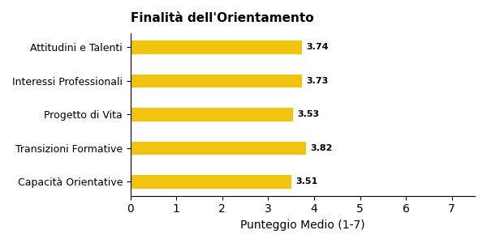
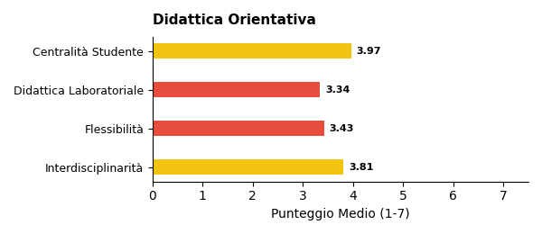
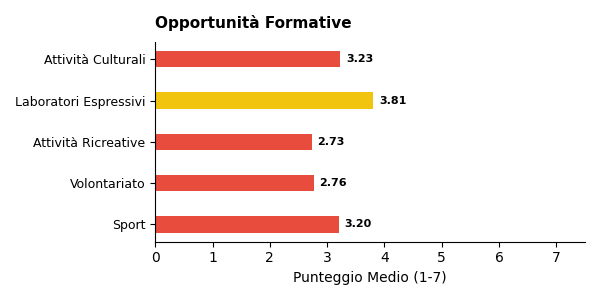

# Report di Sintesi sull'Orientamento nei PTOF — II Grado

*Target Analisi: II Grado*
*Generato con: openrouter / minimax/minimax-m2.5*

## Premessa: Cosa Misuriamo e Perché
Questo report analizza i PTOF (Piani Triennali dell'Offerta Formativa) delle scuole italiane per misurarne la copertura informativa in tema di orientamento: quanto e come il documento descrive le pratiche, i progetti e le strategie che la scuola adotta per orientare gli studenti.

È importante chiarire fin da subito un principio fondamentale: i punteggi che seguono non esprimono un giudizio sulla qualità della scuola, ma sulla ricchezza e completezza della documentazione contenuta nel PTOF. Una scuola con un punteggio basso potrebbe svolgere ottime attività di orientamento senza averle descritte nel proprio piano; viceversa, un punteggio alto indica che il PTOF documenta in modo dettagliato e strutturato le proprie pratiche orientative.
## Come Funziona l'Analisi
L'analisi automatizzata legge e interpreta il testo del PTOF su due livelli complementari.

1. Analisi Strutturale (Compliance): Il sistema verifica la conformità formale rispetto alle Linee Guida per l'orientamento scolastico stabilite dal D.M. 328/2022, il decreto ministeriale che ha introdotto l'obbligo per ogni scuola di dedicare almeno 30 ore annuali a moduli di orientamento formativo e di individuare figure dedicate (tutor e docente orientatore). In concreto, si verifica se il PTOF contiene una sezione esplicitamente dedicata all'orientamento, valutandone la visibilità e la struttura nel documento.

2. Analisi Semantica e di Contenuto: Attraverso modelli di linguaggio avanzati (LLM), l'analisi "legge" l'intero documento per estrarre informazioni sulla copertura delle 6 dimensioni del framework di valutazione (descritte nella sezione successiva). In questa fase, vengono distinte le semplici dichiarazioni di intenti dalle azioni concrete, mappando la presenza di progetti, risorse, tempi e responsabilità. L'algoritmo rileva il contesto in cui appaiono i termini: ad esempio, distingue se l'orientamento è citato in una lista generica oppure se è descritto attraverso laboratori con obiettivi specifici e modalità di verifica.
## Le 6 Dimensioni del Framework di Valutazione

L'analisi semantica valuta la copertura del PTOF attraverso **6 dimensioni**. Ognuna rappresenta un aspetto fondamentale dell'orientamento scolastico: dalla struttura organizzativa alle finalità educative, dalle metodologie didattiche alle opportunità offerte agli studenti. Di seguito, ciascuna dimensione è descritta con i propri sotto-indicatori.

### Dimensione Strutturale e di Contesto
Valuta se l'orientamento ha una collocazione riconoscibile all'interno del PTOF e se la scuola è inserita in un tessuto di relazioni territoriali.
- **Sezione dedicata**: Presenza di un capitolo o paragrafo esplicitamente intitolato all'orientamento, non frammentato tra diverse parti del documento.
- **Partnership e reti territoriali**: Qualità del coinvolgimento di soggetti esterni (Università, ITS, imprese, Terzo Settore), con attenzione ad attività congiunte e accordi formali.

### Finalità dell'Orientamento
Analizza gli obiettivi formativi che la scuola si pone attraverso le attività di orientamento.
- **Attitudini e Talenti**: Azioni per aiutare gli studenti a scoprire i propri punti di forza e inclinazioni personali.
- **Interessi Professionali**: Percorsi di esplorazione degli ambiti disciplinari e del mondo del lavoro.
- **Progetto di Vita**: Supporto alla costruzione di una traiettoria personale di lungo termine.
- **Transizioni Formative**: Accompagnamento nei passaggi critici tra cicli scolastici (primaria-secondaria, secondaria-università/lavoro).
- **Capacità Orientativa (Empowerment)**: Sviluppo di competenze trasversali che rendano lo studente autonomo nelle proprie scelte.

### Obiettivi di Incidenza
Misura l'attenzione del PTOF verso gli impatti sociali dell'orientamento.
- **Contrasto alla Dispersione**: Strategie di prevenzione dell'abbandono scolastico e iniziative di rimotivazione.
- **Riduzione dei NEET**: Azioni di collegamento scuola-lavoro per favorire l'occupabilità e contrastare il fenomeno dei giovani che non studiano né lavorano.
- **Continuità Territoriale**: Costruzione di ponti tra i diversi gradi di istruzione presenti sul territorio.
- **Lifelong Learning**: Concezione dell'orientamento come competenza permanente, utile per tutta la vita.

### Governance e Organizzazione
Esamina il modello organizzativo interno: chi fa cosa e come si coordina l'azione orientativa.
- **Coordinamento**: Presenza di figure dedicate come Funzioni Strumentali, referenti o commissioni per l'orientamento.
- **Dialogo Interno**: Coinvolgimento dei Consigli di Classe e dei docenti nella progettazione orientativa.
- **Alleanza con le Famiglie**: Iniziative strutturate di comunicazione e collaborazione con i genitori.
- **Monitoraggio**: Utilizzo di strumenti di feedback, questionari e dati per valutare l'efficacia delle azioni.
- **Inclusione**: Attenzione specifica a studenti con BES/DSA, studenti stranieri e situazioni di fragilità.

### Didattica Orientativa
Valuta il passaggio dalle dichiarazioni di principio alle pratiche concrete in aula.
- **Didattica Laboratoriale ed Esperienziale**: Attività basate sul *learning by doing* e sull'apprendimento attivo.
- **Centralità dello Studente**: Ruolo attivo degli studenti nella co-progettazione dei percorsi orientativi.
- **Interdisciplinarità**: Integrazione dell'orientamento nelle diverse discipline curricolari, non solo come attività aggiuntiva.
- **Flessibilità Organizzativa**: Adattamento di spazi, tempi e gruppi per favorire esperienze orientative efficaci.

### Opportunità Formative
Mappa l'ecosistema delle proposte extracurricolari e integrative offerte dalla scuola.
- **Attività Culturali e Artistiche**: Progetti di teatro, musica, scrittura creativa, visite a musei.
- **Laboratori Espressivi**: Percorsi manuali, artigianali o digitali che favoriscono la scoperta di talenti.
- **Sport e Attività Ricreative**: Offerta sportiva e ludica come strumento di socializzazione e benessere.
- **Volontariato e Service Learning**: Esperienze di impegno civico che collegano apprendimento e comunità.

## Dal Qualitativo al Quantitativo: la Scala di Punteggio
Ciascuna delle 6 dimensioni appena descritte viene valutata attraverso una scala numerica da 1 a 7, detta scala di copertura informativa. Si tratta di una scala ordinale di tipo Likert — uno strumento consolidato nella ricerca sociale che consente di tradurre valutazioni qualitative in punteggi confrontabili.

Il punteggio riflette il livello di dettaglio con cui il PTOF documenta le pratiche orientative per quella dimensione: da 1 (nessun riferimento) a 7 (documentazione sistematica con evidenze di miglioramento continuo). La tabella seguente descrive ogni livello.

\begin{tabularx}{\textwidth}{@{} c l X @{}}
\toprule
\textbf{Punti} & \textbf{Livello} & \textbf{Cosa significa} \\
\midrule
1 & Copertura assente & Nessun riferimento all'orientamento nel documento. \\
2 & Copertura a traccia minima & Menzione vaga o copia-incolla di testo normativo, senza personalizzazione. \\
3 & Copertura parziale & Intenzione dichiarata, ma senza dettagli su come viene attuata. \\
4 & Copertura di base & Azioni descritte in modo chiaro ma essenziale, senza approfondimento. \\
5 & Copertura strutturata & Azioni dettagliate con metodologie esplicitate e risorse indicate. \\
6 & Copertura approfondita & Azioni integrate nel curricolo, con indicatori di monitoraggio documentati. \\
7 & Copertura esaustiva & Documentazione sistematica e ciclica, con evidenze di revisione e miglioramento. \\
\bottomrule
\end{tabularx}
## L'Indice Sintetico: IIPO
Per avere una visione d'insieme della copertura documentale di ciascuna scuola, i punteggi delle 6 dimensioni vengono riassunti in un unico indicatore: l'IIPO (Indice di Documentazione delle Pratiche di Orientamento).

L'IIPO è calcolato come media aritmetica semplice dei punteggi delle 6 dimensioni (Strutturale, Finalità, Obiettivi, Governance, Didattica, Opportunità). Si è scelta una media non pesata per evitare di privilegiare a priori una dimensione rispetto alle altre, trattandole tutte come ugualmente rilevanti.

Come leggere l'IIPO:
- Un IIPO di 5.0 indica che, in media, il PTOF documenta le pratiche orientative a un livello di Copertura strutturata su tutte le dimensioni.
- Un IIPO di 3.0 segnala una documentazione complessivamente a livello di Copertura parziale.

Limiti da tenere presenti:
- *Effetto compensazione*: Essendo una media, l'IIPO può mascherare squilibri tra le dimensioni. Ad esempio, una scuola con punteggio 7 su Didattica e 1 su Governance otterrebbe un IIPO apparentemente nella norma. Per questo motivo, l'IIPO va sempre letto insieme ai punteggi delle singole dimensioni.
- *Sensibilità incrementale*: La scala a 7 livelli consente di cogliere differenze graduali tra scuole, evitando la polarizzazione tipica delle scale più strette (es. 1-3).
## Approccio Analitico: Raggruppamento per Affinità

Oltre all'analisi dimensionale, il report utilizza una tecnica di **raggruppamento automatico** (clustering) per evitare di appiattire i risultati su una semplice media nazionale.

Il funzionamento è il seguente: il sistema analizza i profili di punteggio di tutte le scuole e individua **gruppi di istituti** che presentano caratteristiche documentali simili. Nel campione corrente sono stati identificati **5 gruppi omogenei** — ad esempio, un gruppo potrebbe riunire scuole con forte attenzione ai PCTO e alle partnership territoriali, mentre un altro potrebbe raccogliere istituti che privilegiano la didattica laboratoriale.

Per ciascun gruppo viene generata una **sintesi tematica** che descrive l'approccio dominante su ogni dimensione. Queste sintesi intermedie vengono poi integrate nel report finale, permettendo di confrontare i diversi "profili di orientamento" e di evidenziare sia le tendenze comuni sia le eccezioni virtuose.

## Analisi e Copertura del Campione (II Grado)
Statistiche Generali
- Scuole Analizzate: 693
- Province Coperte: 100
- Regioni Coperte: 18/20

Bilanciamento Gestione (Statale vs Paritaria)

\begin{tabularx}{\textwidth}{@{} p{3cm} c c c @{}}
\toprule
\textbf{Tipo} & \textbf{Osservato \%} & \textbf{Atteso \% (MIUR)} & \textbf{Deviazione} \\
\midrule
Statale & 72.9\% & 92.0\% & -19.1 pp \\
Paritaria & 27.1\% & 8.0\% & +19.1 pp \\
\bottomrule
\end{tabularx}

Distribuzione Geografica per Macro-Area

\begin{tabularx}{\textwidth}{@{} X c c c @{}}
\toprule
\textbf{Area} & \textbf{Osservato \%} & \textbf{Atteso \% (MIUR)} & \textbf{Deviazione} \\
\midrule
Nord Ovest & 19.3\% & 26.6\% & -7.3 pp \\
Nord Est & 16.7\% & 19.3\% & -2.6 pp \\
Centro & 14.4\% & 19.9\% & -5.5 pp \\
Sud & 38.7\% & 23.3\% & +15.4 pp \\
Isole & 10.8\% & 10.9\% & -0.1 pp \\
\bottomrule
\end{tabularx}

⚠️ Nota sulla Rappresentatività: Il campione presenta significative deviazioni rispetto alla distribuzione attesa, in particolare per alcune macro-aree (es. Sud/Nord).

Distribuzione Territoriale (Aree Metropolitane)

\begin{tabularx}{\textwidth}{@{} X c c c @{}}
\toprule
\textbf{Area} & \textbf{Osservato \%} & \textbf{Atteso \% (Stima)} & \textbf{Deviazione} \\
\midrule
Metropolitana & 41.8\% & 33.0\% & +8.8 pp \\
Non Metropolitana & 58.2\% & 67.0\% & -8.8 pp \\
\bottomrule
\end{tabularx}

*Nota: I dati sopra si riferiscono specificamente al sottocampione analizzato (II Grado) e sono confrontati con i benchmark MIUR di riferimento per tale ordine scolastico.*
## Sintesi Quantitativa: Le Dimensioni dell'Orientamento
Di seguito il dettaglio dei punteggi medi rilevati per le dimensioni e i relativi sotto-indicatori.
Dimensione Strutturale (Compliance)
Media: 2.62 (dev.std: 2.02)

Finalità dell'Orientamento

\begin{tabularx}{\textwidth}{@{} X c c @{}}
\toprule
\textbf{Indicatore} & \textbf{Media} & \textbf{Dev. Std.} \\
\midrule
\textbf{Totale Dimensione} & \textbf{3.68} & \textbf{1.14} \\
Attitudini e Talenti & 3.74 & 1.16 \\
Interessi Professionali & 3.73 & 1.16 \\
Progetto di Vita & 3.53 & 1.44 \\
Transizioni Formative & 3.82 & 1.28 \\
Capacità Orientative & 3.51 & 1.41 \\
\bottomrule
\end{tabularx}

Obiettivi di Incidenza

\begin{tabularx}{\textwidth}{@{} X c c @{}}
\toprule
\textbf{Indicatore} & \textbf{Media} & \textbf{Dev. Std.} \\
\midrule
\textbf{Totale Dimensione} & \textbf{3.21} & \textbf{1.15} \\
Contrasto Dispersione & 3.13 & 1.55 \\
Continuità Territorio & 3.76 & 1.29 \\
Riduzione NEET & 2.41 & 1.31 \\
Lifelong Learning & 3.30 & 1.35 \\
\bottomrule
\end{tabularx}

Governance e Organizzazione

\begin{tabularx}{\textwidth}{@{} X c c @{}}
\toprule
\textbf{Indicatore} & \textbf{Media} & \textbf{Dev. Std.} \\
\midrule
\textbf{Totale Dimensione} & \textbf{3.66} & \textbf{1.10} \\
Coordinamento & 3.66 & 1.23 \\
Dialogo Interno & 3.67 & 1.28 \\
Alleanza Famiglie & 3.95 & 1.18 \\
Monitoraggio & 3.06 & 1.30 \\
Inclusione & 3.90 & 1.18 \\
\bottomrule
\end{tabularx}

Didattica Orientativa

\begin{tabularx}{\textwidth}{@{} X c c @{}}
\toprule
\textbf{Indicatore} & \textbf{Media} & \textbf{Dev. Std.} \\
\midrule
\textbf{Totale Dimensione} & \textbf{3.65} & \textbf{1.02} \\
Centralità Studente & 3.97 & 1.26 \\
Didattica Laboratoriale & 3.34 & 1.21 \\
Flessibilità & 3.43 & 1.21 \\
Interdisciplinarità & 3.81 & 1.17 \\
\bottomrule
\end{tabularx}

Opportunità Formative

\begin{tabularx}{\textwidth}{@{} X c c @{}}
\toprule
\textbf{Indicatore} & \textbf{Media} & \textbf{Dev. Std.} \\
\midrule
\textbf{Totale Dimensione} & \textbf{3.18} & \textbf{1.09} \\
Attività Culturali & 3.23 & 1.44 \\
Laboratori Espressivi & 3.81 & 1.35 \\
Attività Ricreative & 2.73 & 1.15 \\
Volontariato & 2.76 & 1.39 \\
Sport & 3.20 & 1.31 \\
\bottomrule
\end{tabularx}

*Legenda: Copertura esaustiva (>= 5.0), Copertura strutturata (3.5-4.9), Copertura di base/Copertura parziale/Traccia minima/Assente (< 3.5) - Scala 1-7*

\newpage
## Profili dei Cluster e Differenze
L'analisi automatica dei PTOF ha identificato cinque cluster che raccolgono complessivamente 671 scuole su 693 analizzate, con 22 istituti non assegnati a nessun gruppo. La distribuzione è tuttavia fortemente sbilanciata: il Cluster 4 comprende da solo il 60% del campione (407 scuole), mentre i cluster più piccoli oscillano tra 25 e 112 istituti.

Il Cluster 0 raggruppa 112 scuole caratterizzate da un approccio all'orientamento prevalentemente integrato nel documento strategico piuttosto che formalizzato in una sezione autonoma. Le scuole menzionano l'orientamento in diversi punti del PTOF, spesso in relazione agli obiettivi formativi generali o al miglioramento scolastico, suggerendo una consapevolezza del tema ma una mancanza di pianificazione dedicata. Le lacune ricorrenti riguardano l'implementazione di sistemi di monitoraggio orientati prevalentemente alla valutazione degli apprendimenti e al benessere studentesco, con attività di controllo in itinere e raccolta dati per stimare l'efficacia delle strategie didattiche. Questo cluster si distingue per l'attenzione alla transizione tra diversi gradi di istruzione e per il focus sul miglioramento continuo dell'offerta formativa attraverso attività laboratoriali e legami con il territorio.

Il Cluster 1 comprende 77 scuole che presentano una prevalente mancanza di approccio strutturato all'orientamento, senza una sezione specifica e limitandosi a riferimenti impliciti all'interno del curricolo. Le lacune si concentrano sul monitoraggio del benessere psico-fisico degli studenti e sulla supervisione del personale, con un'attenzione significativa all'ambientamento dei nuovi iscritti. L'approccio è prevalentemente reattivo, mirato a rilevare problematiche esistenti piuttosto che a prevenirle strutturalmente. La caratterizzazione distintiva del cluster risiede nel target prevalente su fasce d'età più giovani e nell'enfasi sull'accoglienza piuttosto che sull'orientamento in senso stretto, con un bilancio sintetico che rivela una focalizzazione sull'ottimizzazione dell'accoglienza e sullo sviluppo di competenze di base nella prima infanzia, attraverso attività laboratoriali e progetti di transizione dalla scuola dell'infanzia alla primaria.

Il Cluster 2 raccoglie 25 scuole con un approccio all'orientamento prevalentemente implicito e frammentato, dove il tema è menzionato all'interno di sezioni più ampie come l'offerta formativa o i PCTO senza una trattazione autonoma. Si osserva una riconoscenza generale dell'importanza dell'orientamento a livello dichiarativo, accompagnata però da una carenza diffusa nella definizione di strategie implementative concrete e sistemi di monitoraggio efficaci. Le scuole si limitano ad affermare l'importanza dell'orientamento senza specificare come si traduca in azioni concrete. Il tratto distintivo di questo cluster è la focalizzazione quasi esclusiva sui PCTO come strumento di orientamento, con una carenza di visione strategica più ampia e interventi focalizzati sulla formazione dei docenti.

Il Cluster 3 comprende 50 scuole con un approccio all'orientamento frammentario e non strutturato, dove le tematiche sono integrate in capitoli più ampi come l'Offerta Formativa, l'Inclusione o l'Alternanza Scuola Lavoro senza una pianificazione strategica coerente. Le lacune riguardano la mancanza di una sezione autonoma con prevalenza di riferimenti generici a continuità e strategie di orientamento senza una definizione chiara di obiettivi, azioni concrete o indicatori di monitoraggio. La caratterizzazione distintiva del cluster risiede nella centralità dell'ASL come unica azione esplicitamente collegata all'orientamento, con un bilancio sintetico che rivela una forte focalizzazione sull'Alternanza Scuola Lavoro come principale strumento di orientamento, a scapito di una pianificazione più ampia.

Il Cluster 4 rappresenta il gruppo più numeroso con 407 scuole, caratterizzate da una presenza diffusa ma frammentata dell'orientamento nel PTOF: il tema è menzionato in diverse sezioni, integrato in aree tematiche più ampie o come parte di progetti specifici, ma manca quasi sempre una sezione autonoma dedicata. L'orientamento non sembra essere considerato un pilastro strategico del documento. Le lacune si concentrano sul monitoraggio dei risultati degli alunni e delle competenze dei docenti, con interventi mirati all'individuazione di aree di miglioramento attraverso la raccolta e l'interpretazione di dati. Il bilancio sintetico evidenzia un approccio orientato all'ampliamento dell'offerta formativa attraverso progetti specifici e collaborazioni esterne, con attenzione a bisogni emergenti come dipendenze e disagio giovanile, e una forte attenzione all'inclusione e al miglioramento professionale dei docenti.

La comparazione tra i cluster evidenzia alcune convergenze significative: la maggior parte dei gruppi presenta una mancanza di sezioni autonome dedicate all'orientamento, con un'integrazione frammentata in sezioni più ampie del PTOF. Il monitoraggio emerge come pratica diffusa in quasi tutti i cluster, sebbene con focus differenti. Le divergenze principali riguardano il target d'azione (alcuni cluster orientati alla prima infanzia, altri alla transizione verso il mondo del lavoro), gli strumenti privilegiati (PCTO, ASL, progetti specifici) e il grado di consapevolezza strategica, che risulta più sviluppata nei cluster con approccio integrato rispetto a quelli con approccio esclusivamente reattivo. Il Cluster 4, pur essendo il più numeroso, non mostra un livello di strutturazione superiore, ma piuttosto una maggiore varietà di interventi dispersi nel documento.
## Commento di Sintesi Generale
L'analisi condotta su 693 istituti scolastici di II grado rivela un quadro complessivo che si colloca nella fascia intermedia della scala di copertura informativa, con un IIPO medio di 3.55 su 7. Questo valore posiziona la documentazione dell'orientamento nei PTOF italiani tra la "copertura parziale" e la "copertura di base", suggerendo che il tema è riconosciuto come rilevante ma non ancora pienamente integrato nella pianificazione strategica delle scuole.

Le dimensioni analizzate mostrano un pattern significativo: le finalità dell'orientamento raggiungono il punteggio più elevato con una media di 3.68, seguite dalla governance a 3.66 e dalla didattica orientativa a 3.65. Al contrario, gli obiettivi specifici e le opportunità formative ottengono i punteggi più bassi rispettivamente con 3.21 e 3.18. Questa distribuzione indica che le scuole tendono a dichiarare intenti e finalità educative legate all'orientamento, ma incontrano maggiori difficoltà nel tradurre tali dichiarazioni in obiettivi misurabili e in un'offerta di opportunità concrete per gli studenti.

La variabilità intra-gruppo appare contenuta, con deviazioni standard che oscillano tra 1.02 e 1.15, suggerendo una relativa omogeneità nel comportamento del campione. Tuttavia, le analisi per cluster rivelano differenze significative nell'approccio documentale. Il Cluster 4, che comprende la maggioranza delle scuole (407 istituti), evidenzia un orientamento "presente ma frammentato", integrato in sezioni diverse del PTOF senza una strutturazione autonoma. I Cluster 1 e 3 mostrano approcci ancora più deboli, con frammentazione e scarsa integrazione. Solo il Cluster 2 presenta alcune eccezioni con moduli di orientamento formativo strutturati nelle classi terze, quarte e quinte.

L'assenza di una sezione dedicata rappresenta la debolezza più ricorrente segnalata nelle analisi individuali. Numerose scuole, come Istituto Omnicomprensivo "A. Giordano (ISIS003002) in Molise, - I. S. Caravaggio San Gennaro Ves. - (NARA06350L) in Campania e Morando Morandi (MOPS04000L) in Emilia-Romagna, identificano esplicitamente questa mancanza come ostacolo alla pianificazione strategica delle azioni orientative. Le evidenze testuali confermano questa tendenza: l'istituto I.I.S."De Sarlo-De Lorenzo" Lagonegro (PZIS001007) in Basilicata descrive attività di orientamento in entrata e ri-orientamento, ma senza una sezione organica nel PTOF. Analogamente, la scuola I.I.S. "A.M.Jaci - Caio Duilio (METD03751E) in Sicilia articola un percorso di orientamento in più momenti, che tuttavia rimane disperso nel documento senza una collocazione strategica unitaria.

La coerenza tra intenti dichiarati e azioni documentate emerge come area critica. Sebbene le scuole citino frequentemente riferimenti normativi recenti, come il DM 328/2022 sulle Linee guida per l'orientamento (evidenza nella scuola Via Delle Sette Chiese 259 (RMIS01600N) del Lazio), la traduzione operativa di tali riferimenti rimane limitata. L'evidenza della scuola C. Varalli (MITN05101L) in Lombardia mostra l'impegno nelle attività promosse dal PNRR e l'introduzione delle figure del Docente Tutor e del Docente Orientatore, ma anche in questo caso l'integrazione nel PTOF appare ancora in fase di definizione.

Le differenze macroscopiche tra tipologie di scuola non emergono con chiarezza dai dati aggregati, mentre la variabilità geografica appare contenuta. Le eccezioni positive si distribuiscono lungo l'intero territorio nazionale, dalla Lombardia alla Sicilia, dalla Campania al Lazio, suggerendo che la qualità della documentazione dipende più da scelte interne agli istituti che da condizioni territoriali strutturali.

In prospettiva, i dati suggeriscono che l'orientamento nelle scuole di II grado italiane si trova in una fase di transizione: non più considerato un adempimento puramente burocratico, ma ancora lontano dal rappresentare una scelta strategica pienamente strutturata. Le sezioni successive approfondiranno le specificità delle singole dimensioni analizzate, esaminando più nel dettaglio le pratiche di governance, le metodologie didattiche orientative e l'offerta di opportunità formative.
## Allineamento Normativo e Approccio Innovativo
Il punteggio medio di allineamento normativo pari a 2.62 su 7 rivela una distanza significativa tra le prescrizioni delle Linee Guida Orientamento, del D.M. 328/2022 e degli investimenti PNRR e la loro effettiva documentazione nei PTOF. Un valore di 2.62 si colloca nella fascia intermedia tra la "traccia minima" e la "copertura parziale", indicando che la maggior parte delle scuole si limita a citazioni normative superficiali senza tradurre i principi in azioni dettagliate. La deviazione standard elevata (2.02) conferma un'elevata eterogeneità tra gli istituti: alcune scuole dimostrano un recepimento strutturato mentre altre non menzionano affatto il quadro normativo di riferimento.

L'analisi del recepimento formale e sostanziale rivela una dicotomia marcata. Il recepimento formale è ampiamente documentato: le evidenze mostrano che molte scuole citano esplicitamente i "Moduli di orientamento formativo" nei loro PTOF, come emerge dai documenti della scuola MIRFHT500U (Barbara Melzi, Lombardia) che riporta la dicitura "Pcto - Moduli di orientamento formativo - Ptof 2022-2025", e della scuola NAIS13700L (Istituto Superiore Guglielmo Marconi, Campania) che analogamente richiama i moduli di orientamento nell'ambito del Ptof 2025-2028. Tuttavia, il recepimento sostanziale appare più carente: poche scuole esplicitano come i principi normativi vengano effettivamente tradotti in pratiche concrete. La scuola CBPM040008 (Liceo Statale G. M. Galanti, Molise) rappresenta un caso di recepimento parziale, poiché menziona i moduli per le classi III, IV e V senza tuttavia dettagliare le metodologie adottate né gli esiti attesi.

Le figure del Tutor e dell'Orientatore emergono dalle evidenze come referenti operativi menzionate ma raramente descritte con precisione nei documenti. L'evidenza della scuola Liceo Classico Istituto Leone Xiii (MIPC10500T) (Lombardia) mostra "colloqui personali per gli studenti - su appuntamento, con il proprio Tutor di classe", evidenziando l'esistenza di questa figura senza tuttavia specificarne ruolo, formazione o modalità di intervento. La scuola I.S.I.S. "D'Este-Caracciolo (NARC118016) (Campania) viene segnalata nelle sintesi per aver implementato un ciclo completo di 4 moduli di orientamento con il supporto di tutor interni ed esterni, dimostrando un'integrazione più articolata tra le figure di riferimento. Nel complesso, tuttavia, l'analisi dei cluster rivela che il ruolo del tutor e dell'orientatore come figure chiave per la transizione degli studenti rimane sottodimensionato nella documentazione, con 17 scuole su 19 nel Cluster 3 che integrano l'orientamento come sottosezione di altri capitoli senza valorizzare pienamente queste figure.

I moduli da 30 ore PNRR rappresentano l'elemento più documentato, benché la loro interpretazione vari sensibilmente tra le scuole. La scuola Edoardo Agnelli (TOPS04500E) (Charles Darwin, Piemonte) emerge come esempio di piena aderenza alla prescrizione normativa, avendo previsto "moduli di orientamento formativo di almeno 30 ore per le classi terze, quarte e quinte, integrati nei curricoli scolastici". Analogamente, la scuola Giuseppe Gangale (KRIS00400C) (Calabria) documenta "moduli di orientamento formativo strutturati sulla base di 30 ore". Le evidenze della scuola Barbara Melzi (MIRFHT500U) mostrano un'ulteriore articolazione: per la classe III IPSSAS sono previste "circa 120 ore" tra sicurezza, primo soccorso, incontri con testimoni privilegiati e alternanza, mentre per la classe V LSU si segnalano "visita in Università Cattolica e incontro in sede con docente dell'Ufficio Orientamento UC pari a 6 ore pomeridiane" insieme ad altri progetti orientativi. Questa variabilità suggerisce che l'orario minimo di 30 ore viene talvolta superato significativamente, trasformando l'obbligo normativo in opportunità formativa strutturata.

Alcune scuole dimostrano un approccio che va oltre il minimo normativo. La scuola 2 I.C. Ravarino (MOIC84900D) (Emilia-Romagna) viene segnalata per aver esplicitamente fatto riferimento al D.M. 328/2022 nell'implementazione di moduli curricolari di orientamento, dimostrando consapevolezza del quadro normativo. La scuola Leonardo Da Vinci (VETF01350V) (Veneto) implementa "stage di 240 ore in aziende" per le classi quarte, un monte ore significativamente superiore ai minimi previsti. La scuola Nullo Baldini (RATF01000T) (Emilia-Romagna) prevede per tutti gli studenti "Percorsi per le Competenze Trasversali e per l'Orientamento, con un monte ore minimo di 150 ore per gli istituti tecnici", integrando così l'orientamento con esperienze professionalizzanti strutturate. La scuola Edoardo Agnelli (TOPS04500E) (Piemonte) si distingue inoltre per aver previsto moduli di orientamento formativo integrati nei curricoli non solo per le classi terminali ma anche per le terze, quarte e quinte, garantendo continuità nel percorso orientativo.

In sintesi, il recepimento normativo nei PTOF appare ancora in una fase di consolidamento, con una distanza rilevante tra la dimensione formale (citazione delle norme) e quella sostanziale (traduzione in pratiche documentate con indicatori e monitoraggio).
## Rapporto con il Territorio
L'analisi della documentazione relativa alle relazioni con il territorio per finalità orientative rivela un quadro contraddittorio: i punteggi medi di 3.76 su 7 per la continuità territoriale e di 3.66 su 7 per il coordinamento dei servizi collocano la copertura informativa leggermente al di sotto della soglia di base su scala 1-7, indicando una fascia che va dalla copertura parziale alla copertura di base. Questo dato quantitativo trova conferma nell'analisi qualitativa dei PTOF, dove emerge una marcata focalizzazione sui Percorsi per le Competenze Trasversali e per l'Orientamento come modalità pressoché esclusiva di rapporto con il contesto esterno.

La classificazione delle partnership documentate evidenzia una netta prevalenza di collaborazioni con il mondo produttivo e delle imprese, declinate attraverso convenzioni per stage e tirocini aziendali. Questa tipologia di partnership rappresenta l'ossatura principale del rapporto scuola-territorio in tutti i cluster analizzati, con particolare evidenza nel Cluster 4 che comprende 407 istituti e nel Cluster 0 con 112 scuole. Le università compaiono come partner in un numero più ridotto di documenti, generalmente attraverso convenzioni per PCTO presso dipartimenti universitari o per l'accoglienza di studenti universitari in tirocinio formativo presso le scuole secondarie. L'evidenza testuale dell'Istituto A. Volta [CODICE DUBBIO: Itc A.Volta (BATD105005)] in Puglia costituisce un caso isolato di particolare rilevanza: la scuola dichiara un network di venti partner che spazia da prestigiose istituzioni accademiche come l'Università di Cambridge, la London Business School e l'Università Bocconi, fino a enti come la Banca d'Italia e la Croce Rossa, oltre a collaborazioni con il centro giovanile territoriale e specialisti esterni per il supporto a studenti con DSA. Tuttavia, la maggioranza delle scuole non documenta reti di partnership paragonabili per ampiezza e articolazione, limitandosi a menzionare convenzioni generiche senza specificarne la natura operativa.

L'analisi dei PCTO e degli stage rivela una differenza significativa tra due modalità di documentazione. Da un lato, alcune scuole descrivono i percorsi come esperienze orientative strutturate con obiettivi formativi espliciti: il Liceo Benedetto Croce [CODICE DUBBIO: PAPS100008] in Sicilia, ad esempio, ha stipulato una convenzione con l'Università degli Studi di Palermo per attivare percorsi PCTO che prevedono attività laboratoriali presso le sedi universitarie, integrate da attività progettuali per raggiungere un totale di trenta ore, con certificazione finale per chi raggiunge la soglia minima del settanta percento di frequenza. Dall'altro lato, una quota rilevante di istituti si limita a registrare l'offerta di PCTO senza articolare finalità orientative specifiche, come evidenziato nel Cluster 2 dove la scuola [CODICE DUBBIO: Lc M. Gioia (PCPC010004)] in Emilia-Romagna e la scuola [CODICE DUBBIO: I. C. Albenga Ii (SVAA815019)] in Liguria descrivono semplicemente la disponibilità di PCTO senza dettagliare obiettivi di sviluppo territoriale o progettuale. Questa differenza suggerisce che per molte scuole i PCTO rappresentano un adempimento normativo piuttosto che uno strumento strategico di orientamento, con la sola indicazione del monte ore da completare senza esplicitazione del valore formativo orientativo.

La continuità verticale, intesa come dialogo documentato con il grado scolastico precedente e successivo, risulta essere la dimensione meno sviluppata nella documentazione analizzata. I PTOF tendono a focalizzarsi quasi esclusivamente sulle relazioni con il mondo del lavoro e dell'università, trascurando il rapporto con le scuole di grado inferiore o superiore. Le evidenze testuali non riportano riferimenti a protocolli di continuità con istituti comprensivi o licei, né a collaborazioni strutturate per la transizione degli studenti tra ordini di scuola. Fanno eccezione alcune esperienze nel Cluster 1 che, pur essendo riferite a scuole di I grado, evidenziano l'attenzione alla transizione scuola-scuola attraverso pratiche di accoglienza e preparazione agli studenti in ingresso. Nel contesto del II grado, questa dimensione appare sostanzialmente assente dalla documentazione PTOF, lasciando una lacuna significativa nella rappresentazione dell'ecosistema orientativo completo che dovrebbe accompagnare lo studente lungo l'intero percorso formativo.

In sintesi, il rapporto con il territorio documentato nei PTOF delle scuole di II grado si configura come un sistema prevalentemente monodimensionale, centrato sull'esperienza PCTO come veicolo principale di connessione con l'esterno. La variabilità nella qualità della documentazione oscilla tra chi articola partnership strategiche con obiettivi orientativi espliciti e chi si limita a registrare adempimenti normativi, con una media complessiva che non raggiunge la soglia della copertura di base. L'assenza di una documentazione sistematica sulla continuità verticale e sulla diversificazione dei partner costituisce un elemento di debolezza nella rappresentazione dell'orientamento come processo integrato e contestualizzato.
## Metodologie Didattiche
Analisi delle Metodologie Didattiche per l'Orientamento

I punteggi relativi alle metodologie didattiche per l'orientamento rivelano un quadro articolato ma non completamente strutturato. La didattica laboratoriale ottiene un punteggio medio di 3.34 su 7, posizionandosi nella fascia che va dalla copertura parziale alla copertura di base, mentre l'apprendimento dall'esperienza degli studenti registra un punteggio medio più elevato di 3.97 su 7, indicando una sostanziale copertura di base con elementi di strutturazione. La differenza di 0.63 punti tra le due dimensioni suggerisce che le scuole tendono a documentare con maggiore ricchezza le esperienze formative sul campo rispetto alla progettazione laboratoriale sistematica, un elemento che emerge con coerenza nell'analisi degli estratti PTOF.

La domanda centrale rispetto all'integrazione dell'orientamento nel curricolo quotidiano trova una risposta articolata. I cluster analizzati rivelano due paradigmi prevalenti: da un lato, il Cluster 2 e il Cluster 3 identificano rispettivamente nei PCTO e nell'Alternanza Scuola Lavoro lo strumento principale e pressoché esclusivo per l'orientamento, configurando queste esperienze come momenti distinti e complementari al percorso curricolare ordinario; dall'altro, il Cluster 0 e il Cluster 1 propongono un approccio più pervasivo, con il learning by doing e le metodologie laboratoriali dichiarate come "pilastro metodologico" dell'intera offerta formativa. La scuola I. I. S. S. "F. Patetta" - Cairo M. (SVIS00300A) (Liguria, Istituto Tecnico e Professionale) esemplifica questa seconda tendenza, affermando che "la didattica laboratoriale è un pilastro metodologico, volta all'acquisizione di competenze attraverso esperienze educative e occasioni di gioco che sviluppano abilità sensoriali, percettive, motorie, manipolative, linguistiche, sociali, cognitive e affettive". Tuttavia, la prevalenza di questo approccio rimane limitata: la maggioranza delle scuole del campione colloca le attività orientative in progetti speciali extracurricolari piuttosto che nella didattica ordinaria, come conferma la ricorrenza di espressioni come "Proposte agli studenti in collaborazione con enti e associazioni locali" per descrivere le attività laboratoriali, una formulazione che evidenzia la natura esterna e aggiuntiva di tali iniziative.

L'analisi della didattica attiva rivela una significativa distanza tra dichiarazioni d'intento e operativa. Il punteggio medio di 3.34 per la didattica laboratoriale riflette una copertura che si ferma alla descrizione delle attività senza giungere alla specificazione di prodotti, risultati attesi e criteri di valutazione. La scuola Xxv Aprile (VEPC050007) (Veneto, Liceo) illustra emblematicamente questa dinamica: l'offerta include "corsi di strumento musicale, laboratori informatici, di lingua, domotica, robotica, programmazione Python e sperimentazioni con RaspberryPI", ma la valutazione della stessa scuola riconosce che "la generica descrizione 'Proposte agli studenti in collaborazione con enti e associazioni locali' per 'Attività laboratoriali' necessita di maggiore specificità per giustificare un punteggio pieno". In modo analogo, la scuola G.B. Vico - Umberto I - R. Gagliardi (RGIS018002) (Sicilia, Liceo e Tecnico) presenta "il Progetto domotica e robotica" come attività laboratoriale, ma l'analisi complessiva evidenzia che "la didattica laboratoriale non sembra essere la metodologia prevalente e sistematica nell'offerta formativa complessiva". Questa oscillazione tra affermazioni di principio e concretezza operativa rappresenta un elemento ricorrente nel campione: le scuole dichiarano l'importanza del laboratorio ma raramente dettagliano le modalità di conduzione, le competenze specifiche sviluppate e gli strumenti di verifica dei risultati.

Il ruolo dello studente nelle metodologie documentate emerge come prevalentemente passivo, con rare eccezioni che indicano una maggiore agency. Le evidenze testuali mostrano che gli studenti sono generalmente destinatari di attività decise a livello istituzionale, con scarso coinvolgimento nella co-progettazione o nella scelta dei percorsi. La scuola L.Scientifico "Righi (FOPS010028) (Emilia-Romagna, Liceo) rappresenta un'eccezione significativa, ottenendo punteggi di 5 su 7 per la valorizzazione delle esperienze degli studenti, la didattica laboratoriale, la flessibilità di spazi e tempi e l'interdisciplinarità, grazie a progetti specifici come "domotica e robotica, oltre a laboratori di informatica, biologia e fisica". Tuttavia, la stessa scuola riconosce implicitamente che questo livello di strutturazione non è la norma quando confronta il proprio caso con quello di scuole meno sviluppate. Un elemento che emerge dalle evidenze è la ricorrenza di attività laboratoriali ed espressive nel liceo artistico, come nel caso della scuola I. S ." Nitti" Portici (NAIS10200N) (Campania, Liceo e Tecnico) che elenca "Discipline Pittoriche", "Laboratorio Della Figurazione - Scultura", "Discipline Geometriche E Scenotecniche" e "Laboratorio Di Scenografia", offrendo agli studenti la possibilità di sviluppare competenze pratiche e creative in ambiti artistici. Questa specificità disciplinare non si ritrova tuttavia nelle scuole con indirizzi diversi, dove l'orientamento laboratoriale rimane più generico.

L'innovazione metodologica autentica appare circoscritta al Cluster 4, che rappresenta il 59% del campione totale con 407 scuole. In questo gruppo si osservano approcci non convenzionali come la gamification, il digital storytelling e l'utilizzo di piattaforme interattive per la creazione di contenuti. La scuola I.C. Spoleto 2 (PGEE84401P) (Umbria) esemplifica questa tendenza con il progetto "InnovaMenti", che include "gamification, inquiry based learning e hackathon", mentre la scuola Scuola Dell'Infanzia "San Paolo" - Legnano (MI1A39800E) (Lombardia) "punta sull'implementazione di Genially per creare contenuti interattivi". Al di fuori di questo cluster, l'offerta metodologica appare sostanzialmente omogenea, dominata dal riferimento al learning by doing senza ulteriori specificazioni. Le metodologie innovative come l'orientamento narrativo, il debate, i compiti di realtà o il peer tutoring non emergono con frequenza significativa negli estratti analizzati. Un'eccezione rilevante è rappresentata dalla scuola Iis P. Dagomari (POIS00600X) (Toscana, Tecnico e Professionale) che propone "laboratori espressivi e manuali come 'bricolage e giardinaggio' e 'teatro sociale'", introducendo elementi di alternatività rispetto al modello dominante, ma si tratta di casi isolati che non modificano il quadro complessivo di relativa omogeneità metodologica.
## Strumenti di Supporto
L'analisi degli strumenti operativi e digitali documentati nei PTOF rivela un panorama variegato, caratterizzato da una marcata eterogeneità di approcci che va dalla semplice menzione nominalistica all'integrazione consapevole nei percorsi orientativi. Emerge con chiarezza che la disponibilità di strumenti tecnologici non equivale automaticamente a un loro utilizzo efficace, e che la dimensione riflessiva dell'orientamento risulta spesso sottorappresentata rispetto alla dimensione burocratica e compilativa.

Gli strumenti che compaiono con maggiore frequenza nei documenti analizzati sono l'e-portfolio, la Piattaforma UNICA del Ministero dell'Istruzione, i questionari di soddisfazione e i PCTO. L'e-portfolio emerge come lo strumento più universalmente citato, presente in modo trasversale in particolare nel Cluster 4, dove 407 scuole lo identificano come dispositivo centrale per la documentazione del percorso di studi. La Piattaforma UNICA viene menzionata soprattutto in relazione alla raccolta di esperienze e competenze, mentre i questionari risultano prevalentemente orientati alla rilevazione della soddisfazione delle famiglie, con una funzione più valutativa che orientativa.

La questione dell'e-portfolio rappresenta il nodo interpretativo più significativo. L'analisi degli estratti rivela infatti due approcci profondamente differenti che coesistono nel campione. Da un lato, alcune scuole dimostrano una concezione dello strumento come dispositivo riflessivo e di sviluppo della consapevolezza. L'Istituto Giovanni Pascoli (FIPM02000L) in Toscana, ad esempio, descrive l'e-portfolio come strumento per "documentare competenze e progetti di vita", evidenziando una dimensione proiettiva e non meramente ricettiva. Analogamente, la scuola Amm/Vo Per Il Turismo D. Panedda (SSTD09000T) in Sardegna offre un supporto specifico agli studenti nella revisione e compilazione dell'e-portfolio, includendo la selezione di un "capolavoro" annuale, in un'ottica che valorizza la capacità di analisi retrospettiva e di sintesi dell'esperienza formativa. Dall'altro lato, numerose scuole sembrano concepire lo strumento come un adempimento compilativo, una mera raccolta di dati e certificazioni da accumulare senza una reale funzione orientativa. In questi casi, l'e-portfolio viene citato come voce presente ma non viene esplicitata alcuna metodologia di accompagnamento alla sua compilazione, né momenti strutturati di restituzione e riflessione.

La Piattaforma UNICA, lanciata dal Ministero come strumento unico per la documentazione del percorso scolastico, appare nei PTOF analizzati come uno strumento prevalentemente infrastrutturale, più menzionato che effettivamente integrato in un percorso orientativo strutturato. L'evidenza testuale della scuola F.De Pinedo- M. Colonna (RMIS127001) nel Lazio ne descrive l'utilizzo come "strumento digitale per raccogliere competenze e esperienze", senza tuttavia illustrare come tale raccolta si traduca in un percorso di consapevolezza orientativa. Questa constatazione suggerisce che l'integrazione della Piattaforma UNICA nei processi di orientamento richieda ancora un lavoro di progettazione pedagogica che molte scuole non hanno ancora sviluppato compiutamente.

Per quanto riguarda i questionari e i test attitudinali, l'analisi evidenzia una prevalenza di utilizzo come strumenti isolati, somministrati una tantum senza un conseguente percorso di elaborazione. Nel Cluster 1 emerge con chiarezza come i questionari siano rivolti prevalentemente ai genitori per rilevare la soddisfazione rispetto al servizio scolastico, mentre i questionari rivolti agli studenti per esplorare attitudini e interessi risultano scarsamente documentati. I pochi test attitudinali citati non vengono descritti come parte di un processo più ampio che preveda restituzione ai diretti interessati, momenti di riflessione guidata e follow-up.

Il consiglio orientativo, infine, appare nei PTOF analizzati come un atto finale scarsamente collegato a un processo documentato di osservazioni, colloqui e valutazioni. Molte scuole non dedicano spazio alla descrizione del percorso che conduce alla formulazione del consiglio, lasciando un vuoto tra la raccolta di informazioni e la decisione finale. Questa frammentazione conferma quanto già emerso nell'analisi del Cluster 3, dove l'orientamento viene sistematicamente trattato in modo residuale e privo di organicità.

In sintesi, la fotografia che emerge dai PTOF è quella di un sistema che dispone degli strumenti tecnologici ma che fatica a integrarli in percorsi orientativi strutturati e riflessivi, privilegiando spesso la dimensione compilativa e documentale rispetto a quella dell'accompagnamento e della consapevolezza.
## Formazione del Personale
La formazione del personale sui temi dell'orientamento

Il punteggio medio di 3.67 su 7 per il dialogo docenti-studenti, nel framework di governance dell'orientamento, rivela un livello di copertura informativa che si colloca tra la "Copertura parziale" e la "Copertura di base". Questo valore, con una deviazione standard di 1.28 che indica una variabilità significativa tra le scuole, suggerisce che la dimensione relazionale tra docenti e studenti nell'orientamento è presente ma non sistematicamente documentata. Le scuole tendono a descrivere meccanismi di contatto base come il coordinatore di classe o colloqui individuali, senza tuttavia strutturare un sistema pervasivo di interazione che coinvolga rappresentanza studentesca negli organi collegiali o meccanismi strutturati di feedback orientativo.

L'analisi trasversale dei cinque cluster evidenzia una significativa assenza di formazione specifica sull'orientamento per il personale docente e tutor. Le scuole documentano ampiamente interventi formativi su tematiche diverse, ma questi raramente si collegano esplicitamente al potenziamento delle competenze orientative degli studenti.

Nel Cluster 0 (112 scuole), la formazione del personale si concentra primariamente sul benessere psicologico e sullo sviluppo inclusivo, con sportelli di ascolto, supporto psicologico e consulenza psicopedagogica. La scuola NAMM8E3001E in Campania implementa un sistema integrato per l'inclusione focalizzato sul rinforzo socio-relazionale, mentre la scuola I.C. Perugia 6 (PGIC867009) in Umbria estende il supporto psicologico anche ai genitori. La formazione dei docenti su tematiche didattiche innovative e tecnologie è presente, ma il collegamento esplicito con le competenze orientative risulta meno sviluppato.

Nel Cluster 1 (77 scuole), l'aggiornamento professionale riguarda principalmente tematiche sanitarie e di benessere infantile. La scuola Ic Carlo Fontana (MIMM8FQ02Q) in Lombardia organizza incontri con la pediatra per temi legati alla salute dei bambini e al supporto alla genitorialità, mentre la scuola Marcellino Corradini (PA1MQ8500S) in Sicilia sviluppa piani formativi basati sull'analisi dei bisogni. L'orientamento scolastico e professionale risulta un tema poco esplicitamente affrontato, con rare eccezioni come formazione specifica per l'inclusione di alunni con BES.

Il Cluster 2 (25 scuole) mostra una predominanza di interventi focalizzati sull'implementazione dei Percorsi per le Competenze Trasversali e l'Orientamento, con attività rivolte agli studenti piuttosto che alla formazione dei docenti in metodologie orientative. La scuola I.C. D. Alighieri Civita Castel (VTMM81702D) nel Lazio si distingue per una connessione esplicita con aziende locali, mentre la scuola Enrico Fermi (BLIS00100B) in Veneto menziona attività didattiche e amministrative per l'orientamento, suggerendo un approccio più ampio ma comunque privo di riferimenti a percorsi formativi per il personale.

Nel Cluster 3 (50 scuole) emerge una marcata assenza di specificità riguardo alla formazione dei docenti e tutor in materia di orientamento. La maggior parte delle scuole si limita a indicare "Iniziative di ampliamento curricolare" o "Alternanza Scuola Lavoro" senza dettagliare attività formative per il personale. La scuola I.C. N.9 Bologna Via Longo (BOEE85201D) non specifica laboratori dedicati all'orientamento, mentre la scuola I.C. "S.Chiara-Pascoli-Altamura (FGIC877005) indica laboratori disciplinari non collegati all'esplorazione di percorsi formativi.

Il Cluster 4 (407 scuole), il più numeroso, documenta un'attenzione significativa all'aggiornamento professionale dei docenti su tematiche didattiche, pedagogiche, inclusive e sull'utilizzo di strumenti innovativi, insieme alla presenza diffusa di Sportelli d'Ascolto. La formazione specifica sulle metodologie di orientamento rimane marginale rispetto a questi temi.

La preparazione dei Tutor prevista dal DM 328/2022 emerge come un gap significativo nella documentazione. Sebbene il decreto abbia introdotto la figura del docente orientatore come figura strategica per l'orientamento, come evidenziato nel PTOF della scuola I.P.S.E.O.A.-I.P.S.A.R. "F. Di Svevia (CBRH010005) in Molise che esplicitamente richiama il DM 328/2022, le scuole non documentano percorsi formativi dedicati per questa figura. La funzione di tutor appare spesso assegnata senza training specifico, come dimostrato dalla scuola I.I.S. Curie - Vittorini (TOPM03450E) in Piemonte dove il ruolo del tutor è descritto nelle sue funzioni organizzative ma senza riferimenti a formazione sulle metodologie orientative.

Un'eccezione positiva emerge dalla scuola Liceo Artistico "Antonio Rosmini (VBSLCH500S) in Piemonte, che documenta il potenziamento del gruppo di lavoro dedicato al Progetto Continuità e all'orientamento in ingresso, con il coinvolgimento attivo di studenti e docenti. Questa scuola rappresenta un esempio di come la formazione del personale possa essere esplicitamente orientata al rafforzamento delle competenze orientative.

In sintesi, l'analisi rivela che la formazione del personale scolastico sui temi dell'orientamento non è adeguatamente documentata nei PTOF. Le scuole tendono a documentare formazione su temi diversi (sicurezza, digitale, inclusione, disciplinare) ma manca una strategia formativa esplicita e strutturata per sviluppare le competenze orientative dei docenti e dei tutor. Il punteggio di 3.67 riflette questa lacuna: senza formazione specifica, il personale non dispone degli strumenti metodologici per strutturare un intervento orientativo sistematico e pervasivo.
## Figure Professionali e Governance
Figure Professionali e Governance

La Governance dell'Orientamento nei PTOF delle Scuole di Secondo Grado

Il coordinamento dei servizi: un punteggio che rivela fragilità strutturali

Il punteggio medio di 3.66 su 7 per il coordinamento dei servizi di orientamento rivela un livello di copertura informativa che si colloca tra la "copertura parziale" e la "copertura di base". Questo dato, letto insieme alla deviazione standard di 1.23, indica una significativa eterogeneità tra le scuole: alcune presentano sistemi di governance strutturati, mentre la maggioranza fatica a documentare meccanismi operativi di coordinamento. In media, i PTOF descrivono intenzioni o azioni frammentarie, senza una vera architettura organizzativa che connetta le diverse componenti coinvolte nell'orientamento. È emblematico il caso della scuola Centro Scolastico Dante Alighieri (NATF25500E) (Campania), che nel proprio PTOF dichiara esplicitamente: *"Non sono previste azioni di sistema dedicate all'orientamento. Manca la figura di un responsabile dell'orientamento e non è stato istituito un gruppo di lavoro specifico per questo tema. Il coordinamento delle attività di orientamento è demandato ai singoli docenti, senza una strategia unitaria."*

L'organigramma orientativo: tra funzioni strumentali e vuoti organizzativi

L'analisi dei PTOF rivela due modelli dominanti di organizzazione dell'orientamento. Nel primo modello, più diffuso, l'orientamento è affidato a una Funzione Strumentale che ne cura la progettazione, senza tuttavia che questo si traduca in un sistema strutturato di governance. Le scuole del Cluster 0 e del Cluster 3 presentano tipicamente questa configurazione, dove le informazioni sull'orientamento risultano disperse in diverse parti del PTOF, rendendo difficile ricostruire una strategia organica. La scuola I.C. S.Vito Chiet.G.D'Annunzio (CHMM812024) (Abruzzo) viene citata come esempio di questa frammentazione informativa. Nel secondo modello, più evoluto, alcune scuole costituiscono veri e propri gruppi di lavoro o équipe dedicate all'orientamento. La scuola Leonardo Da Vinci (MIIS02700G) (Lombardia) documenta ad esempio un'"equipe composta da tutti i tutor delle classi prime e seconde, i docenti con funzione strumentale: Sostegno agli studenti - Accoglienza e ri-orientamento"*, che si confronta anche con un consulente psicologo. Il raccordo con i Consigli di Classe emerge in modo debole nella documentazione: nella maggioranza dei casi, i Consigli di Classe vengono menzionati come destinatari delle azioni orientative, non come attori coinvolti nella governance. Solo la scuola G.B. Vico - Umberto I - R. Gagliardi (RGIS018002) (Sicilia) evidenzia esplicitamente che *"il colloquio studente-consiglio di classe e le funzioni di tutorato del docente coordinatore favoriscono un dialogo costante"*, suggerendo un'integrazione tra orientamento e organi collegiali.

Il ruolo del Tutor e dell'Orientatore: tra operatività e burocrazia

La documentazione PTOF rivela una significativa differenza tra la definizione formale delle figure di Tutor e Orientatore e la loro operatività effettiva. Diverse scuole, come I.I.S.S. "Luigi Russo (BAIS05300C) (Puglia) e I.I.S. "G. Solimene" Lavello (PZIS01100T) (Basilicata), forniscono nel PTOF descrizioni dettagliate delle funzioni: il docente tutor *"ha la funzione di coordinare l'attività scolastica dello studente, intercettarne i talenti da valorizzare e le difficoltà da arginare"*, mentre l'orientatore *"si occupa di favorire l'orientamento degli alunni, in linea con le rispettive capacità e interessi"*. Tuttavia, queste definizioni non sempre si traducono in compiti operativi specificati nei documenti. Le scuole del Cluster 4 (n=407, la maggioranza del campione) presentano sistemi di supporto più strutturati, con particolare attenzione al ruolo del tutor per accompagnare gli studenti nella transizione post-diploma. La scuola Villaggio Dei Ragazzi (CETB015007) (Campania) implementa addirittura *"i percorsi 'MiOriento' e 'MiAssumo', attività di Competenze Trasversali e per l'Orientamento in collaborazione con la Banca d'Italia, l'attivazione del Curriculum dello Studente Ministeriale e una chat Orientamento in Teams"*. Al contempo, diverse scuole riconoscono che queste figure rimangono "etichette" organizzative senza un reale coordinamento operativo: la scuola Istituto Paritario "Quasimodo (SRTN2V5006) (Sicilia) evidenzia nelle debolezze che *"manca una strategia specifica per guidare gli alunni nella scelta del percorso formativo più adatto"*, suggerendo che la presenza delle figure non garantisce automaticamente una governance efficace.

Il lavoro in rete: tra dichiarazioni di intenti e concretezza operativa

Il tema del lavoro in rete emerge in modo contraddittorio nei PTOF analizzati. Da un lato, diverse scuole dichiarano di operare in rete per l'orientamento; dall'altro, la documentazione raramente specifica la natura, la struttura e le modalità operative di queste reti. La scuola Silvio D'Arzo (REIS00400D) (Emilia-Romagna) menziona *"percorsi di orientamento per studenti delle scuole secondarie di I grado in rete con l'istituto"*, evidenziando una collaborazione strutturata con le scuole medie del territorio. Analogamente, alcune scuole del Cluster 2 integrano l'orientamento all'interno dei PCTO, stipulando convenzioni con aziende e strutture esterne. Tuttavia, la scuola Liceo T. Campanella-M. Preti Frangipane (RCPC043016) (Calabria) segnala esplicitamente come debolezza che *"l'assenza di partnership rappresenti un'area di miglioramento"*, riconoscendo che la documentazione di reti e collaborazioni rimane un punto debole. In generale, quando le scuole menzionano il lavoro in rete, si tratta prevalentemente di partnership con enti esterni per attività specifiche (PCTO, stages), più che di vere e proprie reti di scopo dedicate all'orientamento con altri istituti scolastici.

Il livello di formalizzazione: tra piani strutturati e dichiarazioni generiche

L'analisi della documentazione rivela una graduazione nel livello di formalizzazione delle azioni di orientamento. Alle estremità opposte dello spettro troviamo, da un lato, scuole come Villaggio Dei Ragazzi (CETB015007) (Campania) che presentano un sistema articolato con *"utilizzo di strumenti ministeriali, piattaforme digitali e collaborazioni con enti esterni"*, con azioni specifiche e misurabili. Dall'altro, scuole come P. Savi" - Viterbo (VTIS014004) (Lazio) che evidenziano come *"non siano previste azioni specifiche per il coordinamento dei servizi di orientamento, il dialogo tra docenti e studenti o il coinvolgimento delle famiglie"* e *"manchi un sistema di monitoraggio delle attività di orientamento e di valutazione dei risultati"*. La maggioranza delle scuole si colloca in una posizione intermedia: dichiarano finalità e obiettivi generici, ma non accompagnano queste dichiarazioni con un piano annuale che specifichi tempi, azioni, responsabilità e modalità di monitoraggio. La scuola Nullo Baldini (RATF01000T) (Emilia-Romagna) rappresenta un esempio di maggiore formalizzazione, con un documento che indica *"soggetti responsabili"*, *"soggetti coinvolti"*, *"termini di conclusione"* e *"risultati attesi"*, dimostrando come sia possibile, quando presente la volontà organizzativa, declinare l'orientamento in un piano operativo documentato. Tuttavia, questa risulta essere l'eccezione piuttosto che la regola nel campione analizzato.

In sintesi, la governance dell'orientamento nei PTOF delle scuole di secondo grado appare caratterizzata da una strutturale fragilità organizzativa: il punteggio medio di 3.66 su 7 riflette una situazione in cui, pur essendo presenti le figure formali (tutor, orientatore, funzione strumentale), queste raramente operano all'interno di un sistema di governance strutturato, con responsabilità definite, meccanismi di raccordo con i Consigli di Classe e piani di monitoraggio documentati. La frammentazione osservata nei Cluster 0, 1 e 3, che rappresentano complessivamente 239 scuole su 693, conferma questa tendenza a trattare l'orientamento come componente accessoria piuttosto che come area strategica di intervento.
## Principali Lacune
Analizzando i punteggi medi aggregati delle 693 scuole di II grado, emergono con evidenza nitida le aree dove la copertura informativa del PTOF risulta sistematicamente carente. Il punteggio più basso in assoluto riguarda l'obiettivo di contrastare i NEET, con una media di 2.41 su 7: si tratta di un valore che indica una copertura che si colloca tra l'"assente" e la "traccia minima", nel senso che la stragrande maggioranza dei PTOF non definisce strategie concrete per intervenire su un fenomeno che in Italia coinvolge circa un giovane su quattro nella fascia 15-29 anni. Le scuole si limitano talvolta a dichiarare l'importanza dell'orientamento in uscita senza tuttavia specificare azioni mirate per studenti a rischio di dispersione post-diploma, percorsi di accompagnamento al lavoro, o collaborazioni strutturate con servizi per l'impiego e enti di formazione.

Il monitoraggio delle azioni si attesta a una media di 3.06 su 7, posizionandosi nella fascia di copertura parziale. Questo dato è particolarmente problematico perché rivela che la maggioranza delle scuole non documenta processi di verifica dell'efficacia delle proprie azioni orientative. La scuola M.Polo-Liceo Artistico (VEIS02400C) (Veneto) nel proprio PTOF identifica esplicitamente questa criticità, affermando che le attività PCTO "necessitano di un monitoraggio costante per garantirne l'efficacia", evidenziando come il monitoraggio sia percepito come necessario ma non effettivamente implementato. La distanza tra la percezione del problema e la sua traduzione operativa è palese.

La riduzione dell'abbandono scolastico ottiene un punteggio di 3.13 su 7, segnalando una copertura che si colloca al limite inferiore della fascia di base. Sebbene molte scuole menzionino interventi per studenti a rischio, raramente questi vengono integrati in una strategia orientativa coerente: si tratta prevalentemente di azioni reattive, come segnalazioni di studenti in difficoltà o sportelli di recupero, piuttosto che di percorsi orientativi preventivi che accompagnino lo studente nella costruzione del proprio progetto di vita riducendo il rischio di abbandono. La scuola Dante Alighieri (MOPS01500X) (Emilia-Romagna) evidenzia nel proprio PTOF come il divario tra le finalità dichiarate e gli obiettivi di riduzione dell'abbandono indichi "la necessità di definire strategie più mirate".

Il sistema integrato per inclusione e fragilità, pur risultando la dimensione meno critica con un punteggio di 3.9 su 7, si colloca comunque nella fascia di copertura di base, indicando che le scuole descrivono azioni per studenti con BES ma raramente le articolano in un sistema organico di orientamento che consideri le specificità di questi studenti nella costruzione del percorso post-scolastico.

Il gap tra dichiarazioni ambiziose e azioni concrete emerge con forza dall'analisi dei PTOF. La scuola Savoia (CTPS10500V) (Sicilia) dichiara esplicitamente che "il gap principale è l'assenza di una visione strategica e integrata dell'orientamento", riconoscendo la necessità di "progettare attività mirate e monitorare i risultati raggiunti". Analogamente, la scuola Istituto Leonardo Da Vinci (POPS9T5004) (Toscana) identifica come criticità "la mancanza di una visione strategica dell'orientamento che integri le diverse azioni in un sistema coerente e strutturato". Queste ammissioni esplicite confermano quanto i punteggi quantitativi suggeriscono: i PTOF tendono a contenere dichiarazioni di principio sull'importanza dell'orientamento, ma scarsamente traducono tali principi in azioni con risorse dedicate, tempi definiti e destinatari identificati.

La frammentazione emerge come tratto distintivo del Cluster 3, dove 50 scuole non dedicano una sezione autonoma all'orientamento, integrandolo marginalmente in ambiti più ampi come l'offerta formativa o l'inclusione. La scuola I.O.Convitto/Sec.Igr.Don Milani (GEMM181008) (Liguria) indica l'orientamento come "sottosezione dell'offerta formativa" evidenziando la necessità di una valutazione qualitativa più approfondita. La scuola I.C.Vitruvio Pollione (LTIC81300V) (Lazio) menziona l'orientamento nella sezione "L'Organizzazione" ma senza una trattazione autonoma e sistematica. Questo approccio determina una difficoltà a rendere conto delle azioni orientative come insieme coerente e valutabile.

Il monitoraggio dell'efficacia delle azioni orientative rappresenta forse la lacuna più grave emersa dall'analisi. Il punteggio medio di 3.06 sulla dimensione del monitoraggio indica che la maggioranza delle scuole non documenta meccanismi per valutare l'impatto delle proprie azioni sugli studenti. La scuola Cossali" - Orzinuovi (BSTF013014) (Lombardia) nel proprio PTOF dichiara senza mezzi termini che manca "any mention of mechanisms for monitoring and evaluating the effectiveness of orientation activities, such as student surveys or data analysis". La scuola Barbara Melzi (MIRFHT500U) (Lombardia) precisa che "il PTOF menziona l'importanza del monitoraggio, ma non fornisce dettagli specifici su come verrà effettuato né su indicatori di performance definiti". Quando il monitoraggio è presente, come evidenziato nelle attività rappresentative, si concentra prevalentemente sul monitoraggio dei PEI/PDP per alunni con BES e sull'analisi dei dati acquisiti per individuare criticità, piuttosto che sulla valutazione dell'efficacia orientativa.

Alcune scuole, come la M.Polo-Liceo Artistico (VEIS02400C) (Veneto), implementano incontri periodici per monitorare l'andamento dei progetti, ma si tratta di monitoraggi procedurali che verificano lo stato di avanzamento delle attività senza tuttavia misurare l'impatto sugli esiti orientativi degli studenti. La scuola Istituto Superiore Guglielmo Marconi (NAIS13700L) (Campania) rappresenta un'eccezione parziale, con un sistema articolato che include raccolta di dati sulle competenze acquisite, monitoraggio del clima scolastico e della partecipazione, e persino comunicazione dei risultati agli studenti sotto forma di feedback regolare. Tuttavia, anche in questo caso, l'analisi non è specificamente orientata alla valutazione dell'efficacia delle azioni di orientamento.

I temi sistematicamente assenti dai PTOF includono anzitutto il riferimento esplicito al contrasto degli stereotipi di genere nelle scelte orientative. Nessuna delle scuole analizzate nel campione evidenza interventi specifici per sensibilizzare studenti e studentesse rispetto a professioni tradizionalmente genere-specifiche, né tantomeno azioni per contrastare bias impliciti nei processi di orientamento. Il tema dell'empowerment studentesco, inteso come sviluppo della capacità degli studenti di autodeterminare il proprio percorso, emerge solo marginalmente, con prevalenza di approcci orientativi di tipo informativo-invitazionale piuttosto che trasformativo.

La fragilità e il rischio dispersione vengono affrontati prevalentemente attraverso il monitoraggio dei Piani Didattici Personalizzati per studenti con BES/DSA, come evidenziato dalla scuola I.I.S.S. "F. S. Nitti (NATD022018) (Campania) che precisa come "il monitoraggio delle azioni è focalizzato principalmente sull'andamento dei Piani Didattici Personalizzati per studenti BES/DSA". Tuttavia, questo tipo di monitoraggio non è specificamente orientato all'orientamento e non si integra in una strategia più ampia di contrasto alla dispersione. La scuola G.B. Vico - Umberto I - R. Gagliardi (RGIS018002) (Sicilia) menziona genericamente "diverse strategie di supporto e monitoraggio volte a prevenire l'abbandono scolastico" senza tuttavia specificare la natura di tali strategie né la loro connessione con l'orientamento.

Per quanto riguarda le risorse, i dati mostrano una sostanziale assenza di informazioni su fondi, spazi, tempo o personale dedicato alle attività orientative. La scuola R.Cottini"Liceo Artistico Statale (TOSL020003) (Piemonte) menziona il contributo liberale delle famiglie come risorsa determinante per le attività dell'istituto, ma non specifica la quota destinata all'orientamento. Non emergono dai PTOF segnali di carenza esplicita di risorse, quanto piuttosto un'assenza di documentazione su questo aspetto: le scuole non rendono conto di quali risorse umane, finanziarie e organizzative destinino specificamente alle azioni di orientamento, rendendo impossibile valutare l'adeguatezza delle risorse rispetto agli obiettivi dichiarati.

In sintesi, i dati aggregati e le evidenze testuali convergono nel delineare un quadro dove l'orientamento nei PTOF delle scuole di II grado risulta essere prevalentemente una dichiarazione di intenti piuttosto che una strategia documentata, implementata e verificata. La distanza tra la consapevolezza del problema, espressa esplicitamente in molte Gap Analysis, e la capacità di tradurla in azioni concrete costituisce il gap più significativo emerso dall'analisi.
## Temi Globali e Scelte Consapevoli
L'analisi della documentazione PTOF rivela un quadro articolato ma disomogeneo per quanto riguarda la dimensione etica, civica e di sviluppo personale dell'orientamento nelle scuole di II Grado. I dati aggregati su scala 1-7 evidenziano livelli di copertura informativa differenziati, con punteggi medi che oscillano tra 2.76 e 3.74, indicando una copertura che va da "traccia minima" a "parziale" per la maggior parte delle dimensioni analizzate.

Il punteggio medio di 3.53 su 7 per la finalità "progetto di vita" segnala una copertura informativa che si colloca tra la "traccia minima" e la "copertura parziale". L'analisi degli estratti e delle evidenze testuali conferma questa indicazione numerica: l'orientamento nella maggioranza dei PTOF analizzati tende a concentrarsi sulla scelta del percorso scolastico o formativo successivo, senza necessariamente accompagnare la costruzione di un progetto di vita più ampio che integri dimensioni personali, professionali e valoriali. Tuttavia, alcune scuole si distinguono per una visione più ampia. Il Liceo Terni Liceo Scientifico "G. Galilei (TRPS020009) (Umbria) dichiara esplicitamente "Formare cittadini consapevoli e responsabili, promuovendo lo sviluppo di un progetto di vita personale e professionale", mentre il Liceo Lc Immanuel Kant (RMPC31000G) (Lazio) sottolinea l'impegno "a supportare una crescita sana e la costruzione di un'identità solida, ponendo le basi per un futuro percorso di vita equilibrato" attraverso l'approccio Montessori. L'Istituto Ist.Istr.Sup. "L. Nostro/L.Repaci (RCPM036017) (Calabria) menziona il supporto alla "costruzione del progetto di vita" in modo esplicito. Questi esempi, pur rappresentando casi positivi, non costituiscono la tendenza dominante nel campione esaminato.

Il dato relativo alle attitudini (mean 3.74, std 1.16) presenta un livello di copertura leggermente superiore, collocandosi nella fascia medio-bassa della scala. Le evidenze mostrano che le scuole tendono a documentare competenze trasversali quali soft skills, pensiero critico e imprenditorialità, sebbene spesso queste vengano trattate come generiche competenze di cittadinanza piuttosto che come obiettivi specificatamente orientativi. L'Istituto Luigi Pirandello (RGIC83600B) (Sicilia) include esplicitamente "la conoscenza giuridica, economico-finanziaria e l'autoimprenditorialità" nello sviluppo delle competenze. L'Istituto Liceo "Giordano Bruno" - Albenga (SVPS030004) (Liguria) propone il progetto "ADOZIONI A DISTANZA" che simula un'impresa non-profit, promuovendo valori di solidarietà e responsabilità sociale. Il tecnico Caio Plinio Secondo (COTD01000G) (Lombardia) unisce "orientamento professionale a temi sociali e ambientali" attraverso il "Progetto BEN-ESSERE – UNPLUGGED" e il "Progetto di Transizione ecologica e culturale", dimostrando un'integrazione tra dimensione orientativa e valoriale.

L'Agenda 2030 emerge come elemento di particolare rilievo in alcuni cluster, sebbene con modalità di integrazione nell'orientamento differenti. Il Cluster 4 (n=407) presenta un approccio dominante che integra l'Agenda 2030 come quadro di riferimento per l'educazione alla sostenibilità e alla cittadinanza globale. La scuola Ss.Natale (TO1M05700R) (Piemonte) "dettaglia un progetto completo che spazia dall'educazione alla salute alla salvaguardia ambientale, utilizzando i 17 obiettivi dell'Agenda 2030 come guida", mentre Ic San Giorgio - Catania (CTIC899007) (Sicilia) implementa "un progetto d'istituto che integra Costituzione, Agenda 2030 e cittadinanza digitale". Le evidenze testuali dai PTOF confermano questa tendenza: diverse scuole esplicitano nelle loro finalità che gli studenti devono "compiere le scelte di partecipazione alla vita pubblica e di cittadinanza coerentemente agli obiettivi di sostenibilità sanciti a livello comunitario attraverso l'Agenda 2030 per lo sviluppo sostenibile" (Lic.Sc.Annesso Conv.Naz."V.Emanuele Ii (RMPS420006), Lazio). L'Istituto Faicchio (BNIS02300V) (Campania) include esplicitamente la sostenibilità nei project work, prevedendo che "gli studenti saranno chiamati a riflettere sulla sostenibilità sia come privati cittadini sia come futuri professionisti". Tuttavia, non in tutti i cluster questa connessione tra Agenda 2030 e orientamento risulta altrettanto esplicita: nei Cluster 2 e 3 l'enfasi su PCTO e alternanza scuola-lavoro lascia poco spazio alla dimensione della cittadinanza globale e della sostenibilità come parte dell'orientamento.

Il punteggio sul lifelong learning (mean 3.3, std 1.35) indica una copertura parziale. Le scuole tendono a richiamare l'importanza dell'apprendimento continuo, ma raramente lo declinano in modo strutturato come obiettivo orientativo. L'Istituto Lc Immanuel Kant (RMPC31000G) (Lazio) promuove "la formazione continua del personale e dei genitori, riconoscendo l'importanza di un apprendimento che si estende lungo tutto l'arco della vita". L'Istituto I.S. "Giorgi - Fermi (TVTF023015) (Veneto) sottolinea lo sviluppo di "abilità trasferibili in altri contesti di apprendimento e di vita, promuovendo un apprendimento continuo e autonomo".

La dimensione del volontariato e del servizio presenta il punteggio più basso (mean 2.76, std 1.39), collocandosi nella fascia di "traccia minima" con una deviazione standard elevata che indica una significativa variabilità tra le scuole. Nella maggioranza dei PTOF analizzati, le esperienze di impegno sociale risultano completamente assenti o solo marginalmente menzionate. L'Istituto Liceo "Giordano Bruno" - Albenga (SVPS030004) (Liguria) costituisce un'eccezione con il già citato progetto di adozioni a distanza. Il Cluster 1 si concentra invece sull'inclusione e sul supporto agli studenti con BES, con iniziative quali "Incontri con professionisti servizi riabilitativi" e "Condivisione del progetto individualizzato", ma si tratta di una dimensione diversa rispetto al volontariato inteso come impegno sociale attivo degli studenti.

In sintesi, l'analisi evidenzia come la dimensione etica, civica e di sviluppo personale dell'orientamento sia presente nei PTOF ma con livelli di copertura informativa disomogenei. L'Agenda 2030 e la sostenibilità rappresentano gli elementi più frequentemente documentati, specialmente nel Cluster 4, mentre il progetto di vita e le competenze trasversali mostrano una copertura di base ma non sistematica. Il volontariato rimane la dimensione più carente, con un punteggio che indica una sostanziale assenza di documentazione nei documenti esaminati.
## Bilancio Complessivo
L'Indice di Documentazione Pratiche Orientamento (IIPO) medio delle 693 scuole analizzate si attesta a 3.55 su scala 1-7, collocandosi nella fascia intermedia tra copertura di base e strutturata. Questo dato indica che, nel complesso, i PTOF documentano l'esistenza di azioni orientative ma non ne garantiscono una descrizione sistematica, con ampi margini di miglioramento nella strutturazione e nel monitoraggio delle pratiche.

I punti di forza emergenti riguardano la dimensione della governance, con un punteggio medio di 3.66 che evidenzia una maggiore attenzione delle scuole al coordinamento interno e al coinvolgimento delle famiglie. La finalità orientativa risulta altrettanto sviluppata (3.68), con istituti come il Liceo T. Campanella-M. Preti Frangipane (RCIS04300V) in Calabria che costruiscono una visione strategica articolata attraverso il Progetto di Orientamento Attivo – PNRR Next Generation e collaborazioni strutturate con il territorio. Inoltre, la rete di partnership emerge come elemento distintivo: l'Istituto [Iti R.Elia- C/Mmare- (NATF10000D)] in Campania documenta oltre venti collaborazioni con aziende, enti di formazione e università, superando la logica della semplice comunicazione informativa per costruire percorsi orientativi integrati.

Le criticità prioritarie riguardano innanzitutto la frammentazione dell'approccio: i Cluster 2 e 3, che rappresentano rispettivamente 25 e 50 scuole, concentrano l'orientamento quasi esclusivamente sui PCTO, trascurando una pianificazione strategica più ampia. L'assenza di una sezione dedicata all'orientamento nel PTOF, riscontrata nel Cluster 3 con istituti come P. Savi" - Viterbo (VTIS014004) nel Lazio e Ic Orchidee (MIMM880019) in Lombardia, impedisce una lettura sistemica delle azioni. La seconda criticità riguarda la debolezza nella documentazione degli obiettivi (3.21) e delle opportunità formative (3.18): le scuole raramente esplicitano come le attività laboratoriali, culturali o di volontariato contribuiscano allo sviluppo delle capacità orientative degli studenti. La terza criticità riguarda la carenza di sistemi di monitoraggio, con la maggior parte dei documenti che elenca iniziative senza indicatori di valutazione né analisi dell'impatto.

La direzione di sviluppo per i prossimi PTOF deve orientarsi verso tre cambiamenti concreti. In primo luogo, l'orientamento deve essere integrato nel curricolo trasversale come competenza trasversale, non ridotto a fase di uscita o a elenco di attività: le scuole migliori, come l'Istituto Iiss Amadeo Peter Giannini (GEIS01900V) in Liguria, dimostrano che è possibile costruire un percorso coerente dalla prima alla quinta classe. In secondo luogo, serve una documentazione strutturata che specifichi finalità, obiettivi misurabili, metodologie e indicatori di monitoraggio per ciascuna azione orientativa, abbandonando l'approccio descrittivo generico. In terzo luogo, le partnership devono essere declinate come strumento di orientamento formativo, non solo come occasione di alternanza: i progetti Erasmus+ e le collaborazioni con enti di ricerca documentati da scuole come I.I.S.S. "Galileo Ferraris (BAIS06400V) nella rappresentano un modello replicabile. Il dato di 3.55 su 7 non è un punto di arrivo ma una base da cui partire: le scuole che hanno già costruito pratiche strutturate possono fare da riferimento per l'intero sistema.
