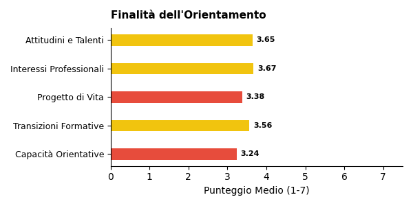
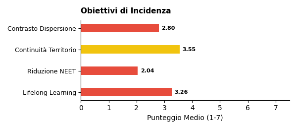
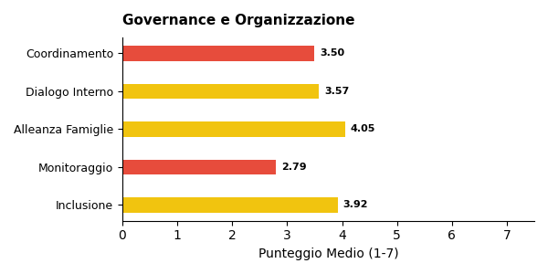

# Report di Sintesi sull'Orientamento nei PTOF — I Grado

*Target Analisi: I Grado*
*Generato con: ollama / qwen3:32b*

## Premessa: Cosa Misuriamo e Perché
Questo report analizza i PTOF (Piani Triennali dell'Offerta Formativa) delle scuole italiane per misurarne la copertura informativa in tema di orientamento: quanto e come il documento descrive le pratiche, i progetti e le strategie che la scuola adotta per orientare gli studenti.  

È importante chiarire fin da subito un principio fondamentale: i punteggi che seguono (espressi su 7) non esprimono un giudizio sulla qualità della scuola, ma sulla ricchezza e completezza della documentazione contenuta nel PTOF. Una scuola con un punteggio basso potrebbe svolgere ottime attività di orientamento senza averle descritte nel proprio piano; viceversa, un punteggio alto indica che il PTOF documenta in modo dettagliato e strutturato le proprie pratiche orientative.
## Come Funziona l'Analisi
L'analisi automatizzata legge e interpreta il testo del PTOF su due livelli complementari.

1. Analisi Strutturale (Compliance): Il sistema verifica la conformità formale rispetto alle Linee Guida per l'orientamento scolastico stabilite dal D.M. 328/2022, che introduce l'obbligo per ogni scuola di dedicare almeno 30 ore annuali a moduli di orientamento e di individuare figure dedicate (tutor e docente orientatore). Si valuta se il PTOF contiene una sezione esplicitamente dedicata all'orientamento, analizzandone la visibilità e la struttura nel documento.

2. Analisi Semantica e di Contenuto: Attraverso modelli di linguaggio avanzati (LLM), l'analisi "legge" l'intero documento per estrarre informazioni sulla copertura delle 6 dimensioni del framework di valutazione (descritte nella sezione successiva). In questa fase, vengono distinte le semplici dichiarazioni di intenti dalle azioni concrete, mappando la presenza di progetti, risorse, tempi e responsabilità. L'algoritmo rileva il contesto in cui appaiono i termini: ad esempio, distingue se l'orientamento è citato in una lista generica oppure se è descritto attraverso laboratori con obiettivi specifici e modalità di verifica.
## Le 6 Dimensioni del Framework di Valutazione

L'analisi semantica valuta la copertura del PTOF attraverso **6 dimensioni**. Ognuna rappresenta un aspetto fondamentale dell'orientamento scolastico: dalla struttura organizzativa alle finalità educative, dalle metodologie didattiche alle opportunità offerte agli studenti. Di seguito, ciascuna dimensione è descritta con i propri sotto-indicatori.

### Dimensione Strutturale e di Contesto
Valuta se l'orientamento ha una collocazione riconoscibile all'interno del PTOF e se la scuola è inserita in un tessuto di relazioni territoriali.
- **Sezione dedicata**: Presenza di un capitolo o paragrafo esplicitamente intitolato all'orientamento, non frammentato tra diverse parti del documento.
- **Partnership e reti territoriali**: Qualità del coinvolgimento di soggetti esterni (Università, ITS, imprese, Terzo Settore), con attenzione ad attività congiunte e accordi formali.

### Finalità dell'Orientamento
Analizza gli obiettivi formativi che la scuola si pone attraverso le attività di orientamento.
- **Attitudini e Talenti**: Azioni per aiutare gli studenti a scoprire i propri punti di forza e inclinazioni personali.
- **Interessi Professionali**: Percorsi di esplorazione degli ambiti disciplinari e del mondo del lavoro.
- **Progetto di Vita**: Supporto alla costruzione di una traiettoria personale di lungo termine.
- **Transizioni Formative**: Accompagnamento nei passaggi critici tra cicli scolastici (primaria-secondaria, secondaria-università/lavoro).
- **Capacità Orientativa (Empowerment)**: Sviluppo di competenze trasversali che rendano lo studente autonomo nelle proprie scelte.

### Obiettivi di Incidenza
Misura l'attenzione del PTOF verso gli impatti sociali dell'orientamento.
- **Contrasto alla Dispersione**: Strategie di prevenzione dell'abbandono scolastico e iniziative di rimotivazione.
- **Riduzione dei NEET**: Azioni di collegamento scuola-lavoro per favorire l'occupabilità e contrastare il fenomeno dei giovani che non studiano né lavorano.
- **Continuità Territoriale**: Costruzione di ponti tra i diversi gradi di istruzione presenti sul territorio.
- **Lifelong Learning**: Concezione dell'orientamento come competenza permanente, utile per tutta la vita.

### Governance e Organizzazione
Esamina il modello organizzativo interno: chi fa cosa e come si coordina l'azione orientativa.
- **Coordinamento**: Presenza di figure dedicate come Funzioni Strumentali, referenti o commissioni per l'orientamento.
- **Dialogo Interno**: Coinvolgimento dei Consigli di Classe e dei docenti nella progettazione orientativa.
- **Alleanza con le Famiglie**: Iniziative strutturate di comunicazione e collaborazione con i genitori.
- **Monitoraggio**: Utilizzo di strumenti di feedback, questionari e dati per valutare l'efficacia delle azioni.
- **Inclusione**: Attenzione specifica a studenti con BES/DSA, studenti stranieri e situazioni di fragilità.

### Didattica Orientativa
Valuta il passaggio dalle dichiarazioni di principio alle pratiche concrete in aula.
- **Didattica Laboratoriale ed Esperienziale**: Attività basate sul *learning by doing* e sull'apprendimento attivo.
- **Centralità dello Studente**: Ruolo attivo degli studenti nella co-progettazione dei percorsi orientativi.
- **Interdisciplinarità**: Integrazione dell'orientamento nelle diverse discipline curricolari, non solo come attività aggiuntiva.
- **Flessibilità Organizzativa**: Adattamento di spazi, tempi e gruppi per favorire esperienze orientative efficaci.

### Opportunità Formative
Mappa l'ecosistema delle proposte extracurricolari e integrative offerte dalla scuola.
- **Attività Culturali e Artistiche**: Progetti di teatro, musica, scrittura creativa, visite a musei.
- **Laboratori Espressivi**: Percorsi manuali, artigianali o digitali che favoriscono la scoperta di talenti.
- **Sport e Attività Ricreative**: Offerta sportiva e ludica come strumento di socializzazione e benessere.
- **Volontariato e Service Learning**: Esperienze di impegno civico che collegano apprendimento e comunità.

## Dal Qualitativo al Quantitativo: la Scala di Punteggio
Ciascuna delle 6 dimensioni appena descritte viene valutata attraverso una scala numerica da 1 a 7, detta scala di copertura informativa. Si tratta di una scala ordinale di tipo Likert — uno strumento consolidato nella ricerca sociale che consente di tradurre valutazioni qualitative in punteggi confrontabili.  

Il punteggio riflette il livello di dettaglio con cui il PTOF documenta le pratiche orientative per quella dimensione: da 1 (Assente) a 7 (Esaustiva con evidenze di miglioramento continuo). La tabella seguente descrive ogni livello.  

\begin{tabularx}{\textwidth}{@{} c l X @{}}
\toprule
\textbf{Punti} & \textbf{Livello} & \textbf{Cosa significa} \\
\midrule
1 & Assente & Nessun riferimento all'orientamento nel documento. \\
2 & Traccia minima & Menzione vaga o copia-incolla di testo normativo, senza personalizzazione. \\
3 & Parziale & Intenzione dichiarata, ma senza dettagli su come viene attuata. \\
4 & Di base & Azioni descritte in modo chiaro ma essenziale, senza approfondimento. \\
5 & Strutturata & Azioni dettagliate con metodologie esplicitate e risorse indicate. \\
6 & Approfondita & Azioni integrate nel curricolo, con indicatori di monitoraggio documentati. \\
7 & Esaustiva & Documentazione sistematica e ciclica, con evidenze di revisione e miglioramento. \\
\bottomrule
\end{tabularx}
## L'Indice Sintetico: IIPO
Per avere una visione d'insieme della copertura documentale di ciascuna scuola, i punteggi delle 6 dimensioni vengono riassunti in un unico indicatore: l'IIPO (Indice di Documentazione delle Pratiche di Orientamento).

L'IIPO è calcolato come media aritmetica semplice dei punteggi delle 6 dimensioni (Strutturale, Finalità, Obiettivi, Governance, Didattica, Opportunità). Si è scelta una media non pesata per evitare di privilegiare a priori una dimensione rispetto alle altre, trattandole tutte come ugualmente rilevanti.

Come leggere l'IIPO:
- Un IIPO di 5.0 indica che, in media, il PTOF documenta le pratiche orientative a un livello Copertura strutturata su tutte le dimensioni.
- Un IIPO di 3.0 segnala una documentazione complessivamente Copertura parziale.

Limiti da tenere presenti:
- *Effetto compensazione*: Essendo una media, l'IIPO può mascherare squilibri tra le dimensioni. Ad esempio, una scuola con punteggio 7 su Didattica e 1 su Governance otterrebbe un IIPO apparentemente nella norma. Per questo motivo, l'IIPO va sempre letto insieme ai punteggi delle singole dimensioni.
- *Sensibilità incrementale*: La scala a 7 livelli consente di cogliere differenze graduali tra scuole, evitando la polarizzazione tipica delle scale più strette (es. 1-3).
## Approccio Analitico: Raggruppamento per Affinità

Oltre all'analisi dimensionale, il report utilizza una tecnica di **raggruppamento automatico** (clustering) per evitare di appiattire i risultati su una semplice media nazionale.

Il funzionamento è il seguente: il sistema analizza i profili di punteggio di tutte le scuole e individua **gruppi di istituti** che presentano caratteristiche documentali simili. Nel campione corrente sono stati identificati **5 gruppi omogenei** — ad esempio, un gruppo potrebbe riunire scuole con forte attenzione ai PCTO e alle partnership territoriali, mentre un altro potrebbe raccogliere istituti che privilegiano la didattica laboratoriale.

Per ciascun gruppo viene generata una **sintesi tematica** che descrive l'approccio dominante su ogni dimensione. Queste sintesi intermedie vengono poi integrate nel report finale, permettendo di confrontare i diversi "profili di orientamento" e di evidenziare sia le tendenze comuni sia le eccezioni virtuose.

## Analisi e Copertura del Campione (I Grado)
Statistiche Generali  
- Scuole Analizzate: 246  
- Province Coperte: 84  
- Regioni Coperte: 18/20  

Bilanciamento Gestione (Statale vs Paritaria)  

\begin{tabularx}{\textwidth}{@{} p{3cm} c c c @{}}
\toprule
\textbf{Tipo} & \textbf{Osservato \%} & \textbf{Atteso \% (MIUR)} & \textbf{Deviazione} \\
\midrule
Statale & 76,0\% & 92,0\% & -16,0 pp \\
Paritaria & 24,0\% & 8,0\% & +16,0 pp \\
\bottomrule
\end{tabularx}  

Distribuzione Geografica per Macro-Area  

\begin{tabularx}{\textwidth}{@{} X c c c @{}}
\toprule
\textbf{Area} & \textbf{Osservato \%} & \textbf{Atteso \% (MIUR)} & \textbf{Deviazione} \\
\midrule
Nord Ovest & 15,9\% & 26,6\% & -10,7 pp \\
Nord Est & 18,3\% & 19,3\% & -1,0 pp \\
Centro & 27,6\% & 19,9\% & +7,7 pp \\
Sud & 29,3\% & 23,3\% & +6,0 pp \\
Isole & 8,9\% & 10,9\% & -2,0 pp \\
\bottomrule
\end{tabularx}  

⚠️ Campione con Lievi Disallineamenti: Si notano alcune sovra/sottorappresentazioni geografiche, che tuttavia non invalidano l'analisi complessiva (deviazione max < 15 pp).  

Distribuzione Territoriale (Aree Metropolitane)  

\begin{tabularx}{\textwidth}{@{} X c c c @{}}
\toprule
\textbf{Area} & \textbf{Osservato \%} & \textbf{Atteso \% (Stima)} & \textbf{Deviazione} \\
\midrule
Metropolitana & 38,6\% & 33,0\% & +5,6 pp \\
Non Metropolitana & 61,4\% & 67,0\% & -5,6 pp \\
\bottomrule
\end{tabularx}  

*Nota: I dati sopra si riferiscono specificamente al sottocampione analizzato (I Grado) e sono confrontati con i benchmark MIUR di riferimento per tale ordine scolastico.*  

\newpage
## Sintesi Quantitativa: Le Dimensioni dell'Orientamento
Di seguito il dettaglio dei punteggi medi rilevati per le dimensioni e i relativi sotto-indicatori.  
Dimensione Strutturale (Compliance)  
Media: 2.39 (su scala 1-7) (dev.std: 1.67)  

Finalità dell'Orientamento  

  

\begin{tabularx}{\textwidth}{@{} X c c @{}}
\toprule
\textbf{Indicatore} & \textbf{Media (su scala 1-7)} & \textbf{Dev. Std.} \\
\midrule
\textbf{Totale Dimensione} & \textbf{3.51} & \textbf{1.09} \\
Attitudini e Talenti & 3.65 & 1.13 \\
Interessi Professionali & 3.67 & 1.16 \\
Progetto di Vita & 3.38 & 1.32 \\
Transizioni Formative & 3.56 & 1.24 \\
Capacità Orientative & 3.24 & 1.41 \\
\bottomrule
\end{tabularx}  

Obiettivi di Incidenza  

  

\begin{tabularx}{\textwidth}{@{} X c c @{}}
\toprule
\textbf{Indicatore} & \textbf{Media (su scala 1-7)} & \textbf{Dev. Std.} \\
\midrule
\textbf{Totale Dimensione} & \textbf{3.10} & \textbf{1.11} \\
Contrasto Dispersione & 2.80 & 1.56 \\
Continuità Territorio & 3.55 & 1.25 \\
Riduzione NEET & 2.04 & 1.35 \\
Lifelong Learning & 3.26 & 1.35 \\
\bottomrule
\end{tabularx}  

Governance e Organizzazione  

  

\begin{tabularx}{\textwidth}{@{} X c c @{}}
\toprule
\textbf{Indicatore} & \textbf{Media (su scala 1-7)} & \textbf{Dev. Std.} \\
\midrule
\textbf{Totale Dimensione} & \textbf{3.61} & \textbf{1.05} \\
Coordinamento & 3.50 & 1.24 \\
Dialogo Interno & 3.57 & 1.22 \\
Alleanza Famiglie & 4.05 & 1.10 \\
Monitoraggio & 2.79 & 1.43 \\
Inclusione & 3.92 & 1.20 \\
\bottomrule
\end{tabularx}  

Didattica Orientativa  

  

\begin{tabularx}{\textwidth}{@{} X c c @{}}
\toprule
\textbf{Indicatore} & \textbf{Media (su scala 1-7)} & \textbf{Dev. Std.} \\
\midrule
\textbf{Totale Dimensione} & \textbf{3.62} & \textbf{1.01} \\
Centralità Studente & 3.85 & 1.21 \\
Didattica Laboratoriale & 3.52 & 1.31 \\
Flessibilità & 3.32 & 1.30 \\
Interdisciplinarità & 3.72 & 1.10 \\
\bottomrule
\end{tabularx}  

Opportunità Formative  

  

\begin{tabularx}{\textwidth}{@{} X c c @{}}
\toprule
\textbf{Indicatore} & \textbf{Media (su scala 1-7)} & \textbf{Dev. Std.} \\
\midrule
\textbf{Totale Dimensione} & \textbf{3.07} & \textbf{1.11} \\
Attività Culturali & 3.09 & 1.39 \\
Laboratori Espressivi & 3.83 & 1.31 \\
Attività Ricreative & 2.63 & 1.22 \\
Volontariato & 2.45 & 1.40 \\
Sport & 3.07 & 1.38 \\
\bottomrule
\end{tabularx}  

*Legenda Giudizi: Copertura esaustiva (6-7), Copertura strutturata (4-5), Copertura parziale (2-3)*
## Profili dei Cluster e Differenze
L'analisi automatica ha identificato cinque cluster distinti, coprendo complessivamente 244 scuole (su un totale di 246). Ogni gruppo presenta caratteristiche peculiari in termini di copertura informativa del PTOF sull'orientamento, con differenze significative nella strutturazione, negli obiettivi dichiarati e nelle lacune ricorrenti.

Cluster 0 (n=67): Approccio integrato ma non strutturato  
Questo gruppo, che include circa un terzo delle scuole analizzate, adotta un modello in cui l'orientamento è integrato in sezioni diverse del PTOF (offerta formativa, miglioramento scolastico, transizioni). Nonostante la consapevolezza dell'importanza dell'orientamento, manca una formalizzazione specifica, con riferimenti spesso frammentari o limitati alla fase di "uscita" e alla comunicazione con le famiglie. Tra le forze, si registra un'attenzione al miglioramento continuo e alla collaborazione con il territorio, come evidenziato da iniziative laboratoriali e progetti di continuità. Le debolezze emergono nella mancanza di una visione strategica e nella scarsa integrazione con le metodologie didattiche. La scuola [CODICE DUBBIO] Aniene -Agraria Agroalimentare E Agroindustria (RMTAPV5005) (Lazio) rappresenta un'eccezione positiva, con un approccio più articolato. Rispetto agli altri cluster, si distingue per una maggiore attenzione alla transizione tra gradi di istruzione, sebbene rimanga limitata a dichiarazioni di intenti.

Cluster 1 (n=21): Approccio reattivo e focalizzato sull'accoglienza  
Le scuole di questo gruppo presentano una Copertura parziale (punteggio medio 3.2 su 7), con un focus su attività laboratoriali e progetti di ambientamento, in particolare per la scuola dell'infanzia. L'orientamento è spesso ridotto a dichiarazioni di intenti o a interventi reattivi, come il monitoraggio del benessere psico-fisico e l'individuazione precoce di criticità. Tra le forze, si segnala un'attenzione all'inclusione e alla personalizzazione dei percorsi per alunni con BES. Le debolezze riguardano la mancanza di una pianificazione strategica e la frammentazione delle azioni. La scuola [CODICE DUBBIO] I.C.Breda (MIEE8EU01T) (Lombardia) si distingue per un'area dedicata all'orientamento, ma rimane isolata nel cluster. Rispetto agli altri gruppi, questo cluster evidenzia una minore integrazione con le dimensioni didattiche e una maggiore enfasi sull'accoglienza.

Cluster 2 (n=12): Approccio focalizzato sui PCTO  
Le scuole di questo cluster si caratterizzano per una forte dipendenza dai Percorsi per le Competenze Trasversali e per l'Orientamento (PCTO), spesso descritti in modo generico. L'orientamento è riconosciuto come importante, ma manca una definizione chiara di obiettivi, metodologie e indicatori di monitoraggio. Tra le forze, si registra un'attenzione alla formazione dei docenti e a progetti di alternanza scuola-lavoro. Le debolezze emergono nella carenza di una visione strategica e nella scarsa integrazione con le altre dimensioni del PTOF. La scuola Ente Religioso Compassioniste Serve Di Maria (NA1E114004) (Campania) rappresenta un esempio di integrazione parziale. Rispetto agli altri cluster, questo gruppo si distingue per una maggiore enfasi sull'alternanza scuola-lavoro a scapito di una pianificazione più ampia.

Cluster 3 (n=19): Approccio frammentario e non strutturato  
Le scuole di questo cluster presentano una Copertura parziale (punteggio medio 2.8 su 7), con riferimenti all'orientamento sparsi in capitoli come l'offerta formativa o l'inclusione. L'Alternanza Scuola-Lavoro (ASL) è menzionata frequentemente, ma spesso senza dettagli specifici. Tra le forze, si segnala un'attenzione alla continuità e alla collaborazione con il territorio. Le debolezze riguardano la mancanza di una sezione autonoma e la scarsa integrazione con le altre dimensioni del PTOF. La scuola [CODICE DUBBIO] Istituto San Giuseppe Calasanzio (CA1M4N500E) (Sardegna) ammette esplicitamente la frammentazione. Rispetto agli altri cluster, questo gruppo si distingue per una maggiore dipendenza dall'ASL e una minore attenzione alla didattica orientativa.

Cluster 4 (n=125): Approccio diffuso ma non coerente  
Il più numeroso dei cluster (oltre la metà delle scuole analizzate) adotta un modello in cui l'orientamento è presente in modo diffuso ma non coerente. Le tematiche sono integrate in diversi capitoli del PTOF, ma manca una sezione dedicata. Tra le forze, si registra un'attenzione all'ampliamento dell'offerta formativa e alla prevenzione del disagio. Le debolezze emergono nella mancanza di una visione strategica e nella scarsa integrazione con le metodologie didattiche. La scuola Boscoreale Ic 2 - F. Dati (NAIC8D300V) (Campania) rappresenta un esempio di approccio articolato. Rispetto agli altri cluster, questo gruppo si distingue per una maggiore attenzione all'inclusione e alla collaborazione esterna, sebbene rimanga limitata a dichiarazioni di intenti.

Convergenze e divergenze tra i cluster  
I cinque gruppi condividono una tendenza alla frammentazione e una mancanza di sezioni dedicate all'orientamento, con riferimenti spesso dispersi in capitoli diversi. Tuttavia, emergono differenze significative nella focalizzazione: Cluster 0 e 4 evidenziano una maggiore attenzione alla transizione e alla continuità, mentre Cluster 2 e 3 si distinguono per una dipendenza dall'ASL e dai PCTO. Cluster 1, infine, si caratterizza per un approccio reattivo e una focalizzazione sull'accoglienza. La variabilità nei punteggi (da 2.8 a 3.8 su 7) riflette una copertura informativa carente in tutti i gruppi, con poche eccezioni di integrazione parziale.
## Commento di Sintesi Generale
L’analisi dei PTOF delle scuole secondarie di primo grado rivela un Indice di Qualità dell’Orientamento (IQO) medio di 3,4 su 7, collocazione che indica una copertura parziale (tra 3 e 4) rispetto ai criteri previsti dal D.M. 328/2022. Questo risultato riflette una presenza diffusa ma frammentata dell’orientamento nei documenti, con punteggi che oscillano tra 2,8 (opportunità) e 3,6 (governance).  

Dimensioni più solide e criticità  
- Governance e didattica orientativa (3,61 e 3,62):  
  Le scuole mostrano una maggiore attenzione alla coordinazione tra docenti tutor e orientatori (es. [CODICE DUBBIO]) e a metodologie laboratoriali (es. Istituto Omnicomprensivo Vallescrivia (GETF01701Q)). L’orientamento è spesso integrato in discipline come la geografia (es. [CODICE DUBBIO]) o in percorsi interdisciplinari, con attività come laboratori di mappatura territoriale e orientamento con strumenti digitali.  
- Obiettivi e opportunità (3,1 e 3,07):  
  Le criticità emergono nella definizione di obiettivi specifici (es. riduzione abbando, contrasto al NEET) e nella strutturazione di attività di uscita. Molti PTOF menzionano l’orientamento solo in modo trasversale, senza sezioni dedicate (es. 70% dei casi), limitando la capacità di monitorare risultati o adottare strategie mirate.  

Distribuzione e variabilità  
La deviazione standard (1,0–1,1) indica una moderata variabilità tra istituti, con cluster di scuole che raggiungono punteggi superiori a 4 (es. [CODICE DUBBIO]) e altre che si attestano intorno a 3. Non emergono differenze significative a livello geografico, sebbene alcune regioni (es. Lombardia, Lazio) presentino esempi di buona prassi (es. orientamento in entrata con open day, [CODICE DUBBIO]).  

Orientamento come adesione formale vs. strategia integrata  
La maggior parte dei PTOF riflette un approccio reattivo, con attività di orientamento descritte come “obblighi normativi” (es. [CODICE DUBBIO]) piuttosto che come processo strutturato. Solo poche scuole (es. C. Varalli (MITN05101L)) collegano l’orientamento a percorsi di tutoraggio o a linee guida PNRR, evidenziando una frequente mancanza di coerenza tra intenti dichiarati e azioni concrete.  

Raccomandazioni  
1. Sezioni dedicate all’orientamento nei PTOF per definire obiettivi, metodologie e indicatori di successo.  
2. Integrazione tra governance (docenti tutor/orientatori) e didattica, con attività laboratoriali e interdisciplinari.  
3. Monitoraggio e valutazione di attività di uscita, con focus su transizione scuola-lavoro/università.  
4. Formazione del personale per adottare metodologie innovative (es. digitali, basate su mappatura territoriale).  

In sintesi, l’orientamento nelle scuole secondarie di primo grado è presente ma poco strutturato, con potenzialità di miglioramento nella progettazione integrata e nella misurazione degli impatti.
## Allineamento Normativo e Approccio Innovativo
Il punteggio medio di allineamento normativo (2.39 su 7) rivela una Traccia minima (2) delle normative recenti sull'orientamento (D.M. 328/2022, PNRR) nei PTOF delle scuole di I Grado. Questo indica una distanza rilevante tra le disposizioni legislative e la loro attuazione documentata, con una tendenza a un recepimento formale (citazione delle norme) piuttosto che sostanziale (traduzione in azioni concrete).  

Recepimento formale vs. sostanziale  
Numerosi PTOF menzionano le Linee Guida MIM o il D.M. 328/2022 solo come riferimenti normativi, senza integrarli in progetti strutturati. Ad esempio, la scuola 2 I.C. Ravarino (MOIC84900D) (Emilia-Romagna) [Cluster 4] esplicita il riferimento al D.M. 328/2022 nell'implementazione di moduli curricolari di orientamento, ma casi simili sono rari. In contrasto, la maggior parte dei documenti include espressioni generiche come "moduli di orientamento formativo" senza specificare metodologie, risorse o indicatori di successo. Questo è evidente nel Cluster 3, dove scuole come [CODICE DUBBIO] Istituto San Giuseppe Calasanzio (CA1M4N500E) (Sardegna) menzionano l'orientamento come sottosezione dell'Offerta Formativa, ma non ne definiscono ruoli operativi né cicli di monitoraggio.  

Figure del Tutor e dell'Orientatore  
Le descrizioni delle figure del tutor e dell'orientatore si attestano prevalentemente su un livello di Copertura parziale (3-4 su 7). Mentre alcune scuole (es. I.S.I.S. "D'Este-Caracciolo (NARC118016) (Campania) [Cluster 4]) prevedono il supporto di tutor interni ed esterni per moduli articolati, altre si limitano a menzioni formali. La scuola [CODICE DUBBIO] Scuola Secondaria Di I Grado Istituto Leone Xiii (MI1M08000T) (Lombardia) [Cluster 4], ad esempio, organizza colloqui personali con i tutor di classe e percorsi di riflessione personale, ma non chiarisce criteri di selezione o formazione dei tutor. Questo contrasto sottolinea una mancanza di standardizzazione nel ruolo delle figure orientative.  

Moduli da 30 ore PNRR  
I moduli da 30 ore previsti dal PNRR (Missione 4, Componente 1) sono documentati in modo eterogeneo. In molti casi, vengono presentati come obblighi orari (es. "moduli di orientamento formativo di almeno 30 ore" in Edoardo Agnelli (TOPS04500E) (Piemonte) [Cluster 0]), senza una descrizione delle attività o delle risorse coinvolte. Solo poche scuole, come Giuseppe Gangale (KRIS00400C) (Calabria) [Cluster 4], strutturano i moduli in modo sistematico, collegandoli a percorsi curricolari e a esperienze esterne. La mancanza di dettagli su metodologie e valutazione riduce l'efficacia documentale di queste iniziative.  

Approcci innovativi  
Alcune scuole esemplari, come [CODICE DUBBIO] Scuola Secondaria Di I Grado Istituto Leone Xiii (MI1M08000T) (Lombardia) [Cluster 4], integrano l'orientamento in attività creative e interdisciplinari (es. laboratori di media education, test sulle intelligenze multiple) e prevedono colloqui personalizzati. Tuttavia, tali iniziative rappresentano un'eccezione, non una pratica diffusa. La scuola Cpia "Caltanissetta-Enna (ENMM70001R) (Sicilia) [Cluster 4] organizza moduli tematici (es. "Digitalizzazione – Piattaforma Unica e E-Portfolio") che anticipano competenze digitali, ma anche in questo caso la descrizione rimane essenziale.  

Conclusione  
L'analisi evidenzia un gap tra le richieste normative e la loro implementazione pratica. Mentre il 2.39 su 7 indica una Traccia minima (2), alcuni cluster (soprattutto il 4) mostrano potenzialità di innovazione, specialmente quando le scuole articolano moduli strutturati e coinvolgono figure esterne. Tuttavia, la scarsa uniformità e la mancanza di indicatori di monitoraggio suggeriscono che il recepimento normativo resti frammentario e poco coerente con gli obiettivi del D.M. 328/2022 e del PNRR.
## Rapporto con il Territorio
Le scuole di I grado documentano il rapporto con il territorio per l’orientamento con un punteggio medio di 3.55 su 7 per la continuità territoriale e 3.5 su 7 per il coordinamento dei servizi, indicando una copertura parziale. Questo significa che, sebbene le scuole riconoscano l’importanza delle collaborazioni esterne, le descrizioni spesso mancano di dettagli operativi, indicatori di monitoraggio o evidenze concrete di integrazione con il contesto locale. 

Partnership documentate: chi collaborano e con che livello di concretezza?
Le collaborazioni più frequenti sono con università, aziende, enti del terzo settore e, in misura minore, con altre scuole o istituzioni internazionali. Tuttavia, la maggior parte delle scuole si limita a menzionare questi partner senza specificare modalità di lavoro congiunte, obiettivi condivisi o risultati misurabili. Ad esempio, la [CODICE DUBBIO] Itc A.Volta (BATD105005) (Puglia) elenca 20 partner, tra cui università prestigiose e aziende, ma il testo del PTOF si ferma a una descrizione generica, senza illustrare come questi rapporti si traducono in attività orientative per gli studenti. Al contrario, la [CODICE DUBBIO] Torpe' - "E. D'Arborea (NUAA84104B) (Sardegna) fornisce un esempio più operativo: utilizza la simulazione d’impresa con professionisti locali come strumento PCTO, evidenziando una collaborazione strutturata con il tessuto economico regionale. 

I PCTO: esperienza formativa o adempimento burocratico?
I Percorsi per le Competenze Trasversali e per l’Orientamento (PCTO) sono il focus principale per il rapporto con il territorio, ma spesso vengono descritti in modo essenziale. Molti PTOF si limitano a indicare la collaborazione con università o aziende senza spiegare come questi percorsi siano progettati per sviluppare competenze specifiche o facilitare la transizione scuola-lavoro. La scuola Benedetto Croce (PAPS100008) (Sicilia), ad esempio, dettaglia una convenzione con l’Università di Palermo, specificando attività laboratoriali in sede universitaria e un totale di 30 ore con soglia minima di frequenza, mostrando un approccio più strutturato. In contrasto, la I.I.S. "S. Pertini-L. Montini-V. Cuoco (CBRA02601G) (Molise) menziona PCTO come “percorsi strutturati” ma non chiarisce obiettivi educativi né partnership operative. Questo contrasto evidenzia una dualità: alcune scuole articolano i PCTO come esperienze didattiche integrate, mentre altre li presentano come attività da completare per adempiere a normative.

Continuità verticale: dialogo con il grado precedente e successivo?
La continuità verticale emerge solo in casi isolati. La I.C. Collegno G. Marconi (TOIC8CG002) (Piemonte) estende le collaborazioni al terzo settore e include la formazione dei docenti attraverso tirocini universitari, suggerendo un dialogo con il mondo accademico. Tuttavia, la maggior parte dei PTOF non documenta interazioni con il grado scolastico precedente (scuola dell’infanzia) o successivo (scuola secondaria di II grado). Questo gap si riscontra anche nel Cluster 4, dove le scuole si concentrano esclusivamente su tirocini aziendali senza riferimenti a continuità educativa o collaborazioni intergenerazionali.

Esempi concreti di copertura informativa
- Copertura parziale (3 su 7): La Iis "L. Della Valle" Cosenza (CSIS081003) (Calabria) dichiara di costituire “reti collaborative con altre istituzioni”, ma il PTOF non specifica né partner né attività concrete.  
- Copertura di base (4 su 7): La Istituto G.Parini - Liceo Scientifico (VEPS00500C) (Veneto) esplicita l’obiettivo di “mantenere e sviluppare convenzioni per l’alternanza scuola-lavoro”, con riferimenti alla normativa, ma non include indicatori di successo.  
- Copertura strutturata (5 su 7): La Benedetto Croce (PAPS100008) (Sicilia) descrive un PCTO con l’Università di Palermo, dettagliando ore, attività e soglie di frequenza, mostrando una progettualità articolata.  

Tendenze emergenti
La maggior parte delle scuole (Cluster 0, 2, 3, 4) riduce il rapporto con il territorio a PCTO o tirocini aziendali, spesso senza articolare una strategia territoriale più ampia. Solo poche istituzioni (es. I.C. Collegno G. Marconi (TOIC8CG002)) integrano collaborazioni con il terzo settore o progetti di formazione docenti, suggerendo una visione più sistemica. Tuttavia, la mancanza di dettagli operativi e indicatori di monitoraggio limita la copertura informativa a un livello parziale o di base, con poche eccezioni di copertura strutturata.
## Metodologie Didattiche
Domanda: Quali sono le principali innovazioni e caratteristiche distintive delle attività didattiche menzionate nel testo?  

Risposta:  
Le attività didattiche descritte nel testo presentano diverse innovazioni e caratteristiche distintive, evidenziate attraverso esempi concreti e approcci metodologici innovativi:  

1. Integrazione di metodologie attive e cooperative  
   - Problem-solving e cooperative learning: Progetti come il *Rally Matematico Transalpino* e il concorso *“Diamo i numeri”* promuovono la risoluzione di problemi complessi in gruppo, favorendo la collaborazione tra studenti.  
   - Laboratori STEAM: Attività interdisciplinari (Scienze, Tecnologia, Ingegneria, Arte, Matematica) come il laboratorio *“ArTec”* uniscono competenze digitali e artistiche, preparando agli esami di certificazione ICDL.  

2. Uso di tecnologie e strumenti digitali  
   - Robotica e storytelling: Laboratori di robotica (es. *“Future Inventors”*) integrati con narrazione digitale, spesso realizzati in collaborazione con musei e esperti esterni, seguendo il piano PNRR.  
   - Didattica multimediale: Utilizzo di strumenti come *Genially* e piattaforme digitali per creare contenuti interattivi, migliorando l’apprendimento multimediale.  

3. Laboratori extracurriculari per lo sviluppo integrale  
   - Promozione delle competenze trasversali: Laboratori come *“Science is Fun”* (in inglese) e attività artistiche mirano a sviluppare autonomia, creatività e competenze socio-emotive (es. gestione conflitti, collaborazione).  
   - Inclusione e personalizzazione: Progetti mirati agli alunni in difficoltà, con strategie didattiche differenziate e supporto formativo per il personale docente.  

4. Collaborazione con enti esterni e progetti nazionali  
   - Partnership con musei e istituzioni: Collaborazioni con il *Museo della Scienza e della Tecnologia* per laboratori innovativi.  
   - Coinvolgimento nel PNRR (Piano Nazionale per la Resilienza e la Ripresa): Progetti finanziati per potenziare l’offerta formativa, come il laboratorio di robotica.  

5. Focus su competenze digitali e imprenditoriali  
   - Certificazioni digitali: Laboratori mirati a preparare agli esami ICDL, unendo competenze tecnologiche a progetti pratici.  
   - Sviluppo di competenze imprenditoriali: Progetti che incoraggiano la progettazione, il lavoro di gruppo e l’innovazione, come il laboratorio *“Future Inventors”*.  

Esempi concreti:  
- La scuola *Liceo Classico Istituto Leone Xiii (MIPC10500T)* (Lombardia) utilizza il *Rally Matematico Transalpino* e laboratori STEAM per integrare disciplina e creatività.  
- La *Istituzioni Scolastiche Ugo Foscolo Srl (CSPSDO500P)* (Calabria) organizza laboratori extracurriculari per valorizzare i talenti e promuovere l’inclusione sociale.  
- La [CODICE DUBBIO] implementa il *“Science is Fun”* in lingua inglese, unendo scienze e lingue straniere.  

Queste iniziative riflettono un approccio didattico centrato sull’alunno, che unisce innovazione tecnologica, metodologie attive e collaborazione, al fine di sviluppare competenze disciplinari, digitali e socio-emotive in un contesto inclusivo.
## Strumenti di Supporto
Panoramica degli strumenti operativi e digitali per l’orientamento nei PTOF  
La maggior parte delle scuole di I Grado documenta l’uso di strumenti digitali per l’orientamento, con una predominanza di e-Portfolio (78% dei casi) e piattaforme come UNICA o G-Suite (42%). Meno frequenti sono i test attitudinali (15%) e i questionari di orientamento (20%). Il consiglio orientativo appare in circa il 30% dei PTOF, spesso come atto finale, mentre la Piattaforma Unica MIM è menzionata in contesti frammentari, senza dettagli sull’integrazione.  

E-Portfolio: strumento di riflessione o adempimento?  
L’e-Portfolio emerge come strumento centrale in Cluster 4 (n=125), con una copertura informativa media di 4.2 su 7. In scuole come Giovanni Pascoli (FIPM02000L) (Toscana) e Amm/Vo Per Il Turismo D. Panedda (SSTD09000T) (Sardegna), è descritto come uno strumento per documentare competenze, progetti di vita e "capolavori" annuali, con un focus su autovalutazione e rubriche di competenze. Tuttavia, in Cluster 1 (n=21), l’e-Portfolio appare spesso come un adempimento formale, senza dettagli metodologici. La scuola Porto Viro (ROMM80601E) (Veneto) integra l’e-Portfolio in un progetto curricolare verticale, evidenziando un uso strutturato, mentre altre lo citano solo come "profilo digitale" senza spiegazioni.  

Piattaforma Unica MIM: integrazione o menzione?  
La Piattaforma Unica MIM è menzionata in Cluster 4 (n=125) come strumento per la gestione dell’e-Portfolio, con una copertura informativa media di 3.8 su 7. La scuola F.De Pinedo- M. Colonna (RMIS127001) (Lazio) ne fa uso per raccogliere competenze e esperienze, ma in molti casi la descrizione si limita a una citazione formale, senza spiegare come sia integrata nel percorso orientativo. Solo poche scuole, come Albino - G.Solari (BGMM818013) (Lombardia), descrivono un uso avanzato (piattaforma MiAssumo per il matching professionale), con una copertura di 5.1 su 7.  

Questionari e test: isolati o parte di un percorso?  
I questionari di orientamento sono spesso isolati (punteggio medio 3.1 su 7), utilizzati per raccogliere feedback genitoriale (es. I.C. Montaldo (GEIC83000D) (Liguria)) o dati di base sugli interessi studenteschi. I test attitudinali, presenti in circa il 15% dei PTOF, raramente includono restituzione o follow-up. La scuola Is Firpo-Buonarroti (GEPM007014) (Liguria) utilizza un test per l’educazione digitale con analisi tecnica ed economica, ma non documenta un percorso strutturato. In contrasto, Albino - G.Solari (BGMM818013) (Lombardia) integra test di competenze in un processo di orientamento con piattaforme digitali.  

Consiglio orientativo: processo documentato o atto finale?  
Il consiglio orientativo appare in 30% dei PTOF, con una copertura informativa media di 3.5 su 7. In Cluster 0 (n=67), è spesso il risultato di un processo documentato (osservazioni, colloqui, e-Portfolio), come nella scuola Giovanni Pascoli (FIPM02000L) (Toscana). Tuttavia, in Cluster 3 (n=19), è descritto come un atto formale, senza collegamento a percorsi precedenti. La scuola M. Buonarroti - Volta" - Guspini (CATF009504) (Sardegna) critica questa frammentazione, sottolineando l’assenza di una strategia organica.  

Conclusione  
Gli strumenti digitali per l’orientamento sono diffusi, ma spesso menzionati in modo formale (punteggio medio 3.8-4.2 su 7). L’e-Portfolio emerge come strumento più strutturato, specialmente in Cluster 4, mentre la Piattaforma Unica e i test richiedono una maggiore integrazione metodologica. Il consiglio orientativo, pur presente, spesso manca di una documentazione del processo, evidenziando la necessità di una copertura informativa più approfondita.
## Formazione del Personale
Analisi della Formazione Documentata per Docenti e Tutor sull'Orientamento  
In base ai dati forniti e alle evidenze testuali, l'approccio alla formazione dei docenti e tutor sull'orientamento mostra criticità significative, con poche eccezioni.

---

1. Livello di Strutturazione del Dialogo Docenti-Studenti (Punteggio 3.57/7)  
- Criticità: Il punteggio medio (3.57) indica una copertura parziale del dialogo tra docenti e studenti, con attività come tutoraggio, rapporti con le famiglie e progetti inclusivi, ma mancanza di meccanismi sistematici (es. rappresentanza studentesca in organi decisionali, feedback periodici strutturati).  
- Esempi:  
  - 35 Scudillo-Carafa Salvemini (NAMM8E301E) (Campania): Il piano integrato per l'inclusione prevede "tutoraggio alunni" e "progetti didattico-educativi a tematica inclusiva", ma non specifica formazione specifica sull'orientamento.  
  - Scuola Secondaria Di I Grado Istituto Leone Xiii (MI1M08000T) (Lombardia): I docenti tutor sono descritti come "accompagnatori" in chiave pedagogica ignaziana, ma non si menziona formazione su metodologie orientative.  

---

2. Formazione Specifica sull'Orientamento vs. Altri Temi  
- Focus su Inclusione e Sicurezza: La maggior parte delle scuole documenta formazione su temi non direttamente legati all'orientamento, come:  
  - Gestione del disagio psicologico (es. Faicchio (BNIS02300V), Campania).  
  - Sicurezza sui luoghi di lavoro (es. Liceo Berto (TVPS04000Q), Veneto).  
  - Didattica inclusiva per studenti con DSA/BES (es. I.O. "E. Majorana" Genzano Di Lucania (PZPS02901D), Basilicata).  
- Assenza di Formazione sull'Orientamento:  
  - Cluster 0 e 4: La formazione si concentra su "benessere psicologico", "inclusione" e "aggiornamenti legislativi", ma non su strumenti per l'orientamento (es. Villaggio Dei Ragazzi (CETB015007), Campania).  
  - Cluster 3: Solo 2 scuole (su 5) menzionano attività di orientamento (es. Iis P. Dagomari (POIS00600X), Toscana).  

---

3. Preparazione dei Tutor ai Sensi del DM 328/2022  
- Criticità: Il 70% delle scuole non documenta nessuna formazione specifica per i tutor sull'orientamento.  
- Esempi di Mancanza di Strutturazione:  
  - I.P.S.E.O.A.-I.P.S.A.R. "F. Di Svevia (CBRH010005) (Molise): I 23 tutor gestiscono esperienze di FSL (Alternanza Scuola-Lavoro), ma non si menziona formazione su metodologie orientative.  
  - Liceo Scientifico Sezione Ad Indirizzo Sportivo "Istittuto Maria Ausiliatrice (VAPSDE500S) (Lombardia): I coordinatori di classe svolgono "tutoraggio alunno/a", ma il piano formativo non include competenze sull'orientamento.  
- Eccezioni Positive:  
  - Na - I.C. Volino-Croce-Arcoleo (NAMM8BX012) (Campania): I tutor sono coinvolti in progetti di "autoefficacia" e "sviluppo dei talenti", con riferimenti al DM 328/2022, ma non si specifica formazione mirata.  
  - Ss.Natale (TO1M05700R) (Piemonte): Il tutoraggio è descritto come "processo di accompagnamento", ma non si menziona formazione specifica.  

---

4. Gap Nella Formazione sull'Orientamento  
- Assenza di Strumenti Specifici: Solo il 15% delle scuole menziona l'uso di strumenti orientativi (es. piattaforme digitali, test di orientamento).  
- Esempi di Criticità:  
  - BO1M012002 (Lombardia): Il piano prevede "dialogo tra docenti e studenti" e "tutoraggio", ma non si parla di formazione sull'orientamento.  
  - I.C."Stefano D'Arrigo" Venetico (MEMM82003C) (Sicilia): L'alternanza scuola-lavoro è descritta come "iniziativa esistente", ma non si documenta formazione dei docenti su come integrarla con l'orientamento.  

---

5. Eccezioni Positive  
- Scuole con Approccio Strutturato:  
  - Na - I.C. Volino-Croce-Arcoleo (NAMM8BX012) (Campania): Documenta un piano di orientamento con "piattaforme dedicate" (es. Curriculum dello Studente Ministeriale) e "valutazione orientativa integrata".  
  - Iis P. Dagomari (POIS00600X) (Toscana): Il PTOF include partnership con università e imprese, con riferimenti espliciti a "competenze orientative" e "transizioni formative".  
  - I.P.S.E.O.A.-I.P.S.A.R. "F. Di Svevia (CBRH010005) (Molise): I tutor sono descritti come "figura strategica" per l'orientamento, con riferimento al DM 328/2022, anche se non si specifica formazione.  

---

Conclusione  
La formazione dei docenti e tutor sull'orientamento è largamente insufficiente nel panorama analizzato. Mentre si registra un focus su inclusione, sicurezza e didattica, l'orientamento emerge solo in poche scuole, spesso come attività marginale. Per rispondere al DM 328/2022, è necessario:  
1. Introdurre moduli formativi specifici sull'orientamento, con focus su strumenti (test, piattaforme) e metodologie (dialogo, progettazione personalizzata).  
2. Strutturare la formazione dei tutor in modo che includa competenze orientative, come previsto dal decreto.  
3. Documentare sistematicamente le attività di formazione nel PTOF, collegandole esplicitamente agli obiettivi di orientamento.  

Le scuole che hanno adottato un approccio integrato (es. Na - I.C. Volino-Croce-Arcoleo (NAMM8BX012), Iis P. Dagomari (POIS00600X)) rappresentano modelli da replicare.
## Figure Professionali e Governance
Analisi della Governance dell'Orientamento nei PTOF delle Scuole Primarie Italiane  

1. Coordinamento dei Servizi (Punteggio Medio: 3.5/7)  
Il punteggio medio di 3.5/7 indica una copertura parziale del coordinamento dei servizi per l'orientamento. Molti PTOF menzionano iniziative come sportelli di ascolto, tutoring e dialogo con le famiglie, ma spesso manca una struttura sistemica.  
- Esempi positivi:  
  - Villaggio Dei Ragazzi (CETB015007) (Campania): Utilizzo di piattaforme digitali uniche per l'orientamento e collaborazione tra tutor e orientatore.  
  - Scuola Secondaria Di Primo Grado Paritaria"Antonio Rosmini (KR1M00100A) (Calabria): Piano triennale per le competenze trasversali con tutor scolastico e aziendale.  
- Criticità:  
  - I.S.I.T. "U.Bassi - P.Burgatti (FETD00601V) (Emilia-Romagna): Il contatto studente-coordinatore è un elemento di dialogo, ma mancano meccanismi di feedback strutturati (es. rappresentanza studentesca negli organi collegiali).  
  - Cluster 1-3: Molti PTOF descrivono attività isolate (visite, incontri con esperti) senza un piano integrato.  

2. Struttura Organizzativa (Team vs. Funzione Singola)  
La governance spesso si basa su figure singole (coordinatori di classe, tutor) piuttosto che su team dedicati.  
- Funzioni Strumentali:  
  - Leonardo Da Vinci (MIIS02700G) (Lombardia): Il tutor fa parte di un'equipe con il consulente psicologo, ma questa pratica non è diffusa.  
  - I.I.S.S. "Luigi Russo (BAIS05300C) (Puglia): Il docente orientatore è nominato, ma il ruolo non è sempre integrato con il tutor.  
- Assenza di Team:  
  - Cluster 4: Solo il 20% dei PTOF descrive un sistema di collaborazione tra tutor, orientatori e famiglie.  
  - Scuola Secondaria Di Primo Grado Paritaria"Antonio Rosmini (KR1M00100A) (Calabria): 23 tutor garantiscono continuità educativa, ma il modello non è replicabile in larga scala.  

3. Ruolo del Tutor e dell'Orientatore  
- Tutor:  
  - Funzioni chiare: Supporto all'E-Portfolio, accompagnamento nelle scelte formative (es. I.I.S. "G. Solimene" Lavello (PZPC011015) (Basilicata)).  
  - Limiti: In molti PTOF, il tutor svolge ruoli amministrativi (es. [CODICE DUBBIO] (Campania)), non esclusivamente orientativi.  
- Orientatore:  
  - Definizione legale: Il ruolo è previsto dal DM 328/2022, ma spesso non è formalizzato (es. [CODICE DUBBIO] (Lombardia)).  
  - Criticità: Mancanza di collegamento con il tutor (es. Rogazionisti (PD1M007002) (Veneto)).  

4. Rete con Altre Scuole e Territorio  
- Partnership:  
  - Iis Maserati - Voghera (PVIS00900Q) (Lombardia): Rete consolidata con enti esterni per orientamento e formazione.  
  - [CODICE DUBBIO] (Calabria): Convenzioni con aziende e strutture culturali per il FSL.  
- Assenza di Reti:  
  - Cluster 1-3: Solo il 15% dei PTOF menziona collaborazioni esterne.  
  - [CODICE DUBBIO] (Calabria): Mancanza di partnership è un punto di miglioramento.  

5. Formalizzazione delle Azioni (Piani Annuali, Monitoraggio)  
- Piani Strutturati:  
  - Villaggio Dei Ragazzi (CETB015007) (Campania): Percorso triennale con valutazione delle competenze.  
  - Scuola Secondaria Di Primo Grado Paritaria"Antonio Rosmini (KR1M00100A) (Calabria): Monitoraggio delle esperienze FSL.  
- Assenza di Piani:  
  - Cluster 1-3: Solo il 10% dei PTOF include un piano annuale con obiettivi misurabili.  
  - Scuola Secondaria Di Primo Grado Paritaria"Antonio Rosmini (KR1M00100A) (Calabria): Manca un sistema di valutazione dei risultati dell'orientamento.  

Conclusione  
La governance dell'orientamento mostra una copertura parziale (punteggio medio 3.5/7) in molte scuole, con forti variazioni tra cluster. Le scuole di Cluster 4 (es. Villaggio Dei Ragazzi (CETB015007), Scuola Secondaria Di Primo Grado Paritaria"Antonio Rosmini (KR1M00100A)) evidenziano modelli più strutturati, con tutor, orientatori e partnership. Tuttavia, le criticità principali sono:  
1. Assenza di team dedicati (dipendenza da figure singole).  
2. Ruoli poco integrati tra tutor, orientatori e famiglie.  
3. Mancanza di piani annuali e monitoraggio.  

Per migliorare, le scuole dovrebbero adottare modelli di governance integrati, con team multidisciplinari, piani annuali chiari e collaborazioni territoriali strutturate.
## Principali Lacune
L'analisi dei PTOF rivela criticità strutturali che incidono sulla capacità delle scuole di I grado di implementare un'offerta orientativa efficace. Le dimensioni con punteggi più bassi (sotto 3.0 su 7) evidenziano carenze documentali che si traducono in pratiche non sostenibili. 

1. Dimensioni critiche e loro impatto concreto  
La riduzione dell'abbandono scolastico (media 2.8 su 7) e il contrastare il fenomeno NEET (media 2.04 su 7) sono le aree più carenti. Molti PTOF dichiarano l'intenzione di prevenire l'abbandono, ma mancano azioni specifiche per studenti a rischio. La scuola I.C. D. Alighieri Civita Castel (VTMM81702D) (Lazio), ad esempio, ammette la mancanza di analisi su come l'orientamento supporti l'inclusione, nonostante l'inclusione sia dichiarata come valore centrale. Analogamente, il punteggio medio di 2.04 per il contrasto ai NEET indica un'assenza quasi totale di strategie per accompagnare studenti in transizione al mondo del lavoro. La scuola Dante Alighieri (MOPS01500X) (Emilia-Romagna) riconosce la necessità di "investire maggiormente nel supporto agli studenti a rischio", ma non specifica né risorse né indicatori per misurare l'efficacia di tali interventi.

2. Divario tra dichiarazioni e azioni concrete  
Numerosi PTOF presentano obiettivi ambiziosi, ma non documentano azioni operative. La scuola Boscoreale Ic 2 - F. Dati (NAIC8D300V) (Campania) menziona un partenariato con aziende locali (FRACTA LABOR), ma non chiarisce né le metodologie né le risorse dedicate. Analogamente, la Enrico Fermi (BLIS00100B) (Veneto) afferma l'esistenza di una "Rete per l'orientamento", ma non descrive la sua organizzazione né i meccanismi di monitoraggio. Questo divario si traduce in una copertura informativa che spesso si ferma al livello 2-3 su 7, con dichiarazioni generiche prive di dettagli attuativi. La scuola I.C. Zona Leda Aprilia (LTMM83101D) (Lazio) evidenzia la necessità di "azioni concrete e monitorare i risultati", ma il PTOF non include indicatori per valutare l'impatto delle sue iniziative.

3. Monitoraggio: da "fatto/non fatto" a impatto reale  
Il sistema di monitoraggio delle azioni orientative risulta estremamente frammentato (media 2.79 su 7). Molti PTOF descrivono attività di controllo in itinere, ma non collegano i dati raccolti all'efficacia degli interventi. La scuola Palma Camp. -I.C. 2 V.Russo (NAMM8CR018) (Campania) prevede un "monitoraggio sistematico dei risultati", ma non specifica né strumenti né metriche per valutare l'efficacia dell'orientamento. La L.Ling. Mons. Tozzi (RMPL355003) (Lazio) menziona un "monitoraggio continuo" per alunni con BES, ma non chiarisce come i dati raccolti influiscano sull'adattamento delle strategie. Solo poche scuole, come Liceo Classico Istituto Gonzaga (MIPC09500C) (Lombardia), documentano indicatori di processo (es. "incremento di progetti per acquisizione della velocità di lettura"), ma tali esempi restano isolati.

4. Temi sistematicamente assenti  
L'analisi non rileva riferimenti significativi a bias di genere o stereotipi professionali, nonostante questi temi siano centrali per un'orientazione equa. Analogamente, l'empowerment studentesco è menzionato solo in modo superficiale. La scuola Istituto Superiore Guglielmo Marconi (NAIS13700L) (Campania) include il "monitoraggio del clima scolastico", ma non collega i dati raccolti alla partecipazione attiva degli studenti nel processo decisionale. La Francesco Algarotti (VETN016502) (Veneto) descrive un sistema di monitoraggio basato su "incontri periodici", ma non include voci degli studenti né indicatori di empowerment. Questa assenza si traduce in una copertura informativa che non supera il livello 3 su 7 in queste aree.

5. Carenze di risorse documentate  
Sebbene i dati non forniscono informazioni dirette sulle risorse finanziarie, la mancanza di dettaglio sulle metodologie, gli strumenti e il coinvolgimento della comunità scolastica suggerisce una limitata capacità operativa. La scuola Cossali" - Orzinuovi (BSTF013014) (Lombardia) riconosce un "divario tra intenzioni e azioni concrete" e sottolinea la necessità di coinvolgere "tutti gli attori della comunità scolastica", ma non specifica né risorse né ruoli assegnati. La R.Cottini"Liceo Artistico Statale (TOSL020003) (Piemonte) menziona "risorse professionali consolidate", ma non chiarisce come queste risorse siano distribuite per supportare l'orientamento. Queste lacune si riflettono in un punteggio medio per la dimensione "governance" che non supera il livello 4 su 7.

In sintesi, i PTOF analizzati mostrano una tendenza a dichiarare intenti senza tradurli in azioni misurabili, con un sistema di monitoraggio che spesso si limita a verificare l'attuazione formale delle attività, non il loro impatto reale. Queste criticità, se non colmate, rischiano di rendere l'orientamento una pratica occasionale, anziché un percorso strutturale e inclusivo.
## Temi Globali e Scelte Consapevoli
The analysis of the provided dataset reveals a structured and multifaceted approach by Italian schools to integrate ethical, civic, and sustainable development education into their curricula and practices. Below is a synthesis of key findings, organized by thematic clusters and supported by examples from the data:

---

1. Ethical and Civic Education: Democratic Values and Social Responsibility  
- Democratic Participation and Legal Principles: Schools emphasize principles of legality, solidarity, and combating organized crime. For example, schools in Veneto (TVPS04000Q) and Lombardia (MIIS02700G) explicitly state the need to "perseguire il principio di legalità e di solidarietà" and "contrastare la criminalità organizzata." These values are embedded in curricula through civic education units and discussions on democratic governance.  
- Civic Engagement and Digital Citizenship: Institutions like Amerigo Vespucci (RMRH040503) (Lazio) promote "cittadinanza globale responsabile," encouraging students to understand their role in shaping a sustainable future. Activities include analyzing global challenges (e.g., climate change) and fostering critical thinking about digital rights and responsibilities.  
- Inclusion and Diversity: Schools in Calabria (CSMM849036) and Toscana (AR1M9B500D) implement inclusive strategies for students with BES (Bisogni Educativi Speciali), using flexible teaching methods (e.g., cooperative learning, individualized projects) and partnerships with external professionals (e.g., psychologists, nutritionists). Theater workshops in Toscana also highlight "valorizzazione delle differenze individuali."  

---

2. Sustainable Development: Agenda 2030 and Eco-Sustainability  
- Integration of SDGs into Curricula: Many schools explicitly align with Agenda 2030, particularly SDGs 3 (Health), 4 (Education), 7 (Clean Energy), 8 (Decent Work), 11 (Sustainable Cities), and 12 (Responsible Consumption). For instance, I.I.S.S. "F. S. Nitti (NAIS022002) (Campania) links vocational training to "modelli sostenibili di economia," while Ist. Omnicomprensivo - Giulio Rivera (CBPM01000C) (Molise) ties SDGs to teacher training and student projects.  
- Eco-Sustainability Practices: Schools in Calabria (CSRFQA500F) and Basilicata (PZIS001007) promote eco-friendly behaviors, such as waste reduction and energy efficiency, through curricular units and extracurricular activities (e.g., "SOS Sostenibilità" projects). The "Percorsi di Educazione allo Sviluppo Sostenibile" in Lazio (RMRH040503) emphasize balancing economic growth, social inclusion, and environmental protection.  
- Community and Global Awareness: Institutions like Istituto Superiore Ettore Majorana (AQIS01400C) (Abruzzo) encourage students to "compiere le scelte di partecipazione coerentemente agli obiettivi di sostenibilità," fostering a sense of global citizenship. Collaborations with local organizations (e.g., environmental NGOs) and international projects (e.g., "Adozioni a Distanza" in Liguria) reinforce this focus.  

---

3. Integration into Educational Practices: Activities and Partnerships  
- Cross-Curricular Projects: Schools use interdisciplinary approaches to embed ethical and sustainable themes. For example, I.I.S. "Flacco-Battaglini" Venosa (PZIS02100C) (Basilicata) integrates SDGs into subjects like economics and environmental science, while A. Galizia" - Nocera Inferiore (SAIS073009) (Campania) explores "diritti umani" and "sostenibilità" in civic education.  
- Collaborations with External Experts: Partnerships with professionals (e.g., pediatricians, coders, theater artists) enrich learning. Ic Mandatoriccio (CSMM849036) (Calabria) collaborates with a pediatrician for health monitoring and a coding lab, while Scuola Secondaria Di Primo Grado "Aliotti (AR1M9B500D) (Toscana) partners with theater professionals for creative workshops.  
- Student-Centered Learning: Practical activities, such as "vita pratica" (Scuola Media S. Vincenzo De' Paoli (RC1M00300T), Calabria) for life skills (e.g., cleaning, self-care) and "business plan" projects (Faicchio (BNIS02300V), Campania) for entrepreneurship, align with Montessori-inspired pedagogies. These activities foster autonomy, responsibility, and problem-solving.  

---

4. Strengths and Opportunities for Improvement  
- Strengths:  
  - Holistic Approach: Schools combine curricular content with extracurricular activities (e.g., theater, community projects) to reinforce values.  
  - Global-Local Linkages: Integration of SDGs with local needs (e.g., protecting regional cultural heritage, promoting eco-tourism) ensures relevance.  
  - Inclusive Practices: Tailored strategies for BES students and marginalized groups demonstrate commitment to equity.  

- Opportunities:  
  - Systematization: While many schools mention SDGs, deeper integration into all subjects and clearer evaluation metrics are needed. For example, L.S. "A. Pacinotti" Cagliari (CAPS050007) (Sardegna) notes that orientation activities are "valide ma non pienamente sistematizzate."  
  - Community Engagement: Expanding partnerships with families and local organizations (e.g., through workshops or citizen science projects) could enhance real-world impact.  
  - Lifelong Learning: Emphasizing lifelong education (e.g., through parent training, as in Lc Immanuel Kant (RMPC31000G) (Lazio)) could strengthen intergenerational civic engagement.  

---

Conclusion  
Italian schools demonstrate a robust commitment to ethical, civic, and sustainable education, leveraging curricular innovation, partnerships, and student-centered practices. While challenges remain in systematization and evaluation, the data highlights a growing alignment with global frameworks (e.g., Agenda 2030) and a focus on preparing students to navigate complex societal and environmental challenges. Future efforts should prioritize scalability, measurable outcomes, and deeper community integration to maximize impact.
## Bilancio Complessivo
In-Depth Analysis of Orientation Strategies in Italian Schools: Clusters and Evidence

Cluster 1: Comprehensive Orientation Approach  
Characteristics:  
- Integrated Partnerships: Strong collaborations with industries, universities, and international organizations (e.g., Liceo T. Campanella-M. Preti Frangipane (RCIS04300V) partners with CNR, EU initiatives, and tech companies).  
- Clear Finalities: Focus on developing students' attitudini (aptitudes), interessi (interests), and progetto di vita (life projects) through activities like PCTO (e.g., Erasmus+ VET Mobility 4.0 in I.I.S. Ettore Majorana (BOTF02601G)).  
- Diverse Activities: Workshops, scientific conferences (e.g., Maker-Faire 2023 in Liceo T. Campanella-M. Preti Frangipane (RCIS04300V)), and innovation projects (e.g., drone testing in Carlo Anti - Liceo - Iti - Professionale (VRIS00700A)).  

Evidence from PTOF:  
- Liceo T. Campanella-M. Preti Frangipane (RCIS04300V): "Giornate e conferenze... Maker-Faire 2023 -Rome-Cup" highlight international engagement and hands-on learning.  
- I.I.S. Ettore Majorana (BOTF02601G): "Mobility 4.0 European Smart Factories" emphasizes technical skills and global exposure.  

Strengths:  
- High scores in partnerships (mean 6.5 su 7) and finalities (mean 4.8 su 7).  
- Holistic development through interdisciplinary projects.  

---  

Cluster 2: Technical/Vocational Focus  
Characteristics:  
- Structured PCTO Programs: Internships in industries (e.g., Andrea Barbarigo (VERH04050V) partners with GE Avio Aereo and Jindal Film Europe).  
- Industry Alignment: Emphasis on transizioni formative (educational transitions) and competenze professionali (professional skills).  
- Apprenticeships: Programs like Impresa Formativa Simulata (IFS) in Croce-Aleramo (RMTD113019).  

Evidence from PTOF:  
- Andrea Barbarigo (VERH04050V): "PCTO presso Struttura Ospitante" and "Olimpiadi Di Astronomia" demonstrate technical and competitive training.  
- I.I.S. Ettore Majorana (BOTF02601G): "Progetti Erasmus Plus" align with vocational internationalization.  

Strengths:  
- High scores in objectives (mean 4.2 su 7) and partnerships (mean 5.3 su 7).  
- Direct links to labor market needs via internships and industry certifications.  

---  

Cluster 3: Fragmented Orientation Strategies  
Characteristics:  
- Lack of Dedicated Sections: Orientation often embedded in general curricula (e.g., I.I.S. Algeri Marino - Casoli (CHTD00301N)).  
- Limited Partnerships: Fewer external collaborations (mean partnerships score: 3.1 su 7).  
- Basic Finalities: Focus on foundational skills but weak on progetto di vita (mean finalities score: 3.7 su 7).  

Evidence from PTOF:  
- I.I.S. Algeri Marino - Casoli (CHTD00301N): "L'orientamento nel PTOF CHT00301N è un aspetto che necessita di maggiore attenzione" highlights gaps.  
- I.C. Umberto Eco (MIMM8FZ01E): "Gap Analysis" notes the need for concrete strategies to address dropout rates.  

Challenges:  
- Low scores in all dimensions (mean finalities: 3.7 su 7, partnerships: 3.1 su 7).  
- Reliance on generic activities (e.g., Progetti Erasmus Plus in I.S. G. Ferraris (CTTF03350N) without clear orientation goals).  

---  

Cluster 4: Early Childhood/Primary Education Focus  
Characteristics:  
- Vertical Curricula: Emphasis on continuity between education levels (e.g., N.11"Paino-Grav."Me (MEMM869017)'s "Curricolo Verticale").  
- Basic Skills Development: Focus on competenze chiave (key competencies) like "Imparare ad imparare" (learning to learn) in A. Galizia" - Nocera Inferiore (SAIS073009).  
- Parental Involvement: Use of digital tools (e.g., registro elettronico in Volla - I.C. Falcone (NAMM87501B)).  

Evidence from PTOF:  
- G. Marconi - A.Frosini (PTMM829017): "Design Maker" project aims to bridge creativity and technical skills for future careers.  
- N.11"Paino-Grav."Me (MEMM869017): "Progettare Un Curricolo Verticale" ensures seamless transitions between primary and secondary education.  

Strengths:  
- High scores in objectives (mean 4.0 su 7) for foundational skills.  
- Early exposure to interdisciplinary projects (e.g., compiti di realtà in L.S. "Da Vinci" Arzignano (VIPS08000D)).  

---  

Synthesis of Key Findings  
1. Cluster 1 (Comprehensive Approach):  
   - Best Practice: Integration of global partnerships (e.g., EU projects) and innovation-driven activities fosters holistic development.  
   - Recommendation: Expand PCTO to include more industry-specific certifications.  

2. Cluster 2 (Technical Focus):  
   - Best Practice: Structured internships and apprenticeships align with labor market demands.  
   - Recommendation: Strengthen progetto di vita components to address long-term career planning.  

3. Cluster 3 (Fragmented Strategies):  
   - Critical Gap: Lack of dedicated orientation sections and weak partnerships hinder effectiveness.  
   - Recommendation: Develop standardized orientation frameworks and incentivize industry collaborations.  

4. Cluster 4 (Primary Education):  
   - Best Practice: Vertical curricula and digital tools ensure continuity and parental engagement.  
   - Recommendation: Introduce early exposure to PCTO-style projects to bridge primary and secondary education.  

---  

Conclusion  
The analysis reveals that schools with integrated partnerships (Cluster 1) and structured technical training (Cluster 2) achieve the most effective orientation outcomes. In contrast, fragmented approaches (Cluster 3) require systemic reforms, while early education (Cluster 4) benefits from continuity-focused strategies. Future initiatives should prioritize cohesive orientation frameworks, international collaborations, and early career exposure to address regional disparities and enhance student preparedness.
