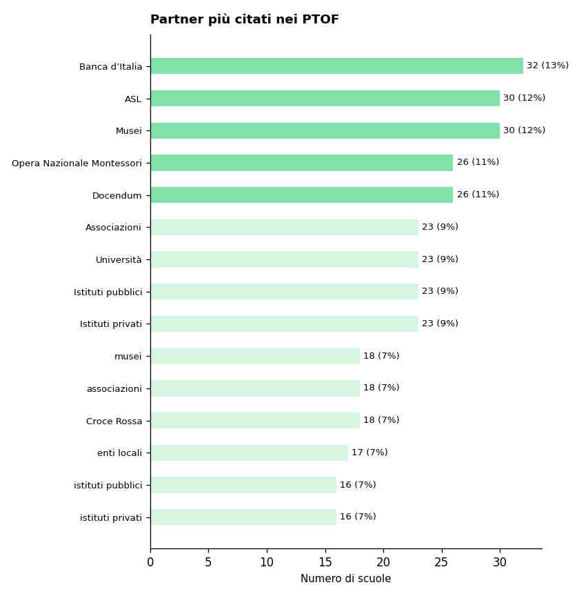
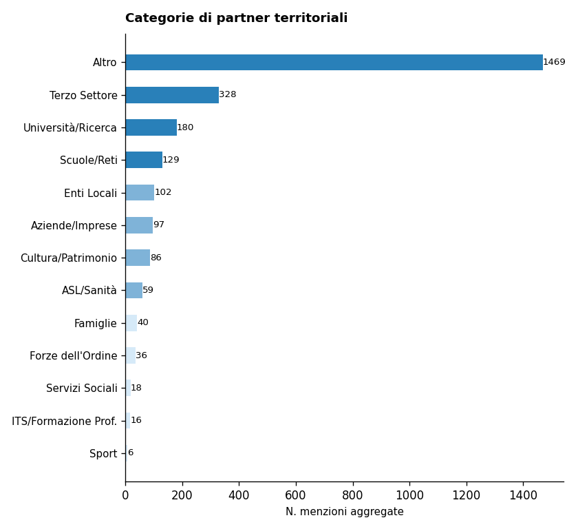
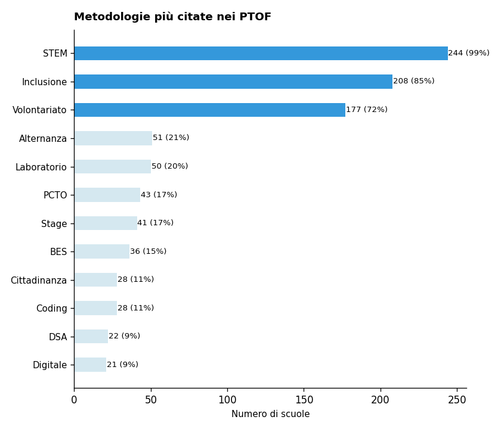

# Report di Sintesi sull'Orientamento nei PTOF — I Grado

*Target Analisi: I Grado*
*Generato con: openrouter / minimax/minimax-m2.5*

## Premessa: Cosa Misuriamo e Perché
Questo report analizza i PTOF (Piani Triennali dell'Offerta Formativa) delle scuole italiane per misurarne la copertura informativa in tema di orientamento: quanto e come il documento descrive le pratiche, i progetti e le strategie che la scuola adotta per orientare gli studenti.

È importante chiarire fin da subito un principio fondamentale: i punteggi che seguono non esprimono un giudizio sulla qualità della scuola, ma sulla ricchezza e completezza della documentazione contenuta nel PTOF. Una scuola con un punteggio basso potrebbe svolgere attività di orientamento senza averle descritte nel proprio piano; viceversa, un punteggio alto indica che il PTOF documenta in modo dettagliato e strutturato le proprie pratiche orientative.
## Come Funziona l'Analisi
L'analisi automatizzata interpreta il testo del PTOF su due livelli complementari.

1. Analisi Strutturale (Compliance): Il sistema verifica la conformità formale rispetto alle Linee Guida per l'orientamento scolastico stabilite dal D.M. 328/2022, il decreto ministeriale che ha introdotto l'obbligo per ogni scuola di dedicare almeno 30 ore annuali a moduli di orientamento formativo e di individuare figure dedicate (tutor e docente orientatore). In concreto, si verifica se il PTOF contiene una sezione esplicitamente dedicata all'orientamento, valutandone la visibilità e la struttura nel documento.

2. Analisi Semantica e di Contenuto: Attraverso modelli linguistici avanzati (LLM), il sistema estrae informazioni sulla copertura delle 6 dimensioni del framework di valutazione (descritte nella sezione successiva). In questa fase, vengono distinte le semplici dichiarazioni di intenti dalle azioni concrete, mappando la presenza di progetti, risorse, tempi e responsabilità. L'algoritmo rileva il contesto in cui appaiono i termini: ad esempio, distingue se l'orientamento è citato in una lista generica oppure se è descritto attraverso laboratori con obiettivi specifici e modalità di verifica.
## Le 6 Dimensioni del Framework di Valutazione

L'analisi semantica valuta la copertura del PTOF attraverso **6 dimensioni**. Ognuna rappresenta un aspetto fondamentale dell'orientamento scolastico: dalla struttura organizzativa alle finalità educative, dalle metodologie didattiche alle opportunità offerte agli studenti. Di seguito, ciascuna dimensione è descritta con i propri sotto-indicatori.

### Dimensione Strutturale e di Contesto
Valuta se l'orientamento ha una collocazione riconoscibile all'interno del PTOF e se la scuola è inserita in un tessuto di relazioni territoriali.
- **Sezione dedicata**: Presenza di un capitolo o paragrafo esplicitamente intitolato all'orientamento, non frammentato tra diverse parti del documento.
- **Partnership e reti territoriali**: Qualità del coinvolgimento di soggetti esterni (Università, ITS, imprese, Terzo Settore), con attenzione ad attività congiunte e accordi formali.

### Finalità dell'Orientamento
Analizza gli obiettivi formativi che la scuola si pone attraverso le attività di orientamento.
- **Attitudini e Talenti**: Azioni per aiutare gli studenti a scoprire i propri punti di forza e inclinazioni personali.
- **Interessi Professionali**: Percorsi di esplorazione degli ambiti disciplinari e del mondo del lavoro.
- **Progetto di Vita**: Supporto alla costruzione di una traiettoria personale di lungo termine.
- **Transizioni Formative**: Accompagnamento nei passaggi critici tra cicli scolastici (primaria-secondaria, secondaria-università/lavoro).
- **Capacità Orientativa (Empowerment)**: Sviluppo di competenze trasversali che rendano lo studente autonomo nelle proprie scelte.

### Obiettivi di Incidenza
Misura l'attenzione del PTOF verso gli impatti sociali dell'orientamento.
- **Contrasto alla Dispersione**: Strategie di prevenzione dell'abbandono scolastico e iniziative di rimotivazione.
- **Riduzione dei NEET**: Azioni di collegamento scuola-lavoro per favorire l'occupabilità e contrastare il fenomeno dei giovani che non studiano né lavorano.
- **Continuità Territoriale**: Costruzione di ponti tra i diversi gradi di istruzione presenti sul territorio.
- **Lifelong Learning**: Concezione dell'orientamento come competenza permanente, utile per tutta la vita.

### Governance e Organizzazione
Esamina il modello organizzativo interno: chi fa cosa e come si coordina l'azione orientativa.
- **Coordinamento**: Presenza di figure dedicate come Funzioni Strumentali, referenti o commissioni per l'orientamento.
- **Dialogo Interno**: Coinvolgimento dei Consigli di Classe e dei docenti nella progettazione orientativa.
- **Alleanza con le Famiglie**: Iniziative strutturate di comunicazione e collaborazione con i genitori.
- **Monitoraggio**: Utilizzo di strumenti di feedback, questionari e dati per valutare l'efficacia delle azioni.
- **Inclusione**: Attenzione specifica a studenti con BES/DSA, studenti stranieri e situazioni di fragilità.

### Didattica Orientativa
Valuta il passaggio dalle dichiarazioni di principio alle pratiche concrete in aula.
- **Didattica Laboratoriale ed Esperienziale**: Attività basate sul *learning by doing* e sull'apprendimento attivo.
- **Centralità dello Studente**: Ruolo attivo degli studenti nella co-progettazione dei percorsi orientativi.
- **Interdisciplinarità**: Integrazione dell'orientamento nelle diverse discipline curricolari, non solo come attività aggiuntiva.
- **Flessibilità Organizzativa**: Adattamento di spazi, tempi e gruppi per favorire esperienze orientative efficaci.

### Opportunità Formative
Mappa l'ecosistema delle proposte extracurricolari e integrative offerte dalla scuola.
- **Attività Culturali e Artistiche**: Progetti di teatro, musica, scrittura creativa, visite a musei.
- **Laboratori Espressivi**: Percorsi manuali, artigianali o digitali che favoriscono la scoperta di talenti.
- **Sport e Attività Ricreative**: Offerta sportiva e ludica come strumento di socializzazione e benessere.
- **Volontariato e Service Learning**: Esperienze di impegno civico che collegano apprendimento e comunità.

## Dal Qualitativo al Quantitativo: la Scala di Punteggio
Ciascuna delle 6 dimensioni appena descritte viene valutata attraverso una scala di copertura informativa su 7, detta scala di copertura informativa. Si tratta di una scala ordinale di tipo Likert — uno strumento consolidato nella ricerca sociale che consente di tradurre valutazioni qualitative in punteggi confrontabili.

Il punteggio riflette il livello di dettaglio con cui il PTOF documenta le pratiche orientative per quella dimensione: da 1 (nessun riferimento) a 7 (documentazione sistematica con evidenze di miglioramento continuo). La tabella seguente descrive ogni livello.

\begin{tabularx}{\textwidth}{@{} c l X @{}}
\toprule
\textbf{Punti} & \textbf{Livello} & \textbf{Cosa significa} \\
\midrule
1 & Assente & Nessun riferimento all'orientamento nel documento. \\
2 & Traccia minima & Menzione vaga o copia-incolla di testo normativo, senza personalizzazione. \\
3 & Copertura parziale & Intenzione dichiarata, ma senza dettagli su come viene attuata. \\
4 & Copertura di base & Azioni descritte in modo chiaro ma essenziale, senza approfondimento. \\
5 & Copertura strutturata & Azioni dettagliate con metodologie esplicitate e risorse indicate. \\
6 & Copertura approfondita & Azioni integrate nel curricolo, con indicatori di monitoraggio documentati. \\
7 & Copertura esaustiva & Documentazione sistematica e ciclica, con evidenze di revisione e miglioramento. \\
\bottomrule
\end{tabularx}
## L'Indice Sintetico: IIPO
Per avere una visione d'insieme della copertura documentale di ciascuna scuola, i punteggi delle 6 dimensioni vengono riassunti in un unico indicatore: l'IIPO (Indice di Documentazione delle Pratiche di Orientamento).

L'IIPO è calcolato come media aritmetica semplice dei punteggi delle 6 dimensioni (Strutturale, Finalità, Obiettivi, Governance, Didattica, Opportunità). Si è scelta una media non pesata per evitare di privilegiare a priori una dimensione rispetto alle altre, trattandole tutte come ugualmente rilevanti.

Come leggere l'IIPO:
- Un IIPO di 5.0 indica che, in media, il PTOF documenta le pratiche orientative a un livello di Copertura strutturata su tutte le dimensioni.
- Un IIPO di 3.0 segnala una documentazione complessivamente a livello di Copertura parziale.

Limiti da tenere presenti:
- *Effetto compensazione*: Essendo una media, l'IIPO può mascherare squilibri tra le dimensioni. Ad esempio, una scuola con punteggio 7 su Didattica e 1 su Governance otterrebbe un IIPO apparentemente nella norma. Per questo motivo, l'IIPO va sempre letto insieme ai punteggi delle singole dimensioni.
- *Sensibilità incrementale*: La scala a 7 livelli consente di cogliere differenze graduali tra scuole, evitando la polarizzazione tipica delle scale più strette (es. 1-3).
## Approccio Analitico: Raggruppamento per Affinità

Oltre all'analisi dimensionale, il report utilizza una tecnica di **raggruppamento automatico** (clustering) per evitare di appiattire i risultati su una semplice media nazionale.

Il funzionamento è il seguente: il sistema analizza i profili di punteggio di tutte le scuole e individua **gruppi di istituti** che presentano caratteristiche documentali simili. Nel campione corrente sono stati identificati **5 gruppi omogenei** — ad esempio, un gruppo potrebbe riunire scuole con forte attenzione ai PCTO e alle partnership territoriali, mentre un altro potrebbe raccogliere istituti che privilegiano la didattica laboratoriale.

Per ciascun gruppo viene generata una **sintesi tematica** che descrive l'approccio dominante su ogni dimensione. Queste sintesi intermedie vengono poi integrate nel report finale, permettendo di confrontare i diversi "profili di orientamento" e di evidenziare sia le tendenze comuni sia le eccezioni virtuose.

## Analisi e Copertura del Campione (I Grado)
Questa sezione descrive la composizione del campione analizzato e ne valuta la rappresentatività rispetto all'universo delle scuole italiane. Comprendere la struttura del campione è essenziale per interpretare correttamente i risultati: un campione ben bilanciato consente di generalizzare le osservazioni; un campione sbilanciato richiede cautela nell'estendere le conclusioni a tutto il sistema scolastico.

Per ogni dimensione di confronto (gestione, area geografica, contesto territoriale) la tabella riporta tre valori:
- Osservato %: la percentuale nel nostro campione.
- Atteso % (MIUR): la percentuale nell'universo reale delle scuole italiane, ricavata dai dati ministeriali.
- Deviazione (pp): la differenza tra osservato e atteso, espressa in *punti percentuali*. Deviazioni entro ±5 pp sono trascurabili; tra 5 e 15 pp segnalano un lieve squilibrio; oltre 15 pp indicano una sovra- o sotto-rappresentazione significativa.

Statistiche Generali

- Scuole Analizzate: 246 PTOF di scuole I Grado
- Province Coperte: 84 (su 107 totali)
- Regioni Coperte: 18/20

Il campione copre la quasi totalità delle regioni italiane, garantendo una visione nazionale.

Bilanciamento Gestione (Statale vs Paritaria)

In Italia, le scuole statali rappresentano la grande maggioranza degli istituti. Un campione rappresentativo dovrebbe riflettere questa proporzione. Una sovra-rappresentazione delle paritarie, ad esempio, potrebbe influenzare i risultati perché i PTOF delle scuole paritarie tendono ad avere strutture e contenuti diversi da quelli delle statali.

\begin{tabularx}{\textwidth}{@{} p{3cm} c c c @{}}
\toprule
\textbf{Tipo} & \textbf{Osservato \%} & \textbf{Atteso \% (MIUR)} & \textbf{Deviazione} \\
\midrule
Statale & 76.0\% & 92.0\% & -16.0 pp \\
Paritaria & 24.0\% & 8.0\% & +16.0 pp \\
\bottomrule
\end{tabularx}

Distribuzione Geografica per Macro-Area

L'Italia presenta significative differenze territoriali nell'offerta formativa. Per valutare se il campione rispecchia la distribuzione reale delle scuole, confrontiamo le cinque macro-aree geografiche (Nord Ovest, Nord Est, Centro, Sud, Isole) con i dati MIUR. Una buona rappresentatività geografica è fondamentale perché le pratiche di orientamento possono variare sensibilmente tra Nord e Sud, tra aree urbane e rurali.

\begin{tabularx}{\textwidth}{@{} X c c c @{}}
\toprule
\textbf{Area} & \textbf{Osservato \%} & \textbf{Atteso \% (MIUR)} & \textbf{Deviazione} \\
\midrule
Nord Ovest & 15.9\% & 26.6\% & -10.7 pp \\
Nord Est & 18.3\% & 19.3\% & -1.0 pp \\
Centro & 27.6\% & 19.9\% & +7.7 pp \\
Sud & 29.3\% & 23.3\% & +6.0 pp \\
Isole & 8.9\% & 10.9\% & -2.0 pp \\
\bottomrule
\end{tabularx}

⚠️ Campione con Lievi Disallineamenti: Si notano alcune sovra/sottorappresentazioni geografiche, che tuttavia non invalidano l'analisi complessiva (deviazione max < 15 pp).

Distribuzione Territoriale (Aree Metropolitane vs Non Metropolitane)

Le scuole situate nelle 14 città metropolitane italiane operano in contesti diversi rispetto a quelle di provincia: maggiore offerta formativa esterna, più partnership con università e imprese, ma anche maggiore competizione tra istituti. Questa distinzione aiuta a capire se i risultati del report sono influenzati da una prevalenza di scuole urbane o rurali nel campione.

\begin{tabularx}{\textwidth}{@{} X c c c @{}}
\toprule
\textbf{Area} & \textbf{Osservato \%} & \textbf{Atteso \% (Stima)} & \textbf{Deviazione} \\
\midrule
Metropolitane & 38.6\% & 33.0\% & +5.6 pp \\
Non Metropolitane & 61.4\% & 67.0\% & -5.6 pp \\
\bottomrule
\end{tabularx}

Implicazioni per la Lettura del Report

Il campione di 246 scuole di I grado presenta una copertura territoriale ampia, con 84 province e 18 regioni rappresentate, il che conferisce una solidità geografica apprezzabile. Tuttavia, la composizione del campione diverge significativamente dalla struttura del sistema scolastico italiano su almeno tre assi principali, e queste deviazioni impongono una lettura attenta dei risultati.

Il bias più marcato riguarda la tipologia di istituto: le scuole paritarie risultano sovrarappresentate di 16 punti percentuali rispetto alla loro incidenza reale nel sistema (24% osservato contro 8% atteso). Poiché le paritarie tendono a operare in contesti socio-economici specifici e con risorse organizzative differenti, le sezioni relative alla governance e alle opportunità formative potrebbero riflettere pratiche non immediatamente trasferibili alla maggioranza delle scuole statali. Il lettore dovrebbe pertanto considerare che i punteggi medi sull'integrazione dei servizi e sulle attività opzionali potrebbero essere influenzati da caratteristiche proprie del segmento paritario.

Sul piano geografico, il Nord Ovest risulta sottorappresentato di quasi 11 punti percentuali, mentre il Centro e il Sud appaiono sovrastimati rispettivamente di 7.7 e 6 punti. Poiché le scuole settentrionali presentano tipicamente condizioni strutturali e risorse diverse da quelle meridionali, le analisi sulla didattica orientativa e sulle pratiche di contrasto alla dispersione potrebbero sottostimare o sovrastimare alcune dinamiche. Inoltre, le aree metropolitane sono sovrastimate di 5.6 punti, il che significa che il report cattura con maggiore intensità l'esperienza delle scuole urbane.

In sintesi, i risultati del report offrono un quadro dettagliato delle pratiche di orientamento documentate nei PTOF analizzati, ma la generalizzazione all'intero sistema scolastico italiano richiede cautela. Il campione rappresenta adeguatamente la variabilità regionale e tipologica del sistema, pur essendo sistematicamente sbilanciato verso le scuole paritarie, le aree metropolitane e il Centro-Sud. Le sezioni più influenzate da questi bias — in particolare la governance, le opportunità formative e il contrasto ai NEET — andrebbero interpretate come indicative di pratiche emergenti in contesti specifici, più che come specchio della media nazionale. Per una lettura corretta, è opportuno considerare i punteggi come indicatori di tendenza piuttosto che come misure esatte della realtà complessiva.

\newpage
## Sintesi Quantitativa: Le Dimensioni dell'Orientamento
Di seguito il dettaglio dei punteggi medi rilevati per le dimensioni e i relativi sotto-indicatori.

Dimensione Strutturale (Compliance)

Media: 2.39 (dev.std: 1.67)

Finalità dell'Orientamento

| Indicatore | Media | Dev. Std. |
|----------------|-----------|---------------|
| Totale Dimensione | 3.51 | 1.09 |
| Attitudini e Talenti | 3.65 | 1.13 |
| Interessi Professionali | 3.67 | 1.16 |
| Progetto di Vita | 3.38 | 1.32 |
| Transizioni Formative | 3.56 | 1.24 |
| Capacità Orientative | 3.24 | 1.41 |

Obiettivi di Incidenza

| Indicatore | Media | Dev. Std. |
|----------------|-----------|---------------|
| Totale Dimensione | 3.10 | 1.11 |
| Contrasto Dispersione | 2.80 | 1.56 |
| Continuità Territorio | 3.55 | 1.25 |
| Riduzione NEET | 2.04 | 1.35 |
| Lifelong Learning | 3.26 | 1.35 |

Governance e Organizzazione

| Indicatore | Media | Dev. Std. |
|----------------|-----------|---------------|
| Totale Dimensione | 3.61 | 1.05 |
| Coordinamento | 3.50 | 1.24 |
| Dialogo Interno | 3.57 | 1.22 |
| Alleanza Famiglie | 4.05 | 1.10 |
| Monitoraggio | 2.79 | 1.43 |
| Inclusione | 3.92 | 1.20 |

Didattica Orientativa

| Indicatore | Media | Dev. Std. |
|----------------|-----------|---------------|
| Totale Dimensione | 3.62 | 1.01 |
| Centralità Studente | 3.85 | 1.21 |
| Didattica Laboratoriale | 3.52 | 1.31 |
| Flessibilità | 3.32 | 1.30 |
| Interdisciplinarità | 3.72 | 1.10 |

Opportunità Formative

| Indicatore | Media | Dev. Std. |
|----------------|-----------|---------------|
| Totale Dimensione | 3.07 | 1.11 |
| Attività Culturali | 3.09 | 1.39 |
| Laboratori Espressivi | 3.83 | 1.31 |
| Attività Ricreative | 2.63 | 1.22 |
| Volontariato | 2.45 | 1.40 |
| Sport | 3.07 | 1.38 |

*Legenda Copertura Informativa: Copertura esaustiva (6-7), Copertura approfondita (5-5.9), Copertura strutturata (4-4.9), Copertura di base (3-3.9), Copertura parziale (2-2.9), Traccia minima (1-1.9), Assente (0)*

Panoramica Grafica dei Sotto-Indicatori

\noindent
\begin{minipage}[t]{0.32\textwidth}
\centering
\includegraphics[width=\textwidth]{images/bar_finalita_dellorientamento_compact_20260215_204823.png}
\end{minipage}
\hfill
\begin{minipage}[t]{0.32\textwidth}
\centering
\includegraphics[width=\textwidth]{images/bar_obiettivi_di_incidenza_compact_20260215_204823.png}
\end{minipage}
\hfill
\begin{minipage}[t]{0.32\textwidth}
\centering
\includegraphics[width=\textwidth]{images/bar_governance_e_organizzazione_compact_20260215_204824.png}
\end{minipage}

\vspace{0.5cm}

\noindent\hfill
\begin{minipage}[t]{0.32\textwidth}
\centering
\includegraphics[width=\textwidth]{images/bar_didattica_orientativa_compact_20260215_204824.png}
\end{minipage}
\hfill
\begin{minipage}[t]{0.32\textwidth}
\centering
\includegraphics[width=\textwidth]{images/bar_opportunita_formative_compact_20260215_204824.png}
\end{minipage}
\hfill

Panoramica dei Risultati Quantitativi

L'analisi dei punteggi aggregati rivela un panorama articolato in cui la dimensione strutturale, relativa all'allineamento normativo con il DM 328/2022, emerge come l'elemento più critico con un punteggio medio di 2.39 su 7, collocandosi nella fascia di Traccia minima. Questo dato segnala che la maggioranza delle scuole di I grado nel campione presenta riferimenti normativi generici o privi di operazionalizzazione concreta, configurandosi più come adempimento formale che come reale progettazione orientativa. Al contempo, le dimensioni di Didattica Orientativa (3.62 su 7) e Governance (3.61 su 7) si posizionano su livelli di Copertura di base, indicando che il corpo docente e i team di coordinamento hanno sviluppato pratiche più radicate rispetto alla cornice normativa. Il divario di oltre un punto tra struttura e didattica suggerisce un fenomeno di "orientamento dal basso": le scuole agiscono sulla base di sensibilità professionali interne piuttosto che di un quadro programmatico esplicito, condizione che potrebbe compromettere la continuità e la sistematicità degli interventi nel tempo.

L'esame della distribuzione interna alle dimensioni mette in luce alcune deviazioni significative rispetto alle medie aggregate. In particolare, l'alleanza scuola-famiglie raggiunge un punteggio di 4.05 su 7, risultando l'unico indicatore a superare la soglia di 4 e configurandosi come punto di forza strutturale delle scuole di I grado, verosimilmente per la maggiore prossimità con le famiglie degli studenti in età preadolescenziale. Analogamente, la centralità dello studente (3.85 su 7) e i laboratori espressivi (3.83 su 7) si discostano positivamente dalle rispettive medie dimensionali. All'estremo opposto, la riduzione dei NEET (2.04 su 7) e il volontariato (2.45 su 7) evidenziano lacune rilevanti: il primo riflette la distanza dell'orientamento di I grado dal problema della dispersione post-obbligo, tipicamente affrontato nelle secondarie di secondo grado, mentre il secondo indica una limitata integrazione di esperienze di cittadinanza attiva nel percorso orientativo. Il monitoraggio delle azioni (2.79 su 7) conferma la fragilità della dimensione valutativa, già evidenziata dalla bassa copertura strutturale.

I punteggi che meritano approfondimento qualitativo nelle sezioni successive riguardano principalmente le ragioni della forbice tra allineamento normativo e pratiche operative, analizzando se i PTOF riescano a tradurre le intenzioni in indicatori verificabili. Risulta altresì essenziale comprendere quali fattori contestuali — inclusa la sovrarappresentazione delle scuole paritarie nel campione — possano aver influenzato il punteggio elevato dell'alleanza con le famiglie, e se questo pattern si confermi anche nelle scuole statali. Infine, la sezione tematica dovrà chiarire se la debolezza documentata sul contrasto ai NEET derivi da una effettiva assenza di azioni o piuttosto da una collocazione dell'orientamento in una fase del percorso scolastico che non rende immediatamente visibile tale finalità.
## Profili dei Cluster e Differenze
L'analisi automatica ha identificato 5 cluster che raccolgono complessivamente 246 scuole di primo grado. Questa segmentazione permette di riconoscere diverse modalità con cui le scuole documentano l'orientamento nei propri PTOF, evidenziando sia similarità nelle problematiche sia divergenze nelle strategie adottate.

Il Cluster 0 comprende 67 scuole e si caratterizza per un approccio prevalentemente integrato all'orientamento, ossia diffuso in diverse sezioni del documento piuttosto che raccolto in una parte specifica. Le scuole menzionano l'orientamento in relazione agli obiettivi formativi e al miglioramento scolastico, evidenziando una consapevolezza dell'importanza del tema ma senza una formalizzazione strutturata. Le lacune emergenti riguardano l'implementazione di sistemi di monitoraggio orientati alla valutazione degli apprendimenti e al benessere studentesco. Il bilancio sintetico indica una focalizzazione sul miglioramento continuo dell'offerta formativa e sullo sviluppo di competenze, con attenzione alla transizione tra gradi di istruzione, pur trattando l'orientamento limitatamente alla fase di uscita e alla comunicazione di consigli alle famiglie.

Il Cluster 1 raccoglie 21 scuole e si distingue per l'assenza di un approccio strutturato all'orientamento, con la maggior parte degli istituti che non presenta una sezione dedicata. L'orientamento rimane implicito nel curricolo o ridotto a dichiarazioni di intenti, mancando di un piano d'azione definito. Le lacune si concentrano sul monitoraggio del benessere psico-fisico degli studenti e sulla supervisione del personale, con particolare attenzione all'ambientamento dei nuovi iscritti. Il bilancio evidenzia un'ottimizzazione dell'accoglienza e sullo sviluppo di competenze di base nella prima infanzia, con iniziative laboratoriali e progetti di transizione dalla scuola dell'infanzia alla primaria, trascurando una preparazione esplicita all'orientamento.

Il Cluster 2 include 12 scuole e si caratterizza per un approccio implicito e frammentato, dove l'orientamento viene menzionato all'interno di sezioni più ampie come l'offerta formativa o i PCTO, senza una sezione dedicata. Le lacune principali riguardano la carenza di strategie di implementazione concrete e sistemi di monitoraggio efficaci, con molte scuole che si limitano ad affermare l'importanza dell'orientamento senza specificare come tradurlo in azioni. Il bilancio evidenzia una declinazione dell'orientamento quasi esclusivamente attraverso le attività di alternanza scuola-lavoro, con una prevalenza di interventi focalizzati sulla formazione dei docenti.

Il Cluster 3 conta 19 scuole e si caratterizza per un approccio frammentario e non strutturato, senza una sezione autonoma per l'orientamento. Le lacune si concentrano sulla mancanza di strutturazione specifica, con riferimenti generici a continuità e strategie di orientamento senza una definizione chiara di obiettivi, azioni concrete o indicatori di monitoraggio. Il bilancio sintetico rivela una forte focalizzazione sull'Alternanza Scuola Lavoro come principale strumento di orientamento, a scapito di una pianificazione strategica più ampia e strutturata.

Il Cluster 4, il più numeroso con 125 scuole, presenta un approccio integrato ma frammentato, dove l'orientamento permea diverse sezioni del PTOF senza costituire un pilastro strategico autonomo. Le lacune si concentrano sul monitoraggio dei risultati degli alunni e delle competenze dei docenti, con interventi mirati all'individuazione di aree di miglioramento attraverso la raccolta di dati. Il bilancio evidenzia un'attenzione all'ampliamento dell'offerta formativa attraverso progetti specifici e collaborazioni esterne, con focus sulla prevenzione, lo sviluppo di competenze trasversali e l'inclusione.

L'analisi comparativa evidenzia una convergenza tra i cluster: la tendenza prevalente a trattare l'orientamento in modo integrato o marginale, senza dedicargli una sezione autonoma e strategica nel PTOF. Tuttavia, emergono divergenze significative nella natura delle lacune e nei focus tematici. Alcuni cluster (0, 1, 4) mostrano attenzione ai sistemi di monitoraggio, mentre altri (2, 3) evidenziano carenze nella definizione di strategie concrete. Il Cluster 1 si distingue per il focus sull'accoglienza e la prima infanzia, distinguendosi dagli altri gruppi che trattano l'orientamento prevalentemente in chiave di transizione secondaria-superiore o di preparazione al mondo del lavoro. Il Cluster 4, pur essendo il più numeroso, non si differenzia strutturalmente dagli altri nella misura in cui i suoi indicatori non raggiungono livelli di copertura particolarmente elevati, suggerendo che la mera presenza di documentazione non equivale a una pianificazione efficace.
## Commento di Sintesi Generale
L'Indice di Documentazione Pratiche Orientamento calcolato sulle 244 scuole di I grado analizzate si attesta a un valore medio di 3.43 su 7, posizionandosi nella fascia intermedia della scala di copertura informativa. Questo dato aggregato rivela un quadro complessivo in cui l'orientamento scolastico è riconosciuto come tema rilevante dai documenti programmatici, ma non risulta ancora pienamente strutturato come area strategica autonoma all'interno dei PTOF.

L'analisi delle singole dimensioni evidenzia un profilo relativamente omogeneo, con due dimensioni leggermente più sviluppate rispetto alle altre. La didattica orientativa e la governance scolastica registrano rispettivamente medie di 3.62 e 3.61, indicando un'attenzione discretamente presente alla dimensione laboratoriale e alle modalità organizzative dell'orientamento. Le finalità si collocano a 3.51, seguite dagli obiettivi a 3.10 e dalle opportunità formative a 3.07. Quest'ultimo dato merita particolare attenzione poiché segnala una minore ricchezza documentale riguardo alle attività opzionali, culturali, ludiche e di volontariato che pure concorrono al percorso orientativo degli studenti.

La variabilità osservata, misurata attraverso le deviazioni standard che oscillano tra 1.01 e 1.11, risulta contenuta rispetto all'ampiezza della scala. Questo suggerisce che le scuole del campione tendono a raggrupparsi intorno a un livello comune di documentazione, con scostamenti moderati dalla media. Non si rilevano pertanto polarizzazioni significative tra istituti con documentazione molto sviluppata e altri pressoché privi di riferimenti, ma piuttosto una concentrazione nella fascia medio-bassa della scala.

L'esame delle sintesi per cluster rivela una tendenza trasversale: la stragrande maggioranza delle scuole non dedica una sezione autonoma all'orientamento nel proprio PTOF, integrando invece i riferimenti all'interno di capitoli più ampi quali l'offerta formativa, il piano di miglioramento o le attività di inclusione. Il Cluster 0, che comprende 67 istituti, mostra un approccio definibile come "integrato", dove l'orientamento emerge in modo diffuso ma non formalizzato. Il Cluster 4, il più numeroso con 125 scuole, conferma questa tendenza alla frammentazione, pur rilevando eccezioni isolate come la scuola Paritaria Casa Degli Angeli Custodi (PT1E00300A) in Toscana che presenta una sezione specifica sulle competenze orientative [CODICE DUBBIO]. I Cluster 1, 2 e 3, pur con sfumature diverse, confermano il medesimo pattern: una consapevolezza dell'importanza dell'orientamento non accompagnata da una strutturazione organica nel documento strategico.

Le evidenze testuali estratte dai PTOF mostrano che, quando l'orientamento viene menzionato, l'accento ricade frequentemente sulla dimensione geografica dell'orientamento spaziale nel curricolo di geografia, con descrizioni dettagliate delle competenze relative all'uso delle carte e dei punti cardinali. Questa accezione, pur legittima nel contesto delle competenze disciplinari, si sovrappone solo in parte al significato più ampio di orientamento come processo di accompagnamento alla transizione formativa e professionale. In alcuni casi, come nell'istituto I.I.S."De Sarlo-De Lorenzo" Lagonegro (PZIS001007) in Basilicata o nella scuola I.I.S. "A.M.Jaci - Caio Duilio (METD03751E) in Sicilia, emergono riferimenti più articolati che comprendono orientamento in entrata, in itinere e in uscita, con attività di sportello, open day e laboratori orientanti.

Il dato sulla governance, tra i più elevati del framework, trova riscontro nella presenza di riferimenti a figure di riferimento per l'orientamento e a coordinamenti di area, sebbene il dettaglio delle azioni di monitoraggio risulti spesso limitato. La coerenza tra dichiarazioni di intento e azioni documentate appare disomogenea: se da un lato molte scuole dichiarano l'orientamento come obiettivo strategico, dall'altro la specificazione delle modalità attuative, dei tempi, delle risorse e degli indicatori di valutazione rimane frequentemente generica o assente.

I bias segnalati nel campione, con una sovrarappresentazione delle scuole paritarie e una leggera sottocopertura del Nord Ovest rispetto al Centro e al Sud, invitano a una cautela interpretativa nella generalizzazione dei risultati. Tuttavia, il pattern emergente appare sufficientemente robusto da caratterizzare una tendenza di fondo nel sistema delle scuole secondarie di primo grado italiane.

Nelle sezioni successive verranno analizzate nel dettaglio le singole dimensioni del framework, esplorando le specificità delle finalità orientative dichiarate, la natura degli obiettivi dichiarati, le modalità organizzative adottate e l'articolazione dell'offerta formativa orientativa. L'obiettivo è comprendere non solo quanto l'orientamento sia documentato, ma anche come e con quale profondità progettuale, al fine di restituire un quadro utile tanto alla ricerca quanto alle politiche educative territoriali.
## Allineamento Normativo e Approccio Innovativo
Recepimento Normativo nell'Orientamento Scolastico

Il Punteggio di Allineamento e la Distanza Norma-Pratica

Il punteggio medio di allineamento normativo si attesta a 2.39 su scala Likert 1-7, con una deviazione standard di 1.67 che indica una variabilità significativa tra le scuole. Questo valore posiziona il campione tra la traccia minima (citazione vagamente indicata nel documento) e la copertura parziale (intenzione dichiarata senza dettagli attuativi). La distanza tra l'impianto normativo vigente — caratterizzato da indicazioni precise sulle 30 ore annue, sui ruoli di tutor e orientatore, e sulle modalità di monitoraggio — e la pratica documentata nei PTOF risulta pertanto sostanziale.

La metà delle scuole analizzate (cluster 3 e 4) mostra un recepimento che si colloca nei livelli più bassi della scala, segnalando non tanto un rifiuto delle indicazioni ministeriali quanto piuttosto una difficoltà nel tradurre i principi normativi in strutture documentali riconoscibili. Il punteggio medio di coordinamento dei servizi (3.5 su 7) risulta paradossalmente superiore a quello di allineamento normativo, suggerendo che le scuole implementano attività orientative anche in assenza di un explicit riferimento al quadro regolatorio.

Recepimento Formale e Sostanziale: Due Livelli Distinti

L'analisi dei cluster rivela una distinzione netta tra il recepimento formale — la mera menzione della norma nel documento — e quello sostanziale, ovvero la traduzione dei principi in azioni coerenti e documentabili. Il Cluster 4 (125 scuole) rappresenta il gruppo più strutturato: la scuola 2 I.C. Ravarino (MOIC84900D) (Emilia-Romagna) esplicitamente richiama il D.M. 328/2022 nell'implementazione dei moduli curricolari di orientamento, configurando un caso di recepimento sia formale sia sostanziale. Analogamente, I.S.I.S. "D'Este-Caracciolo (NARC118016) (Campania) articola un ciclo completo di 4 moduli orientativi con supporto di tutor interni ed esterni, dimostrando una declinazione operativa dei dettami normativi.

Tuttavia, nei restanti cluster la situazione appare più articolata. Il Cluster 2 (12 scuole) presenta casi intermedi: la scuola Scuola Piccolo Uomo (RM1ES55005) (Lazio) e Ente Religioso Compassioniste Serve Di Maria (NA1E114004) (Campania) integrano moduli di orientamento formativo di almeno 30 ore nelle classi terze, quarte e quinte, ma senza un riferimento esplicito al quadro normativo. Questi istituti mostrano un recepimento sostanziale privo di ancoraggio formale, evidenziando che la prassi può precedere o ignorare la codificazione documentale. Il Cluster 3 (19 scuole) rappresenta il caso opposto: 17 scuole su 19 integrano l'orientamento come sottosezione all'interno dell'Offerta Formativa, senza uno spazio autonomo che le Linee Guida MIM sembrerebbero richiedere, configurando un caso di recepimento formale debole e sostanziale marginale.

Figure del Tutor e dell'Orientatore: Menzione versus Operatività

La presenza delle figure professionali previste dalla normativa emerge in modo disomogeneo. Le sintesi dei cluster indicano che il ruolo di tutor e orientatore viene raramente esplicitato come figura dedicata nella scuola secondaria di primo grado. La scuola Barbara Melzi (MIRFHT500U) (Lombardia) — pur essendo un istituto comprensivo con sezioni di secondaria di primo grado — documenta "colloqui personali per gli studenti su appuntamento con il proprio Tutor di classe" e percorsi di riflessione personale guidati dai docenti di Formazione Umana, configurando una declinazione del tutoraggio più implicita che esplicita. L'istituto Edoardo Agnelli (TOPS04500E) (Piemonte) prevede moduli di orientamento formativo integrati nei curricoli per le classi terze, quarte e quinte, ma non vengono descritte le figure professionali coinvolte nella loro attuazione.

Nel complesso, prevale una configurazione in cui le funzioni orientative sono diffuse tra i docenti curricolari piuttosto che assegnate a figure specifiche. Questa opzione, pur coerente con un approccio trasversale all'orientamento, si discosta dalle indicazioni del D.M. 328/2022 che prevedono l'identificazione di referenti per l'orientamento formativo.

I Moduli da 30 Ore: Obbligo Documentato o Opportunità Strutturata?

Il riferimento alle 30 ore annue per studente — previste dal PNRR e dal D.M. 328/2022 — emerge con frequenza variabile. Il Cluster 4 documenta una prevalenza di interventi intorno alle 30 ore annuali, con una tendenza all'integrazione di figure interne ed esterne per ampliare l'offerta. La scuola Giuseppe Gangale (KRIS00400C) (Calabria) presenta "moduli di orientamento formativo strutturati sulla base di 30 ore" come elemento esplicito della propria offerta, configurando un caso di recezione dell'obbligo normativo come opportunità formativa strutturata. Il medesimo istituto piemontese integra l'orientamento formativo nei curricoli per tre annualità consecutive (terze, quarte e quinte), configurando un percorso longitudinale piuttosto che interventi puntuali.

Tuttavia, la variabilità è marcata: alcune scuole (Cluster 2) quantificano le attività in ore senza riferirsi esplicitamente al quadro normativo, mentre altre (Cluster 1) non menzionano affatto questo elemento. La scuola Cpia "Caltanissetta-Enna (ENMM70001R) (Sicilia, I Grado) articola un percorso modulare strutturato con moduli da 4 a 8 ore ciascuno, distribuiti su classi terze, quarte e quinte, che complessivamente superano le 30 ore annuali ma senza richiamo esplicito all'investimento PNRR 1.6.

Scuole che Vanno Oltre il Minimo Normativo

L'analisi ha identificato alcune scuole che dimostrano un approccio che eccede le indicazioni minime. La scuola Barbara Melzi (MIRFHT500U) (Lombardia) propone un modello articolato che combina moduli curricolari, esperienze di alternanza (PCTO) con monte ore elevati (80-120 ore per classe), partecipazione a progetti universitari ("Operazione Carriere") e formazione su sicurezza e primo soccorso come componente orientativa. Questa configurazione integra l'orientamento in un ecosistema formativo più ampio, superando la logica del modulo isolato.

La scuola Patronato S. Gaetano (VI1E00900T) (Veneto) si distingue per l'implementazione di una "rete di incontri per genitori e stage orientanti", dimensione questa che le Linee Guida suggeriscono ma non dettagliano come requisito minimo.

Considerazioni Conclusive

Il quadro che emerge dall'analisi dei PTOF sulla scuola secondaria di primo grado rivela un recepimento normativo incompleto, dove la distanza tra norma e documentazione riflette probabilmente difficoltà organizzative più che resistenze culturali. Il punteggio di 2.39 su 7 indica una copertura informativa che si colloca nella fascia bassa della scala, confermando che la dimensione documentale rappresenta un'area di sviluppo. Le scuole che mostrano un approccio più strutturato tendono a essere quelle che hanno saputo integrare le attività orientative nel curricolo ordinario piuttosto che considerarle come appendice progettuale, suggerendo una direzione evolutiva coerente con lo spirito delle Linee Guida.
## Rapporto con il Territorio
Partner territoriali più diffusi nel campione

\begin{tabularx}{\textwidth}{@{} X l c c @{}}
\toprule
\textbf{Partner} & \textbf{Categoria} & \textbf{N. Scuole} & \textbf{\% Campione} \\
\midrule
Banca d'Italia & Altro & 32 & 13.0\% \\
ASL & ASL/Sanità & 30 & 12.2\% \\
Musei & Altro & 30 & 12.2\% \\
Opera Nazionale Montessori & Altro & 26 & 10.6\% \\
Docendum & Altro & 26 & 10.6\% \\
Associazioni & Terzo Settore & 23 & 9.3\% \\
Università & Università/Ricerca & 23 & 9.3\% \\
Istituti pubblici & Altro & 23 & 9.3\% \\
Istituti privati & Altro & 23 & 9.3\% \\
musei & Altro & 18 & 7.3\% \\
associazioni & Terzo Settore & 18 & 7.3\% \\
Croce Rossa & Terzo Settore & 18 & 7.3\% \\
enti locali & Altro & 17 & 6.9\% \\
istituti pubblici & Altro & 16 & 6.5\% \\
istituti privati & Altro & 16 & 6.5\% \\
\bottomrule
\end{tabularx}

Distribuzione per categoria di partner

L'analisi della documentazione scolastica sulle relazioni con il territorio rivela un quadro articolato, caratterizzato da una netta prevalenza di partnership di natura istituzionale e culturale rispetto a collaborazioni di carattere produttivo o professionalizzante. Il punteggio medio di 3.55 su 7 per l'obiettivo di continuità con il territorio e di 3.5 su 7 per il coordinamento dei servizi indica una copertura informativa che si colloca nella fascia intermedia tra la copertura parziale e la copertura di base, suggerendo un'attenzione al tema ancora non pienamente strutturata.

La distribuzione delle categorie di partner evidenzia un elemento di forte asimmetria: la categoria "Altro" raccoglie 1469 menzioni, un numero che da solo supera ampiamente la somma di tutte le altre voci e che tradisce una certa genericità nella categorizzazione delle collaborazioni. Il Terzo Settore si posiziona al secondo posto con 328 menzioni, seguito da Università e Ricerca con 180 menzioni e da Scuole e Reti con 129 menzioni. Questa graduatoria rivela come le scuole tendano a privilegiare relazioni con il mondo dell'associazionismo e delle istituzioni accademiche, mentre le collaborazioni con aziende e imprese risultano notevolmente sottorappresentate, attestandosi a sole 97 menzioni. Ancor più significativa appare la scarsità di rapporti con il mondo dello sport, che totalizza appena 6 menzioni, e con gli ITS e la formazione professionale, che non superano le 16 menzioni.

La fotografia dei partner più citati nei PTOF conferma questa tendenza: la Banca d'Italia compare in 32 documenti, seguita da ASL e Musei con 30 citazioni ciascuno, dall'Opera Nazionale Montessori con 26 e da Docendum con 26. Le università e le associazioni del territorio si attestano su 23 citazioni. Emerge con chiarezza come le scuole abbiano costruito reti relazionali orientate prevalentemente verso istituzioni culturali, sanitarie e accademiche, mentre il tessuto produttivo locale appare sistematicamente escluso o marginale nella pianificazione dell'offerta formativa.

L'analisi per cluster mostra una sostanziale omogeneità nell'approccio: quattro gruppi su cinque identificano nei PCTO (Percorsi per le Competenze Trasversali e per l'Orientamento) l'unica o la principale modalità di rapporto con il territorio. Il Cluster 0, che comprende 67 scuole, presenta un'impostazione leggermente più articolata, con attenzione anche alla simulazione d'impresa e alla costituzione di reti collaborative con altre istituzioni, come nel caso della scuola Torpe' - "E. D'Arborea (NUAA84104B) in Sardegna che utilizza professionisti del settore per attività di PCTO. Il Cluster 1, con 21 scuole, si distingue per un approccio prevalentemente interno, incentrato sul benessere e sulle competenze di base attraverso collaborazioni con figure professionali specifiche come pediatri e personale di cucina, come nel caso del "Laboratorio di educazione alimentare e al gusto" condiviso da diverse scuole in Sicilia, Campania e Sardegna.

La documentazione relativa ai PCTO e agli stage rivela una significativa eterogeneità nella qualità delle descrizioni. In alcuni casi, come evidenziato dalla scuola I.I.S. "S. Pertini-L. Montini-V. Cuoco (CBRA02601G) in Molise, i percorsi vengono descritti con una certa ricchezza di dettaglio, includendo "percorsi strutturati, approfondimenti, orientamento universitario, stage" destinati agli studenti delle classi terza, quarta e quinta. La scuola Benedetto Croce (PAPS100008) in Sicilia documenta una convenzione specifica con l'Università degli Studi di Palermo che prevede attività laboratoriali in sede universitaria, con una soglia minima di frequenza del 70% per l'ottenimento del certificato. Tuttavia, in numerose altre scuole, come la Lc M. Gioia (PCPC010004) in Emilia-Romagna o la I. C. Albenga Ii (SVAA815019) in Liguria, la descrizione si limita alla mera indicazione dell'offerta PCTO senza articolare specifici accordi, obiettivi formativi o modalità di attuazione.

Un elemento di particolare rilevanza riguarda l'accoglienza di studenti universitari in tirocinio: diverse scuole, come la S.Vincenzo De'Paoli (RA1M005008) in Emilia-Romagna e la I.I.S. Caduti Della Direttissima (BOTD00901G), risultano accreditate per lo svolgimento di attività di tirocinio ai sensi del D.M. 93/2012. Questa doppia funzione — orientamento in uscita per gli studenti della scuola e formazione in entrata per i futuri docenti — configura un modello di relazione con il territorio che potrebbe rappresentare una buona pratica di sistema, ma che rimane documentato in modo frammentario.

La continuità verticale, ovvero il dialogo documentato con il grado scolastico precedente e quello successivo, emerge come uno degli aspetti più deboli della documentazione. Le sintesi per cluster non riportano evidenze significative di collaborazioni strutturate con le scuole primarie o con gli istituti secondari di secondo grado. Il punteggio medio di 3.55, pur collocandosi nella fascia medio-bassa, potrebbe peraltro sovrastimare la reale consistenza delle pratiche di continuità, giacché le 129 menzioni della categoria "Scuole/Reti" potrebbero riferirsi in parte a collaborazioni orizzontali tra istituti dello stesso grado piuttosto che a veri e propri percorsi di transizione formativa.

La prevalenza di partnership con musei, ASL e istituzioni culturali suggerisce una concezione del rapporto con il territorio incentrata principalmente sulla complementarietà dell'offerta formativa in ambito educativo, sanitario e culturale, piuttosto che sull'orientamento professionale in senso stretto. La scarsa presenza di aziende e imprese nel novero dei partner, unita alla limitata documentazione di esperienze orientative strutturate, indica che il passaggio dal sistema scolastico al mondo del lavoro rimane un ambito su cui la documentazione offre copertura informativa insufficiente.

In definitiva, i PTOF delle scuole di I grado esaminate presentano una rete territoriale che, pur展示了 una discreta articolazione istituzionale, appare ancora lontana dal configurare un sistema integrato di orientamento capace di accompagnare con continuità il percorso formativo degli studenti dalla scuola primaria fino all'inserimento nel mondo del lavoro o nella formazione superiore.
## Metodologie Didattiche
Metodologie più diffuse nel campione

\begin{tabularx}{\textwidth}{@{} X c c @{}}
\toprule
\textbf{Metodologia} & \textbf{N. Scuole} & \textbf{\% Campione} \\
\midrule
STEM & 244 & 99.2\% \\
Inclusione & 208 & 84.6\% \\
Volontariato & 177 & 72.0\% \\
Alternanza & 51 & 20.7\% \\
Laboratorio & 50 & 20.3\% \\
PCTO & 43 & 17.5\% \\
Stage & 41 & 16.7\% \\
BES & 36 & 14.6\% \\
Cittadinanza & 28 & 11.4\% \\
Coding & 28 & 11.4\% \\
DSA & 22 & 8.9\% \\
Digitale & 21 & 8.5\% \\
\bottomrule
\end{tabularx}

Analisi delle Metodologie Didattiche per l'Orientamento nelle Scuole di I Grado

Quadro delle metodologie dominanti

Il quadro metodologico del campione evidenzia un panorama chiaramente sbilanciato verso alcuni approcci specifici. La metodologia STEM emerge come assolutamente prevalente, presente nel 99.2% delle scuole (244 istituti), un dato che riflette l'enfasi nazionale sulle discipline scientifiche e tecnologiche come pilastro dell'offerta formativa. A seguire, l'inclusione compare nell'84.6% dei PTOF (208 scuole), indicando una attenzione diffusa ai Bisogni Educativi Speciali, mentre il volontariato è documentato nel 72.0% dei casi (177 scuole), suggerendo una significativa apertura delle scuole verso esperienze di cittadinanza attiva.

Le metodologie più strettamente connesse all'orientamento scolastico e professionale mostrano tuttavia percentuali significativamente inferiori. L'Alternanza Scuola Lavoro compare nel 20.7% dei documenti (51 scuole), il Laboratorio nel 20.3% (50 scuole), i PCTO nel 17.5% (43 scuole) e lo Stage nel 16.7% (41 scuole). Questa distribuzione suggerisce una tensione tra l'orientamento inteso come accompagnamento alla scelta del percorso secondario superiore e l'orientamento inteso come preparazione al mondo del lavoro, quest'ultimo chiaramente minoritario nel I grado.

Integrazione curricolare versus progetti speciali

La questione dell'integrazione dell'orientamento nel curricolo quotidiano rappresenta uno degli aspetti più significativi emersi dall'analisi. I punteggi medi delle dimensioni relative alla didattica orientativa offrono una prima indicazione: il punteggio medio per la didattica laboratoriale si attesta a 3.52 su 7, mentre quello per la didattica basata sull'esperienza degli studenti raggiunge 3.85 su 7. Entrambi i valori si collocano nella fascia intermedia della scala, indicando una copertura di tipo "parziale" o al massimo "di base", dove le intenzioni sono dichiarate ma i dettagli attuativi risultano spesso carenti.

L'analisi dei cluster conferma questa frammentazione dell'approccio. Il Cluster 0 (67 scuole) mostra una forte enfasi sull'apprendimento esperienziale e laboratoriale, con scuole come la A. Manzoni L.S. Opzione Scienze Applicate (BOPSHR500B) in Emilia-Romagna che esplicitano il "potenziamento delle metodologie laboratoriali" e la I. I. S. S. "F. Patetta" - Cairo M. (SVIS00300A) in Liguria che definisce la didattica laboratoriale un "pilastro metodologico" per lo sviluppo di competenze cognitive, affettive e pratiche. Tuttavia, queste dichiarazioni di intenti non sempre si traducono in una effettiva integrazione nel curricolo ordinario, potendo rimanere confinate ad attività aggiuntive o progetti speciali.

Il Cluster 2 (12 scuole) e il Cluster 3 (19 scuole) presentano una situazione particolarmente significativa. Nel Cluster 2, oltre il 90% delle scuole identifica i PCTO come strumento principale per l'orientamento, con un focus esplicito sull'acquisizione di competenze utili nel mondo del lavoro. La scuola I.C. D. Alighieri Civita Castel (VTMM81702D) nel Lazio esplicita l'obiettivo di preparare gli studenti alle "sfide innovative del mondo del lavoro" attraverso la connessione con aziende del territorio. Questo approccio, tuttavia, risulta quantitativamente marginale nel campione (solo 43 scuole su 246, pari al 17.5%) e concettualmente problematico per le scuole di I grado, dove l'orientamento dovrebbe prioritariamente riguardare la scelta del percorso formativo superiore piuttosto che l'inserimento lavorativo.

Nel Cluster 3, l'Alternanza Scuola Lavoro emerge come metodologia prevalente in 15 scuole su 19, sebbene la descrizione dei progetti sia spesso generica e priva di dettagli specifici. La scuola I.I.S.S. " Gioeni - Trabia (PAPS036017) in Sicilia si distingue per aver specificato l'implementazione dell'ASL nel secondo biennio e nell'ultima classe, offrendo un esempio di maggiore concretezza nella pianificazione. Nonostante ciò, l'assenza di attività laboratoriali specificamente orientate all'esplorazione di percorsi formativi e professionali, evidenziata in alcune scuole del cluster, suggerisce una potenziale area di miglioramento.

La didattica attiva: tra dichiarazioni e realtà operative

L'analisi delle evidenze testuali dai PTOF rivela una significativa distanza tra le dichiarazioni di principio e l'effettiva operatività delle metodologie proposte. Il concetto di "didattica laboratoriale" appare frequentemente come un'etichetta generica, utilizzata per descrivere attività eterogenee senza specificarne i caratteri distintivi, le modalità di realizzazione e i prodotti attesi.

La scuola Xxv Aprile (VEPC050007) in Veneto offre un esempio emblematico di questa tendenza. Il PTOF descrive un'offerta laboratoriale articolata che include "corsi di strumento musicale, laboratori informatici, di lingua, di domotica e robotica, con approccio alla programmazione in Python e sperimentazioni con RaspberryPI". Tuttavia, la descrizione generica di queste attività come "Proposte agli studenti in collaborazione con enti e associazioni locali" non fornisce dettagli sufficienti per comprendere in che modo tali attività si integrino nel percorso di orientamento, quali competenze specifiche sviluppino e come vengano valutate.

Analogamente, la scuola Cittadella Della Formazione (BAPSV85002) in Puglia, pur menzionando attività laboratoriali significative come "i corsi di strumento musicale e il progetto domotica e robotica", evidenzia essa stessa che "la pervasività e l'integrazione di metodologie laboratoriali in tutte le discipline potrebbero essere ulteriormente potenziate". Questa ammissione riflette una consapevolezza diffusa: le attività laboratoriali, quando presenti, tendono a rimanere esperienze isolate piuttosto che infiltrarsi sistematicamente nella didattica quotidiana.

D'altra parte, alcune scuole mostrano un livello di dettaglio superiore. La scuola Istituto Omnic. Citta' S. Angelo (PEPS004016) in Abruzzo descrive la metodologia laboratoriale in modo articolato, prevedendo "l'organizzazione in momenti specifici della giornata, con rotazione periodica degli spazi e la presenza di insegnanti specialisti". L'apprendimento viene descritto come un percorso che attraversa "esplorazione, osservazione, imitazione, rielaborazione, formalizzazione cognitiva e generalizzazione", con diversi tipi di laboratori: espressivo, linguistico, motorio, sensoriale e grafico-pittorico. Questo livello di dettaglio, tuttavia, rimane un'eccezione piuttosto che la norma nel campione analizzato.

Il punteggio medio di 3.52 su 7 per la didattica laboratoriale conferma questa situazione di copertura "di base": le scuole descrivono la finalità generale dell'approccio laboratoriale, ma raramente forniscono indicazioni operative sufficienti a comprendere come tali metodologie si traducano concretamente in attività orientative.

Il ruolo dello studente: tra passività e protagonista attivo

L'analisi del ruolo dello studente nelle metodologie documentate rivela un panorama articolato, dove le dichiarazioni di principio spesso non trovano corrispondenza nelle indicazioni operative presenti nei PTOF.

Il Cluster 1 (21 scuole) mostra una tendenza interessante verso l'apprendimento esperienziale basato sul "learning by doing", con alcune scuole che estendono questa metodologia a tutti gli alunni. La scuola Liceo Scientifico Sportivo Paritario "A. Volta (UDPSBD500N) in Friuli-Venezia Giulia e la scuola Scuola Dell'Infanzia Paritaria "Costanza Di Chiaromonte (CB1A01300Q) in Molise specificano l'utilizzo del learning by doing attraverso il teatro e la danza, ampliando le possibilità espressive e creative degli studenti. Questo approccio suggerisce una volontà di promuovere un apprendimento pratico e focalizzato sulla partecipazione attiva.

Tuttavia, l'analisi delle evidenze testuali rivela che il ruolo dello studente è spesso descritto in termini di beneficiario piuttosto che di co-progettatore. Le scuole tendono a elencare le attività offerte agli studenti piuttosto che documentare processi decisionali partecipati. Rare sono le menzioni di momenti in cui gli studenti possano scegliere, riflettere criticamente o co-progettare i propri percorsi orientativi.

La scuola Istituzioni Scolastiche Ugo Foscolo Srl (CSPSDO500P) in Calabria rappresenta un'eccezione parziale, descrivendo i laboratori come "punti cardine dell'offerta formativa" e "promotori della crescita integrale della persona e momento privilegiato per la valorizzazione dei talenti". L'enfasi sulla "valorizzazione dei talenti" suggerisce un riconoscimento dell'individualità dello studente, sebbene non emergano con chiarezza le modalità attraverso cui gli studenti possano effettivamente esercitare scelte significative.

Un elemento di attenzione emerge dai dati relativi ai BES (Bisogni Educativi Speciali), presenti nel 14.6% dei documenti (36 scuole), e ai DSA (Disturbi Specifici dell'Apprendimento), documentati nell'8.9% dei casi (22 scuole). La presenza significativa di queste categorie suggerisce una attenzione alla personalizzazione dei percorsi, sebbene le evidenze non chiariscano in che misura tale personalizzazione si estenda anche ai processi orientativi.

Ricerca di innovazione autentica

L'analisi del Cluster 4 (125 scuole) rivela una tendenza significativa verso l'adozione di metodologie didattiche attive e innovative, con un focus marcato sull'engagement degli studenti attraverso approcci esperienziali e digitali. La scuola I.C. Spoleto 2 (PGEE84401P) in Umbria esemplifica questa tendenza con il progetto "InnovaMenti", che include una varietà di metodologie innovative come gamification, inquiry based learning e hackathon. Allo stesso modo, la scuola Scuola Dell'Infanzia "San Paolo" - Legnano (MI1A39800E) in Lombardia punta sull'implementazione di Genially per creare contenuti interattivi, dimostrando un interesse diffuso per l'integrazione di strumenti digitali nella didattica.

Questa enfasi su metodologie innovative rappresenta un elemento distintivo del campione, suggerendo un tentativo di superare l'approccio trasmissivo tradizionale a favore di un apprendimento più dinamico e significativo. Tuttavia, rimane da verificare in che misura tali metodologie siano effettivamente orientative, cioè finalizzate a supportare gli studenti nella scoperta di attitudini, interessi e prospettive professionali, piuttosto che genericamente coinvolgenti.

Le metodologie come il coding (11.4%, 28 scuole) e il digitale (8.5%, 21 scuole) mostrano una presenza significativa, pur non essendo direttamente collegabili all'orientamento se non nella misura in cui sviluppano competenze trasversali utili in diversi contesti formativi e professionali.

L'evidenza più significativa di innovazione orientativa emerge dalla scuola Lc Immanuel Kant (RMPC31000G) nel Lazio, che descrive una "didattica laboratoriale" articolata che comprende "non solo le attività di vita pratica, ma anche una vasta gamma di laboratori specifici (musica, scienze, motoria, pittura, lettura, cinese, coding, educazione alimentare, ricorrenze culturali)". Questa varietà di offerta laboratoriale, se genuinamente orientata alla scoperta di attitudini e interessi, potrebbe costituire un elemento di reale innovazione nel panorama analizzato.

In sintesi, il quadro che emerge dall'analisi delle metodologie didattiche per l'orientamento nelle scuole di I grado è caratterizzato da una significativa distanza tra le dichiarazioni di intenti e l'effettiva operatività. La presenza quasi universale della metodologia STEM (99.2%) e l'attenzione all'inclusione (84.6%) non si traducono automaticamente in un orientamento integrato nel curricolo quotidiano. L'orientamento sembra spesso relegato a progetti speciali o attività aggiuntive, con punteggi medi che indicano una copertura di tipo "di base" (3.52-3.85 su 7). Il ruolo dello studente è prevalentemente descritto come beneficiario passivo piuttosto che co-progettatore attivo, sebbene alcune scuole mostrino segnali di innovazione attraverso l'adozione di metodologie digitali e laboratoriali più articolate.
## Strumenti di Supporto
Gli strumenti digitali e operativi per l'orientamento rappresentano un elemento cruciale nella documentazione dei PTOF, rivelando modalità differenziate di utilizzo che spaziano dalla mera adempienza normativa alla costruzione di percorsi strutturati di consapevolezza orientativa. L'analisi del campione di 246 scuole di I Grado evidenzia una certa varietà negli strumenti menzionati, ma anche una significativa disparità nella profondità della loro implementazione documentata.

Per quanto riguarda la panoramica degli strumenti, i più frequentemente citati risultano essere l'e-Portfolio, la Piattaforma Unica del Ministero dell'Istruzione, i questionari di vario genere e, in misura minore, i test attitudinali. L'e-Portfolio emerge come lo strumento più diffuso, particolarmente nel Cluster 4 che comprende 125 scuole, dove viene descritto come strumento centrale per la documentazione e la riflessione sul percorso di studi. La Piattaforma Unica, nota anche come UNICA, compare in diverse scuole come sistema di raccolta delle competenze e delle esperienze. I questionari risultano presenti soprattutto nel Cluster 1, dove tuttavia sono prevalentemente orientati alla soddisfazione delle famiglie piuttosto che alla rilevazione di attitudini e interessi degli studenti.

Riguardo all'e-Portfolio, l'analisi degli estratti rivela due approcci distinti. Da un lato, alcune scuole lo descrivono come uno strumento di adempimento compilativo, dove l'enfasi è sulla raccolta e documentazione delle competenze senza un effettivo percorso riflessivo. Dall'altro, esistono scuole che ne propongono un utilizzo più strutturato e articolato. Un esempio significativo proviene dalla scuola Giovanni Pascoli (FIPM02000L) (Toscana), che lo descrive come strumento per "documentare competenze e progetti di vita". Analogamente, la scuola Amm/Vo Per Il Turismo D. Panedda (SSTD09000T) (Sardegna) offre un supporto specifico agli studenti nella revisione e compilazione dell'e-Portfolio, includendo la selezione di un capolavoro annuale, evidenziando un approccio che favorisce la riflessione metacognitiva. Tuttavia, nella maggioranza dei casi, la documentazione non specifica se lo strumento sia effettivamente utilizzato come occasione di riflessione guidata o come mera raccolta di attestazioni e certificazioni.

La Piattaforma Unica MIM, introdotta dal Ministero come strumento cardine per l'orientamento, risulta menzionata in diverse scuole, ma la sua integrazione nel percorso orientativo appare variabile. La scuola F.De Pinedo- M. Colonna (RMIS127001) (Lazio) la descrive come "strumento digitale UNICA per raccogliere competenze e esperienze", indicando una funzione prevalentemente documentale. Non emergono, tuttavia, dai PTOF analizzati, indicazioni dettagliate su come la piattaforma sia effettivamente integrata in un percorso orientativo strutturato che preveda restituzione, discussione e follow-up. In molti casi, la menzione sembra limitarsi all'indicazione dell'esistenza dello strumento senza specificarne l'uso pedagogico e orientativo.

Per quanto riguarda i questionari e i test attitudinali, l'analisi evidenzia come essi siano spesso strumenti isolati, somministrati una tantum senza un inserimento in un percorso più ampio con restituzione strutturata e monitoraggio. Nel Cluster 1, i questionari sono prevalentemente rivolti ai genitori per la valutazione del servizio scolastico, mentre nel Cluster 0 l'attenzione è focalizzata sulle competenze digitali più che sulla rilevazione attitudinale. Non emergono dai PTOF esempi di percorsi orientativi che integrino la somministrazione di test attitudinali con momenti di restituzione individuale, riflessione guidata e follow-up nel tempo.

Il consiglio orientativo, infine, appare come l'elemento meno documentato tra quelli analizzati. Nel Cluster 3, dove l'orientamento viene sistematicamente trattato in modo residuale, non emergono indicazioni sul processo che conduce al consiglio orientativo. La scuola M. Buonarroti - Volta" - Guspini (CATF009504) (Sardegna) evidenzia come la frammentazione dell'orientamento nel PTOF "impedisca una trattazione organica e approfondita", suggerendo che anche il consiglio orientativo possa essere il frutto di un percorso non adeguatamente documentato nei suoi presupposti e nella sua costruzione. Non si riscontrano, nei dati forniti, indicazioni che il consiglio orientativo sia il risultato di un processo strutturato che includa osservazioni sistematiche, colloqui, analisi del portfolio e restituzione condivisa con studenti e famiglie.

In sintesi, l'analisi degli strumenti operativi e digitali documentati nei PTOF rivela un panorama caratterizzato dalla presenza degli strumenti richiesti dalla normativa, ma con una variabilità significativa nella profondità della loro implementazione. L'e-Portfolio, pur essendo lo strumento più citato, non sempre risulta inserito in un percorso di riflessione guidata, e la Piattaforma Unica appare più come adempimento che come risorsa integrata. I questionari e i test attitudinali rimangono spesso strumenti isolati, mentre il consiglio orientativo non trova adeguata corrispondenza in processi documentati e strutturati nei PTOF analizzati.
## Formazione del Personale
L'analisi della formazione del personale scolastico sui temi dell'orientamento nel campione di 246 scuole di I grado rivela un quadro caratterizzato da significative lacune documentali. Il punteggio medio di 3.57 su 7, con una deviazione standard di 1.22, si colloca nella fascia corrispondente alla copertura di base, indicando una documentazione che attesta una preparazione del personale più implicita che esplicitamente strutturata.

L'esame della formazione documentata nei PTOF evidenzia una netta predominanza di interventi formativi che non riguardano l'orientamento, bensì altri ambiti ritenuti prioritari dalle istituzioni scolastiche. La formazione dei docenti si concentra prevalentemente su tematiche quali la sicurezza, le competenze digitali, l'inclusione di alunni con bisogni educativi speciali, la didattica innovativa e il supporto psicologico. I cluster analitici confermano questa tendenza: nel Cluster 0 l'attenzione è rivolta al benessere psicologico e allo sviluppo inclusivo, con sportelli d'ascolto e supporto per le fragilità; nel Cluster 1 la formazione si focalizza su tematiche sanitarie e di benessere infantile; nel Cluster 4 l'aggiornamento professionale riguarda principalmente tematiche didattiche, pedagogiche e inclusive, con particolare attenzione ai DSA e ai BES. In nessuno dei cluster emerge una formazione specifica e strutturata sulle metodologie di orientamento, sulle tecniche di counseling orientativo o sugli strumenti per l'accompagnamento degli studenti nella costruzione del progetto di vita.

La preparazione dei tutor rappresenta un'altra area critica. Il DM 328/2022 ha introdotto la figura del docente orientatore nelle scuole secondarie di secondo grado, ma nel campione di I grado l'analisi dei PTOF non documenta percorsi formativi dedicati a questa funzione. Le scuole tendono ad assegnare ruoli di tutoraggio generico, descrivendo attività di accompagnamento e supporto senza tuttavia esplicitare una formazione specifica sulle competenze orientative. L'evidenza testuale della scuola Scuola Secondaria Di I Grado Istituto Leone Xiii (MI1M08000T) in Lombardia illustra questa dinamica: il tutor viene presentato come una figura che "si mette accanto" allo studente, accompagnandolo nel percorso formativo, ma non vengono indicati percorsi di formazione specifici sulla funzione tutoriale in ambito orientativo. Analogamente, la scuola Rogazionisti (PD1M007002) del Veneto descrive il processo di orientamento come un'"attività globale che coinvolge la scuola, la famiglia e altri enti", senza tuttavia documentare la preparazione specifica del personale coinvolto. Nel complesso, la funzione di tutor orientativo appare assegnata senza un effettivo training documentato nei PTOF, configurando un gap significativo nella preparazione del personale.

L'assenza di formazione specifica sull'orientamento rappresenta il dato più rilevante emerso dall'analisi. Nessun PTOF documenta esplicitamente corsi, seminari o percorsi formativi dedicati alle metodologie di orientamento scolastico e professionale per i docenti. La formazione orientativa rimane un tema sostanzialmente non affrontato nei documenti analizzati, pur essendo presente una certa consapevolezza della necessità di accompagnare gli studenti nella transizione verso la scuola secondaria di secondo grado. Gli estratti relativi all'orientamento si concentrano sulle attività rivolte agli studenti, come le visite alle scuole superiori o gli incontri con professionisti, senza tuttavia prevedere un corrispondente investimento formativo per il personale docente.

Si riscontrano tuttavia alcune eccezioni positive che meritano menzione. La scuola BO1M01200T in Emilia-Romagna evidenzia come "le attività di tutoring, coaching e supporto psicologico favoriscono un rapporto costruttivo e di fiducia, essenziale per lo sviluppo dell'autostima e delle potenzialità individuali", suggerendo un approccio più strutturato alla funzione tutoriale. La scuola Benedetto Croce (PAPS100008) in Sicilia, pur essendo un liceo, indica "programmi e iniziative di tutoraggio, consulenza e orientamento attivo e professionale, con lo sviluppo di un portale nazionale per la formazione on line e con moduli di formazione per docenti", documentando una connessione esplicita tra orientamento e formazione del personale. Questi casi rappresentano tuttavia eccezioni isolate in un contesto prevalente di assenza di formazione specifica. In sintesi, il campione di scuole di I grado evidenzia una carenza strutturale nella documentazione della formazione del personale sull'orientamento, con i PTOF che tendono a documentare attività formative su altri temi, assegnando funzioni orientative senza corrispondenti percorsi formativi documentati.
## Figure Professionali e Governance
Analisi della Governance dell'Orientamento nei PTOF delle Scuole di I Grado

Il punteggio medio di coordinamento dei servizi si attesta a 3.5 su 7, posizionandosi esattamente nella fascia di copertura di base, con una deviazione standard di 1.24 che indica una variabilità significativa tra le scuole analizzate. Questo valore suggerisce che la maggioranza delle istituzioni scolastiche di I grado nel campione ha una governance dell'orientamento ancora in fase di definizione, con azioni coordinate presenti ma non sistematiche. La distanza dalla copertura strutturata (che richiederebbe un punteggio di 5) evidenzia un'area di miglioramento rilevante per l'intero sistema.

L'analisi dell'organigramma orientativo rivela un modello prevalente basato sulla Funzione Strumentale, con una frammentazione delle responsabilità che non sempre si traduce in un sistema strutturato. Nella scuola Rogazionisti (PD1M007002) (Veneto), ad esempio, il processo di orientamento viene descritto come un'attività globale che coinvolge la scuola, la famiglia e altri enti, ognuno con un proprio ruolo e una propria funzione, ma questa articolazione non trova sempre corrispondenza in una struttura organizzativa esplicita nel PTOF. La scuola Scuola Secondaria Di Primo Grado Paritaria"Antonio Rosmini (KR1M00100A) (Calabria) evidenzia come il PTOF preveda azioni di coordinamento dei servizi, di dialogo tra docenti e studenti e di rapporto con le famiglie, ma manchi un sistema di monitoraggio delle azioni di orientamento e di valutazione dei risultati ottenuti. Questo pattern è confermato dalla scuola I.C."Stefano D'Arrigo" Venetico (MEMM82003C) (Sicilia), che esplicitamente dichiara la necessità di definire una strategia di orientamento chiara e coerente che coinvolga tutti gli attori scolastici. Il raccordo con i Consigli di Classe, quando documentato, avviene prevalentemente attraverso il docente coordinatore che svolge funzioni tutoriali, come evidenziato nella scuola Is I.T.C.G. G.Monaco Di Pomposa (FEIS004001) (Emilia-Romagna), dove il docente coordinatore di classe cura le relazioni con gli studenti e le famiglie, documenta il percorso formativo e organizza unità di lavoro interdisciplinari.

L'esame delle figure del Tutor e dell'Orientatore rivela una distinzione netta tra ruoli dichiarati nell'organigramma e operatività effettiva. La scuola I.I.S. "G. Solimene" Lavello (PZIS01100T) (Basilicata) fornisce una definizione esplicita dei ruoli: l'orientatore scolastico si occupa di favorire l'orientamento degli alunni in linea con le rispettive capacità e interessi, tenendo conto del percorso di studi svolto e delle possibilità offerte dal territorio, mentre il docente con funzioni di tutor ha il compito di accompagnare gli studenti nella predisposizione dell'E-Portfolio e di supportarli nell'effettuare scelte consapevoli, con la valorizzazione dei talenti personali attraverso un dialogo costante nei momenti di passaggio. Analogamente, la scuola I.I.S.S. "Luigi Russo (BAIS05300C) (Puglia) articola le due figure specificando che il docente tutor ha la funzione di coordinare l'attività scolastica dello studente, intercettarne i talenti da valorizzare e le difficoltà da arginare, mentre il docente orientatore ha il compito di orientare lo studente nella scelta del percorso di studi più consono alle capacità e agli interessi. Tuttavia, la scuola I.P.S.E.O.A.-I.P.S.A.R. "F. Di Svevia (CBRH010005) (Molise) evidenzia come la figura dell'orientatore sia una figura strategica prevista dalle politiche nazionali per l'orientamento, in particolare dal Piano Nazionale di Orientamento e dalle indicazioni contenute nel DM 328/2022, ma la sua operatività resta spesso limitata dalla mancanza di risorse dedicate. La scuola Leonardo Da Vinci (MIIS02700G) (Lombardia) presenta un modello più strutturato, dove il tutor fa parte di un'équipe composta da tutti i tutor delle classi prime e seconde e dai docenti con funzione strumentale per il sostegno agli studenti e l'accoglienza, che si confronta anche con il consulente psicologo della scuola per costruire prassi operative e strumenti condivisi.

La documentazione del lavoro in rete con altri istituti per l'orientamento appare limitata nel campione analizzato. La scuola Silvio D'Arzo (REIS00400D) (Emilia-Romagna) rappresenta un'eccezione significativa, descrivendo percorsi di orientamento per studenti delle scuole secondarie di I grado in rete con l'istituto, che necessitano di affiancamento individuale nella scelta della scuola secondaria di II grado. La scuola I.C. Martin Luther King (PIMM816016) (Toscana) menziona attività come la visita alle scuole secondarie e incontri con esperti del mondo del lavoro come punto di partenza per un'offerta di orientamento più strutturata, ma non documenta reti formalizzate con altri istituti. La maggioranza delle scuole analizzate nei cluster 0, 1, 2 e 3 non dedica una sezione specifica alle partnership per l'orientamento, integrando queste attività all'interno di sezioni più ampie come l'Offerta Formativa o i PCTO.

Il livello di formalizzazione delle azioni di orientamento presenta ampie variazioni. La scuola Villaggio Dei Ragazzi (CETB015007) (Campania) dimostra un approccio strutturato, implementando strategie concrete come i percorsi MiOriento e MiAssumo, attività di competenze trasversali e per l'orientamento in collaborazione con la Banca d'Italia, l'attivazione del Curriculum dello Studente Ministeriale e una chat Orientamento in Teams. La scuola Carlo Anti - Liceo - Iti - Professionale (VRTF00701V) (Veneto) evidenzia come il contatto studente-coordinatore di classe rappresenti un elemento di dialogo, ma il punteggio attribuito implicherebbe un sistema più strutturato e pervasivo di interazione, come la rappresentanza studentesca negli organi collegiali o meccanismi di feedback più ampi. La scuola International School Of Lago Patria (NAPS5M500T) (Campania) conclude esplicitamente che il livello di maturità dell'orientamento nel PTOF analizzato è basso, sottolineando la necessità di un maggiore impegno per sviluppare una strategia di orientamento coerente e sistematica che coinvolga tutti gli attori della comunità scolastica.

La sintesi per cluster conferma questi pattern: il Cluster 4 (n=125), che rappresenta il gruppo più ampio, si distingue per l'implementazione di sistemi di supporto individualizzato con forte accento sul ruolo del tutor e dello sportello d'ascolto, mentre i Cluster 0, 1, 2 e 3 presentano livelli di governance più frammentari, con orientamento spesso integrato in attività più ampie e privo di una sezione autonoma e strutturata nel PTOF.
## Principali Lacune
L'analisi dei dati rivela criticità strutturali profonde nella documentazione PTOF delle scuole di I Grado, con punteggi che indicano coperture informative insufficienti su dimensioni cruciali per la qualità dell'orientamento.

Dimensioni con copertura più carente

Il contrasto al fenomeno NEET presenta il punteggio più basso dell'intero framework, con una media di 2.04 su 7. Questo dato merita un'attenzione particolare perché il target delle scuole medie non è direttamente il mercato del lavoro, eppure la documentazione dovrebbe quanto meno articolare strategie di prevenzione del rischio di disengagement educativo. La quasi totale assenza di riferimenti a questo tema nei PTOF suggerisce una disconnessione tra le finalità dichiarate dalla scuola secondaria di I Grado e la consapevolezza del percorso che attende gli studenti nei successivi gradi di istruzione. La scuola Marco Polo Colico (LCIS003001) (Lombardia) rappresenta un'eccezione parziale, impegnandosi a "monitorare ed intervenire tempestivamente sugli alunni a rischio (a partire da una segnalazione precoce di casi potenziali DSA/BES/dispersione)", ma anche in questo caso l'enfasi rimane sulla dispersione scolastica generica piuttosto che su una strategia strutturata di contrasto ai NEET.

Il monitoraggio delle azioni orientative si attesta a 2.79 su 7, un punteggio che segna una copertura appena superiore alla soglia minima. Questa lacuna è particolarmente grave perché indica l'assenza di sistemi di verifica dell'efficacia: le scuole documentano cosa intendono fare, ma non come misureranno se ciò che fanno produce effetti sugli studenti. La scuola Ic A. Tedeschi S.S.B. Fabrizia (VVMM824016) (Calabria) identifica esplicitamente questa criticità, rilevando la necessità di "formalizzare maggiormente l'impegno dell'istituto verso l'orientamento, attraverso la creazione di una sezione dedicata nel PTOF" che consenta di definire "in modo più preciso obiettivi, azioni e indicatori di monitoraggio specifici". La scuola Istituto Superiore Guglielmo Marconi (NAIS13700L) (Campania) aggiunge che l'introduzione di "indicatori chiare di performance (KPI) e la raccolta di dati sistematici consentirebbero di misurare l'efficacia delle azioni implementate e di apportare eventuali correzioni in itinere".

La riduzione dell'abbandono scolastico ottiene un punteggio di 2.8 su 7. Sebbene la dispersione sia un fenomeno più rilevante per la scuola secondaria di II Grado, le scuole medie dovrebbero quantomeno documentare strategie di prevenzione del fallimento scolastico precoce e di mantenimento della motivazione allo studio. Gli estratti rivelano che dove il monitoraggio esiste, si concentra prevalentemente sugli apprendimenti e sul benessere psicofisico degli studenti, come evidenziato dalla scuola Ic Carlo Fontana (MIMM8FQ02Q) (Lombardia) con il suo "sistema di monitoraggio del benessere che coinvolge pediatri, scuola e famiglie", piuttosto che su indicatori orientativi veri e propri.

Il divario tra dichiarazioni e azioni

L'analisi degli estratti PTOF rivela un pattern ricorrente di disconnessione tra finalità ambiziose e assenza di strumentazione operativa. La scuola I.I.S.S. "L. Da Vinci (LEIS05200B) (Puglia) ammette esplicitamente che "il gap principale è la mancanza di un sistema di orientamento integrato nel PTOF" con la necessità di "definire obiettivi specifici, pianificare attività didattiche e formative, coinvolgere i partner esterni e monitorare i risultati". Analogamente, la scuola Savoia (CTPS10500V) (Sicilia) identifica "l'assenza di una visione strategica e integrata dell'orientamento" come problema centrale. La scuola M.Polo-Liceo Artistico (VEIS02400C) (Veneto) evidenzia come l'orientamento si traduca in "un insieme di azioni frammentate" che necessitano di "un piano d'azione più strutturato, con obiettivi misurabili e indicatori di performance".

Questo gap assume contorni particolarmente critici nel Cluster 3 (19 scuole), dove l'analisi preliminare rileva che "la maggior parte delle scuole non dedica una sezione autonoma all'orientamento, integrandolo marginalmente in ambiti più ampi come l'offerta formativa o l'inclusione". La scuola I.O.Convitto/Sec.Igr.Don Milani (GEMM181008) (Liguria) conferma questa tendenza, indicando l'orientamento come sottosezione dell'offerta formativa e evidenziando la necessità di "una valutazione qualitativa più approfondita". La scuola I.C.Vitruvio Pollione (LTIC81300V) (Lazio) colloca l'orientamento nella sezione "L'Organizzazione" senza una trattazione autonoma e sistematica.

La debolezza strutturale del monitoraggio

Il punteggio di 2.79 su 7 per il monitoraggio delle azioni rappresenta una criticità sistemica che permea l'intero impianto orientativo. Quando le scuole menzionano il monitoraggio, si concentrano principalmente sull'andamento dei Piani Didattici Personalizzati per studenti BES/DSA, come documentato dalla scuola I.I.S.S. "F. S. Nitti (NATD022018) (Campania), la quale specifica che "il monitoraggio delle azioni è focalizzato principalmente sull'andamento dei Piani Didattici Personalizzati per studenti BES/DSA" e che "non emerge un monitoraggio sistematico di tutte le azioni del sistema scolastico nel suo complesso". Questo approccio settoriale non consente una valutazione dell'impatto delle azioni orientative sugli studenti nel loro complesso.

La scuola Cossali" - Orzinuovi (BSTF013014) (Lombardia) rileva esplicitamente che "il PTOF non menziona alcun meccanismo per monitorare e valutare l'efficacia delle attività di orientamento, come sondaggi agli studenti o analisi dei dati". Dove esistono sistemi di monitoraggio, questi sono prevalentemente orientati alla valutazione degli apprendimenti e al benessere, piuttosto che all'efficacia orientativa. Il Cluster 0 (67 scuole) mostra che "la maggior parte delle scuole descrive attività di controllo in itinere, incontri periodici del personale e raccolta dati per stimare l'efficacia delle strategie didattiche", ma manca una specifica attenzione al monitoraggio dell'orientamento come dimensione autonoma.

Temi sistematicamente assenti

L'analisi non evidenzia nei PTOF riferimenti espliciti a temi quali i bias di genere nelle scelte orientative, gli stereotipi professionali, o strategie specifiche di empowerment studentesco. La scuola I.C. D. Alighieri Civita Castel (VTMM81702D) (Lazio) rileva una "mancanza di analisi specifica su come l'orientamento supporti l'inclusione di studenti con bisogni educativi speciali o provenienti da contesti svantaggiati, nonostante l'inclusione sia dichiarata come valore del PTOF". Questo suggerisce una carenza nella declinazione dell'orientamento per le categorie più fragili della popolazione studentesca.

Il Cluster 1 (21 scuole) evidenzia un approccio prevalentemente "reattivo, mirato a rilevare problematiche esistenti piuttosto che a prevenirle strutturalmente". La mancanza di azioni proattive di orientamento che valorizzino attitudini e interessi emerge come lacuna trasversale.

Carenze nelle risorse documentate

I dati non riportano segnali espliciti di carenza di fondi, spazi, tempo o personale dedicato all'orientamento. Tuttavia, l'assenza generalizzata di dettagli su risorse, metodologie e strumenti nelle sezioni orientative dei PTOF può essere interpretata come indicatore indiretto di una possibile sottovalutazione delle risorse necessarie. La scuola R.Cottini"Liceo Artistico Statale (TOSL020003) (Piemonte) menziona "il contributo liberale delle famiglie" come determinante per le attività della scuola, suggerendo una dipendenza da risorse esterne che potrebbe incidere sulla capacità di implementare azioni strutturate di orientamento.

In sintesi, l'analisi rivela un panorama di criticità che investe le fondamenta stesse della documentazione orientativa: assenza di visione strategica integrata, debolezza dei sistemi di monitoraggio, frammentazione operativa e mancanza di indicatori di impatto. Queste lacune non sono semplici omissioni formali, ma specchio di un'attenzione marginale all'orientamento come processo strutturato e sistematico.
## Temi Globali e Scelte Consapevoli
Progetto di Vita: Oltre la Scelta Scolastica?

L'analisi dei punteggi rivela una situazione articolata per quanto riguarda la documentazione del progetto di vita nei PTOF delle scuole di I grado. Il punteggio medio di 3.38 su 7 per la finalità "progetto di vita" indica una copertura informativa che si colloca tra la "traccia minima" e la "copertura di base", suggerendo che molti documenti si limitano a intenzioni dichiarative senza articolare in modo compiuto l'accompagnamento alla costruzione dell'identità personale e professionale degli studenti. Questo dato assume particolare rilevanza se confrontato con il punteggio sulle attitudini, che raggiunge un mean di 3.65 su 7, evidenziando una maggiore attenzione documentale verso l'individuazione degli interessi e delle inclinazioni individuali rispetto alla loro proiezione in un orizzonte di vita più ampio.

Le evidenze testuali mostrano una certa variabilità nell'approccio. La scuola Trivento (CBMM851015) (Molise, I Grado) esplicita tra le proprie finalità quella di "contribuire a costruire un clima relazionale positivo in ogni classe, valorizzando le differenze individuali e supportando la costruzione del progetto di vita", manifestando una consapevolezza più matura rispetto alla dimensione progettuale. La scuola Ist.Istr.Sup. "L. Nostro/L.Repaci (RCPM036017) (Calabria) menziona l'estensione progressiva degli ambiti di autonomia a supporto del progetto di vita. Nel campione di I grado, tuttavia, prevalgono formulazioni più generiche: la scuola Santa Marta (FI1M02600E) (Toscana, I Grado) evidenzia come le finalità siano "formulate in termini di acquisizione di padronanza linguistica, metodologica e di problem-solving", con l'indirizzo sportivo che menziona esplicitamente l'orientamento nella scelta universitaria, ma l'approccio risulta "più focalizzato sulla preparazione accademica e professionale che su un supporto integrato alla costruzione di un progetto di vita complessivo, che includa benessere personale e realizzazione a lungo termine". Questa tendenza a ridurre l'orientamento alla scelta del percorso successivo, piuttosto che accompagnare la costruzione di un'identità proiettata nel futuro, emerge come un limite significativo nella documentazione analizzata.

Agenda 2030 e Sostenibilità: Integrazione o Settorializzazione?

I cluster analizzati rivelano pattern differenti nell'approccio all'Agenda 2030 e alla sostenibilità. Il Cluster 4, che rappresenta la quota più significativa del campione con 125 istituzioni, mostra un'impostazione distintiva: l'Agenda 2030 è "fortemente incentrata come quadro di riferimento per l'educazione alla sostenibilità e alla cittadinanza globale", con le scuole che "condividono un impegno comune nell'implementare percorsi didattici e attività di sensibilizzazione". La scuola Ss.Natale (TO1M05700R) (Piemonte, I Grado) esemplifica questo approccio attraverso un progetto completo che spazia "dall'educazione alla salute alla salvaguardia ambientale, utilizzando i 17 obiettivi dell'Agenda 2030 come guida". La scuola Ic San Giorgio - Catania (CTIC899007) (Sicilia, I Grado) implementa invece un progetto d'istituto che integra "Costituzione, Agenda 2030 e cittadinanza digitale, dimostrando un approccio olistico all'educazione civica e alla sostenibilità".

Tuttavia, il collegamento esplicito tra Agenda 2030 e orientamento non sempre emerge con chiarezza. L'analisi per cluster evidenzia che nei gruppi 0, 1, 2 e 3 questa connessione risulta meno strutturata: il Cluster 0 si concentra sulla "cittadinanza attiva e democratica" con accento su "educazione interculturale, rispetto delle differenze e promozione di valori quali responsabilità, solidarietà e legalità", mentre i Cluster 2 e 3 sono quasi esclusivamente focalizzati su PCTO e alternanza scuola-lavoro, con "scarsa o nulla esplicitazione di iniziative legate alla cittadinanza globale, sostenibilità, giustizia o diritti". Le evidenze testuali dai PTOF mostrano formulazioni più articolate, come quella della scuola Antonio Gabriele (CSRFQA500F) (Calabria) che menziona la necessità di "compiere le scelte di partecipazione alla vita pubblica e di cittadinanza coerentemente agli obiettivi di sostenibilità sanciti a livello comunitario attraverso l'Agenda 2030 per lo sviluppo sostenibile", ma per le scuole di I grado mancano riferimenti analoghi altrettanto espliciti.

Competenze Trasversali: Tra Orientamento e Competenze di Cittadinanza

Il punteggio medio di 3.65 su 7 per le attitudini suggerisce una copertura "di base" che non sempre si traduce in una dettagliata documentazione delle competenze trasversali come obiettivi orientativi. L'analisi degli estratti rivela che le scuole tendono a richiamare le competenze trasversali in termini generali, più spesso come competenze di cittadinanza che come strumenti specifici dell'orientamento. La scuola Amm/Vo Per Il Turismo D. Panedda (SSTD09000T) (Sardegna) esplicita l'obiettivo di "sviluppare competenze trasversali e specifiche, quali quelle culturali, digitali, di cittadinanza, personali e sociali, valorizzando le potenzialità individuali", ma la descrizione "potrebbe essere più focalizzata sulle attitudini specifiche che si intendono promuovere, evitando ripetizioni e generalizzazioni". Questa osservazione cattura un limite ricorrente: la tendenza a operare in elenchi di competenze senza connetterle in modo esplicito al percorso orientativo.

La scuola Ic Casalvelino - Pollica (SAMM8CJ036) (Campania, I Grado) mostra un approccio più dettagliato nel descrivere competenze per "collaborare a rilevare bisogni, predisporre ed attuare progetti, gestire azioni di informazione e orientamento, promuovere reti, promuovere stili di vita sani, utilizzare tecniche di animazione, sostenere persone con disabilità, facilitare comunicazione, registrare dati", evidenziando un'attenzione alle competenze relazionali e progettuali. Tuttavia, manca una esplicitazione di come queste competenze si colleghino al percorso orientativo vero e proprio. La scuola I.S. "Giorgi - Fermi (TVTF023015) (Veneto) sottolinea l'acquisizione di "abilità trasferibili in altri contesti di apprendimento e di vita, promuovendo un apprendimento continuo e autonomo", un principio che, sebbene coerente con l'orientamento, non è sistematicamente declinato nei documenti delle scuole di I grado come obiettivo orientativo specifico.

Volontariato e Servizio: Dimensione Marginalizzata

Il punteggio più basso tra le dimensioni analizzate è quello relativo al volontariato, con un mean di 2.45 su 7 e una deviazione standard elevata di 1.4, indicando una copertura informativa che si colloca tra "assente" e "traccia minima" per la maggior parte delle scuole. Questo dato segnala una significativa lacuna nella documentazione dell'orientamento: le esperienze di impegno sociale e volontariato risultano largamente assenti o solo marginalmente menzionate nei PTOF delle scuole di I grado analizzate.

Le evidenze mostrano alcune eccezioni parziali. La scuola I.C. "Don Bosco (PZMM878015) (Basilicata, I Grado) menziona tra le proprie attività "Progetti di Service Learning", che rappresentano una forma di integrazione tra apprendimento e servizio alla comunità. La scuola Liceo "Giordano Bruno" - Albenga (SVPS030004) (Liguria) implementa un progetto di "Adozioni a distanza che simula un'impresa non-profit, promuovere valori di solidarietà e responsabilità sociale". Nel campione di I grado, non emergono documentazioni altrettanto strutturate di esperienze di volontariato integrate nel percorso orientativo. Il Cluster 0, pur incentrato sulla cittadinanza attiva, non mostra evidenze specifiche di attività di volontariato documentate come parte dell'orientamento, concentrandosi piuttosto su dimensioni come l'educazione interculturale e la legalità.

Sintesi Interpretativa

L'analisi complessiva evidenzia una sostanziale eterogeneità nella documentazione della dimensione etica, civica e di sviluppo personale dell'orientamento, con una prevalenza di approcci che non integrano pienamente queste dimensioni nel percorso orientativo. Il progetto di vita risulta spesso ridotto alla scelta del percorso scolastico successivo, l'Agenda 2030 è presente ma non sempre collegata esplicitamente all'orientamento, le competenze trasversali sono menzionate più come competenze di cittadinanza generiche che come obiettivi orientativi specifici, e il volontariato rappresenta la dimensione più marginale. I punteggi medi, tutti inferiori a 4.0 su 7, confermano una copertura informativa complessivamente insufficiente, che non consente di ricostruire dai PTOF una visione strutturata di come le scuole di I grado accompagnino gli studenti nella costruzione di un'identità orientativa che includa valori, cittadinanza e progettualità di vita.
## Bilancio Complessivo
L'Indice di Documentazione Pratiche Orientamento (IIPO) si attesta a 3.47 su 7, un valore che posiziona la documentazione PTOF delle scuole di I Grado analizzate in una fascia di copertura informativa tra "Copertura parziale" e "Copertura di base", con margini significativi di miglioramento nella strutturazione delle pratiche orientative.

I punteggi dimensionali rivelano un pattern coerente: la didattica orientativa (3.62 su 7) e la governance (3.61 su 7) registrano i valori più elevati, indicando una discreta attenzione alle metodologie esperienziali e al coordinamento interno, mentre le opportunità formative (3.07 su 7) e gli obiettivi (3.10 su 7) risultano le aree più deboli, evidenziando una carenza nella definizione di traguardi misurabili e nell'articolazione di offerte extracurricolari strutturate.

Tra i punti di forza emerge con chiarezza l'attenzione delle scuole verso i percorsi di transizione, in particolare il passaggio dalla scuola primaria alla secondaria di I grado, come testimoniano le iniziative di accoglienza e ambientamento documentate nel Cluster 1. La scuola Principessa Di Piemonte (TO1A137009) (Piemonte) rappresenta un esempio efficace di percorso strutturato con inserimento graduale, raggiungendo un livello di copertura superiore alla media. Analogo orientamento verso la dimensione esperienziale si rileva nella didattica orientativa, dove scuole come G. Marconi - A.Frosini (PTMM829017) (Toscana) sviluppano progetti laboratoriali che integrano competenze tecniche e riflessione metacognitiva, ottenendo punteggi più elevati nella dimensione relativa all'empowerment degli studenti.

Le criticità prioritarie si concentrano su tre aspetti fondamentali. In primo luogo, la mancanza di una sezione esplicitamente dedicata all'orientamento nel PTOF, particolarmente evidente nei Cluster 2 e 3, dove l'orientamento viene trattato in modo marginale all'interno di capitoli dedicati all'inclusione o alla continuità, senza una pianificazione strategica autonoma. In secondo luogo, la prevalenza dell'approccio comunicativo-informativo rispetto allo sviluppo di competenze orientative vere e proprie: i dati mostrano che l'orientamento viene spesso ridotto alla trasmissione di informazioni sulle scuole superiori anziché alla costruzione di capacità di autovalutazione e progettazione del percorso di vita. In terzo luogo, la frammentazione delle azioni senza un sistema di monitoraggio e valutazione: la maggior parte dei progetti viene descritta senza indicatori di risultato, rendendo impossibile verificare l'efficacia degli interventi.

La direzione di sviluppo emerge con nitidezza dai casi più strutturati presenti nel campione. Le scuole che raggiungono livelli di copertura superiori alla media, come Albino - G.Solari (BGMM818013) (Lombardia), presentano percorsi orientativi organizzati per annualità con strumenti dedicati come la piattaforma MiAssumo per la scoperta delle competenze, unitamente a sportelli di supporto e progetti specifici di cittadinanza attiva. Queste esperienze dimostrano che il superamento della frammentazione richiede l'adozione di un curricolo verticale dell'orientamento che attraversi l'intero triennio, la definizione di obiettivi learnable e misurabili, e l'integrazione sistematica delle famiglie nel processo orientativo attraverso azioni di accompagnamento e non mera comunicazione. Il dato complessivo, pari a un IIPO di 3.47 su 7, suggerisce che il sistema scolastico di I Grado dispone di una base sufficiente ma deve compiere un salto qualitativo verso una documentazione più strategica e integrata delle pratiche orientative.
