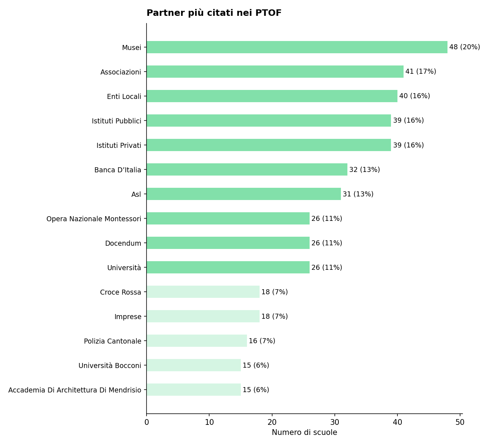
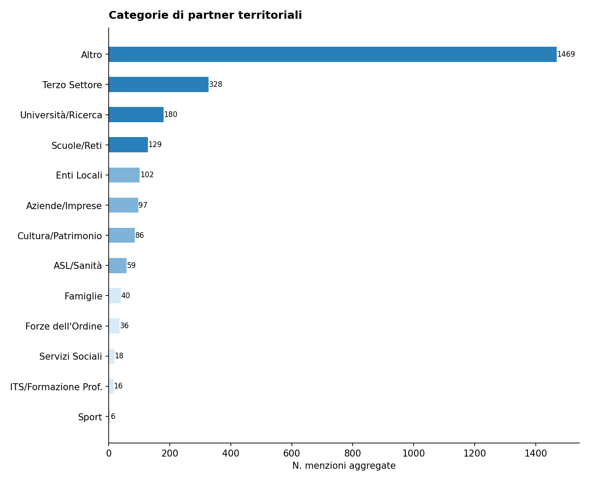
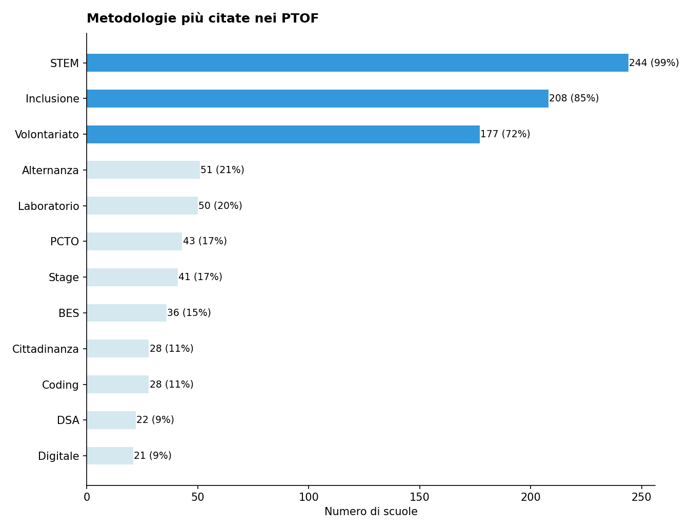

# Report di Sintesi sull'Orientamento nei PTOF — I Grado

*Target Analisi: I Grado*
*Generato con: openrouter / z-ai/glm-5*

## Premessa: Cosa Misuriamo e Perché
Questo report analizza i PTOF (Piani Triennali dell'Offerta Formativa) delle scuole secondarie di I grado italiane per misurarne la copertura informativa in tema di orientamento: quanto e come il documento descrive le pratiche, i progetti e le strategie che la scuola adotta per orientare gli studenti.

È importante chiarire fin da subito un principio fondamentale: i punteggi che seguono non esprimono un giudizio sulla qualità della scuola, ma sulla ricchezza e completezza della documentazione contenuta nel PTOF. Una scuola con un punteggio basso potrebbe svolgere ottime attività di orientamento senza averle descritte nel proprio piano; viceversa, un punteggio alto indica che il PTOF documenta in modo dettagliato e strutturato le proprie pratiche orientative.
## Come Funziona l'Analisi
L'analisi automatizzata legge e interpreta il testo del PTOF su due livelli complementari.

1. Analisi Strutturale (Compliance): Il sistema verifica la conformità formale rispetto alle Linee Guida per l'orientamento scolastico stabilite dal D.M. 328/2022, il decreto ministeriale che ha introdotto l'obbligo per le scuole secondarie di I e II grado di dedicare almeno 30 ore annuali a moduli di orientamento formativo e di individuare figure dedicate (tutor e docente orientatore). In concreto, si verifica se il PTOF contiene una sezione esplicitamente dedicata all'orientamento, valutandone la visibilità e la struttura nel documento.

2. Analisi Semantica e di Contenuto: Attraverso modelli di linguaggio avanzati (LLM), l'analisi "legge" l'intero documento per estrarre informazioni sulla copertura delle 6 dimensioni del framework di valutazione (descritte nella sezione successiva). In questa fase, vengono distinte le semplici dichiarazioni di intenti dalle azioni concrete, mappando la presenza di progetti, risorse, tempi e responsabilità. L'algoritmo rileva il contesto in cui appaiono i termini: ad esempio, distingue se l'orientamento è citato in una lista generica oppure se è descritto attraverso laboratori con obiettivi specifici e modalità di verifica.
## Le 6 Dimensioni del Framework di Valutazione

L'analisi semantica valuta la copertura del PTOF attraverso **6 dimensioni**. Ognuna rappresenta un aspetto fondamentale dell'orientamento scolastico: dalla struttura organizzativa alle finalità educative, dalle metodologie didattiche alle opportunità offerte agli studenti. Di seguito, ciascuna dimensione è descritta con i propri sotto-indicatori.

### Dimensione Strutturale e di Contesto
Valuta se l'orientamento ha una collocazione riconoscibile all'interno del PTOF e se la scuola è inserita in un tessuto di relazioni territoriali.
- **Sezione dedicata**: Presenza di un capitolo o paragrafo esplicitamente intitolato all'orientamento, non frammentato tra diverse parti del documento.
- **Partnership e reti territoriali**: Qualità del coinvolgimento di soggetti esterni (Università, ITS, imprese, Terzo Settore), con attenzione ad attività congiunte e accordi formali.

### Finalità dell'Orientamento
Analizza gli obiettivi formativi che la scuola si pone attraverso le attività di orientamento.
- **Attitudini e Talenti**: Azioni per aiutare gli studenti a scoprire i propri punti di forza e inclinazioni personali.
- **Interessi Professionali**: Percorsi di esplorazione degli ambiti disciplinari e del mondo del lavoro.
- **Progetto di Vita**: Supporto alla costruzione di una traiettoria personale di lungo termine.
- **Transizioni Formative**: Accompagnamento nei passaggi critici tra cicli scolastici (primaria-secondaria, secondaria-università/lavoro).
- **Capacità Orientativa (Empowerment)**: Sviluppo di competenze trasversali che rendano lo studente autonomo nelle proprie scelte.

### Obiettivi di Incidenza
Misura l'attenzione del PTOF verso gli impatti sociali dell'orientamento.
- **Contrasto alla Dispersione**: Strategie di prevenzione dell'abbandono scolastico e iniziative di rimotivazione.
- **Riduzione dei NEET**: Azioni di collegamento scuola-lavoro per favorire l'occupabilità e contrastare il fenomeno dei giovani che non studiano né lavorano.
- **Continuità Territoriale**: Costruzione di ponti tra i diversi gradi di istruzione presenti sul territorio.
- **Lifelong Learning**: Concezione dell'orientamento come competenza permanente, utile per tutta la vita.

### Governance e Organizzazione
Esamina il modello organizzativo interno: chi fa cosa e come si coordina l'azione orientativa.
- **Coordinamento**: Presenza di figure dedicate come Funzioni Strumentali, referenti o commissioni per l'orientamento.
- **Dialogo Interno**: Coinvolgimento dei Consigli di Classe e dei docenti nella progettazione orientativa.
- **Alleanza con le Famiglie**: Iniziative strutturate di comunicazione e collaborazione con i genitori.
- **Monitoraggio**: Utilizzo di strumenti di feedback, questionari e dati per valutare l'efficacia delle azioni.
- **Inclusione**: Attenzione specifica a studenti con BES/DSA, studenti stranieri e situazioni di fragilità.

### Didattica Orientativa
Valuta il passaggio dalle dichiarazioni di principio alle pratiche concrete in aula.
- **Didattica Laboratoriale ed Esperienziale**: Attività basate sul *learning by doing* e sull'apprendimento attivo.
- **Centralità dello Studente**: Ruolo attivo degli studenti nella co-progettazione dei percorsi orientativi.
- **Interdisciplinarità**: Integrazione dell'orientamento nelle diverse discipline curricolari, non solo come attività aggiuntiva.
- **Flessibilità Organizzativa**: Adattamento di spazi, tempi e gruppi per favorire esperienze orientative efficaci.

### Opportunità Formative
Mappa l'ecosistema delle proposte extracurricolari e integrative offerte dalla scuola.
- **Attività Culturali e Artistiche**: Progetti di teatro, musica, scrittura creativa, visite a musei.
- **Laboratori Espressivi**: Percorsi manuali, artigianali o digitali che favoriscono la scoperta di talenti.
- **Sport e Attività Ricreative**: Offerta sportiva e ludica come strumento di socializzazione e benessere.
- **Volontariato e Service Learning**: Esperienze di impegno civico che collegano apprendimento e comunità.

## Dal Qualitativo al Quantitativo: la Scala di Punteggio
Ciascuna delle 6 dimensioni appena descritte viene valutata attraverso una scala numerica da 1 a 7, detta scala di copertura informativa. Si tratta di una scala ordinale di tipo Likert — uno strumento consolidato nella ricerca sociale che consente di tradurre valutazioni qualitative in punteggi confrontabili.

Il punteggio riflette il livello di dettaglio con cui il PTOF documenta le pratiche orientative per quella dimensione: da 1 (nessun riferimento) a 7 (documentazione sistematica con evidenze di miglioramento continuo). La tabella seguente descrive ogni livello.

\begin{tabularx}{\textwidth}{@{} c l X @{}}
\toprule
\textbf{Punti} & \textbf{Livello} & \textbf{Cosa significa} \\
\midrule
1 & Assente & Nessun riferimento all'orientamento nel documento. \\
2 & Traccia minima & Menzione vaga o copia-incolla di testo normativo, senza personalizzazione. \\
3 & Copertura parziale & Intenzione dichiarata, ma senza dettagli su come viene attuata. \\
4 & Copertura di base & Azioni descritte in modo chiaro ma essenziale, senza approfondimento. \\
5 & Copertura strutturata & Azioni dettagliate con metodologie esplicitate e risorse indicate. \\
6 & Copertura approfondita & Azioni integrate nel curricolo, con indicatori di monitoraggio documentati. \\
7 & Copertura esaustiva & Documentazione sistematica e ciclica, con evidenze di revisione e miglioramento. \\
\bottomrule
\end{tabularx}
## L'Indice Sintetico: IIPO
Per avere una visione d'insieme della copertura documentale di ciascuna scuola, i punteggi delle 6 dimensioni vengono riassunti in un unico indicatore: l'IIPO (Indice di Documentazione delle Pratiche di Orientamento).

L'IIPO è calcolato come media aritmetica semplice dei punteggi delle 6 dimensioni (Strutturale, Finalità, Obiettivi, Governance, Didattica, Opportunità). Si è scelta una media non pesata per evitare di privilegiare a priori una dimensione rispetto alle altre, trattandole tutte come ugualmente rilevanti.

Come leggere l'IIPO:
- Un IIPO di 5.0 indica che, in media, il PTOF documenta le pratiche orientative a un livello di "Copertura strutturata" su tutte le dimensioni.
- Un IIPO di 3.0 segnala una documentazione complessivamente a livello di "Copertura parziale".

Limiti da tenere presenti:
- *Effetto compensazione*: Essendo una media, l'IIPO può mascherare squilibri tra le dimensioni. Ad esempio, una scuola con punteggio 7 su 7 su Didattica e 1 su 7 su Governance otterrebbe un IIPO apparentemente nella norma. Per questo motivo, l'IIPO va sempre letto insieme ai punteggi delle singole dimensioni.
- *Sensibilità incrementale*: La scala a 7 livelli consente di cogliere differenze graduali tra scuole, evitando la polarizzazione tipica delle scale più strette (es. 1-3).
## Approccio Analitico: Raggruppamento per Affinità

Oltre all'analisi dimensionale, il report utilizza una tecnica di **raggruppamento automatico** (clustering) per evitare di appiattire i risultati su una semplice media nazionale.

Il funzionamento è il seguente: il sistema analizza i profili di punteggio di tutte le scuole e individua **gruppi di istituti** che presentano caratteristiche documentali simili. Nel campione corrente sono stati identificati **5 gruppi omogenei** — ad esempio, un gruppo potrebbe riunire scuole con forte attenzione ai PCTO e alle partnership territoriali, mentre un altro potrebbe raccogliere istituti che privilegiano la didattica laboratoriale.

Per ciascun gruppo viene generata una **sintesi tematica** che descrive l'approccio dominante su ogni dimensione. Queste sintesi intermedie vengono poi integrate nel report finale, permettendo di confrontare i diversi "profili di orientamento" e di evidenziare sia le tendenze comuni sia le eccezioni virtuose.

## Analisi e Copertura del Campione (I Grado)
Questa sezione descrive la composizione del campione analizzato e ne valuta la rappresentatività rispetto all'universo delle scuole italiane. Comprendere la struttura del campione è essenziale per interpretare correttamente i risultati: un campione ben bilanciato consente di generalizzare le osservazioni; un campione sbilanciato richiede cautela nell'estendere le conclusioni a tutto il sistema scolastico.

Per ogni dimensione di confronto (gestione, area geografica, contesto territoriale) la tabella riporta tre valori:
- Osservato %: la percentuale nel nostro campione.
- Atteso % (MIUR): la percentuale nell'universo reale delle scuole italiane, ricavata dai dati ministeriali.
- Deviazione (pp): la differenza tra osservato e atteso, espressa in *punti percentuali*. Deviazioni entro ±5 pp sono trascurabili; tra 5 e 15 pp segnalano un lieve squilibrio; oltre 15 pp indicano una sovra- o sotto-rappresentazione significativa.

Statistiche Generali

- Scuole Analizzate: 246 PTOF di scuole secondarie di I grado
- Province Coperte: 84 (su 107 totali)
- Regioni Coperte: 18/20

Il campione copre la quasi totalità delle regioni italiane, garantendo una visione nazionale.

Bilanciamento Gestione (Statale vs Paritaria)

In Italia, le scuole statali rappresentano la grande maggioranza degli istituti. Un campione rappresentativo dovrebbe riflettere questa proporzione. Una sovra-rappresentazione delle paritarie, ad esempio, potrebbe influenzare i risultati perché i PTOF delle scuole paritarie tendono ad avere strutture e contenuti diversi da quelli delle statali.

\begin{tabularx}{\textwidth}{@{} p{3cm} c c c @{}}
\toprule
\textbf{Tipo} & \textbf{Osservato \%} & \textbf{Atteso \% (MIUR)} & \textbf{Deviazione} \\
\midrule
Statale & 76.0\% & 92.0\% & -16.0 pp \\
Paritaria & 24.0\% & 8.0\% & +16.0 pp \\
\bottomrule
\end{tabularx}

Distribuzione Geografica per Macro-Area

L'Italia presenta significative differenze territoriali nell'offerta formativa. Per valutare se il campione rispecchia la distribuzione reale delle scuole, confrontiamo le cinque macro-aree geografiche (Nord Ovest, Nord Est, Centro, Sud, Isole) con i dati MIUR. Una buona rappresentatività geografica è fondamentale perché le pratiche di orientamento possono variare sensibilmente tra Nord e Sud, tra aree urbane e rurali.

\begin{tabularx}{\textwidth}{@{} X c c c @{}}
\toprule
\textbf{Area} & \textbf{Osservato \%} & \textbf{Atteso \% (MIUR)} & \textbf{Deviazione} \\
\midrule
Nord Ovest & 15.9\% & 26.6\% & -10.7 pp \\
Nord Est & 18.3\% & 19.3\% & -1.0 pp \\
Centro & 27.6\% & 19.9\% & +7.7 pp \\
Sud & 29.3\% & 23.3\% & +6.0 pp \\
Isole & 8.9\% & 10.9\% & -2.0 pp \\
\bottomrule
\end{tabularx}

⚠️ Campione con Lievi Disallineamenti: Si notano alcune sovra/sottorappresentazioni geografiche, che tuttavia non invalidano l'analisi complessiva (deviazione max < 15 pp).

Distribuzione Territoriale (Aree Metropolitane vs Non Metropolitane)

Le scuole situate nelle 14 città metropolitane italiane operano in contesti diversi rispetto a quelle di provincia: maggiore offerta formativa esterna, più partnership con università e imprese, ma anche maggiore competizione tra istituti. Questa distinzione aiuta a capire se i risultati del report sono influenzati da una prevalenza di scuole urbane o rurali nel campione.

\begin{tabularx}{\textwidth}{@{} X c c c @{}}
\toprule
\textbf{Area} & \textbf{Osservato \%} & \textbf{Atteso \% (Stima)} & \textbf{Deviazione} \\
\midrule
Metropolitana & 38.6\% & 33.0\% & +5.6 pp \\
Non Metropolitana & 61.4\% & 67.0\% & -5.6 pp \\
\bottomrule
\end{tabularx}

Implicazioni per la Lettura del Report

Il campione presenta deviazioni significative rispetto alla popolazione di riferimento che ne limitano la rappresentatività sistemica. Lo scostamento più marcato riguarda la tipologia di gestione: le scuole paritarie risultano nettamente sovrarappresentate, con una presenza quasi triplicata rispetto al dato nazionale atteso. Questo sbilanciamento incide direttamente sulla lettura delle dimensioni relative a governance e opportunità formative, considerato che le scuole paritarie presentano spesso strutture organizzative e offerta complementare differenziate rispetto al settore statale. Il lettore dovrà pertanto considerare che le pratiche documentate nei PTOF analizzati riflettono un mix istituzionale non proporzionale al reale panorama scolastico italiano, con possibile sovrastima di modalità organizzative tipiche della gestione paritaria.

Sul piano geografico, si segnala una sottorappresentazione del Nord Ovest e una sovrarappresentazione del Centro e del Sud, mentre Nord Est e Isole si collocano entro margini accettabili. Questa distribuzione disomogenea influenza in particolare le sezioni del report dedicate al rapporto scuola-territorio e alle azioni di continuità, aspetti fortemente connotati dal contesto socio-economico regionale. Inoltre, la leggera sovrarappresentazione delle aree metropolitane suggerisce una maggiore concentrazione di esperienze documentate in contesti urbani, con possibile sottostima delle specificità delle scuole localizzate in aree non metropolitane, dove le risorse e le partnership territoriali possono assumere configurazioni differenti.

I risultati di questo report sono pertanto da considerarsi generalizzabili con cautele significative. Le tendenze emergenti offrono uno spaccato rilevante delle pratiche di orientamento documentate nei PTOF, ma le distorsioni campionarie consigliano di evitare estrapolazioni dirette all'intero sistema scolastico italiano. Le analisi per cluster e le evidenze qualitative mantengono il loro valore interpretativo, permettendo di individuare pattern e modalità operative interessanti; tuttavia, ogni conclusione dovrebbe essere letta alla luce della composizione specifica del campione, riconoscendo che la sovrarappresentazione delle paritarie e degli ambiti centro-meridionali e metropolitani costituisce un filtro interpretativo non trascurabile per una valutazione rappresentativa del quadro nazionale.

\newpage
## Sintesi Quantitativa: Le Dimensioni dell'Orientamento
Di seguito il dettaglio dei punteggi medi rilevati per le dimensioni e i relativi sotto-indicatori.
Dimensione Strutturale (Compliance)
Media: 2.39 (dev.std: 1.67)

Finalità dell'Orientamento

\begin{tabularx}{\textwidth}{@{} X c c @{}}
\toprule
\textbf{Indicatore} & \textbf{Media} & \textbf{Dev. Std.} \\
\midrule
\textbf{Totale Dimensione} & \textbf{3.51} & \textbf{1.09} \\
Attitudini e Talenti & 3.65 & 1.13 \\
Interessi Professionali & 3.67 & 1.16 \\
Progetto di Vita & 3.38 & 1.32 \\
Transizioni Formative & 3.56 & 1.24 \\
Capacità Orientative & 3.24 & 1.41 \\
\bottomrule
\end{tabularx}

Obiettivi di Incidenza

\begin{tabularx}{\textwidth}{@{} X c c @{}}
\toprule
\textbf{Indicatore} & \textbf{Media} & \textbf{Dev. Std.} \\
\midrule
\textbf{Totale Dimensione} & \textbf{3.10} & \textbf{1.11} \\
Contrasto Dispersione & 2.80 & 1.56 \\
Continuità Territorio & 3.55 & 1.25 \\
Riduzione NEET & 2.04 & 1.35 \\
Lifelong Learning & 3.26 & 1.35 \\
\bottomrule
\end{tabularx}

Governance e Organizzazione

\begin{tabularx}{\textwidth}{@{} X c c @{}}
\toprule
\textbf{Indicatore} & \textbf{Media} & \textbf{Dev. Std.} \\
\midrule
\textbf{Totale Dimensione} & \textbf{3.61} & \textbf{1.05} \\
Coordinamento & 3.50 & 1.24 \\
Dialogo Interno & 3.57 & 1.22 \\
Alleanza Famiglie & 4.05 & 1.10 \\
Monitoraggio & 2.79 & 1.43 \\
Inclusione & 3.92 & 1.20 \\
\bottomrule
\end{tabularx}

Didattica Orientativa

\begin{tabularx}{\textwidth}{@{} X c c @{}}
\toprule
\textbf{Indicatore} & \textbf{Media} & \textbf{Dev. Std.} \\
\midrule
\textbf{Totale Dimensione} & \textbf{3.62} & \textbf{1.01} \\
Centralità Studente & 3.85 & 1.21 \\
Didattica Laboratoriale & 3.52 & 1.31 \\
Flessibilità & 3.32 & 1.30 \\
Interdisciplinarità & 3.72 & 1.10 \\
\bottomrule
\end{tabularx}

Opportunità Formative

\begin{tabularx}{\textwidth}{@{} X c c @{}}
\toprule
\textbf{Indicatore} & \textbf{Media} & \textbf{Dev. Std.} \\
\midrule
\textbf{Totale Dimensione} & \textbf{3.07} & \textbf{1.11} \\
Attività Culturali & 3.09 & 1.39 \\
Laboratori Espressivi & 3.83 & 1.31 \\
Attività Ricreative & 2.63 & 1.22 \\
Volontariato & 2.45 & 1.40 \\
Sport & 3.07 & 1.38 \\
\bottomrule
\end{tabularx}

*Legenda Copertura Informativa su scala 1-7: Assente(1), Traccia minima(2), Copertura parziale(3), Copertura di base(4), Copertura strutturata(5), Copertura approfondita(6), Copertura esaustiva(7)*

\newpage

Panoramica Grafica dei Sotto-Indicatori

\noindent
\begin{minipage}[t]{0.47\textwidth}
\centering
\includegraphics[width=\textwidth]{images/bar_finalita_dellorientamento_compact_20260215_221251.png}
\end{minipage}
\hfill
\begin{minipage}[t]{0.47\textwidth}
\centering
\includegraphics[width=\textwidth]{images/bar_obiettivi_di_incidenza_compact_20260215_221251.png}
\end{minipage}

\vspace{0.5cm}

\noindent
\begin{minipage}[t]{0.47\textwidth}
\centering
\includegraphics[width=\textwidth]{images/bar_governance_e_organizzazione_compact_20260215_221251.png}
\end{minipage}
\hfill
\begin{minipage}[t]{0.47\textwidth}
\centering
\includegraphics[width=\textwidth]{images/bar_didattica_orientativa_compact_20260215_221251.png}
\end{minipage}

\vspace{0.5cm}

\noindent
\hfill
\begin{minipage}[t]{0.47\textwidth}
\centering
\includegraphics[width=\textwidth]{images/bar_opportunita_formative_compact_20260215_221251.png}
\end{minipage}
\hfill

Panoramica dei Risultati Quantitativi

L'analisi quantitativa del campione rivela un quadro sfaccettato, in cui le dimensioni si distribuiscono lungo un arco relativamente contenuto, compreso tra un minimo di 3.07 su 7 per le Opportunità Formative e un massimo di 3.62 su 7 per la Didattica Orientativa. La dimensione più strutturata appare dunque la Didattica Orientativa, che con un punteggio medio di 3.62 su 7 si colloca in una fascia di copertura di base, segno che i PTOF delle scuole secondarie di I grado descrivono con una certa costanza pratiche didattiche centrate sullo studente, laboratoriali e interdisciplinari. Al contrario, la dimensione degli Obiettivi di Incidenza si configura come la più debole, con una media di 3.10 su 7: un valore che segnala una documentazione ancora parziale, specialmente per quanto riguarda il contrasto alla dispersione scolastica e alle situazioni di vulnerabilità educativa. Nondimeno, è la Dimensione Strutturale — relativa all'allineamento normativo con il D.M. 328/2022 — a registrare il punteggio più basso in assoluto, pari a 2.39 su 7, collocandosi tra la traccia minima e la copertura parziale: un dato che meriterà un'attenta disamina qualitativa nelle sezioni successive, poiché suggerisce una possibile sottovalutazione documentale degli obblighi introdotti dalle Linee Guida per l'orientamento.

La distribuzione interna delle dimensioni presenta alcune asimmetrie degne di nota. All'interno della Governance e Organizzazione, la media generale di 3.61 su 7 nasconde un divario significativo tra il sotto-indicatore relativo all'Alleanza con le Famiglie, che raggiunge il valore più alto dell'intero framework con 4.05 su 7, e il Monitoraggio delle azioni, che si arresta a 2.79 su 7. Tale scarto indica una tendenza documentale a privilegiare la relazione con le famiglie — coerente con l'età preadolescenziale degli studenti del I grado — a scapito della sistematicità nel verificare l'efficacia delle pratiche messe in campo. Analogamente, nella dimensione delle Opportunità Formative, i Laboratori Espressivi si distinguono con 3.83 su 7, mentre il Volontariato registra un misurato 2.45 su 7, suggerendo una minore attenzione documentale alle esperienze di cittadinanza attiva. Particolarmente marcata appare la discrepanza negli Obiettivi di Incidenza: la Continuità con il Territorio raggiunge 3.55 su 7, mentre la Riduzione del rischio NEET si ferma a 2.04 su 7, un valore che tuttavia va interpretato alla luce della specificità del grado scolastico, dove il fenomeno NEET rappresenta una preoccupazione meno immediata rispetto alla prevenzione precoce del disengaggio.

Questi numeri sollevano interrogativi che l'analisi qualitativa successiva potrà approfondire. Il basso punteggio strutturale sull'allineamento normativo richiede di verificare se le scuole stiano effettivamente implementando i moduli di orientamento formativo da 30 ore previsti dal D.M. 328/2022, anche se la loro collocazione in forma extracurricolare potrebbe renderli meno visibili nei documenti programmatici. Al contempo, la relativa forza dell'Alleanza con le Famiglie e dei Laboratori Espressivi suggerisce una concezione dell'orientamento ancora sbilanciata su momenti informativi e formativi tradizionali, piuttosto che su un sistema integrato di monitoraggio e valutazione. L'analisi per cluster geografici e tipologia di gestione — tenendo conto della sovrarappresentazione delle scuole paritarie nel campione — potrà chiarire se tali pattern riflettano differenze strutturali tra contesti o piuttosto una cultura documentale diffusa, che tende a privilegiare la descrizione delle attività rispetto alla misurazione dei loro effetti.

\newpage
## Profili dei Cluster e Differenze
L'analisi automatica ha individuato cinque cluster che coprono complessivamente 244 scuole su 246 del campione, con due istituti non assegnati ad alcun gruppo per caratteristiche documentali atipiche.

Il Cluster 4 è il gruppo più numeroso con 125 scuole e rappresenta la tendenza maggioritaria nel campione. Il tratto dominante è una presenza diffusa ma frammentata dell'orientamento nei PTOF: le scuole menzionano il tema in diverse sezioni del documento, integrandolo in aree più ampie o progetti specifici, ma quasi mai gli dedicano una sezione autonoma e organica. Questo suggerisce che l'orientamento è percepito come importante, ma non come pilastro strategico dell'offerta formativa. L'attenzione prevalente è rivolta al monitoraggio dei risultati degli apprendimenti e delle competenze docenti, con interventi mirati a identificare criticità attraverso la raccolta dati. Si distingue dagli altri gruppi per l'enfasi sull'ampliamento dell'offerta attraverso progetti specifici e collaborazioni esterne, con focus su prevenzione del disagio e sviluppo di competenze trasversali.

Il Cluster 0 raccoglie 67 scuole e si caratterizza per un approccio integrato piuttosto che strutturato. Anche qui l'orientamento appare in più punti del documento, ma il tratto distintivo è l'attenzione al miglioramento continuo dell'offerta formativa e alla transizione tra gradi scolastici. Le scuole di questo gruppo sembrano più impegnate nell'ottimizzazione delle metodologie didattiche e nel rafforzamento dei legami con il territorio. Un elemento che lo differenzia dal Cluster 4 è la focalizzazione sulla fase di uscita e sulla comunicazione alle famiglie, sebbene anche in questo caso manchi una sezione dedicata. La scuola Aniene -Agraria Agroalimentare E Agroindustria (RMTAPV5005) (Lazio) rappresenta un'eccezione documentale in questo gruppo.

Il Cluster 1 comprende 21 scuole e mostra la copertura informativa più limitata. L'orientamento è menzionato in modo implicito all'interno del curricolo o come tema trasversale, spesso ridotto a dichiarazioni di intenti prive di un piano d'azione definito. Il focus prevalente è sul monitoraggio del benessere psico-fisico degli studenti e sull'ambientamento dei nuovi iscritti, con approccio prevalentemente reattivo. La scuola I.C.Breda (MIEE8EU01T) (Lombardia) costituisce un'eccezione poiché dedica una sezione esplicita all'orientamento. Questo gruppo si distingue per la minore strutturazione documentale rispetto agli altri cluster.

Il Cluster 3 riunisce 19 scuole con un approccio frammentario e non strutturato. Le tematiche orientative sono integrate in capitoli più ampi come l'offerta formativa o l'inclusione, senza pianificazione strategica coerente. La scuola Istituto San Giuseppe Calasanzio (CA1M4N500E) (Sardegna), pur includendo una sezione "Valutazione, Continuità e Orientamento", riconosce esplicitamente la frammentazione e la scarsa integrazione delle azioni. Questo cluster presenta riferimenti generici a continuità e strategie orientative senza definizione chiara di obiettivi o indicatori di monitoraggio, distinguendosi per l'assenza di dettagli attuativi.

Il Cluster 2 è il gruppo più contenuto con 12 scuole e mostra un approccio implicito e frammentato, con menzioni dell'orientamento in sezioni più ampie del documento. Un tratto peculiare è la presenza di riferimenti ai PCTO nei documenti analizzati, come nel caso delle scuole Ente Religioso Compassioniste Serve Di Maria (NA1E114004) (Campania) e Scuola Piccolo Uomo (RM1ES55005) (Lazio): trattandosi di scuole secondarie di I grado, tali riferimenti configurano un'anomalia documentale, poiché i PCTO sono previsti esclusivamente per il II grado. Questo gruppo si distingue per il riconoscimento generale dell'importanza dell'orientamento a livello dichiarativo, accompagnata tuttavia da carenza diffusa nella definizione di strategie concrete e sistemi di monitoraggio efficaci.

La comparazione tra i gruppi rivela alcune convergenze significative. Tutti i cluster mostrano una tendenza diffusa a non dedicare all'orientamento una sezione autonoma e strutturata nei PTOF, preferendo un approccio integrato e frammentato. La consapevolezza dell'importanza del tema è trasversale, ma la traduzione in pianificazione strategica rimane carente nella maggior parte dei casi. Le divergenze emergono principalmente nel focus tematico: mentre il Cluster 4 privilegia l'ampliamento dell'offerta attraverso progetti, il Cluster 0 si concentra sul miglioramento metodologico e la transizione, il Cluster 1 sul benessere e l'ambientamento, e i Cluster 2 e 3 su aspetti parzialmente incoerenti con il grado scolastico di riferimento. Il Cluster 4 appare il gruppo più rappresentativo della prassi diffusa, mentre il Cluster 1 evidenzia la copertura informativa più modesta.
## Commento di Sintesi Generale
L'analisi di 246 scuole secondarie di primo grado restituisce un Indice di Documentazione delle Pratiche di Orientamento (IIPO) medio pari a 3,44 su 7, posizionando il campione in una fascia di copertura informativa compresa tra il livello "Copertura parziale" e quello "Copertura di base". Questo dato aggregato suggerisce che, nel complesso, i PTOF documentano l'orientamento in modo ancora essenziale: le finalità vengono dichiarate e le azioni vengono descritte, ma senza quell'articolazione metodologica e quel sistema di monitoraggio che caratterizzerebbero una copertura strutturata. L'orientamento, dunque, appare più come un adempimento informativo che come pilastro strategico dell'identità formativa dell'istituto.

Le dimensioni meglio documentate risultano essere la didattica orientativa e la governance, entrambe con una media di 3,62 su 7 e 3,61 su 7 rispettivamente. Questo significa che le scuole tendono a descrivere con maggiore cura le modalità didattiche e l'organizzazione interna delle attività. Al contrario, le dimensioni relative agli obiettivi e alle opportunità formative registrano le medie più basse, rispettivamente 3,1 su 7 e 3,07 su 7, segnalando una minore attenzione alla declinazione operativa di target specifici e all'offerta di esperienze extrascolastiche in chiave orientativa.

La distribuzione dei punteggi appare piuttosto omogenea, con deviazioni standard contenute intorno a 1,0-1,1 per tutte le dimensioni. Tale uniformità indica che non esistono gruppi di scuole nettamente distinti per qualità documentale: il fenomeno della frammentarietà riguarda trasversalmente l'intero campione, indipendentemente dal contesto territoriale o dalla tipologia di istituto. I cluster identificati confermano questo quadro: su cinque raggruppamenti, ben quattro (cluster 0, 1, 3 e 4, che insieme rappresentano 231 scuole su 246) mostrano un approccio caratterizzato da "presenza diffusa ma frammentata", con l'orientamento menzionato in più sezioni del documento senza tuttavia trovare una collocazione autonoma e organica. La stragrande maggioranza delle scuole del campione non dedica una sezione specifica all'orientamento nel PTOF, preferendo disperderlo tra capitoli dedicati all'offerta formativa, all'inclusione o al curricolo.

Un elemento di criticità emerge dall'analisi delle evidenze testuali: alcune scuole di primo grado manifestano una confusione concettuale significativa tra l'orientamento scolastico-formativo e l'orientamento spaziale-geografico. Documenti come quelli della scuola Rogazionisti (PD1M007002) [Veneto] e della scuola I.C. "K. Wojtyla-G. Da Fiore (KRMM83101N) [Calabria] riportano sezioni intitolate "Orientamento" che descrivono esclusivamente competenze geografiche, come "orientarsi sulle carte ed individuare i punti cardinali" o "orientarsi nelle realtà territoriali locali". Tale ambiguità terminologica rischia di svuotare di senso la funzione orientativa propriamente intesa, quella cioè di accompagnamento allo sviluppo dell'identità personale e alla scelta consapevole del percorso di studi successivo.

D'altra parte, non mancano segnali di consapevolezza normativa: scuole come Ic "Pascoli" Tramonti-Ravello (SAMM81102X) [Campania] e Cpia Forli'-Cesena S. Sirotti (FOMM701012) [Emilia-Romagna] citano esplicitamente il D.M. 328/2022 e le Linee Guida per l'orientamento, riconoscendo l'obbligo di strutturare un sistema coordinato. Tuttavia, la distanza tra queste dichiarazioni di principio e la concreta articolazione delle azioni rimane spesso significativa: le finalità vengono enunciate, ma i meccanismi attuativi, le risorse assegnate e i criteri di valutazione rimangono impliciti.

Le sezioni successive approfondiranno singolarmente ciascuna dimensione del framework, analizzando come le scuole di primo grado declinano le finalità orientative, strutturano le azioni di governance, integrano la didattica e progettano le opportunità formative, con particolare attenzione alla coerenza tra normative vigenti e pratiche documentate.
## Allineamento Normativo e Approccio Innovativo
L'analisi del recepimento normativo nei PTOF delle 246 scuole secondarie di I grado del campione rivela un quadro di sostanziale disallineamento tra il dettato legislativo e la sua traduzione documentale. Il punteggio medio di allineamento normativo si attesta a 2,39 su 7, posizionandosi tra il livello "traccia minima" e "copertura parziale". Questo dato indica che la maggior parte dei documenti si limita a menzionare l'obbligo normativo senza tradurlo in una programmazione strutturata e dettagliata, lasciando emergere una distanza significativa tra il quadro regolatorio introdotto dal D.M. 328/2022 e la sua effettiva ricezione nei documenti di istituto.

La distinzione tra recepimento formale e recepimento sostanziale appare netta. Sul versante formale, numerose scuole citano il decreto ministeriale e le Linee Guida, talvolta riportando stralci normativi senza tuttavia articolare le implicazioni operative. Il Cluster 3, che comprende 19 scuole, rappresenta emblematicamente questa tendenza: la quasi totalità degli istituti integra l'orientamento come sottosezione all'interno di altri capitoli del PTOF, prevalentemente nell'Offerta Formativa, senza dedicare uno spazio autonomo e strutturato alla materia. Al contrario, il recepimento sostanziale emerge con maggiore evidenza nel Cluster 4, dove la scuola 2 I.C. Ravarino (MOIC84900D) (Emilia-Romagna) fa riferimento esplicito al D.M. 328/2022 nell'implementazione di moduli curricolari di orientamento, dimostrando come la norma possa essere assunta non come mero adempimento burocratico ma come framework progettuale.

Per quanto concerne le figure del Tutor e dell'Orientatore, previste dal D.M. 328/2022 per le scuole secondarie di I e II grado, la copertura informativa rimanda a una valorizzazione parziale. Il punteggio medio di 3,5 su 7 relativo al coordinamento dei servizi indica una copertura tra "parziale" e "di base", suggerendo che le scuole dichiarano l'esistenza di queste figure ma ne descrivono in modo essenziale i ruoli operativi. L'evidenza testuale proveniente dalla scuola Scuola Secondaria Di I Grado Istituto Leone Xiii (MI1M08000T) (Lombardia) mostra un'articolazione più dettagliata: il documento prevede "colloqui personali per gli studenti con il proprio Tutor di classe" e "percorsi di riflessione personale guidati dai docenti di Formazione Umana", integrando la figura tutoriale in attività curricolari strutturate. Nondimeno, questa rappresenta un'eccezione rispetto a una tendenza diffusa a menzionare le figure senza definirne compiutamente funzioni, tempi e modalità di intervento.

I moduli obbligatori di orientamento formativo di almeno 30 ore annue per studente, previsti dal D.M. 328/2022 a partire dall'anno scolastico 2023/24, costituiscono un elemento critico dell'analisi. La documentazione evidenzia un approccio difforme: alcune scuole registrano il monte ore come adempimento formale, altre lo sostanziano con contenuti pedagogici definiti. La scuola Cpia "Caltanissetta-Enna (ENMM70001R) (Sicilia) documenta un percorso articolato in cinque moduli tematici, che spaziano dalla gestione delle emozioni alla digitalizzazione con la piattaforma Unica e l'E-Portfolio, fino agli incontri con le istituzioni formative del territorio. Questa strutturazione rivela un'interpretazione della norma non come vincolo orario ma come opportunità formativa a tutto tondo. Al contrario, diversi PTOF del Cluster 0 menzionano l'orientamento in modo "dispersivo o come parte di azioni più ampie", riducendo il modulo a mera aggregazione di attività preesistenti senza una progettazione orientativa specifica.

Le scuole che trascendono il mero adempimento minimo presentano approcci originali e integrati. La scuola I.S.I.S. "D'Este-Caracciolo (NARC118016) (Campania) propone "un ciclo completo di 4 moduli di orientamento con il supporto di tutor interni ed esterni", documentando una pluralità di figure coinvolte e una strutturazione modulare che riflette la complessità del processo orientativo. Analogamente, la scuola Scuola Secondaria Di I Grado Istituto Leone Xiii (MI1M08000T) (Lombardia) integra l'orientamento in esperienze formative differenziate, dalla "settimana di scuola in montagna" con attività di conversazione e test sulle intelligenze multiple, ai percorsi di Media Education con esperti esterni. Questi casi, seppur minoritari, dimostrano che il dettato normativo può fungere da leva per un'innovazione pedagogica che superi la logica dell'adempimento.

In definitiva, il quadro che emerge è quello di una fase transitoria in cui il dispositivo normativo ha prodotto una presa d'atto diffusa ma non ancora una piena traduzione operativa. La distanza tra il punteggio di allineamento normativo (2,39 su 7) e il coordinamento dei servizi (3,5 su 7) suggerisce che le scuole stanno progressivamente costruendo le architetture organizzative richieste, ma faticano a documentarle in modo sistematico e trasparente entro i PTOF.
## Rapporto con il Territorio
Partner territoriali più diffusi nel campione

\begin{tabularx}{\textwidth}{@{} X l c c @{}}
\toprule
\textbf{Partner} & \textbf{Categoria} & \textbf{N. Scuole} & \textbf{\% Campione} \\
\midrule
Musei & Altro & 48 & 19.5\% \\
Associazioni & Terzo Settore & 41 & 16.7\% \\
Enti Locali & Altro & 40 & 16.3\% \\
Istituti Pubblici & Altro & 39 & 15.9\% \\
Istituti Privati & Altro & 39 & 15.9\% \\
Banca d'Italia & Altro & 32 & 13.0\% \\
ASL & ASL/Sanità & 31 & 12.6\% \\
Opera Nazionale Montessori & Altro & 26 & 10.6\% \\
Docendum & Altro & 26 & 10.6\% \\
Università & Università/Ricerca & 26 & 10.6\% \\
Croce Rossa & Terzo Settore & 18 & 7.3\% \\
Imprese & Aziende/Imprese & 18 & 7.3\% \\
Polizia Cantonale & Forze dell'Ordine & 16 & 6.5\% \\
Università Bocconi & Università/Ricerca & 15 & 6.1\% \\
Accademia di Architettura di Mendrisio & Università/Ricerca & 15 & 6.1\% \\
\bottomrule
\end{tabularx}

Distribuzione per categoria di partner

L'analisi delle relazioni territoriali documentate dai PTOF del campione rivela un panorama caratterizzato da una significativa eterogeneità nella qualità e nella tipologia delle partnership. Il punteggio medio di 3.55 su 7 registrato per l'obiettivo di continuità con il territorio indica una copertura informativa complessivamente di base, che si colloca tra la dichiarazione di intenzione e la descrizione di azioni essenziali. Analogamente, il punteggio di 3.5 su 7 (1=Assente, 7=Copertura esaustiva) relativo al coordinamento dei servizi conferma una documentazione che, pur evidenziando la presenza di collaborazioni, raramente ne dettaglia modalità operative e strategie di monitoraggio.

I dati di frequenza sui partner territoriali evidenziano una predominanza di collaborazioni con enti culturali e del terzo settore. I musei rappresentano il partner più citato, con 48 scuole che ne fanno menzione, pari al 19.5% del campione, seguiti dalle associazioni con 41 scuole e dagli enti locali con 40. Questa distribuzione suggerisce un approccio al territorio prevalentemente incentrato sulla fruizione culturale e sulla partecipazione a progetti educativi promossi da soggetti non profit. Il terzo settore, con 328 menzioni aggregate, emerge come categoria predominante, segno di una rete collaborativa che fa perno su soggetti dedicati all'educazione e alla socializzazione. Tuttavia, alcune assenze risultano rilevanti: i servizi sociali compaiono solo con 18 menzioni, le famiglie con 40, e gli ITS o enti di formazione professionale con appena 16. Questi dati riflettono un modello di collaborazione in cui il legame con le istituzioni preposte al welfare e al supporto alle fragilità rimane sottodocumentato, nonostante la rilevanza che tali partnership assumono nella gestione dell'inclusione scolastica.

Un elemento di criticità riguarda la categoria "Altro", che aggrega ben 1469 menzioni, suggerendo una classificazione non univoca dei partner e una possibile frammentazione delle informazioni. Le università e gli enti di ricerca, con 180 menzioni, occupano una posizione intermedia, segno che alcune scuole del primo ciclo costruiscono ponti con il mondo accademico, probabilmente in chiave di orientamento in uscita verso il secondo grado o di accoglienza di studenti in tirocinio formativo. Le aziende e le imprese, con 97 menzioni, appaiono poco rappresentate, coerentemente con la natura del primo ciclo scolastico in cui le esperienze dirette nel mondo del lavoro non costituiscono priorità formativa.

La continuità verticale rappresenta un aspetto parzialmente documentato. Le 129 menzioni alla categoria Scuole/Reti indicano che alcune istituzioni coltivano rapporti strutturati con altri ordini di scuola. Nondimeno, l'analisi per cluster evidenzia approcci differenziati: il Cluster 1, composto da 21 scuole, mostra una particolare attenzione alle transizioni interne e alle collaborazioni con figure professionali specifiche, come pediatri e specialisti, per progetti di educazione alla salute e al benessere. Al contrario, i Cluster 2 e 3, rispettivamente con 12 e 19 scuole, appaiono focalizzati su una concezione del rapporto territoriale limitata, con scarse articolazioni strategiche e partnership poco diversificate.

La presenza di partner come l'Opera Nazionale Montessori, citata da 26 scuole, e la Polizia Cantonale, menzionata da 16, riflette la composizione mista del campione, che include istituzioni paritarie e scuole situate in aree transfrontaliere. La Banca d'Italia, con 32 menzioni, suggerisce inoltre una diffusione di progetti di educazione finanziaria, coerentemente con le indicazioni ministeriali che ne promuovono l'introduzione già nel primo ciclo.

In sintesi, la documentazione delle relazioni territoriali appare sbilanciata verso partnership culturali e associative, mentre risultano meno approfondite le collaborazioni con i servizi socio-sanitari e le reti di continuità verticale. Le scuole che conseguono punteggi più elevati in questa dimensione sono quelle che descrivono non solo la lista dei partner, ma anche le modalità di interazione, gli obiettivi condivisi e le ricadute sugli studenti, superando la logica della mera enumerazione formale.
## Metodologie Didattiche
Metodologie più diffuse nel campione

\begin{tabularx}{\textwidth}{@{} X c c @{}}
\toprule
\textbf{Metodologia} & \textbf{N. Scuole} & \textbf{\% Campione} \\
\midrule
STEM & 244 & 99.2\% \\
Inclusione & 208 & 84.6\% \\
Volontariato & 177 & 72.0\% \\
Alternanza & 51 & 20.7\% \\
Laboratorio & 50 & 20.3\% \\
PCTO & 43 & 17.5\% \\
Stage & 41 & 16.7\% \\
BES & 36 & 14.6\% \\
Cittadinanza & 28 & 11.4\% \\
Coding & 28 & 11.4\% \\
DSA & 22 & 8.9\% \\
Digitale & 21 & 8.5\% \\
\bottomrule
\end{tabularx}

L'analisi delle metodologie didattiche documentate nel campione di 246 scuole secondarie di primo grado rivela un quadro caratterizzato da forti concentrazioni e significative lacune informative. I dati di frequenza indicano una netta predominanza delle attività STEM, presenti nel 99,2% delle scuole, seguite dalle pratiche di inclusione (84,6%) e dal volontariato (72,0%). Al contrario, la didattica laboratoriale esplicitamente dichiarata compare solo nel 20,3% dei documenti, una percentuale sorprendentemente contenuta se rapportata alla retorica sull'apprendimento esperienziale che pervade molti PTOF. Questa disparità suggerisce che l'orientamento tramite le discipline scientifico-tecnologiche tenda a configurarsi come arricchimento curricolare piuttosto che come metodologia didattica strutturante.

Il punteggio medio di 3,52 su 7 per la dimensione della didattica laboratoriale, posizionato tra la Copertura parziale e la Copertura di base, conferma questa tendenza. Analogamente, il punteggio di 3,85 su 7 relativo all'esperienza degli studenti indica una documentazione ancora essenziale. L'orientamento appare pertanto prevalentemente affidato a progetti specifici e modulari, spesso extracurricolari, piuttosto che integrato nella pratica didattica quotidiana. Le evidenze testuali mostrano che la Scuola Istituto Omnicomprensivo Bobbio (PCMM819037) (Emilia-Romagna) propone un'"ampia offerta di laboratori didattici svolti in gruppi omogenei per età, tra cui Laboratorio di Coding con Docendum, Laboratorio di Musica, Scienze, Educazione Motoria, Pittura, Lettura, Lingua Cinese, Educazione Alimentare", mentre la Scuola Ic Via Ceneda (RMMM8GE01A) (Lazio) documenta "diverse attività laboratoriali ed espressive, tra cui 'Mercatino di Natale', 'Laboratorio teatrale', 'Animazione alla lettura e costruzione libri'". Tuttavia, quando si esamina il dettaglio operativo, la descrizione rimane frequentemente generica.

La questione centrale riguarda la qualità della didattica attiva dichiarata. L'enfasi sul "learning by doing", che emerge trasversalmente dai cluster analitici, non sempre si traduce in indicazioni operative precise. La Scuola S.Bernardo (FR1M00200A) (Lazio) afferma che le "metodologie laboratoriali sono ampiamente utilizzate per favorire l'apprendimento in piccoli gruppi e l'acquisizione di competenze pratiche", ma il PTOF non dettaglia sistematicamente i prodotti attesi, le modalità di valutazione delle competenze orientative o i criteri di qualità dei laboratori. Solo alcune istituzioni offrono descrizioni più articolate: la Scuola Scuola Secondaria Di I Grado Istituto Leone Xiii (MI1M08000T) (Lombardia) documenta il "Rally Matematico Transalpino, concorso nazionale cui partecipano ogni anno tutte le classi prime, basato sul problem solving e sul cooperative learning", integrato da "Laboratorio 'Science is Fun' per le classi prime, interamente in inglese" e "Laboratorio di robotica inserito all'interno della programmazione di Tecnologia e Informatica". Questi esempi mostrano un approccio più strutturato, con indicazioni su destinatari, contenuti e contesti curricolari.

Il ruolo dello studente nei documenti analizzati appare prevalentemente quello di destinatario di offerte formative predeterminate. Le metodologie innovative come il debate, il peer tutoring o l'orientamento narrativo trovano scarsa documentazione sistematica. Fa eccezione la Scuola I.C. Spoleto 2 (PGEE84401P) (Umbria), citata nelle sintesi cluster, che con il progetto "InnovaMenti" integra "gamification, inquiry based learning e hackathon". Nondimeno, la maggioranza dei PTOF non esplicita modalità attraverso cui gli studenti possano co-progettare percorsi, riflettere autonomamente sulle proprie attitudini o esercitare scelte consapevoli all'interno dell'offerta formativa. La Scuola I.C. Alighieri Formia-Ventotene (LTMM818013) (Lazio) menziona "Linee guida per politiche attive di BYOD (Bring Your Own Device)" rivolte agli "studenti delle classi prime" con focus su "uso consapevole dei dispositivi per l'apprendimento", ma l'approccio rimane centrato sulla strumentazione digitale piuttosto che sull'agency dello studente.

Sul fronte dell'innovazione metodologica, si rileva un'omogeneità sostanziale dell'offerta. Coding e robotica educativa compaiono rispettivamente nell'11,4% e in proporzioni minori, spesso collegati a progetti STEM. La Scuola Elio Vittorini (RGMM81301Q) (Sicilia) elenca "attività laboratoriali, tra cui musica, arte, teatro, informatica, lingua inglese e attività motoria", ma la narrazione rimane descrittiva senza esplicitare il nesso con le competenze orientative. La Scuola Scuola Secondaria Di 1 Grado "Alessandro Manzoni (BO1MUE500U) (Emilia-Romagna) dichiara il "potenziamento delle metodologie laboratoriali e delle attività di laboratorio" come finalità, senza tuttavia articolare i dispositivi didattici specifici. Complessivamente, l'innovazione appare legata più all'introduzione di tecnologie e discipline emergenti che alla trasformazione delle forme di apprendimento e della relazione educativa.
## Strumenti di Supporto
L'analisi degli strumenti operativi e digitali per l'orientamento documentati nei PTOF del campione, composto da 246 scuole secondarie di I grado, rivela un quadro articolato in cui la menzione degli strumenti prevale spesso sulla descrizione del loro uso effettivo nel percorso orientativo. Gli strumenti più frequentemente citati sono l'e-Portfolio, la piattaforma UNICA e, in misura minore, questionari e test attitudinali, mentre il consiglio orientativo compare come atto formale la cui connessione con il percorso precedente non emerge sempre in modo trasparente.

L'e-Portfolio rappresenta lo strumento più diffusamente menzionato, particolarmente nel Cluster 4 che raggruppa 125 scuole. Tuttavia, l'analisi delle evidenze testuali rivela approcci differenziati. Alcune istituzioni descrivono l'e-Portfolio come strumento riflessivo e di consapevolezza: la scuola Giovanni Pascoli (FIPM02000L) (Toscana) documenta lo "sviluppo di un portafoglio digitale per documentare competenze e progetti di vita", mentre F.De Pinedo- M. Colonna (RMIS127001) (Lazio) lo definisce come "strumento digitale UNICA per raccogliere competenze e esperienze" rivolto a tutti gli studenti. La scuola Amm/Vo Per Il Turismo D. Panedda (SSTD09000T) (Sardegna) si distingue per un approccio strutturato, offrendo "supporto specifico agli studenti nella revisione e compilazione dell'e-portfolio, includendo la selezione di un 'capolavoro' annuale", segno di un uso orientato alla riflessione critica sul percorso personale. Al contempo, in molti PTOF l'e-Portfolio appare come adempimento compilativo, menzionato in forma generica senza dettagli su come venga integrato nelle attività didattiche o utilizzato per restituire feedback agli studenti. La distinzione tra queste due modalità d'uso non emerge sempre con chiarezza documentale.

La piattaforma UNICA viene citata prevalentemente come strumento tecnico per la gestione dell'e-Portfolio, ma la sua integrazione nel percorso orientativo rimane spesso implicita. Le evidenze non documentano in modo sistematico come la piattaforma supporti il dialogo orientativo tra docenti, studenti e famiglie, né come i dati raccolti vengano utilizzati per personalizzare l'accompagnamento. La scuola Albino - G.Solari (BGMM818013) (Lombardia) rappresenta un'eccezione rilevante, integrando la piattaforma MiAssumo per la "scoperta delle competenze e il matching professionale" rivolta alle classi II e III, dimostrando un uso più mirato degli strumenti digitali per il raccordo con il territorio e le scelte future.

I questionari e i test attitudinali compaiono in diversi PTOF, ma l'analisi delle evidenze suggerisce un utilizzo prevalentemente isolato, con strumenti somministrati in momenti specifici senza che sia documentato un percorso di restituzione, riflessione e follow-up. I Cluster 1 e 3, che complessivamente includono 40 scuole, mostrano una tendenza a utilizzare questionari rivolti principalmente ai genitori per la valutazione del servizio, piuttosto che strumenti strutturati per l'autoconsapevolezza degli studenti. Questa impostazione riduce il potenziale orientativo di tali strumenti, trasformandoli in rilevazioni puntuali prive di connessione con il percorso formativo complessivo.

Il consiglio orientativo, atto obbligatorio per le classi terze, viene menzionato in numerosi PTOF ma raramente viene documentato come esito di un processo strutturato. Le scuole dei Cluster 2 e 3, in particolare, presentano riferimenti frammentari: la scuola M. Buonarroti - Volta" - Guspini (CATF009504) (Sardegna) evidenzia come questa frammentazione "impedisca una trattazione organica e approfondita", mentre Cpia 1 Lecce (LEMM31000R) (Puglia) conferma l'esistenza solo di "riferimenti frammentari sparsi nel documento". Non emergono in modo diffuso descrizioni di come il consiglio orientativo si alimenti di osservazioni sistematiche, colloqui individuali, o riflessioni documentate nell'e-Portfolio. Questa lacuna informativa suggerisce che, in molti casi, il consiglio orientativo rischi di configurarsi come un atto finale scollegato dal percorso di accompagnamento precedente.

Un elemento trasversale che emerge dall'analisi riguarda la sovrapposizione tra strumenti per l'orientamento e strumenti per lo sviluppo delle competenze digitali. Progetti come "L'impresa digitale" della scuola Porto Viro (ROMM80601E) (Veneto) illustrano come l'acquisizione di competenze informatiche possa integrarsi con un percorso di orientamento sul curricolo verticale. Tuttavia, questa integrazione non è documentata in modo sistematico, e molte scuole sembrano mantenere separati i due ambiti. L'uso di piattaforme come G-Suite, citato dalla scuola I.I.S Arrigo Serpieri (BORA00601T) (Emilia-Romagna) per la "didattica digitale integrata", non viene esplicitamente collegato alle finalità orientative, suggerendo un potenziale ancora inespresso.

Nel complesso, su scala Likert 1-7 (1=Assente, 7=Copertura esaustiva), la copertura informativa relativa agli strumenti operativi per l'orientamento si colloca prevalentemente tra i livelli 3 e 4, indicando una copertura tra parziale e di base: gli strumenti vengono menzionati, ma la descrizione del loro uso integrato nel percorso orientativo rimane limitata. Le eccezioni, come le scuole Amm/Vo Per Il Turismo D. Panedda (SSTD09000T), Albino - G.Solari (BGMM818013) e Giovanni Pascoli (FIPM02000L), dimostrano che è possibile documentare un approccio più strutturato, in cui gli strumenti digitali diventano effettivamente risorse per la consapevolezza e la riflessione orientativa degli studenti.
## Formazione del Personale

Il punteggio medio di 3.57 su scala Likert 1-7 (1=Assente, 7=Copertura esaustiva) registrato per il dialogo docenti-studenti rivela una copertura informativa di livello intermedio, posizionandosi tra la copertura parziale e quella di base. Questo dato suggerisce che le scuole del campione documentano prevalentemente meccanismi di interazione routinaria tra personale docente e studenti, come il coordinatore di classe o i colloqui periodici, senza tuttavia strutturare un sistema formativo che prepari specificamente i docenti a svolgere funzioni orientative. La deviazione standard di 1.22 su 7 indica una certa variabilità tra gli istituti, con alcuni che mostrano approcci più articolati e altri che restano su livelli minimali.

L'analisi dei PTOF evidenzia una tendenza diffusa a documentare percorsi di formazione del personale su tematiche trasversali quali l'inclusione, la sicurezza, le tecnologie digitali e il benessere psicologico, mentre la formazione specifica sull'orientamento costituisce un'eccezione piuttosto che la norma. La scuola I.C. S.Vito Chiet.G.D'Annunzio (CHMM812024) (Abruzzo) [I Grado] rappresenta un esempio paradigmatico di questo scollamento: il PTOF documenta "opportunità di formazione ai docenti sull'uso delle nuove tecnologie e dell'intelligenza artificiale a supporto della didattica", ma la stessa fonte riconosce che "la connessione diretta tra questa formazione e il potenziamento delle capacità orientative degli studenti non è esplicitamente dettagliata". Analogamente, la scuola Paolo Frisi (MIRC058016) (Lombardia) [Professionale] descrive formazione sulla "gestione dei comportamento-problema degli studenti con DOP per rendere efficaci gli interventi atti a favorirne l'inclusione scolastica", senza estendere queste competenze alla dimensione orientativa.

La documentazione relativa alla preparazione dei tutor e dei docenti orientatori presenta lacune significative. Il D.M. 328/2022 ha introdotto l'obbligo di queste figure in tutte le scuole secondarie, sia di I che di II grado, con compiti di accompagnamento degli studenti nei percorsi di orientamento formativo. Tuttavia, i PTOF analizzati tendono a nominare le figure senza descrivere percorsi di preparazione o aggiornamento dedicati. Un'eccezione rilevante è rappresentata dalla scuola MI1M08000T (Lombardia) [I Grado], che delinea con precisione il ruolo del tutor: "il docente, e in particolare colui che tra i docenti riveste la posizione di tutor, assume un ruolo affine a colle che dà gli esercizi spirituali: si mette accanto, rilegge con l'interessato le sue esperienze, lo aiuta a prendere coscienza di quello che sta avvenendo fuori e dentro di lui, suggerisce le tappe successive perché la persona trovi la propria autonomia di studio e di vita". Questa descrizione, pur essendo circoscritta a un contesto specifico, mostra come sia possibile articolare una visione formativa del tutoraggio che trascenda la mera funzione amministrativa.

La scuola Rogazionisti (PD1M007002) (Veneto) [I Grado] offre un'altra evidenza positiva, riconoscendo che "il processo di orientamento non prevede solo il coinvolgimento dei docenti tutor e orientatori, ma è un'attività globale che coinvolge la scuola, la famiglia e altri enti". Tuttavia, anche in questo caso, la documentazione non specifica se e come questi docenti siano stati preparati a svolgere il loro ruolo. La scuola Istituto Superiore Guglielmo Marconi (NAIS13700L) (Campania) [Tecnico] menziona un piano che "prevede formazione docenti, tutoraggio tra pari, sportelli di ascolto e monitoraggio sistematico dei PDP e PEI", con l'obiettivo di "realizzare almeno tre azioni annuali di formazione sulla didattica inclusiva", ma anche qui l'orientamento non figura come oggetto specifico della formazione.

I cluster analizzati confermano questo quadro. Il Cluster 0, pur mostrando attenzione al benessere psicologico e al supporto alle fragilità, non documenta un collegamento esplicito tra la formazione dei docenti e il potenziamento delle competenze orientative. Il Cluster 1 concentra la formazione su tematiche sanitarie e di benessere infantile, mentre il Cluster 3 presenta una "marcata assenza di specificità riguardo alla formazione dei docenti e tutor in materia di orientamento". La scuola L.S. "G. Galilei" Potenza (PZPS040007) (Basilicata) [Liceo] esplicita questo gap nella propria analisi: "sarebbe opportuno rafforzare le competenze orientative dei docenti e dei tutor, attraverso percorsi di formazione specifici".

Il dato complessivo che emerge è quello di una formazione del personale centrata su priorità diverse dall'orientamento: inclusività, competenze digitali, benessere emotivo, sicurezza. Sebbene queste aree siano connesse alla capacità di accompagnare gli studenti nei percorsi di scelta, la mancanza di una formazione mirata sulle metodologie dell'orientamento formativo lascia presumere che molte scuole affidino le funzioni di tutor e orientatore a docenti senza una preparazione specifica documentata. Questo rappresenta un gap rilevante alla luce delle prescrizioni del D.M. 328/2022, che assegna a queste figure un ruolo centrale nei moduli obbligatori di orientamento formativo da 30 ore annue.

## Figure Professionali e Governance
Il dato sull'indicatore di coordinamento dei servizi, con un punteggio medio di 3,5 su scala Likert 1-7 (1=Assente, 7=Copertura esaustiva), evidenzia una copertura informativa che si colloca esattamente a metà strada tra il livello "Copertura parziale" e quello "Copertura di base". Questo risultato sintetizza efficacemente la condizione diffusa nel campione delle 246 scuole secondarie di primo grado analizzate: la consapevolezza dell'importanza dell'orientamento è ampiamente diffusa, ma la sua traduzione in strutture organizzative dedicate rimane un percorso incompiuto nella maggior parte degli istituti.

L'esame dell'organigramma orientativo evidenzia un modello predominante caratterizzato dalla concentrazione delle responsabilità in figure individuali piuttosto che in team strutturati. La Funzione Strumentale per l'Orientamento rappresenta ancora l'architettura organizzativa più ricorrente, con un referente che accumula su di sé la gestione delle diverse azioni senza il supporto di un collegio o di un comitato dedicato. Il raccordo con i Consigli di Classe, quando documentato, si limita spesso alla comunicazione delle attività programmate piuttosto che a una pianificazione condivisa. La scuola M. Malpighi (BO1M01200E) (Emilia-Romagna) [I Grado] rappresenta un'eccezione significativa: il Coordinatore Didattico "mantiene un contatto costante con gli studenti e le famiglie" attraverso "attività di tutoring, coaching e supporto psicologico", descrivendo un modello in cui la funzione tutoriale permea l'intera organizzazione. Tuttavia, casi di questo tipo restano minoritari nel panorama analizzato.

Per quanto concerne le figure del Tutor e dell'Orientatore, previste dal D.M. 328/2022 per le scuole secondarie di I e II grado, la documentazione PTOF mostra una sostanziale ambiguità. Nella maggior parte dei casi, queste figure appaiono come caselle dell'organigramma prive di una descrizione operativa dei compiti. Nondimeno, alcune scuole offrono esempi di definizione più articolata: la scuola Rogazionisti (PD1M007002) (Veneto) [I Grado] esplicita che "il processo di orientamento non prevede solo il coinvolgimento dei docenti tutor e orientatori, ma è un'attività globale che coinvolge la scuola, la famiglia e altri enti", riconoscendo la natura sistemica dell'azione orientativa. La stessa scuola descrive moduli di orientamento formativo strutturati per classi, con distinzione tra ore curriculari ed extracurriculari, dimostrando come l'obbligo normativo dei 30 ore annue possa trovare concreta attuazione. Al contrario, la scuola KR1M00100A (Calabria) [I Grado] annota criticamente che "manca un sistema di monitoraggio delle azioni di orientamento e di valutazione dei risultati ottenuti", segnalando l'assenza di procedure di verifica che renderebbero le figure coinvolte effettivamente responsabili dei risultati.

Il lavoro in rete con altri istituti per l'orientamento risulta scarsamente documentato. Quando presente, si configura prevalentemente come continuità verticale con le scuole primarie per l'orientamento in entrata, mentre il raccordo con le scuole secondarie di secondo grado per l'orientamento in uscita appare meno strutturato. Le sintesi cluster evidenziano che la frammentazione delle informazioni nei PTOF rende spesso difficile comprendere se e come le scuole partecipino a reti di scopo o tavoli territoriali dedicati all'orientamento.

Infine, il livello di formalizzazione dell'orientamento appare complessivamente debole. Pochi sono i PTOF che presentano un piano annuale dell'orientamento con tempi, azioni e responsabilità definite. Più frequentemente, le scuole si limitano a dichiarazioni di intenti o a elenchi di progetti senza un quadro di coerenza strategica. La scuola Macerata Campania (CEMM88301C) (Campania) [I Grado] riconosce esplicitamente la necessità di "integrare una sezione dedicata all'orientamento nel PTOF, definire finalità e obiettivi più specifici, e rafforzare le azioni di sistema". Analogamente, la scuola I.C."Stefano D'Arrigo" Venetico (MEMM82003C) (Sicilia) [I Grado] evidenzia che è "necessario un maggiore impegno per definire una strategia di orientamento chiara e coerente, che coinvolga tutti gli attori scolastici". Queste auto-valutazioni critiche, ricorrenti nei documenti analizzati, confermano che la consapevolezza della necessità di una governance più strutturata è presente nelle scuole, ma la sua traduzione in pratiche documentate rimane un obiettivo da raggiungere piuttosto che un dato acquisito.
## Principali Lacune
L'analisi dei PTOF delle 246 scuole secondarie di I grado rivela carenze documentali strutturali che compromettono la possibilità stessa di valutare l'efficacia dell'orientamento. I dati evidenziano quattro dimensioni critiche con punteggi al di sotto della soglia di copertura di base, ciascuna delle quali rappresenta una lacuna concreta che va oltre la mera assenza di parole chiave nei documenti.

La dimensione più deficitaria riguarda il contrasto al fenomeno NEET, con un punteggio medio di 2,04 su scala Likert 1-7 (livello Traccia minima). Questa carenza, pur essendo in parte coerente con il grado scolastico — il I grado non ha strumenti diretti per intervenire su un fenomeno che riguarda i giovani dopo il diploma — rivela tuttavia un'assenza di prospettiva longitudinale: le scuole non documentano strategie di prevenzione precoce del disimpegno che potrebbero ridurre il rischio di abbandono e successiva condizione di NEET. Il PTOF della scuola I.C. D. Alighieri Civita Castel (VTMM81702D) (Lazio) esplicita questa lacuna ammettendo la "mancanza di analisi specifica su come l'orientamento supporti l'inclusione di studenti con bisogni educativi speciali o provenienti da contesti svantaggiati, nonostante l'inclusione sia dichiarata come valore del PTOF". La frammentazione tra valori dichiarati e azioni pianificate emerge come tratto ricorrente.

Il monitoraggio delle azioni di orientamento registra un punteggio medio di 2,79 su 7, posizionandosi al limite tra "Traccia minima" e "Copertura parziale". Nella pratica, questo significa che la stragrande maggioranza delle scuole non documenta sistemi per verificare se le attività di orientamento producano effetti sugli studenti. Quando il monitoraggio è presente, risulta focalizzato su altri obiettivi: le evidenze testuali mostrano che scuole come Marcellino Corradini (PA1MQ8500S) (Sicilia), Scuola Media S. Vincenzo De' Paoli (RC1M00300T) (Calabria) e Ic Mandatoriccio (CSMM849036) (Calabria) descrivono esclusivamente il "monitoraggio benessere bambini" e del "servizio refezione", mentre Scuola Del Mediterraneo (SA1M0B500F) (Campania) si limita a un "sistema di valutazione e monitoraggio degli obiettivi e degli apprendimenti". L'orientamento come oggetto specifico di verifica sistematica appare quasi ovunque assente. La scuola Palma Camp. -I.C. 2 V.Russo (NAMM8CR018) (Campania) rappresenta un'eccezione significativa: il PTOF prevede esplicitamente di "nominare in seno allo staff/Orientamento un referente che si occupi di monitorare con sistematicità i risultati delle azioni negli esiti di uscita", riconoscendo implicitamente che questa funzione era precedentemente mancante.

La riduzione dell'abbandono scolastico, con un punteggio di 2,80 su 7, rivela un'altra area documentale debole. Sebbene le scuole di I grado operino in un contesto in cui l'abbandono formale è meno frequente rispetto al II grado, il disengagement precoce e la dispersione implicita rappresentano rischi concreti. I PTOF non documentano strategie strutturate per l'individuazione tempestiva dei segnali di allarme, né interventi mirati prima che il distacco diventi irreversibile. La scuola I.C.Curt. E Montanara Pontedera (PIIC838002) (Toscana), segnalata nell'analisi cluster, riconosce esplicitamente "l'assenza di monitoraggi strutturati dell'orientamento", evidenziando come questa lacuna comprometta la capacità di intervenire sulle criticità.

Il gap tra dichiarazioni e azioni emerge in modo netto dall'analisi dei cluster. Il Cluster 3, composto da 19 scuole, descrive un orientamento "frammentato e privo di strutturazione specifica", integrato marginalmente in sezioni più ampie senza autonomia progettuale. La scuola I.O.Convitto/Sec.Igr.Don Milani (GEMM181008) (Liguria) relega l'orientamento a "sottosezione dell'offerta formativa", mentre I.C.Vitruvio Pollione (LTIC81300V) (Lazio) lo menziona nella sezione "L'Organizzazione" senza trattazione sistematica. Questa collocazione marginale riflette una gerarchia di priorità documentale in cui l'orientamento non occupa una posizione centrale, nonostante le Linee Guida del D.M. 328/2022 ne sanciscano l'obbligatorietà con moduli da 30 ore annue per studente. Il Cluster 2 conferma questo quadro: le scuole "si limitano ad affermare l'importanza dell'orientamento senza specificare come questo si traduca in azioni concrete", con una prevalenza di enunciati generici privi di metodologie dettagliate e indicatori di misurazione.

I temi sistematicamente assenti riguardano in primo luogo la prospettiva di genere. Nessuna evidenza testuale tra quelle analizzate menziona bias di genere nelle scelte orientative, stereotipi professionali o azioni per contrastare la segregazione formativa. Per studenti di 11-14 anni in fase di costruzione dell'identità, questa assenza rappresenta una lacuna significativa: il PTOF non documenta attività di decostruzione degli stereotipi di genere che potrebbero influenzare le scelte future. Analogamente, l'empowerment studentesco — inteso come sviluppo della capacità decisionale autonoma e della consapevolezza di sé — appare come finalità dichiarata ma non tradotta in azioni documentate con indicatori specifici.

Le risorse dedicate all'orientamento non emergono come oggetto di pianificazione esplicita. I PTOF non dettagliano fondi, spazi, tempi o personale dedicato in modo strutturato. La scuola Scuola Secondaria I G. - Antonio Graziani (VI1M01300P) (Veneto) segnala la "mancanza di un sistema integrato per l'orientamento che coinvolga tutti gli attori coinvolti (docenti, genitori, esperti esterni)", suggerendo che la carenza riguarda prima di tutto il coordinamento delle risorse umane già presenti che non vengono organizzate in un quadro coerente. La scuola Ic A. Tedeschi S.S.B. Fabrizia (VVMM824016) (Calabria) identifica come priorità la creazione di "una sezione dedicata nel PTOF" per "definire in modo più preciso obiettivi, azioni e indicatori di monitoraggio specifici", riconoscendo che l'assenza di una sede documentale dedicata si traduce in frammentazione operativa.

Il quadro complessivo rivela una distanza significativa tra l'obbligo normativo introdotto dal D.M. 328/2022 e la capacità delle scuole di documentare risposte strutturate. I moduli da 30 ore annue per studente, obbligatori dall'anno scolastico 2023/24, richiederebbero una pianificazione dettagliata che i PTOF analizzati non mostrano di aver integrato in modo sistematico. La scuola I.C. Rocca Di Neto (KRMM804019) (Calabria) riassume sintomaticamente la situazione: "È necessario istituire una sezione specifica per l'orientamento nel PTOF, dettagliando le partnership e definendo indicatori di monitoraggio". Laddove l'orientamento non ha sede documentale autonoma, non può avere né strategia né verifica.
## Temi Globali e Scelte Consapevoli
L'analisi della dimensione etica, civica e di sviluppo personale dell'orientamento nei PTOF delle scuole secondarie di I grado rivela un quadro complesso, caratterizzato da una sostanziale discontinuità tra la dichiarazione di intenti valoriali e la loro traduzione in percorsi orientativi strutturati. Il punteggio medio di 3,38 su scala 1-7 (1=Assente, 7=Copertura esaustiva) registrato per la finalità "progetto di vita" indica una copertura informativa che si colloca tra il livello "Copertura parziale" e quello "Copertura di base": le scuole dichiarano l'intenzione di accompagnare gli studenti nella costruzione della propria identità, ma raramente dettagliano le modalità attraverso cui questa finalità si traduce in azioni concrete e monitorabili.

La documentazione del "progetto di vita" appare frequentemente circoscritta alla transizione verso la scuola secondaria di II grado, piuttosto che concepita come percorso integrato di scoperta di sé e costruzione dell'identità personale. La scuola Trivento (CBMM851015) esprime compiutamente questa finalità quando dichiara di «contribuire a costruire un clima relazionale positivo in ogni classe, valorizzando le differenze individuali e supportando la costruzione del progetto di vita». Tuttavia, esempi di questa chiarezza non sono prevalenti nel campione. La scuola Santa Marta (FI1M02600E) evidenzia come le finalità siano «più focalizzate sulla preparazione accademica e professionale che su un supporto integrato alla costruzione di un progetto di vita complessivo, che includa benessere personale e realizzazione a lungo termine». Questa osservazione sintetizza efficacemente il limite ricorrente: l'orientamento rimane sovente ancorato alla scelta del percorso scolastico successivo, trascurando la dimensione più ampia di accompagnamento alla crescita personale degli studenti di 11-14 anni.

Per quanto concerne l'Agenda 2030 e la sostenibilità, il Cluster 4, che comprende 125 scuole, presenta la copertura più articolata del campione. In questo gruppo, l'Agenda 2030 è integrata come «elemento trasversale» nel curriculum, collegando esplicitamente le scelte formative alla cittadinanza globale. La scuola Ss.Natale (TO1M05700R) dettaglia un progetto completo «che spazia dall'educazione alla salute alla salvaguardia ambientale, utilizzando i 17 obiettivi dell'Agenda 2030 come guida». Analogamente, la scuola Ic San Giorgio - Catania (CTIC899007) implementa un progetto che integra «Costituzione, Agenda 2030 e cittadinanza digitale». Le evidenze testuali mostrano una formulazione ricorrente: «Compiere le scelte di partecipazione alla vita pubblica e di cittadinanza coerentemente agli obiettivi di sostenibilità sanciti a livello comunitario attraverso l'Agenda 2030». Questa standardizzazione lessicale suggerisce un allineamento normativo diffuso, sebbene non sempre accompagnato da una personalizzazione rispetto al contesto specifico di ciascun istituto. Nondimeno, la connessione tra orientamento e cittadinanza globale emerge in modo più strutturato rispetto ad altre dimensioni etiche.

Le competenze trasversali costituiscono un'area di documentazione intermedia. Il punteggio medio di 3,65 su 7 per la finalità "attitudini" indica una copertura che si avvicina al livello "Copertura di base". Le scuole dichiarano di mirare allo sviluppo di soft skills, pensiero critico e autoregolazione, ma la trattazione rimane spesso generica, confinata nelle competenze chiave di cittadinanza senza un esplicito collegamento al percorso orientativo. La scuola Scuola Secondaria Di I Gradoparitaria "S.Agostino (PR1M00900X) formula l'obiettivo di formare studenti che diventino «adulti competenti, responsabili, rispettosi, tesi verso la cittadinanza attiva», mentre la scuola Scuola Media S. Vincenzo De' Paoli (RC1M00300T) pone le «fondamenta per esercizio cittadinanza responsabile, comportamento eticamente rispettoso». Queste dichiarazioni, pur encomiabili, non sono sempre corredate dalla specificazione di come tali competenze vengano sviluppate attraverso attività orientative mirate.

La dimensione del volontariato e del servizio sociale rappresenta l'area più carente nella documentazione dei PTOF. Il punteggio medio di 2,45 su 7 segnala una copertura che si colloca tra il livello "Traccia minima" e "Copertura parziale": il volontariato è raramente integrato nel percorso orientativo e, quando presente, figura come opportunità extrascolastica non connessa alla costruzione del progetto di vita dello studente. Le attività documentate riguardano prevalentemente collaborazioni con professionisti esterni per finalità inclusive, come nel caso della scuola Ic Mandatoriccio (CSMM849036), che prevede collaborazioni con pediatra e psicologa, oppure esperienze di vita pratica orientate all'autonomia personale. Tuttavia, manca una sistematica connessione tra esperienze di servizio sociale e sviluppo dell'identità orientativa dello studente.

In sintesi, la dimensione etica e civica dell'orientamento nei PTOF delle scuole di I grado mostra una polarizzazione: da un lato, una documentazione relativamente strutturata su Agenda 2030 e cittadinanza globale; dall'altro, una copertura lacunosa su progetto di vita e volontariato. L'orientamento sembra prevalentemente concepirsi come preparazione alla scelta scolastica, con un'integrazione ancora parziale delle dimensioni valoriali e di sviluppo personale che pure vengono dichiarate nelle finalità generali degli istituti.
## Bilancio Complessivo
L'IIPO medio del campione si attesta a 3,4 su 7, posizionando la documentazione orientativa delle scuole secondarie di I grado in una fascia tra la copertura parziale e quella di base. Questo dato indica che i PTOF descrivono azioni orientative con un livello essenziale di dettaglio, ma ancora lontano da una strutturazione sistematica richiesta dal D.M. 328/2022.

La governance rappresenta il principale punto di forza con un punteggio medio di 3,61 su 7, corrispondente a una copertura di base. Le scuole documentano azioni di coordinamento e dialogo con le famiglie, sebbene spesso in forma frammentata. La scuola Albino - G.Solari (BGMM818013) (Lombardia) esemplifica un approccio strutturato, articolando percorsi distinti per annualità attraverso il progetto "MiOriento" in classe I e la piattaforma "MiAssumo" per le classi II-III. Analogamente, la dimensione della didattica orientativa si attesta a 3,62 su 7, con particolare attenzione alle metodologie laboratoriali e all'apprendimento esperienziale, coerentemente con l'età preadolescenziale degli studenti.

Le criticità prioritarie emergono con chiarezza nelle dimensioni delle opportunità e degli obiettivi, rispettivamente a 3,07 e 3,10 su 7. Il punteggio sulle opportunità segnala una copertura parziale: i PTOF menzionano attività extrascolastiche senza dettagliare il loro collegamento con il percorso orientativo. La dimensione degli obiettivi rivela una lacuna strategica più profonda: la finalità di orientamento, pur dichiarata con un punteggio di 3,51 su 7, raramente si traduce in obiettivi misurabili di riduzione della dispersione o di continuità territoriale. Come osservato nell'analisi del cluster predominante, l'orientamento resta confinato alla fase di "uscita", limitandosi alla comunicazione del consiglio orientativo alle famiglie piuttosto che allo sviluppo graduale di competenze decisionali lungo tutto il triennio.

La direzione di sviluppo emerge dall'analisi delle scuole con documentazione più ricca. Le pratiche più efficaci integrano l'orientamento nel curricolo ordinario attraverso percorsi verticali che accompagnano lo studente dalla classe I alla III, anziché concentrare l'intervento esclusivamente nell'anno terminale. La scuola Ic Francavilla - Cerchiara (CSMM82404V) (Calabria) dimostra come una sezione dedicata all'orientamento nel PTOF, corredata da partnership territoriali esplicitamente finalizzate, possa elevare la qualità documentale. I prossimi PTOF dovrebbero quindi articolarsi in sezioni autonome e strutturate, definendo indicatori di monitoraggio che rendano tracciabile l'efficacia delle azioni orientative, in linea con quanto le scuole più avanzate già sperimentano.
