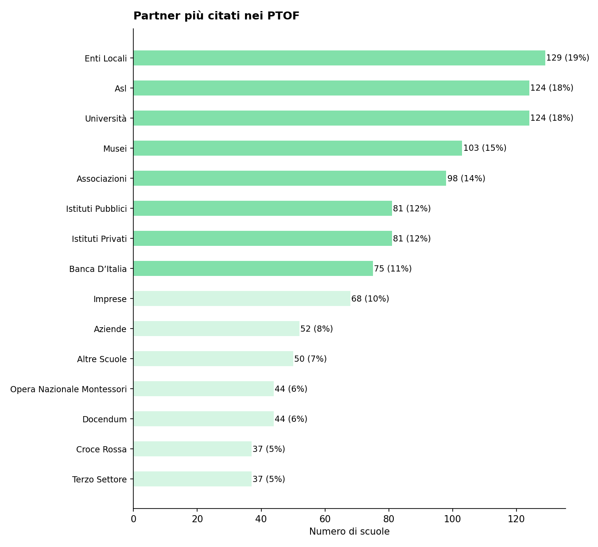
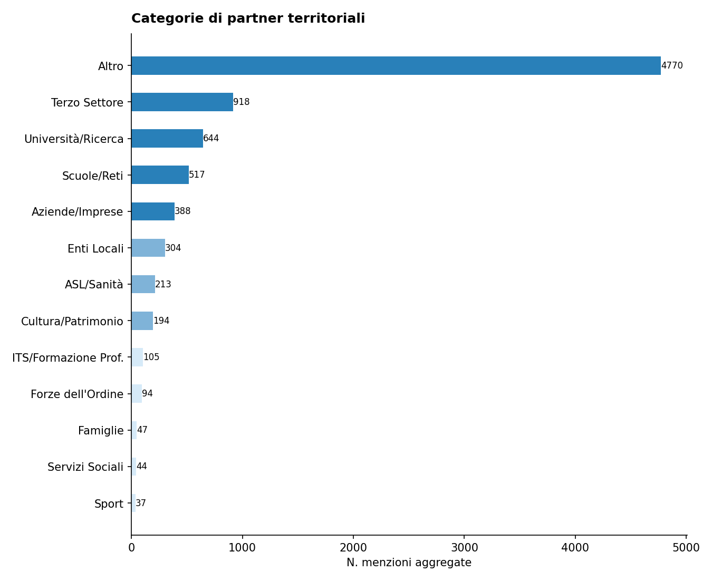

# Report di Sintesi sull'Orientamento nei PTOF — II Grado

*Target Analisi: II Grado*
*Generato con: openrouter / google/gemini-3-flash-preview*

## Premessa: Cosa Misuriamo e Perché
Questo report analizza i PTOF (Piani Triennali dell'Offerta Formativa) delle scuole secondarie di II grado per misurarne la copertura informativa in tema di orientamento scolastico e formativo: quanto e come il documento descrive le pratiche, i progetti e le strategie che l'istituzione adotta per supportare gli studenti nelle loro scelte future.

È importante chiarire fin da subito un principio fondamentale: i punteggi che seguono non esprimono un giudizio sulla qualità della scuola, ma sulla ricchezza e completezza della documentazione contenuta nel PTOF. Una scuola con un punteggio basso potrebbe svolgere ottime attività di orientamento senza averle descritte nel proprio piano; viceversa, un punteggio elevato indica che il PTOF documenta in modo dettagliato e strutturato le proprie pratiche orientative. 

L'analisi si concentra sulla capacità del documento di riflettere l'attuazione delle riforme vigenti, con particolare riferimento ai moduli curricolari di orientamento formativo di almeno 30 ore, resi obbligatori dal D.M. 328/2022 per tutte le scuole secondarie, e alla formalizzazione delle figure del docente tutor e del docente orientatore. I risultati sono espressi su una scala da 1 a 7, dove ogni livello corrisponde a un differente grado di densità informativa: Assente (1), Traccia minima (2), Copertura parziale (3), Copertura di base (4), Copertura strutturata (5), Copertura approfondita (6) e Copertura esaustiva (7).
## Come Funziona l'Analisi
L'analisi automatizzata legge e interpreta il testo del PTOF su due livelli complementari.

1. Analisi Strutturale (Compliance): Il sistema verifica la conformità formale rispetto alle Linee Guida per l'orientamento stabilite dal D.M. 328/2022. Tale normativa ha introdotto l'obbligo per le scuole secondarie di I e II grado di dedicare moduli curricolari di orientamento formativo di almeno 30 ore annuali e di individuare le figure del docente tutor e del docente orientatore. In concreto, si verifica se il PTOF contiene una sezione esplicitamente dedicata all'orientamento, valutandone la visibilità e la struttura nel documento.

2. Analisi Semantica e di Contenuto: Attraverso modelli di linguaggio avanzati (LLM), l'analisi esamina l'intero documento per misurare la copertura informativa delle 6 dimensioni del framework di valutazione. In questa fase, vengono distinte le semplici dichiarazioni di intenti dalle azioni concrete, mappando la presenza di progetti, risorse, tempi e responsabilità. L'algoritmo rileva il contesto in cui appaiono i termini: ad esempio, distingue se l'orientamento scolastico e formativo è citato in una lista generica oppure se è descritto attraverso laboratori con obiettivi specifici e modalità di verifica. I punteggi risultanti sono espressi su una scala 1-7, dove ogni livello corrisponde a un grado crescente di copertura informativa, dall'Assente (1) alla Copertura esaustiva (7).
## Le 6 Dimensioni del Framework di Valutazione

L'analisi semantica valuta la copertura del PTOF attraverso **6 dimensioni**. Ognuna rappresenta un aspetto fondamentale dell'orientamento scolastico: dalla struttura organizzativa alle finalità educative, dalle metodologie didattiche alle opportunità offerte agli studenti. Di seguito, ciascuna dimensione è descritta con i propri sotto-indicatori.

### Dimensione Strutturale e di Contesto
Valuta se l'orientamento ha una collocazione riconoscibile all'interno del PTOF e se la scuola è inserita in un tessuto di relazioni territoriali.
- **Sezione dedicata**: Presenza di un capitolo o paragrafo esplicitamente intitolato all'orientamento, non frammentato tra diverse parti del documento.
- **Partnership e reti territoriali**: Qualità del coinvolgimento di soggetti esterni (Università, ITS, imprese, Terzo Settore), con attenzione ad attività congiunte e accordi formali.

### Finalità dell'Orientamento
Analizza gli obiettivi formativi che la scuola si pone attraverso le attività di orientamento.
- **Attitudini e Talenti**: Azioni per aiutare gli studenti a scoprire i propri punti di forza e inclinazioni personali.
- **Interessi Professionali**: Percorsi di esplorazione degli ambiti disciplinari e del mondo del lavoro.
- **Progetto di Vita**: Supporto alla costruzione di una traiettoria personale di lungo termine.
- **Transizioni Formative**: Accompagnamento nei passaggi critici tra cicli scolastici (primaria-secondaria, secondaria-università/lavoro).
- **Capacità Orientativa (Empowerment)**: Sviluppo di competenze trasversali che rendano lo studente autonomo nelle proprie scelte.

### Obiettivi di Incidenza
Misura l'attenzione del PTOF verso gli impatti sociali dell'orientamento.
- **Contrasto alla Dispersione**: Strategie di prevenzione dell'abbandono scolastico e iniziative di rimotivazione.
- **Riduzione dei NEET**: Azioni di collegamento scuola-lavoro per favorire l'occupabilità e contrastare il fenomeno dei giovani che non studiano né lavorano.
- **Continuità Territoriale**: Costruzione di ponti tra i diversi gradi di istruzione presenti sul territorio.
- **Lifelong Learning**: Concezione dell'orientamento come competenza permanente, utile per tutta la vita.

### Governance e Organizzazione
Esamina il modello organizzativo interno: chi fa cosa e come si coordina l'azione orientativa.
- **Coordinamento**: Presenza di figure dedicate come Funzioni Strumentali, referenti o commissioni per l'orientamento.
- **Dialogo Interno**: Coinvolgimento dei Consigli di Classe e dei docenti nella progettazione orientativa.
- **Alleanza con le Famiglie**: Iniziative strutturate di comunicazione e collaborazione con i genitori.
- **Monitoraggio**: Utilizzo di strumenti di feedback, questionari e dati per valutare l'efficacia delle azioni.
- **Inclusione**: Attenzione specifica a studenti con BES/DSA, studenti stranieri e situazioni di fragilità.

### Didattica Orientativa
Valuta il passaggio dalle dichiarazioni di principio alle pratiche concrete in aula.
- **Didattica Laboratoriale ed Esperienziale**: Attività basate sul *learning by doing* e sull'apprendimento attivo.
- **Centralità dello Studente**: Ruolo attivo degli studenti nella co-progettazione dei percorsi orientativi.
- **Interdisciplinarità**: Integrazione dell'orientamento nelle diverse discipline curricolari, non solo come attività aggiuntiva.
- **Flessibilità Organizzativa**: Adattamento di spazi, tempi e gruppi per favorire esperienze orientative efficaci.

### Opportunità Formative
Mappa l'ecosistema delle proposte extracurricolari e integrative offerte dalla scuola.
- **Attività Culturali e Artistiche**: Progetti di teatro, musica, scrittura creativa, visite a musei.
- **Laboratori Espressivi**: Percorsi manuali, artigianali o digitali che favoriscono la scoperta di talenti.
- **Sport e Attività Ricreative**: Offerta sportiva e ludica come strumento di socializzazione e benessere.
- **Volontariato e Service Learning**: Esperienze di impegno civico che collegano apprendimento e comunità.

## Dal Qualitativo al Quantitativo: la Scala di Punteggio
Ciascuna delle 6 dimensioni descritte viene valutata attraverso una scala numerica su 7, denominata scala di copertura informativa. Si tratta di una scala ordinale che consente di tradurre il grado di approfondimento della documentazione scolastica in punteggi confrontabili.

Il punteggio riflette il livello di dettaglio con cui il PTOF documenta le pratiche di orientamento formativo per quella dimensione: dal punteggio 1 (Assente) al punteggio 7 (Copertura esaustiva). La tabella seguente descrive ogni livello della scala:

\begin{tabularx}{\textwidth}{@{} c l X @{}}
\toprule
\textbf{Punti} & \textbf{Livello} & \textbf{Descrizione della copertura informativa} \\
\midrule
1 & Assente & Nessun riferimento all'orientamento nel documento. \\
2 & Traccia minima & Menzione generica o riproduzione di testi normativi senza personalizzazione rispetto al contesto scolastico. \\
3 & Copertura parziale & Intenzione progettuale dichiarata, ma priva di dettagli operativi sulle modalità di attuazione. \\
4 & Copertura di base & Azioni descritte in modo chiaro ed essenziale, con una prima contestualizzazione delle attività. \\
5 & Copertura strutturata & Azioni dettagliate con metodologie esplicitate, risorse indicate e pianificazione definita. \\
6 & Copertura approfondita & Azioni integrate nel curricolo scolastico, con presenza di indicatori di monitoraggio documentati. \\
7 & Copertura esaustiva & Documentazione sistematica e organica, con evidenze di processi di revisione e miglioramento continuo. \\
\bottomrule
\end{tabularx}
## L'Indice Sintetico: IIPO
Per avere una visione d'insieme della copertura documentale di ciascuna scuola, i punteggi delle 6 dimensioni vengono riassunti in un unico indicatore: l'IIPO (Indice di Documentazione delle Pratiche di Orientamento).

L'IIPO è calcolato come media aritmetica semplice dei punteggi delle 6 dimensioni (Strutturale, Finalità, Obiettivi, Governance, Didattica, Opportunità). Si è scelta una media non pesata per evitare di privilegiare a priori una dimensione rispetto alle altre, trattandole tutte come ugualmente rilevanti per la descrizione dell'offerta formativa.

Come leggere l'IIPO:
L’indice sintetico è espresso su scala 1-7. Ad esempio:
- Un IIPO di 5.0 indica che, in media, il PTOF presenta una Copertura strutturata (5) su tutte le dimensioni relative all'orientamento scolastico e formativo.
- Un IIPO di 3.0 segnala una Copertura parziale (3) complessiva.

Limiti da tenere presenti:
- *Effetto compensazione*: Essendo una media, l'IIPO può mascherare squilibri tra le dimensioni. Ad esempio, una scuola con punteggio 7 su Didattica e 1 su Governance otterrebbe un IIPO apparentemente nella norma. Per questo motivo, l'IIPO va sempre letto insieme ai punteggi delle singole dimensioni.
- *Sensibilità incrementale*: La scala a 7 livelli consente di cogliere differenze graduali tra le scuole del campione, evitando la polarizzazione tipica delle scale più strette.
## Approccio Analitico: Raggruppamento per Affinità

Oltre all'analisi dimensionale, il report utilizza una tecnica di **raggruppamento automatico** (clustering) per evitare di appiattire i risultati su una semplice media nazionale.

Il funzionamento è il seguente: il sistema analizza i profili di punteggio di tutte le scuole e individua **gruppi di istituti** che presentano caratteristiche documentali simili. Nel campione corrente sono stati identificati **5 gruppi omogenei** — ad esempio, un gruppo potrebbe riunire scuole con forte attenzione ai PCTO e alle partnership territoriali, mentre un altro potrebbe raccogliere istituti che privilegiano la didattica laboratoriale.

Per ciascun gruppo viene generata una **sintesi tematica** che descrive l'approccio dominante su ogni dimensione. Queste sintesi intermedie vengono poi integrate nel report finale, permettendo di confrontare i diversi "profili di orientamento" e di evidenziare sia le tendenze comuni sia le eccezioni virtuose.

## Analisi e Copertura del Campione (II Grado)
Questa sezione descrive la composizione del campione analizzato e ne valuta la rappresentatività rispetto all'universo delle scuole italiane di secondo grado. Comprendere la struttura del campione è essenziale per interpretare correttamente i risultati: un campione ben bilanciato consente di generalizzare le osservazioni; un campione sbilanciato richiede cautela nell'estendere le conclusioni a tutto il sistema scolastico.

Per ogni dimensione di confronto (gestione, area geografica, contesto territoriale) la tabella riporta tre valori:
- Osservato %: la percentuale nel nostro campione.
- Atteso % (MIUR): la percentuale nell'universo reale delle scuole italiane, ricavata dai dati ministeriali.
- Deviazione (pp): la differenza tra osservato e atteso, espressa in *punti percentuali*. Deviazioni entro ±5 pp sono trascurabili; tra 5 e 15 pp segnalano un lieve squilibrio; oltre 15 pp indicano una sovra- o sotto-rappresentazione significativa.

Statistiche Generali

- Scuole Analizzate: 693 PTOF di scuole di II Grado
- Province Coperte: 100 (su 107 totali)
- Regioni Coperte: 18/20

Il campione copre la quasi totalità delle regioni italiane, garantendo una visione nazionale focalizzata sulla scuola secondaria di secondo grado.

Bilanciamento Gestione (Statale vs Paritaria)

In Italia, le scuole statali rappresentano la grande maggioranza degli istituti. Un campione rappresentativo dovrebbe riflettere questa proporzione. Una sovra-rappresentazione delle paritarie, ad esempio, potrebbe influenzare i risultati perché i PTOF delle scuole paritarie tendono ad avere strutture e contenuti diversi da quelli delle statali.

\begin{tabularx}{\textwidth}{@{} p{3cm} c c c @{}}
\toprule
\textbf{Tipo} & \textbf{Osservato \%} & \textbf{Atteso \% (MIUR)} & \textbf{Deviazione} \\
\midrule
Statale & 72.9\% & 92.0\% & -19.1 pp \\
Paritaria & 27.1\% & 8.0\% & +19.1 pp \\
\bottomrule
\end{tabularx}

Distribuzione Geografica per Macro-Area

L'offerta formativa presenta differenze territoriali che riflettono le specificità dei percorsi di istruzione secondaria. Per valutare se il campione rispecchia la distribuzione reale, confrontiamo le cinque macro-aree geografiche con i dati MIUR. Una buona rappresentatività geografica è fondamentale perché le pratiche di orientamento possono variare sensibilmente tra Nord e Sud, tra aree urbane e rurali.

\begin{tabularx}{\textwidth}{@{} X c c c @{}}
\toprule
\textbf{Area} & \textbf{Osservato \%} & \textbf{Atteso \% (MIUR)} & \textbf{Deviazione} \\
\midrule
Nord Ovest & 19.3\% & 26.6\% & -7.3 pp \\
Nord Est & 16.7\% & 19.3\% & -2.6 pp \\
Centro & 14.4\% & 19.9\% & -5.5 pp \\
Sud & 38.7\% & 23.3\% & +15.4 pp \\
Isole & 10.8\% & 10.9\% & -0.1 pp \\
\bottomrule
\end{tabularx}

⚠️ Nota sulla Rappresentatività: Il campione presenta significative deviazioni rispetto alla distribuzione attesa, in particolare per quanto riguarda la sovra-rappresentazione delle regioni meridionali rispetto a quelle settentrionali.

Distribuzione Territoriale (Aree Metropolitane vs Non Metropolitane)

Le scuole situate nelle 14 città metropolitane italiane operano in contesti caratterizzati da una fitta rete di università, imprese e ITS Academy. Questa distinzione aiuta a capire se i risultati del report sono influenzati da una prevalenza di scuole urbane o provinciali, fattore che incide sulla facilità di attivazione di percorsi di alternanza e PCTO.

\begin{tabularx}{\textwidth}{@{} X c c c @{}}
\toprule
\textbf{Area} & \textbf{Osservato \%} & \textbf{Atteso \% (Stima)} & \textbf{Deviazione} \\
\midrule
Metropolitana & 41.8\% & 33.0\% & +8.8 pp \\
Non Metropolitana & 58.2\% & 67.0\% & -8.8 pp \\
\bottomrule
\end{tabularx}

Implicazioni per la Lettura del Report

Il campione di 693 istituzioni scolastiche di secondo grado presenta alcune distorsioni strutturali che ne limitano la piena generalizzabilità al sistema nazionale. Sebbene la numerosità delle osservazioni permetta un’analisi statistica robusta, l’architettura dei dati rivela squilibri significativi sia sulla natura giuridica degli istituti sia sulla distribuzione geografica. Tali asimmetrie impongono una lettura prudente: le evidenze emerse potrebbero riflettere dinamiche specifiche di determinati segmenti educativi o aree territoriali piuttosto che una panoramica universale.

Un primo scostamento rilevante riguarda la sovrarappresentazione delle scuole paritarie (+19.1 pp). Questa deviazione influenza la dimensione della governance e della didattica orientativa, poiché le istituzioni paritarie tendono a descrivere modelli di flessibilità didattica talvolta divergenti da quelli della scuola statale. Analogamente, si osserva una marcata concentrazione di risposte provenienti dalle regioni del Sud (+15.4 pp) e dalle aree metropolitane. Queste distorsioni impongono di calibrare l'analisi sulle opportunità territoriali in uscita e sulla continuità con il mondo del lavoro: l'accento su determinati percorsi verso università o ITS Academy risente dei contesti socio-economici regionali, mentre la forte presenza urbana potrebbe sovrastimare la disponibilità di partner per i PCTO o collaborazioni strutturate.

In conclusione, i risultati riflettono una risposta più attiva da parte di specifici territori e tipologie gestionali. La validità dell'analisi resta elevata per l'identificazione delle metodologie adottate, documentando come le scuole si stiano adeguando alle disposizioni del D.M. 328/2022, che prevede l'obbligatorietà dei moduli da 30 ore di orientamento formativo e l'introduzione delle figure del docente tutor e del docente orientatore nelle scuole secondarie di I e II grado.

\newpage
## Sintesi Quantitativa: Le Dimensioni dell'Orientamento
Di seguito il dettaglio dei punteggi medi rilevati per le dimensioni e i relativi sotto-indicatori del campione di 671 scuole di secondo grado.

Dimensione Strutturale (Compliance)
Media: 2.62 (dev.std: 2.02)

Finalità dell'Orientamento

\begin{tabularx}{\textwidth}{@{} X c c @{}}
\toprule
\textbf{Indicatore} & \textbf{Media} & \textbf{Dev. Std.} \\
\midrule
\textbf{Totale Dimensione} & \textbf{3.68} & \textbf{1.14} \\
Attitudini e Talenti & 3.74 & 1.16 \\
Interessi Professionali & 3.73 & 1.16 \\
Progetto di Vita & 3.53 & 1.44 \\
Transizioni Formative & 3.82 & 1.28 \\
Capacità Orientative & 3.51 & 1.41 \\
\bottomrule
\end{tabularx}

Obiettivi di Incidenza

\begin{tabularx}{\textwidth}{@{} X c c @{}}
\toprule
\textbf{Indicatore} & \textbf{Media} & \textbf{Dev. Std.} \\
\midrule
\textbf{Totale Dimensione} & \textbf{3.21} & \textbf{1.15} \\
Contrasto Dispersione & 3.13 & 1.55 \\
Continuità Territorio & 3.76 & 1.29 \\
Riduzione NEET & 2.41 & 1.31 \\
Lifelong Learning & 3.30 & 1.35 \\
\bottomrule
\end{tabularx}

Governance e Organizzazione

\begin{tabularx}{\textwidth}{@{} X c c @{}}
\toprule
\textbf{Indicatore} & \textbf{Media} & \textbf{Dev. Std.} \\
\midrule
\textbf{Totale Dimensione} & \textbf{3.66} & \textbf{1.10} \\
Coordinamento & 3.66 & 1.23 \\
Dialogo Interno & 3.67 & 1.28 \\
Alleanza Famiglie & 3.95 & 1.18 \\
Monitoraggio & 3.06 & 1.30 \\
Inclusione & 3.90 & 1.18 \\
\bottomrule
\end{tabularx}

Didattica Orientativa

\begin{tabularx}{\textwidth}{@{} X c c @{}}
\toprule
\textbf{Indicatore} & \textbf{Media} & \textbf{Dev. Std.} \\
\midrule
\textbf{Totale Dimensione} & \textbf{3.65} & \textbf{1.02} \\
Centralità Studente & 3.97 & 1.26 \\
Didattica Laboratoriale & 3.34 & 1.21 \\
Flessibilità & 3.43 & 1.21 \\
Interdisciplinarità & 3.81 & 1.17 \\
\bottomrule
\end{tabularx}

Opportunità Formative

\begin{tabularx}{\textwidth}{@{} X c c @{}}
\toprule
\textbf{Indicatore} & \textbf{Media} & \textbf{Dev. Std.} \\
\midrule
\textbf{Totale Dimensione} & \textbf{3.18} & \textbf{1.09} \\
Attività Culturali & 3.23 & 1.44 \\
Laboratori Espressivi & 3.81 & 1.35 \\
Attività Ricreative & 2.73 & 1.15 \\
Volontariato & 2.76 & 1.39 \\
Sport & 3.20 & 1.31 \\
\bottomrule
\end{tabularx}

*Legenda Copertura Informativa: Copertura esaustiva (7), Copertura approfondita (6), Copertura strutturata (5), Copertura di base (4), Copertura parziale (3), Traccia minima (2), Assente (1)*

\newpage

Panoramica Grafica dei Sotto-Indicatori

\noindent
\begin{minipage}[t]{0.47\textwidth}
\centering
\includegraphics[width=\textwidth]{images/bar_finalita_dellorientamento_compact_20260216_074229.png}
\end{minipage}
\hfill
\begin{minipage}[t]{0.47\textwidth}
\centering
\includegraphics[width=\textwidth]{images/bar_obiettivi_di_incidenza_compact_20260216_074229.png}
\end{minipage}

\vspace{0.5cm}

\noindent
\begin{minipage}[t]{0.47\textwidth}
\centering
\includegraphics[width=\textwidth]{images/bar_governance_e_organizzazione_compact_20260216_074229.png}
\end{minipage}
\hfill
\begin{minipage}[t]{0.47\textwidth}
\centering
\includegraphics[width=\textwidth]{images/bar_didattica_orientativa_compact_20260216_074229.png}
\end{minipage}

\vspace{0.5cm}

\noindent
\hfill
\begin{minipage}[t]{0.47\textwidth}
\centering
\includegraphics[width=\textwidth]{images/bar_opportunita_formative_compact_20260216_074229.png}
\end{minipage}
\hfill

Panoramica dei Risultati Quantitativi

L'analisi dei dati delinea un quadro documentale in cui la dimensione delle Finalità emerge come la più solida, con un punteggio medio di 3.68 su scala 1-7. Tale valore indica una copertura informativa di livello Copertura parziale tendente alla Copertura di base, suggerendo che gli istituti riescono a descrivere con sufficiente chiarezza le intenzioni pedagogiche legate alla scoperta delle attitudini e alla gestione delle transizioni verso l'università o il lavoro. Al contrario, la dimensione più debole risulta essere quella delle Opportunità Formative, che con una media di 3.18 su 7 si ferma a una soglia di Copertura parziale. Questo divario indica che, sebbene le scuole dichiarino con una certa proprietà cosa intendono ottenere dall'orientamento, faticano a documentare nel PTOF la ricchezza delle esperienze concrete extra-curricolari, come il volontariato o le attività ricreative, che restano spesso ai margini della progettazione ufficiale. Un dato ulteriormente critico è rappresentato dalla Dimensione Strutturale, che con un punteggio di 2.62 su 7 evidenzia una Traccia minima nell'allineamento alle disposizioni del D.M. 328/2022, segnalando una difficoltà nel tradurre l'obbligatorietà dei moduli di 30 ore e delle nuove figure di sistema in descrizioni operative dettagliate.

Esaminando la distribuzione interna alle dimensioni, emergono sotto-indicatori che rivelano gap inattesi e punti di forza specifici nella documentazione delle pratiche. All'interno della Governance, l'indicatore relativo al monitoraggio delle azioni si attesta su un valore di 3.06 su scala 1-7, distanziandosi dai punteggi più elevati ottenuti dall'alleanza con le famiglie (3.95 su 7) e dall'inclusione delle fragilità (3.90 su 7). Questa discrepanza suggerisce che, mentre le scuole documentano i rapporti relazionali e l'attenzione ai bisogni speciali, spesso non descrivono come intendono misurare l'efficacia dei propri percorsi orientativi. Analogamente, nell'ambito degli obiettivi di incidenza, il punteggio di 2.41 su 7 relativo al contrasto dei NEET rappresenta un valore critico rispetto alla media della dimensione (3.21 su 7). Tale dato indica che la documentazione scolastica non presidia ancora in modo strutturato il rischio di inattività post-diploma, limitandosi spesso a una menzione generica di questo fenomeno. Sul fronte della didattica, l'interdisciplinarità e la centralità dell'esperienza dello studente superano la soglia del 3.80 su 7, indicando una descrizione più approfondita della didattica orientativa rispetto alla flessibilità di tempi e spazi, che invece rimane ferma a una Copertura parziale.

Questi riscontri preparano il terreno per un approfondimento necessario su alcuni nodi cruciali. L'elevata variabilità della Dimensione Strutturale richiede un'analisi attenta di come le scuole stiano recependo le figure del docente tutor e del docente orientatore — introdotte per le scuole secondarie di I e II grado dal D.M. 328/2022 — dato che il punteggio medio di 2.62 su 7 suggerisce un'applicazione spesso formale nei documenti. Inoltre, i punteggi relativi ai PCTO e al rapporto con il territorio, pur essendo tra i più alti del framework, meritano una verifica per capire se alla ricchezza descrittiva corrisponda un'autentica capacità di auto-direzione dello studente. Infine, la discrepanza tra la volontà dichiarata di supportare il progetto di vita (3.53 su 7) e la carenza di monitoraggio strutturato apre una riflessione sulla sostenibilità delle strategie di orientamento documentate, specialmente alla luce dell'obbligatorietà dei nuovi moduli formativi.

\newpage
## Profili dei Cluster e Differenze
L'analisi automatica condotta sui documenti strategici ha permesso di identificare cinque cluster distinti, che raggruppano complessivamente 693 istituzioni scolastiche di secondo grado, offrendo uno spaccato eterogeneo sulla profondità della documentazione relativa all'orientamento.

Il primo gruppo, definito come Cluster 0, comprende 112 scuole e si distingue per un approccio all'orientamento prevalentemente integrato nella didattica e nel miglioramento scolastico, piuttosto che strutturato in una sezione documentale autonoma. In queste istituzioni, la copertura informativa si attesta mediamente su un livello di Copertura di base (4), indicando che, sebbene l'orientamento sia menzionato in relazione agli obiettivi formativi e alla transizione tra gradi di istruzione, manca spesso una formalizzazione strategica dedicata. Le evidenze testuali mostrano una forte attenzione al monitoraggio degli apprendimenti e alla prevenzione dell'abbandono, con una tendenza a utilizzare i dati per il miglioramento continuo dell'offerta. Un esempio è fornito dalla scuola Aniene -Agraria Agroalimentare E Agroindustria (RMTAPV5005) (Lazio), che evidenzia come l'orientamento sia vissuto come un processo di ottimizzazione delle metodologie e di rafforzamento del legame con il territorio, pur con un punteggio di copertura informativa che, su scala 1-7, si ferma alla Copertura di base (4), rimanendo ancorato a una descrizione essenziale delle azioni di uscita.

Il Cluster 1 raccoglie 77 scuole ed è caratterizzato dalla configurazione informativa più fragile tra i gruppi analizzati, con una copertura che spesso oscilla tra il livello di Traccia minima (2) e quello di Copertura parziale (3). In questo contesto, l'orientamento è frequentemente privo di una sezione dedicata e compare in modo frammentario o puramente dichiarativo. Le scuole appartenenti a questo cluster sembrano focalizzare la propria documentazione più sul benessere psicofisico e sull'accoglienza iniziale che sulla costruzione di un percorso di auto-direzione verso il post-diploma. Nondimeno, l'analisi rileva alcune eccezioni documentali, come nel caso della scuola I.C.Breda (MIEE8EU01T) (Lombardia), che tenta di dedicare uno spazio esplicito alla tematica, discostandosi dalla tendenza reattiva del gruppo, che solitamente limita la propria azione alla rilevazione di criticità esistenti piuttosto che alla loro prevenzione strutturale.

Un gruppo più ristretto di 25 istituti compone il Cluster 2, dove il tratto dominante è l'identificazione quasi esclusiva dell'orientamento con i Percorsi per le Competenze Trasversali e per l'Orientamento (PCTO). Qui, la copertura informativa su scala 1-7 indica una Copertura di base (4) per quanto concerne l'alternanza scuola-lavoro, ma rivela lacune significative nella definizione di strategie di monitoraggio e metodologie riflessive autentiche. Sebbene istituzioni come la Ente Religioso Compassioniste Serve Di Maria (NA1E114004) (Campania) e la Scuola Piccolo Uomo (RM1ES55005) (Lazio) documentino l'integrazione di moduli di orientamento, il profilo generale del cluster evidenzia una carenza di visione strategica ampia, riducendo spesso l'orientamento a una serie di adempimenti legati alla formazione dei docenti o alla gestione burocratica dei percorsi esterni.

Il Cluster 3, che coinvolge 50 scuole, presenta un profilo di documentazione frammentario e non strutturato, dove l'orientamento viene spesso assorbito all'interno delle sezioni dedicate all'inclusione o all'offerta formativa generale. Analogamente al cluster precedente, emerge una forte dipendenza narrativa dalla terminologia dell'Alternanza Scuola Lavoro, talvolta utilizzata in modo obsoleto rispetto alla normativa vigente sui PCTO. La scuola Istituto San Giuseppe Calasanzio (CA1M4N500E) (Sardegna) rappresenta emblematicamente questa condizione, dichiarando nel proprio PTOF una "frammentazione e scarsa integrazione" delle attività di continuità. Il punteggio di copertura informativa in questo gruppo suggerisce una difficoltà sistematica nel tradurre le intenzioni pedagogiche in piani d'azione definiti, con una cronica assenza di indicatori di monitoraggio specifici per le attività orientative.

Infine, il Cluster 4 rappresenta il gruppo più numeroso con 429 scuole, caratterizzato da una presenza dell'orientamento diffusa ma comunque priva di un'architettura documentale autonoma e strategica. In queste scuole, la copertura informativa si posiziona stabilmente su un livello di Copertura di base (4 su 7), con una narrazione che privilegia l'ampliamento dell'offerta formativa attraverso progetti specifici e collaborazioni esterne. L'attenzione è rivolta alla gestione del disagio giovanile e allo sviluppo di competenze trasversali, tuttavia l'orientamento non viene ancora descritto come un pilastro strategico del Piano Triennale dell'Offerta Formativa. Le evidenze mostrano un impegno significativo nell'analisi dei dati di rendimento per identificare criticità, ma una minore profondità nel documentare il "Capolavoro" dello studente o l'uso riflessivo dell'E-Portfolio, strumenti invece centrali nella riforma introdotta dal D.M. 328/2022.

In sintesi, emerge una chiara divergenza tra la consapevolezza dell'importanza dell'orientamento, dichiarata in modo trasversale in quasi tutti i cluster, e l'effettiva capacità di documentare tali pratiche in modo sistematico. Mentre i Cluster 0 e 4 mostrano una maggiore proattività nel legare l'orientamento al miglioramento dei risultati e all'inclusione, i Cluster 1, 2 e 3 soffrono di una frammentazione che riduce l'orientamento a un'attività episodica o puramente legata ai PCTO. La convergenza principale risiede nella difficoltà comune a tutti i gruppi di superare la soglia della Copertura strutturata (5 su 7), segnalando che la transizione verso una didattica orientativa pienamente integrata e documentata è ancora in una fase di assestamento rispetto agli obblighi previsti dal D.M. 328/2022, che impone moduli da 30 ore per tutte le scuole secondarie di I e II grado e l'istituzione dei docenti tutor e orientatori.
## Commento di Sintesi Generale
L’analisi del sistema di orientamento all’interno dei PTOF per la scuola secondaria di II grado delinea un panorama caratterizzato da una documentazione ancora in fase di transizione, dove l’allineamento normativo precede spesso la reale strutturazione strategica. L’Indice di Documentazione delle Pratiche di Orientamento (IIPO) medio per il campione di 671 istituzioni scolastiche analizzate si attesta su un valore di 3.51 su scala 1-7 (1=Assente, 7=Copertura esaustiva). Tale dato indica una copertura informativa che si colloca tra il livello di "Copertura parziale" e quello di "Copertura di base", suggerendo che, sebbene l’orientamento sia presente nei documenti di pianificazione, la sua descrizione rimane frequentemente ancorata a dichiarazioni di intenti o a riferimenti normativi generali, senza raggiungere una narrazione sistematica dei processi attuativi.

Esaminando le singole dimensioni, il framework evidenzia una polarizzazione tra le Finalità (media 3.68 su scala 1-7), che costituiscono l’area più presidiata, e le Opportunità formative opzionali (media 3.18 su scala 1-7), che risultano la dimensione meno documentata. Questo scostamento indica che le scuole dichiarano con relativa chiarezza l’intenzione di supportare le attitudini e il progetto di vita degli studenti, ma faticano a descrivere l’offerta di attività emotive e integrative — come il volontariato, lo sport o le esperienze ludico-espressive — come parte integrante del percorso orientativo. La Governance (media 3.66 su scala 1-7) e la Didattica Orientativa (media 3.65 su scala 1-7) mostrano una copertura di base, riflettendo lo sforzo di integrazione del D.M. 328/2022, mentre gli Obiettivi (media 3.21 su scala 1-7) appaiono spesso deboli, con una carenza documentale specifica per quanto riguarda il contrasto al fenomeno dei NEET e il monitoraggio dell'efficacia delle azioni nel lungo periodo.

La distribuzione dei dati mostra una variabilità contenuta, con una forte concentrazione nel Cluster 4, dove l'orientamento è descritto come una presenza diffusa ma frammentata. In questa vasta coorte di istituti, l'orientamento non viene percepito come un pilastro autonomo ma come un'attività ancillare ad altri ambiti. Le "Aree di Debolezza" ricorrenti segnalate nei riassunti sottolineano l'assenza di sezioni dedicate e coordinate. Ad esempio, il Liceo Carducci (MIPC03000N) [Lombardia] descrive un orientamento in entrata strutturato, ma in molti altri casi, come per l'ISIS De Sarlo-De Lorenzo (PZIS001007) [Basilicata], la documentazione si limita a elencare attività tradizionali come gli open day o i laboratori, senza evidenziare una visione strategica organica che accompagni l'intero quinquennio.

Un tema critico che emerge dall'analisi è la distinzione tra l'orientamento come adempimento burocratico e come scelta strategica. Le scuole devono adottare i moduli curricolari di orientamento di almeno 30 ore per anno scolastico, come previsto dal D.M. 328/2022; tuttavia, persiste una tendenza a confondere l'orientamento formativo con la mera informazione sulle scadenze o con la didattica disciplinare decontestualizzata. Un segnale di questa ambiguità è l'inclusione di contenuti puramente tecnici sotto la voce orientamento, come rilevato nei documenti di istituti quali il C. Zuccante (TVPSIL5006) [Veneto] o il G. Natta (RMIS01600N) [Lazio], dove l'accezione tecnica e strumentale del termine si sovrappone impropriamente a quella formativa.

L'integrazione nella didattica curricolare quotidiana rimane l’ostacolo principale. Molte scuole, pur dichiarando il valore dell'orientamento, lo relegano ad attività episodiche o a moduli separati. Tuttavia, si osservano casi di transizione verso un modello più riflessivo: l'Istituto Primo Levi (MOPS00201V) [Emilia-Romagna] propone letture di testi e produzione di elaborati che portino a una riflessione sul sé, spostando il baricentro dell'azione dallo studente come destinatario passivo di informazioni allo studente come soggetto agente capace di auto-direzione. Al contempo, emerge una marcata fragilità nella responsabilità sociale della scelta: i riferimenti alla sostenibilità e alla dignità della persona nel lavoro sono ancora limitati, e l'orientamento sembra focalizzarsi prevalentemente sulla transizione verso l'università o gli ITS Academy.

Nelle sezioni successive verranno approfonditi i modelli di governance, analizzando come le figure del docente tutor e del docente orientatore, introdotte dal D.M. 328/2022 nelle scuole secondarie di I e II grado, stiano influenzando la qualità della documentazione, e si esplorerà il ruolo dei PCTO come dispositivo centrale per l'acquisizione di competenze trasversali nel triennio finale. L'analisi si sposterà poi sulle strategie specifiche di contrasto alla dispersione, verificando se la copertura di base rilevata nei dati aggregati si traduca in azioni concrete di supporto alle fragilità.
## Allineamento Normativo e Approccio Innovativo
L’analisi del sistema scolastico di secondo grado evidenzia un recepimento delle recenti riforme sull'orientamento che oscilla sensibilmente tra l’adempimento burocratico e l'integrazione pedagogica riflessiva. Il punteggio medio di allineamento normativo (indicatore 2_1_score) si attesta su un valore di 2.62 su scala 1-7, un dato che indica una copertura informativa situata tra una "Traccia minima (2)" e una "Copertura parziale (3)". Questo punteggio rivela una persistente distanza tra la vigenza degli obblighi introdotti dal D.M. 328/2022 e la loro sistematizzazione documentale nei PTOF. Sebbene le scuole citino spesso i nuovi dispositivi normativi, la traduzione in azioni metodologicamente dettagliate appare ancora in una fase di transizione, con una tendenza a sovrapporre i nuovi moduli da 30 ore a strutture preesistenti come i PCTO.

Il recepimento normativo si manifesta primariamente su un piano formale, dove la citazione del D.M. 328/2022 o del PNRR funge da cornice giustificativa. Tuttavia, il passaggio a un recepimento sostanziale è documentato in modo più efficace solo in alcuni cluster (come il Cluster 4, n=407), dove si osserva un focus più deciso sull’orientamento formativo. Un esempio di recepimento esplicito è rintracciabile nell'I.I.S. Delfico-Montauti (TEIS012009) [Abruzzo], che ancora esplicitamente le proprie attività alla Missione 4 del PNRR, definendo i percorsi come "Orientamento Attivo". Dall'altro lato, una parte del campione (Cluster 3, n=50) mostra un approccio ancora frammentario e subalterno, dove l’orientamento non gode di una sezione autonoma ma viene diluito in altri capitoli dell'Offerta Formativa, limitando la visibilità della strategia istituzionale.

Per quanto riguarda le figure del Tutor e dell'Orientatore, la loro presenza è diffusamente menzionata in ottemperanza ai decreti vigenti, ma la descrizione operativa dei loro compiti rimane spesso generica. Il D.M. 328/2022 ha introdotto il docente orientatore e il docente tutor nelle scuole secondarie di I e II grado come figure chiave per supportare gli studenti nella costruzione del proprio percorso. Fa eccezione il Liceo Lussana (MIPC10500T) [Lombardia], che documenta dodici ore di colloqui personali per gli studenti con il proprio "Tutor di classe", configurando questa figura non solo come supervisore burocratico, ma come facilitatore di riflessione individuale. Analogamente, l'I.P.S. Sannino-De Cillis (NARC118016) [Campania] esplicita l'integrazione di tutor interni ed esterni per supportare cicli di moduli strutturati. Nondimeno, in molti altri contesti, queste figure appaiono come etichette applicate a funzioni già esistenti, senza che ne venga dettagliato il ruolo specifico nel monitoraggio dell'E-Portfolio o nella validazione del "Capolavoro" dello studente.

L'adozione dei moduli di orientamento formativo di almeno 30 ore annue è obbligatoria per tutte le scuole secondarie ai sensi della normativa vigente. Tale aspetto è il più visibile nelle evidenze documentali, sebbene la qualità della loro descrizione vari. Diverse scuole, tra cui il Liceo Galanti (CBPM040008) [Molise] e l'I.I.S. Galilei (PVIS01600V) [Lombardia], riportano tabelle specifiche per il triennio che distinguono tra ore curricolari ed extracurricolari, evidenziando il raggiungimento del monte ore prescritto. Tuttavia, emerge il rischio che queste 30 ore vengano sature attraverso la semplice somma di attività eterogenee. Ad esempio, presso l'Istituto Barbara Melzi (MIRFHT500U) [Lombardia], il modulo orientativo include formazione sulla sicurezza e primo soccorso accanto a incontri con testimoni del mondo del lavoro. Sebbene tali attività siano formative, la loro valenza orientativa in senso stretto — ovvero la capacità di promuovere l'auto-direzione e la riflessione sulle attitudini — dipende dalla capacità dei docenti di integrarle in un percorso riflessivo, come suggerito dall'inserimento di ore dedicate alla "rielaborazione dell’esperienza".

Alcuni istituti si distinguono per un approccio che supera il minimo normativo, tentando di costruire un "curricolo orientativo" che parta sin dal biennio. L'I.T.E. Scaruffi-Levi-Tricolore (RETD09000V) [Emilia-Romagna] documenta moduli specifici sin dalla classe prima e seconda, promuovendo una continuità interna verso la scelta dei percorsi professionalizzanti. Altrettanto degno di nota è l'approccio dell'I.I.S. Primo Levi (MOIS00200C) [Emilia-Romagna], che denomina i propri moduli con titoli evocativi come "Cosa so - cosa sogno", suggerendo una transizione dai test diagnostici standardizzati a strumenti riflessivi volti alla costruzione del progetto di vita. In conclusione, sebbene la copertura informativa complessiva rimanga ferma a un livello di "Traccia minima (2)" o "Copertura parziale (3)" su scala 1-7, si osserva un gruppo di scuole che sta trasformando l'obbligo normativo in un dispositivo formativo integrato, coerente con i principi di responsabilità sociale e dignità della persona.
## Rapporto con il Territorio
Partner territoriali più diffusi nel campione

\begin{tabularx}{\textwidth}{@{} X l c c @{}}
\toprule
\textbf{Partner} & \textbf{Categoria} & \textbf{N. Scuole} & \textbf{\% Campione} \\
\midrule
Enti Locali & Altro & 129 & 18.6\% \\
Asl & ASL/Sanità & 124 & 17.9\% \\
Università & Università/Ricerca & 124 & 17.9\% \\
Musei & Altro & 103 & 14.9\% \\
Associazioni & Terzo Settore & 98 & 14.1\% \\
Istituti Pubblici & Altro & 81 & 11.7\% \\
Istituti Privati & Altro & 81 & 11.7\% \\
Banca D’Italia & Altro & 75 & 10.8\% \\
Imprese & Aziende/Imprese & 68 & 9.8\% \\
Aziende & Aziende/Imprese & 52 & 7.5\% \\
Altre Scuole & Scuole/Reti & 50 & 7.2\% \\
Opera Nazionale Montessori & Altro & 44 & 6.3\% \\
Docendum & Altro & 44 & 6.3\% \\
Croce Rossa & Terzo Settore & 37 & 5.3\% \\
Terzo Settore & Terzo Settore & 37 & 5.3\% \\
\bottomrule
\end{tabularx}

Distribuzione per categoria di partner

L’analisi della documentazione relativa alle relazioni territoriali nelle scuole secondarie di II grado rivela un panorama complesso, dove la rete di collaborazioni è strettamente funzionale all’adempimento dei percorsi orientativi obbligatori. Il punteggio medio di 3.76 su scala 1-7 per quanto riguarda l’obiettivo di continuità con il territorio indica una copertura informativa situata tra una "Copertura parziale" e una "Copertura di base". Questo dato suggerisce che, mentre la quasi totalità degli istituti dichiara l’esistenza di rapporti esterni, la descrizione dettagliata delle finalità strategiche di tali reti non è sempre approfondita. Analogamente, la governance dei servizi, con un punteggio di 3.66 su scala 1-7, conferma una documentazione spesso limitata all'elencazione formale dei partner piuttosto che alla descrizione di un coordinamento sistemico.

I dati sulla frequenza dei partner evidenziano una netta prevalenza degli Enti Locali (18.6%) e delle Università (17.9%), seguite dalle ASL. La forte presenza degli atenei è coerente con la missione della scuola secondaria di II grado di preparare lo studente alla transizione verso l'istruzione terziaria. Tuttavia, appare significativo il dato relativo alle "Imprese" e alle "Aziende", che sommate raggiungono circa il 17% delle citazioni, riflettendo la centralità dei PCTO (Percorsi per le Competenze Trasversali e l'Orientamento) come fulcro delle relazioni esterne. Esiste però un forte sbilanciamento: le categorie legate a "ITS e Formazione Professionale" restano sottorappresentate rispetto alla ricerca accademica, evidenziando una potenziale criticità nella documentazione di percorsi professionalizzanti alternativi all'università.

Le partnership documentate spaziano da collaborazioni locali a network internazionali di alto profilo. Un grado di "Copertura strutturata" è offerto dall'Istituto A. Volta (BATD105005), che vanta un network di venti partner tra cui figurano istituzioni come l'Università Bocconi, la London Business School e la Banca d’Italia, delineando un raggio d'azione che va ben oltre il confine locale per abbracciare una dimensione globale dell'orientamento. In molti altri contesti, come rilevato nel Cluster 4, prevale invece un approccio più pragmatico e limitato al territorio di prossimità, dove il rapporto con il mondo esterno è mediato quasi esclusivamente da stage e tirocini. Al contempo, il Terzo Settore emerge come un partner rilevante, offrendo agli studenti occasioni di orientamento legate alla responsabilità sociale e al volontariato, dimensioni fondamentali per lo sviluppo di una coscienza civile consapevole.

Il cuore pulsante di queste relazioni è rappresentato dai PCTO, che il D.M. 328/2022 integra all'interno dei moduli obbligatori di orientamento formativo da 30 ore per il triennio. La documentazione di tali percorsi varia sensibilmente tra i diversi istituti. Alcune realtà presentano i PCTO come esperienze autenticamente orientative; ad esempio, il Liceo B. Croce (PAPS100008) documenta convenzioni con l'Università di Palermo per attivare percorsi laboratoriali focalizzati sull'acquisizione di nuove competenze e linguaggi. Analogamente, l'Istituto E. Majorana (CBRA02601G) descrive i PCTO come percorsi strutturati che includono approfondimenti e stage volti a favorire la scelta universitaria o professionale. Tuttavia, in altri casi, i PTOF sembrano ridurre tali esperienze a un elenco burocratico di ore da completare, mancando di esplicitare gli obiettivi riflessivi e di auto-direzione dello studente, come evidenziato dalle analisi del Cluster 2.

Per quanto riguarda la continuità verticale, la documentazione si sofferma prevalentemente sulla transizione in uscita. Il dialogo con l'università e il mondo del lavoro è ben presidiato, come dimostrano le attività di orientamento presso le sedi universitarie documentate dall'istituto I.I.S. " L. Da Vinci - O. Colecchi (AQIS007009). La continuità in entrata, ovvero il raccordo con la scuola secondaria di I grado, è spesso citata come accoglienza, ma raramente documentata attraverso protocolli di monitoraggio o percorsi di riorientamento strutturati. Un elemento distintivo emerge nella funzione di "scuola accogliente" per il territorio: molti istituti, tra cui l'Istituto Majorana (CBRA02601G) e l'istituto Istituto Istruzione Superiore "C. Levi (NATD08401G), riportano la loro qualifica di scuole accreditate per ospitare i tirocinanti universitari di Scienze della Formazione o di altri ambiti, trasformando il rapporto con l'università in uno scambio bidirezionale dove la scuola diventa essa stessa luogo di formazione per i futuri docenti.

In sintesi, i PTOF delle scuole di II grado mostrano una rete territoriale densa, ma non sempre documentata con una visione organica. Laddove la scuola integra l'esterno non come semplice fornitore di ore di stage, ma come partner di un progetto educativo co-progettato, l'orientamento cessa di essere un adempimento e diventa un dispositivo di crescita. Tuttavia, l'ampio numero di menzioni di partner generici suggerisce che sussistano margini per una documentazione più sistematica della governance territoriale, affinché non si limiti a una sommatoria di convenzioni ma diventi un effettivo ecosistema formativo.
## Metodologie Didattiche
Metodologie più diffuse nel campione

\begin{tabularx}{\textwidth}{@{} X c c @{}}
\toprule
\textbf{Metodologia} & \textbf{N. Scuole} & \textbf{\% Campione} \\
\midrule
STEM & 681 & 98.3\% \\
Inclusione & 593 & 85.6\% \\
Volontariato & 518 & 74.7\% \\
PCTO & 206 & 29.7\% \\
Alternanza & 169 & 24.4\% \\
Stage & 149 & 21.5\% \\
Laboratorio & 110 & 15.9\% \\
Cittadinanza & 83 & 12.0\% \\
BES & 65 & 9.4\% \\
Digitale & 55 & 7.9\% \\
DSA & 50 & 7.2\% \\
Coding & 50 & 7.2\% \\
\bottomrule
\end{tabularx}

L'analisi delle metodologie didattiche documentate nei PTOF delle scuole secondarie di II grado evidenzia una chiara predominanza di approcci orientati alle competenze tecnico-scientifiche e all'inclusione, pur con una marcata eterogeneità nel grado di integrazione curricolare. I dati di frequenza del campione (n=692) rivelano che le metodologie STEM sono presenti nella quasi totalità degli istituti (681 scuole, 98.3%), seguite da strategie per l'Inclusione (85.6%) e attività di Volontariato (74.7%). È interessante notare come i Percorsi per le Competenze Trasversali e l'Orientamento (PCTO) siano esplicitamente citati come metodologia specifica dal 29.7% del campione, pur essendo una componente strutturale del triennio, spesso descritta sotto etichette come "Alternanza" (24.4%) o "Stage" (21.5%).

Il punteggio medio di 3.34 su scala 1-7 per la didattica laboratoriale indica una Copertura parziale. Questo dato suggerisce che, sebbene le intenzioni siano dichiarate, la descrizione dei dettagli attuativi rimane spesso superficiale. Al contrario, la didattica basata sull'esperienza degli studenti raggiunge una media di 3.97 su 7, segnando una Copertura di base che riflette una documentazione più puntuale di visite, viaggi d'istruzione e scambi culturali, considerati momenti chiave di maturazione personale.

L'integrazione curricolare dell'orientamento appare ancora come una sfida aperta. Sebbene l'orientamento debba essere una dimensione costitutiva dell'insegnamento, molte scuole tendono a relegarlo a progetti speciali o moduli separati. Tuttavia, emergono esempi dove la disciplina stessa diventa occasione orientativa. L'Istituto Silvio D'Arzo (REIS00400D), ad esempio, documenta l'uso del problem-solving ludico nella matematica attraverso i "Giochi di Archimede", con l'obiettivo esplicito di stimolare tecniche creative per "risolvere problemi mai visti prima". Analogamente, il Liceo Liceo - E. Setti Carraro Dalla Chiesa (MIPC110009) integra metodologie laboratoriali di domotica e robotica con la flessibilità di spazi e tempi, promuovendo un approccio interdisciplinare che non separa il sapere dal saper fare.

L'analisi della didattica attiva rivela che il termine "laboratorio" viene talvolta utilizzato come etichetta generica, ma non mancano evidenze di pratiche strutturate. La scuola I. I. S. S. "F. Patetta" - Cairo M. (SVIS00300A) definisce la didattica laboratoriale come un "pilastro metodologico" finalizzato all'acquisizione di competenze cognitive e sociali. In alcuni contesti, come nel Liceo Artistico I. S ." Nitti" Portici (NAIS10200N), il laboratorio è consustanziale all'indirizzo di studi, con attività in "Discipline Plastiche e Scultoree" e "Scenotecniche" che permettono un'immersione professionale diretta. Nondimeno, in altri casi, come rilevato nella scuola Cittadella Della Formazione (BAPSV85002), si evidenzia la necessità di potenziare la pervasività di tali attività in tutte le discipline, affinché l'orientamento diventi prassi quotidiana per l'intero corpo docente.

Il ruolo dello studente come soggetto agente emerge con forza laddove le scuole implementano percorsi di autodirezione e riflessione. La scuola Istituto Omnic. Citta' S. Angelo (PEPS004016) descrive un processo circolare che va dall'osservazione all'imitazione fino alla "formalizzazione cognitiva e generalizzazione", permettendo allo studente di rielaborare attivamente l'esperienza. L'adozione di politiche BYOD (Bring Your Own Device), documentata dal Tecnico Via Gramsci S.N.C. (RMTD099029) e dal Professionale Iiss N.Bergese (GERH023514), punta a responsabilizzare gli studenti nell'uso consapevole dei dispositivi per l'apprendimento, trasformandoli da fruitori passivi a produttori multimediali.

L'innovazione si manifesta inoltre in percorsi che superano la didattica trasmissiva. Il progetto "InnovaMenti" della scuola I.C. Spoleto 2 (PGEE84401P) introduce gamification, hackathon e inquiry-based learning, mentre il Liceo L.Sc.C.Miranda-F/Maggiore- (NAPS27000E) sperimenta il "job shadowing" nell'ambito della robotica e dell'automotive, permettendo agli studenti una riflessione diretta sull'esercizio professionale. Al contempo, pratiche come il "Rally Matematico Transalpino" citato dal liceo Liceo Classico Istituto Leone Xiii (MIPC10500T) utilizzano il cooperative learning per sviluppare competenze di cittadinanza e relazionali, dimostrando che l'orientamento può essere efficacemente veicolato attraverso competizioni e sfide intellettuali collettive. In sintesi, sebbene la copertura documentale sia ancora spesso ancorata a descrizioni di base, emerge un fermento metodologico che tenta di trasformare la scuola in un dispositivo di auto-direzione per il progetto di vita degli studenti.
## Strumenti di Supporto
L'analisi degli strumenti operativi e digitali documentati nei PTOF delle scuole secondarie di II grado rivela un panorama in cui la digitalizzazione, spinta dalle riforme normative introdotte dal D.M. 328/2022 e dai finanziamenti del PNRR, sta ridefinendo il perimetro dell'orientamento formativo. Gli strumenti che compaiono con maggiore frequenza sono l'E-Portfolio, la Piattaforma Unica del Ministero dell'Istruzione e del Merito (MIM) e l'ecosistema di Google Workspace (G-Suite) per la gestione delle competenze. Tuttavia, emerge una marcata eterogeneità nel grado di copertura informativa: se alcune scuole descrivono i dispositivi digitali come fulcri di una riflessione identitaria, molte altre si fermano a una citazione burocratica o metodologicamente scarna.

L'E-Portfolio è lo strumento cardine della nuova strategia orientativa. In molti istituti, come la scuola Giovanni Pascoli (FIPM02000L) (Toscana), esso viene descritto non come una mera cartella di certificazioni, ma come un dispositivo finalizzato a «documentare competenze e progetti di vita», suggerendo un approccio che mira alla costruzione di una traiettoria biografica. Analogamente, il Liceo Giuseppe Berto (TVPS04000Q) [Veneto] indica tra i propri obiettivi strategici la strutturazione di un portfolio digitale per «potenziare la consapevolezza della specificità degli indirizzi di studio». Tuttavia, persiste il rischio che l'E-Portfolio venga percepito come un adempimento compilativo. In numerosi PTOF, specialmente riferibili ai cluster con documentazione più frammentaria, lo strumento è citato come obbligo normativo senza dettagli sulle ore dedicate alla sua manutenzione o sul ruolo del docente tutor nel supportare lo studente nella selezione del "Capolavoro", ovvero l'elaborato più rappresentativo della propria crescita. Un'eccezione è rappresentata dalla scuola Amm/Vo Per Il Turismo D. Panedda (SSTD09000T) [Sardegna], che documenta un supporto specifico per la revisione e la compilazione, rendendo l'E-Portfolio un esercizio di autovalutazione attiva.

L'integrazione della Piattaforma Unica MIM appare ancora in una fase di assestamento. Ai sensi del D.M. 328/2022, le scuole adottano i moduli da 30 ore di orientamento formativo obbligatori, avvalendosi delle figure del docente tutor e del docente orientatore. Nonostante l'obbligatorietà, la documentazione di come i dati della piattaforma vengano rielaborati in classe è spesso carente. Il punteggio medio rilevato per la dimensione della "Didattica Orientativa" di 3.2 su scala 1-7 indica una situazione di Copertura parziale, confermando che gli strumenti digitali sono spesso menzionati ma poco dettagliati nelle loro implicazioni pedagogiche quotidiane. La Piattaforma Unica viene citata prevalentemente come il luogo di deposito del Consiglio Orientativo e dell'E-Portfolio, ma raramente i PTOF descrivono l'interazione tra l'interfaccia digitale e il dialogo educativo in presenza.

Un elemento critico emerge dalla distinzione tra test psicodiagnostici e questionari riflessivi. Prevale ancora un approccio di tipo "diagnostico", dove test standardizzati fotografano attitudini e interessi in momenti episodici, spesso in occasione delle simulazioni per l'università nel triennio finale. Questi strumenti, pur utili, rischiano di relegare lo studente a destinatario passivo di un profilo predefinito. Al contrario, sono meno frequenti le documentazioni di percorsi riflessivi sistematici che spingano lo studente a interrogarsi sulle proprie motivazioni profonde. Alcune realtà tentano di superare questa dicotomia integrando strumenti digitali per il «pensiero critico nella società digitale», come indicato dalla scuola Faicchio (BNIS02300V) [Campania], dove la tecnologia diventa pretesto per esplorare e applicare conoscenze in modo attivo. Altre, come il IIS Delfico-Montauti (TEIS012009) [Abruzzo], utilizzano i laboratori "Next Generation Labs" per sviluppare competenze personali in modo fluido, spostando il focus dal "test" all'esperienza laboratoriale orientativa.

Il Consiglio Orientativo è spesso citato come un dato acquisito, ma nei documenti raramente se ne descrive un utilizzo dinamico per il riorientamento interno. Nondimeno, il Liceo Giuseppe Berto (TVPS04000Q) [Veneto] dimostra una sensibilità specifica citando la necessità di «orientare e riorientare le scelte personali», suggerendo che gli strumenti non debbano solo sancire una scelta passata, ma supportare un processo continuo. La capacità di auto-direzione dello studente rimane dunque l'obiettivo più ambizioso e meno documentato: sebbene strumenti come il portale "MiAssumo" citato dalla scuola Albino - G.Solari (BGMM818013) [Lombardia] tentino di creare un raccordo tra competenze e mondo del lavoro, l'enfasi resta spesso sulle competenze tecniche (hard skills) o digitali, piuttosto che sulla maturazione di un'autonomia decisionale fondata sulla dignità della persona e sulla responsabilità sociale. In sintesi, la documentazione degli strumenti oscilla tra l'efficienza tecnologica (certificazioni ICDL, droni, realtà virtuale) e la necessità di una cornice narrativa che trasformi il dato digitale in autentica consapevolezza orientativa.
## Formazione del Personale
L’analisi della documentazione relativa alla formazione del personale nelle scuole secondarie di II grado rivela un panorama complesso, dove la preparazione dei docenti oscilla tra un consolidato impegno sul fronte del benessere e dell’inclusione e una fase embrionale per quanto concerne le specifiche competenze orientative richieste dal D.M. 328/2022. Il punteggio medio di 3,67 su scala 1-7 per la dimensione del dialogo tra docenti e studenti indica una copertura informativa situabile tra la Copertura parziale (3) e la Copertura di base (4). Questo dato suggerisce che, sebbene esista una struttura relazionale consolidata, spesso mediata dalla figura del coordinatore di classe come evidenziato nel Liceo Scientifico Galilei (PZPS040007), la traduzione di tale dialogo in un processo di orientamento sistematico e professionalizzato non è ancora pienamente documentata nella maggior parte dei PTOF analizzati.

Le evidenze testuali mostrano come la formazione documentata si concentri prevalentemente su aree diverse dall'orientamento formativo puro. È frequente riscontrare piani di aggiornamento focalizzati sulla sicurezza, sulle competenze digitali e, con particolare vigore nel Cluster 0 e nel Cluster 4, sull'inclusione di alunni con Bisogni Educativi Speciali (BES) e Disturbi Specifici dell’Apprendimento (DSA). Ad esempio, l'Istituto Professionale Paolo Frisi (MIRC058016) documenta percorsi formativi per la gestione dei comportamenti problema e l’inclusione di studenti con Disturbi Oppositivi Provocatori (DOP), mentre nel Liceo Statale Tarantino (BAPS07000G) la formazione è orientata ai Gruppi di Lavoro per l'Inclusione (GLI). In questi contesti, l'orientamento è spesso sussunto sotto la categoria del "benessere psicologico" o del "supporto alle fragilità", come dimostrato dalla centralità degli sportelli di ascolto e delle attività di counseling, piuttosto che essere configurato come una specifica competenza pedagogica dei docenti finalizzata all'auto-direzione dello studente.

Per quanto riguarda la preparazione dei tutor e del docente orientatore, figure obbligatorie ai sensi del D.M. 328/2022 per le scuole secondarie di I e II grado al fine di accompagnare gli studenti nella costruzione dell’E-Portfolio e del "Capolavoro", si registra un significativo divario tra l'assegnazione del ruolo e la documentazione del relativo training. Molte scuole, come l’Istituto Professionale di Stato per i Servizi Enogastronomici e l'Ospitalità Alberghiera (CBRH010005), dichiarano esplicitamente la presenza di un numero elevato di docenti tutor e riconoscono la figura dell'orientatore come strategica, ma non sempre dettagliano il percorso formativo specifico che ha abilitato tali figure all'esercizio delle nuove funzioni ministeriali. In molti casi, la funzione tutoriale viene ancora sovrapposta a quella tradizionale del coordinatore di classe, limitandosi a compiti di monitoraggio delle assenze o di gestione burocratica dei PCTO, senza che emerga una formazione dedicata alla didattica riflessiva o al bilancio di competenze.

Un gap esplicito emerge nitidamente dall’analisi del Cluster 3, dove la formazione sull'orientamento appare spesso relegata alla mera gestione amministrativa dei Percorsi per le Competenze Trasversali e per l'Orientamento (PCTO). In queste istituzioni, l'assenza di un piano formativo strutturato è il dato prevalente; la formazione non compare come investimento strategico per abilitare il corpo docente alla nuova didattica orientativa curricolare di almeno 30 ore annue, divenuta obbligatoria per tutte le scuole secondarie. Questa carenza è segnalata come criticità nel Liceo Statale Polo Liceale Scalea- Praia A Mare (CSPS082019), dove le stesse conclusioni del PTOF suggeriscono la necessità di "rafforzare le competenze orientative dei docenti e dei tutor attraverso percorsi di formazione specifici", confermando che la mancanza di training è spesso percepita dalle scuole stesse come un limite all'efficacia del servizio offerto.

Tuttavia, si riscontrano eccezioni positive in cui la formazione assume una connotazione interdisciplinare e aperta al territorio. L’Istituto Tecnico Ascanio Sobrero (ALTF080003) documenta una governance orientata all'aggiornamento continuo, con docenti formati per coordinare collaborazioni con oltre settecento imprese e personale specializzato nella didattica dell'Intelligenza Artificiale, collegando direttamente l'aggiornamento professionale alle esigenze del mercato del lavoro. Analogamente, il Liceo Statale I.I.S. Curie - Vittorini (TOPM03450E) riporta esperienze di laboratori condotti in collaborazione con docenti universitari della Facoltà di Chimica, in cui la frequenza dei docenti è esplicitamente conteggiata come aggiornamento professionale. Queste evidenze dimostrano come, laddove la formazione non è autoreferenziale ma si apre al confronto con università, ITS Academy e mondo del lavoro, l'orientamento cessi di essere un adempimento burocratico per diventare una pratica didattica viva e documentata.
## Figure Professionali e Governance
L’analisi della governance dell’orientamento nelle scuole secondarie di II grado, basata su un campione di 693 istituti, delinea un quadro in cui la strutturazione dei servizi e il coordinamento delle figure chiave presentano ampi margini di sviluppo. Il punteggio medio di 3.66 su scala 1-7 per quanto riguarda il coordinamento dei servizi indica una copertura informativa che si colloca tra la "Copertura parziale" e la "Copertura di base". Tale dato rivela un’organizzazione che, pur avendo recepito le spinte normative del D.M. 328/2022, fatica ancora a tradurle in assetti gestionali organici e sistematici all'interno dei PTOF. In molti testi, infatti, la governance non emerge come un sistema di processi integrati, ma come una sommatoria di responsabilità individuali o di adempimenti legati a singoli progetti, rendendo la strategia complessiva talvolta frammentata.

L’organigramma orientativo prevalente mostra una transizione ancora incompiuta da un modello centrato sulla singola Funzione Strumentale a una struttura di team. Sebbene in alcune realtà, come il Liceo Classico "Tommaso Campanella" (RCPC043016) [Calabria], si riscontri un approccio solido, in molti altri casi la responsabilità sembra ricadere su figure isolate. Tuttavia, emerge una tendenza positiva verso il potenziamento dei gruppi di lavoro, come documentato dall'Istituto Liceo Artistico "Antonio Rosmini (VBSLCH500S) [Piemonte], che punta al coinvolgimento attivo di studenti e docenti per supportare le transizioni. Il raccordo con i Consigli di Classe viene spesso mediato dalla figura del coordinatore, che assume funzioni tutoriali e di cura delle relazioni, come evidenziato nel PTOF del Liceo Scientifico Roiti (FEIS004001) [Emilia-Romagna]. La connessione tra la governance centrale e l'attività collegiale dei docenti rimane spesso descritta in termini generali, senza dettagli procedurali su come i consigli integrino effettivamente i moduli da 30 ore, obbligatori ai sensi del D.M. 328/2022, nella programmazione curricolare.

Un elemento di significativa innovazione è rappresentato dall'introduzione raccordata delle figure del docente tutor e del docente orientatore, previste dal D.M. 328/2022 per le scuole secondarie di I e II grado, che iniziano a comparire come pilastri operativi della nuova governance. Nelle scuole che mostrano una copertura più strutturata, come l'I.I.I.S. "G. Solimene" (PZIS01100T) [Basilicata], i compiti sono ben distinti: il tutor accompagna lo studente nella predisposizione dell'E-Portfolio e nella valorizzazione dei talenti, mentre l'orientatore funge da raccordo con le opportunità del territorio e del mercato del lavoro. Analogamente, l'Istituto Tecnico "Valentano - F.lli Agosti" (VTTD016012) [Lazio] e l'Istituto "Benedetto Castelli" (BSTF013014) [Lombardia] descrivono il docente orientatore come una figura strategica che integra i dati della piattaforma unica con il contesto socio-economico locale. In queste realtà, le figure non sono meri nomi in una casella burocratica, ma soggetti attivi nel facilitare la prosecuzione degli studi o l'ingresso nel mondo del lavoro, supportando direttamente le famiglie nei momenti di scelta.

Il lavoro in rete con altri istituti e stakeholder territoriali emerge come una componente dinamica della governance, specialmente laddove l'orientamento si intreccia con i PCTO. L'istituto IPSEOA di Vinchiaturo (CBRH010005) [Molise] documenta una "spina dorsale dell'orientamento" fondata su convenzioni con aziende e strutture ricettive, coinvolgendo attivamente tutor aziendali e scolastici. Altresì, il Liceo Scientifico Leoniano (FRPSD0500E) [Lazio] e l'I.S.I.S.S. "Einaudi-Molari" (RNIS006001) [Emilia-Romagna] evidenziano solide reti di partnership che includono università, enti locali per lo stage e organizzazioni per la mobilità internazionale. Tuttavia, persiste una criticità legata alla formalizzazione di tali relazioni: se alcune scuole descrivono patti formativi e tavoli territoriali, altre si limitano a menzionare collaborazioni episodiche senza specificare i protocolli di monitoraggio o i benefici attesi a lungo termine.

Infine, il livello di formalizzazione della governance nel PTOF varia drasticamente. Al polo della copertura strutturata si collocano istituti come l'Istituto "C. E. Gadda" (CETB015007) [Campania], che implementa un sistema articolato con l'uso di piattaforme digitali e strategie concrete per la transizione verso l'università e il lavoro. Al polo opposto si trovano scuole che dichiarano esplicitamente l'assenza di un sistema di governance integrato, come l'Istituto Tecnico "Galilei - Sani" (LTTF09000X) [Lazio] o il Liceo "Marconi" (NATF25500E) [Campania], dove la mancanza di un responsabile o di un gruppo di lavoro dedicato viene segnalata come una lacuna da colmare. In tali contesti, l'orientamento rimane spesso confinato all'esperienza pratica dei PCTO, senza un Piano Annuale dell'Orientamento che definisca tempi, responsabilità e indicatori di risultato. In conclusione, la governance documentata riflette una fase di transizione: la cornice normativa è presente, ma la sua implementazione in un modello organizzativo stabile e monitorabile è ancora in divenire per gran parte del campione analizzato.
## Principali Lacune
L’analisi della documentazione strategica di 693 istituti di II grado rivela una scollatura profonda tra l’architettura normativa stabilita dal D.M. 328/2022 e la realtà descritta nei PTOF. Il dato più critico riguarda il contrasto al fenomeno dei NEET, che registra un punteggio di 2.41 su scala 1-7 (1=Assente, 7=Copertura esaustiva), indicando una copertura tra la traccia minima e la parzialità. Questo significa che, nonostante la scuola secondaria di secondo grado rappresenti l’ultimo passaggio prima del potenziale ingresso nel limbo dell’inattività, la stragrande maggioranza dei documenti non descrive azioni specifiche, protocolli di recupero o strategie di raccordo con i servizi per l’impiego per prevenire questa deriva. Analogamente, l’obiettivo di riduzione dell’abbandono scolastico si attesta su un punteggio di 3.13 su scala 1-7, definendo una copertura parziale che raramente supera la dichiarazione di intenti. La scuola Dante Alighieri (MOPS01500X) (Emilia-Romagna) conferma questo divario, sottolineando come le finalità ambiziose del PTOF non trovino riscontro in obiettivi performanti per il supporto agli studenti a rischio. Anche il monitoraggio delle azioni di orientamento, con un punteggio di 3.06 su scala 1-7, denota una copertura informativa parziale: manca una struttura metodologica che vada oltre la semplice conta delle attività svolte per indagare l'impatto reale sulle scelte degli studenti.

Il divario tra le dichiarazioni di principio e l'operatività concreta emerge con forza nell'analisi della governance. Sebbene la dimensione delle finalità goda di una narrazione più ricca, la traduzione in sistemi integrati di supporto per le fragilità si ferma a un punteggio di 3.9 su scala 1-7, ovvero una copertura parziale prossima a quella di base che spesso si limita all'adempimento burocratico per gli alunni con Bisogni Educativi Speciali (BES), senza però connettere l'orientamento alla gestione complessiva della vulnerabilità. Molti PTOF, come evidenziato nel Cluster 2, riconoscono l'importanza teorica dell'orientamento ma non riescono a definire strategie di implementazione. La scuola I.I.S.S. "L. Da Vinci (LEIS05200B) (Puglia) rileva l'assenza di un sistema integrato, auspicando la necessità di definire obiettivi misurabili. Questo gap è particolarmente evidente nei PCTO, citati come contenitori di ore obbligatorie ma raramente descritti come percorsi di orientamento riflessivo. L'istituto Cossali" - Orzinuovi (BSTF013014) (Lombardia) esemplifica questa criticità, ammettendo che il divario tra intenzioni e azioni è significativo e che mancano meccanismi di valutazione dell'efficacia, come sondaggi tra gli studenti o analisi dei dati di transizione.

Il monitoraggio, quando presente, appare ripiegato su una dimensione puramente amministrativa o focalizzato esclusivamente sul benessere immediato, trascurando la funzione orientativa di lungo periodo. Molte scuole, come la Biagio Pascal (RMIS12300N) (Lazio), documentano attività di monitoraggio rigorose per DSA e BES, ma faticano a estendere tale sistematicità all'efficacia dei moduli di orientamento da 30 ore, che peraltro sono obbligatori ai sensi del D.M. 328/2022. La tendenza rilevata nel Cluster 4 mostra un focus sull'analisi dei dati di rendimento scolastico per identificare criticità, ma raramente questa mole di informazioni viene utilizzata per riorientare lo studente o validare le sue attitudini. La scuola Liceo Delle Scienze Umane "Antonio Rosmini (VBPM03500D) (Piemonte) riporta che il monitoraggio quantitativo è delegato al Ministero attraverso il portale dedicato, confermando una percezione del monitoraggio come obbligo esterno piuttosto che come strumento di auto-direzione dell'istituto. Solo raramente, come nel caso della I.I.S.S. "F. S. Nitti (NATD022018) (Campania), si ammette l'assenza di un controllo sistematico per l'intero processo formativo, limitando l'azione ai Piani Didattici Personalizzati.

Esiste inoltre una carenza informativa su temi sistemici cruciali come il superamento dei bias di genere nelle scelte formative e lo sviluppo di un autentico empowerment studentesco. L'orientamento viene spesso narrato come un servizio di erogazione di informazioni piuttosto che come un dispositivo per la costruzione della capacità di scelta autonoma. Nel Cluster 3, la frammentazione è la norma: molte scuole non dedicano una sezione autonoma all'orientamento, inserendolo in modo generico nell'offerta formativa. Questa mancanza di visibilità documentale riflette una lacuna nella pianificazione strategica, dove l'orientamento non è ancora percepito come l'asse portante del curricolo ma come una serie di attività episodiche. Perfino in casi di attenzione nel monitoraggio degli apprendimenti, come per la scuola I.S. "Giorgi - Fermi (TVTF023015) (Veneto), i dati faticano a tradursi in indicatori specifici per l'efficacia orientativa.

Infine, l'analisi delle risorse mette in luce una gestione del personale e degli spazi che raramente viene declinata in funzione dell'orientamento. Sebbene le figure del docente tutor e del docente orientatore siano obbligatorie per le scuole secondarie di I e II grado ai sensi della normativa vigente, la loro integrazione nei processi decisionali descritti nei PTOF rimane nebulosa. La scuola Istituto Scienze Umane Opz. Economico-Sociale Polo San Pietro Celestino (ISPMFM500P) (Molise) riassume questa area di debolezza parlando di attività giustapposte e non integrate nel curricolo. Permane, inoltre, una carenza di dettagli sulle metodologie laboratoriali; l'istituto Giovanni Pascoli (FIPM02000L) (Toscana) suggerisce esplicitamente di dettagliare maggiormente tali approcci per renderli valutabili. In assenza di indicatori di performance chiari (KPI) e di una visione strategica unitaria, l'orientamento nel II grado rischia di rimanere un insieme di adempimenti orari privi di un reale impatto sulla capacità degli studenti di dirigere il proprio progetto di vita.
## Temi Globali e Scelte Consapevoli
L'analisi dei Piani Triennali dell'Offerta Formativa (PTOF) su un campione di 693 scuole secondarie di II grado evidenzia una progressiva, seppur disomogenea, integrazione della dimensione etica e civica all'interno dei percorsi di orientamento. L'orientamento non appare più soltanto come uno strumento tecnico per la scelta del percorso di studi universitario, ma inizia a configurarsi come un dispositivo volto alla costruzione del progetto di vita, dove il "chi essere" prevale progressivamente sul "cosa fare".

La dimensione del progetto di vita e dell'auto-direzione registra un punteggio medio di 3.53 su scala 1-7, indicando una copertura informativa che si colloca tra la Copertura parziale (3) e la Copertura di base (4). Molte istituzioni, come il Liceo Montessori (RMPC31000G) [Lazio], documentano un impegno nel supportare una crescita sana e una costruzione identitaria solida, sebbene indichino che il progetto di vita possa essere ulteriormente esplicitato. In diverse realtà, l'autonomia dello studente è posta al centro, come nel caso del Liceo (BAPS029012) [Puglia], che dichiara l'obiettivo di "estendere progressivamente gli ambiti di autonomia e le potenzialità di ogni alunno". Tuttavia, permane in alcuni cluster (specialmente nel Cluster 2 e 3) una visione dove l'orientamento coincide quasi esclusivamente con i Percorsi per le Competenze Trasversali e per l'Orientamento (PCTO) finalizzati all'acquisizione di competenze professionalizzanti, talvolta senza una chiara riflessione sulla maturazione personale.

Il tema della responsabilità sociale e della dignità della persona emerge con vigore in un ampio sottogruppo di scuole (Cluster 0 e Cluster 4), dove le scelte individuali vengono contestualizzate all'interno della comunità. L'Istituto (VBSLCH500S) [Piemonte] esplicita finalità legate alla cittadinanza attiva e alla solidarietà, mirando a formare cittadini consapevoli dei propri diritti e doveri. Particolarmente significativa è l'esperienza di scuole che integrano la responsabilità sociale d'impresa anche negli indirizzi tecnici; l'Istituto Panedda (SSTD09000T) [Sardegna] documenta la capacità di "analizzare e produrre documenti relativi alla rendicontazione sociale e ambientale", collegando la futura professione a criteri di sostenibilità e responsabilità etica. Questa visione trasforma l'orientamento da atto individuale a scelta di impegno collettivo.

La sostenibilità ambientale e l'Agenda 2030 rappresentano ormai un pilastro della documentazione orientativa per oltre 400 scuole (Cluster 4). L'orientamento si connette alla tutela del patrimonio culturale e dei beni comuni, come rilevato nei PTOF del Liceo (AQIS01400C) [Abruzzo] e dell'Istituto (RMPS420006) [Lazio]. In questi documenti, compiere scelte di partecipazione alla vita pubblica è presentato come un atto coerente con gli obiettivi di sostenibilità globale. L'Istituto Professionale (RMRH040503) [Lazio] descrive l'Agenda 2030 come un "quadro di orientamento globale" necessario per armonizzare crescita economica, inclusione sociale e tutela dell'ambiente, dimostrando come le macro-sfide planetarie diventino bussola per le scelte formative degli studenti.

Le competenze trasversali (soft skills) sono spesso documentate come il ponte tra l'identità personale e l'agire sociale. L'attenzione al pensiero critico e alla capacità di agire in modo autonomo è centrale nei documenti dell'Istituto (PZIS001007) [Basilicata], che punta su studenti capaci di selezionare fonti e risolvere problemi in gruppo. Tuttavia, la copertura informativa riguardante l'integrazione del volontariato e del servizio sociale nei percorsi orientativi è ancora limitata, con un punteggio di 2.76 su scala 1-7, che indica una "Traccia minima". Nonostante ciò, si riscontrano casi come il Liceo (SVPS030004) [Liguria] che, attraverso simulazioni di imprese non-profit, promuove attivamente i valori della solidarietà. In sintesi, sebbene la struttura dei PTOF sia guidata dagli obblighi previsti dal D.M. 328/2022, che rende obbligatori i moduli di 30 ore di orientamento formativo e introduce le figure del docente tutor e orientatore, emerge una chiara traiettoria che vede l'orientamento evolvere verso una formazione etica e civile integrata.
## Bilancio Complessivo
L'analisi sistematica dei 693 PTOF delle scuole secondarie di II grado restituisce un Indice di Documentazione delle Pratiche Orientative (IIPO) medio di 3,5 su scala 1-7, configurando una copertura informativa che si colloca tra il livello di Copertura parziale (3) e quello di Copertura di base (4). Tale dato segnala come, a fronte dell'obbligo di adesione alle direttive ministeriali, la traduzione documentale delle strategie di orientamento manchi ancora di una declinazione analitica e strutturata, restando spesso confinata a una descrizione di singole attività operative piuttosto che inserirsi in una visione di sistema integrata nel curricolo.

PUNTI DI FORZA

* Sviluppo delle finalità personali e progetto di vita (3,68 su 7): Le scuole dimostrano una Copertura di base nel descrivere l'orientamento come strumento per la maturazione dell'identità e delle attitudini. Un esempio significativo è il Liceo Vittorini (TOPM03450E), il quale esplicita come la finalità del percorso sia permettere agli studenti di realizzarsi come persone "adulte colte, impegnate e dinamiche", superando la dicotomia tra istruzione e crescita personale.
* Radicamento territoriale e reti di partnership (3,66 su 7): Emerge una Copertura di base per quanto riguarda le collaborazioni esterne, intese come leve per l'orientamento esperienziale. L'Istituto Tecnico Iti R.Elia- C/Mmare- (NATF10000D) documenta una rete vastissima che include università, enti di ricerca e aziende leader, evidenziando come il partenariato non sia episodico ma un pilastro della governance orientativa.
* Centralità dei PCTO come metodologia didattica: Nei PTOF analizzati, i percorsi per le competenze trasversali sono descritti come il principale dispositivo di auto-direzione. Il Liceo Fornari (BAPM02000G) definisce i PCTO non come semplice alternanza, ma come metodologia didattica innovativa atta a sostenere la motivazione allo studio e la progettazione per competenze chiave di cittadinanza.

CRITICITÀ PRIORITARIE

* Frammentazione della Didattica Orientativa (3,65 su 7): Ai sensi del D.M. 328/2022, i moduli di 30 ore annue di orientamento formativo sono obbligatori per tutte le scuole secondarie; tuttavia, la documentazione nel PTOF spesso non ne esplicita l'integrazione curricolare. L'orientamento è frequentemente considerato un'estensione dei progetti PCTO piuttosto che un processo trasversale alle discipline, portando a una mancanza di una sezione autonoma dedicata in molti documenti.
* Debolezza delle strategie di contrasto ai NEET e alla dispersione (3,21 su 7): Il punteggio medio indica una Copertura parziale su temi cruciali per il II grado. Molte istituzioni, pur menzionando l'inclusione, non descrivono protocolli specifici di monitoraggio delle carriere post-diploma o azioni di riorientamento precoce nel biennio per prevenire l'abbandono.
* Carenza di indicatori di monitoraggio e valutazione: Come segnalato dalla scuola Polo Statale I.S.S. Piersanti Mattarella (TPTD00802B), si riscontra una mancanza di dati specifici sull'efficacia a lungo termine dei progetti. Diverse istituzioni (es. Ente Religioso Figlie Maria Ausiliatrice Salesiane Don Bosco (NA1M023007)) ammettono l'assenza di metodologie e indicatori chiari per valutare se le azioni intraprese abbiano effettivamente migliorato la capacità di scelta autonoma degli studenti.

DIREZIONE DI SVILUPPO

Per evolvere verso una Copertura strutturata (5) o una Copertura approfondita (6) su scala 1-7, i PTOF del prossimo triennio devono formalizzare la transizione verso il modello introdotto dal D.M. 328/2022, che prevede obbligatoriamente per le scuole secondarie di I e II grado l'adozione dei moduli di 30 ore e l'attivazione delle figure del docente tutor e del docente orientatore. Ciò implica documentare sistematicamente l'attività di tali figure e l'uso dell'E-Portfolio come strumento riflessivo, passando da un orientamento informativo a un dispositivo di accompagnamento continuo. Le scuole più virtuose indicano la strada integrando la didattica laboratoriale con la didattica metacognitiva e i compiti di realtà, come l'Istituto Da Vinci (VIPS08000D), dove la risoluzione di problemi reali diventa la base per lo sviluppo di competenze orientative autentiche. L'orientamento deve consolidarsi come pilastro del curricolo, documentando non solo le attività svolte, ma l'effettiva incidenza sulla capacità di auto-direzione dello studente.
