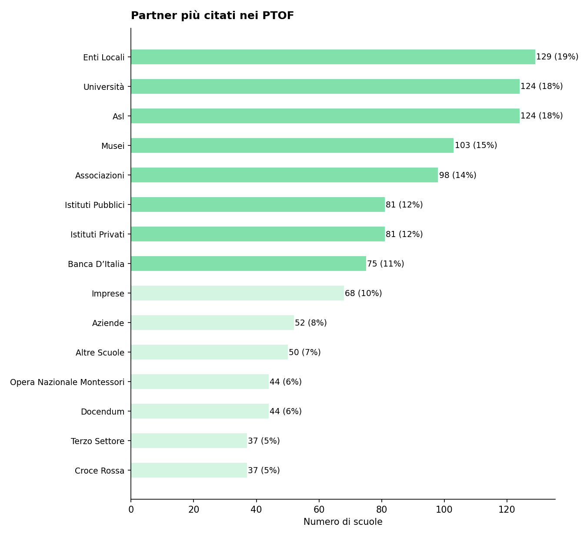
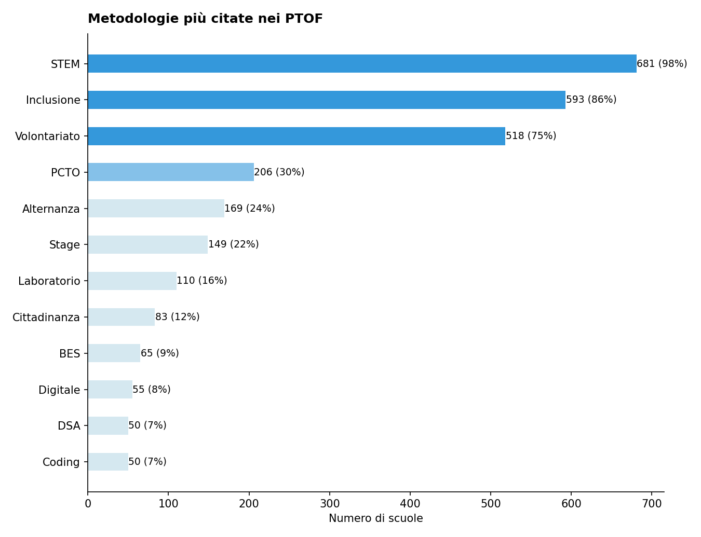

# Report di Sintesi sull'Orientamento nei PTOF — II Grado

*Target Analisi: II Grado*
*Generato con: openrouter / google/gemini-3-pro-preview*

## Premessa: Cosa Misuriamo e Perché
Questo report analizza i PTOF (Piani Triennali dell'Offerta Formativa) delle scuole secondarie di secondo grado per misurarne la copertura informativa in tema di orientamento: quanto e come il documento descrive le pratiche, i progetti e le strategie che la scuola adotta per orientare gli studenti.

È essenziale chiarire un principio fondamentale: i punteggi assegnati non esprimono un giudizio sulla qualità dell'istituto, ma esclusivamente sulla ricchezza e completezza della documentazione presente nel PTOF. Una scuola con un livello di copertura basso potrebbe svolgere attività efficaci senza averle esplicitate nel proprio piano; viceversa, un livello elevato indica che il PTOF documenta in modo dettagliato e strutturato le proprie pratiche orientative.
## Come Funziona l'Analisi
L'analisi automatizzata legge e interpreta il testo del PTOF su due livelli complementari.

1. Analisi Strutturale (Compliance): Il sistema verifica la conformità formale rispetto alle Linee Guida per l'orientamento scolastico stabilite dal D.M. 328/2022, il decreto ministeriale che ha introdotto l'obbligo per tutte le scuole secondarie di dedicare almeno 30 ore annuali a moduli di orientamento formativo e di individuare figure dedicate (docente tutor e docente orientatore). In concreto, si verifica se il PTOF contiene una sezione esplicitamente dedicata all'orientamento, valutandone la visibilità e la struttura nel documento.

2. Analisi Semantica e di Contenuto: Attraverso modelli di linguaggio avanzati (LLM), l'analisi esamina l'intero documento per estrarre informazioni sulla copertura delle 6 dimensioni del framework di valutazione, descritte nella sezione successiva. In questa fase, vengono distinte le semplici dichiarazioni di intenti dalle azioni concrete, mappando la presenza di progetti, risorse, tempi e responsabilità. L'algoritmo rileva il contesto in cui appaiono i termini: ad esempio, distingue se l'orientamento formativo è citato in una lista generica oppure se è descritto attraverso laboratori con obiettivi specifici e modalità di verifica.
## Le 6 Dimensioni del Framework di Valutazione

L'analisi semantica valuta la copertura del PTOF attraverso **6 dimensioni**. Ognuna rappresenta un aspetto fondamentale dell'orientamento scolastico: dalla struttura organizzativa alle finalità educative, dalle metodologie didattiche alle opportunità offerte agli studenti. Di seguito, ciascuna dimensione è descritta con i propri sotto-indicatori.

### Dimensione Strutturale e di Contesto
Valuta se l'orientamento ha una collocazione riconoscibile all'interno del PTOF e se la scuola è inserita in un tessuto di relazioni territoriali.
- **Sezione dedicata**: Presenza di un capitolo o paragrafo esplicitamente intitolato all'orientamento, non frammentato tra diverse parti del documento.
- **Partnership e reti territoriali**: Qualità del coinvolgimento di soggetti esterni (Università, ITS, imprese, Terzo Settore), con attenzione ad attività congiunte e accordi formali.

### Finalità dell'Orientamento
Analizza gli obiettivi formativi che la scuola si pone attraverso le attività di orientamento.
- **Attitudini e Talenti**: Azioni per aiutare gli studenti a scoprire i propri punti di forza e inclinazioni personali.
- **Interessi Professionali**: Percorsi di esplorazione degli ambiti disciplinari e del mondo del lavoro.
- **Progetto di Vita**: Supporto alla costruzione di una traiettoria personale di lungo termine.
- **Transizioni Formative**: Accompagnamento nei passaggi critici tra cicli scolastici (primaria-secondaria, secondaria-università/lavoro).
- **Capacità Orientativa (Empowerment)**: Sviluppo di competenze trasversali che rendano lo studente autonomo nelle proprie scelte.

### Obiettivi di Incidenza
Misura l'attenzione del PTOF verso gli impatti sociali dell'orientamento.
- **Contrasto alla Dispersione**: Strategie di prevenzione dell'abbandono scolastico e iniziative di rimotivazione.
- **Riduzione dei NEET**: Azioni di collegamento scuola-lavoro per favorire l'occupabilità e contrastare il fenomeno dei giovani che non studiano né lavorano.
- **Continuità Territoriale**: Costruzione di ponti tra i diversi gradi di istruzione presenti sul territorio.
- **Lifelong Learning**: Concezione dell'orientamento come competenza permanente, utile per tutta la vita.

### Governance e Organizzazione
Esamina il modello organizzativo interno: chi fa cosa e come si coordina l'azione orientativa.
- **Coordinamento**: Presenza di figure dedicate come Funzioni Strumentali, referenti o commissioni per l'orientamento.
- **Dialogo Interno**: Coinvolgimento dei Consigli di Classe e dei docenti nella progettazione orientativa.
- **Alleanza con le Famiglie**: Iniziative strutturate di comunicazione e collaborazione con i genitori.
- **Monitoraggio**: Utilizzo di strumenti di feedback, questionari e dati per valutare l'efficacia delle azioni.
- **Inclusione**: Attenzione specifica a studenti con BES/DSA, studenti stranieri e situazioni di fragilità.

### Didattica Orientativa
Valuta il passaggio dalle dichiarazioni di principio alle pratiche concrete in aula.
- **Didattica Laboratoriale ed Esperienziale**: Attività basate sul *learning by doing* e sull'apprendimento attivo.
- **Centralità dello Studente**: Ruolo attivo degli studenti nella co-progettazione dei percorsi orientativi.
- **Interdisciplinarità**: Integrazione dell'orientamento nelle diverse discipline curricolari, non solo come attività aggiuntiva.
- **Flessibilità Organizzativa**: Adattamento di spazi, tempi e gruppi per favorire esperienze orientative efficaci.

### Opportunità Formative
Mappa l'ecosistema delle proposte extracurricolari e integrative offerte dalla scuola.
- **Attività Culturali e Artistiche**: Progetti di teatro, musica, scrittura creativa, visite a musei.
- **Laboratori Espressivi**: Percorsi manuali, artigianali o digitali che favoriscono la scoperta di talenti.
- **Sport e Attività Ricreative**: Offerta sportiva e ludica come strumento di socializzazione e benessere.
- **Volontariato e Service Learning**: Esperienze di impegno civico che collegano apprendimento e comunità.

## Dal Qualitativo al Quantitativo: la Scala di Punteggio
Ciascuna delle 6 dimensioni appena descritte viene valutata attraverso una scala numerica da 1 a 7, detta scala di copertura informativa. Si tratta di una scala ordinale di tipo Likert — uno strumento consolidato nella ricerca sociale che consente di tradurre valutazioni qualitative in punteggi confrontabili.

Il punteggio riflette il livello di dettaglio con cui il PTOF documenta le pratiche orientative per quella dimensione: da 1 (nessun riferimento) a 7 (documentazione sistematica con evidenze di miglioramento continuo). La tabella seguente descrive ogni livello.

\begin{tabularx}{\textwidth}{@{} c l X @{}}
\toprule
\textbf{Punti} & \textbf{Livello} & \textbf{Cosa significa} \\
\midrule
1 & Assente & Nessun riferimento all'orientamento nel documento. \\
2 & Traccia minima & Menzione vaga o copia-incolla di testo normativo, senza personalizzazione. \\
3 & Copertura parziale & Intenzione dichiarata, ma senza dettagli su come viene attuata. \\
4 & Copertura di base & Azioni descritte in modo chiaro ma essenziale, senza approfondimento. \\
5 & Copertura strutturata & Azioni dettagliate con metodologie esplicitate e risorse indicate. \\
6 & Copertura approfondita & Azioni integrate nel curricolo, con indicatori di monitoraggio documentati. \\
7 & Copertura esaustiva & Documentazione sistematica e ciclica, con evidenze di revisione e miglioramento. \\
\bottomrule
\end{tabularx}
## L'Indice Sintetico: IIPO
Per avere una visione d'insieme della copertura documentale di ciascuna scuola, i punteggi delle 6 dimensioni vengono riassunti in un unico indicatore: l'IIPO (Indice di Documentazione delle Pratiche di Orientamento).

L'IIPO è calcolato come media aritmetica semplice dei punteggi delle 6 dimensioni (Strutturale, Finalità, Obiettivi, Governance, Didattica, Opportunità). Si è scelta una media non pesata per evitare di privilegiare a priori una dimensione rispetto alle altre, trattandole tutte come ugualmente rilevanti.

Come leggere l'IIPO:
- Un IIPO di 5.0 indica che, in media, il PTOF documenta le pratiche orientative a un livello di "Copertura strutturata" su tutte le dimensioni.
- Un IIPO di 3.0 segnala una documentazione complessivamente di "Copertura parziale".

Limiti da tenere presenti:
- *Effetto compensazione*: Essendo una media, l'IIPO può mascherare squilibri tra le dimensioni. Ad esempio, una scuola con punteggio 7 su Didattica e 1 su Governance otterrebbe un IIPO apparentemente nella norma. Per questo motivo, l'IIPO va sempre letto insieme ai punteggi delle singole dimensioni.
- *Sensibilità incrementale*: La scala a 7 livelli consente di cogliere differenze graduali tra scuole, evitando la polarizzazione tipica delle scale più strette (es. 1-3).
## Approccio Analitico: Raggruppamento per Affinità

Oltre all'analisi dimensionale, il report utilizza una tecnica di **raggruppamento automatico** (clustering) per evitare di appiattire i risultati su una semplice media nazionale.

Il funzionamento è il seguente: il sistema analizza i profili di punteggio di tutte le scuole e individua **gruppi di istituti** che presentano caratteristiche documentali simili. Nel campione corrente sono stati identificati **5 gruppi omogenei** — ad esempio, un gruppo potrebbe riunire scuole con forte attenzione ai PCTO e alle partnership territoriali, mentre un altro potrebbe raccogliere istituti che privilegiano la didattica laboratoriale.

Per ciascun gruppo viene generata una **sintesi tematica** che descrive l'approccio dominante su ogni dimensione. A ogni cluster viene inoltre assegnato un **nome rappresentativo** (ad esempio *"Orientamento frammentario e implicito"* o *"Forte integrazione territoriale"*), generato automaticamente a partire dalla sintesi del profilo dominante, per facilitare la lettura e il riferimento nel testo. Queste sintesi intermedie vengono poi integrate nel report finale, permettendo di confrontare i diversi "profili di orientamento" e di evidenziare sia le tendenze comuni sia le eccezioni virtuose.

## Strategia di Generazione del Report
La redazione di questo report è affidata a un sistema di intelligenza artificiale che opera attraverso un processo strutturato in tre fasi, progettato per garantire coerenza, accuratezza e aderenza ai dati.

Fase 1: Costruzione dello Scheletro
Il sistema genera automaticamente la struttura del report — titolo, sezioni tematiche, nota metodologica, grafici e tabelle — senza coinvolgere il modello linguistico. Questa fase è puramente deterministica: calcola statistiche aggregate, produce visualizzazioni e predispone i segnaposto (*slot*) che verranno riempiti nella fase successiva.

Fase 2: Compilazione Narrativa (Slot Filling)
Per ogni sezione tematica, il modello linguistico riceve un prompt specifico che include:

- Istruzioni di ruolo: il sistema si presenta come analista esperto del sistema scolastico italiano, con conoscenza approfondita della normativa sull'orientamento (D.M. 328/2022, Linee Guida MIM).
- Contesto normativo per grado: informazioni specifiche sulla fascia d'età, sugli obblighi normativi e sulle pratiche appropriate per la scuola secondaria di II grado, per evitare contaminazioni con altri ordini scolastici.
- Dati aggregati: statistiche calcolate dal campione (medie su scala 1-7, deviazioni standard, distribuzione dei punteggi per dimensione).
- Sintesi per cluster: i profili tematici pre-generati per ciascun gruppo omogeneo.
- Evidenze testuali (RAG ibrido): estratti reali dai PTOF recuperati attraverso un sistema di *Retrieval-Augmented Generation* a doppio livello — sintesi analitiche per il quadro d'insieme e citazioni dirette dai documenti originali per ancorare le affermazioni.

Ogni prompt tematico è stato progettato con una struttura analitica vincolante (punti da trattare, domande guida, vincoli stilistici e contenuti da evitare) per ottenere testi omogenei, comparabili tra sezioni e privi di generalizzazioni non supportate dai dati.

Contenuto dei Prompt Tematici

Di seguito si descrive *cosa* viene richiesto al modello in ciascuna sezione e *perché* quella prospettiva analitica è stata scelta.

- Profili dei Cluster: il modello deve descrivere ciascun gruppo di scuole evidenziandone il tratto dominante, le dimensioni forti e deboli e le differenze rispetto agli altri gruppi. L'obiettivo è offrire al lettore una mappa tipologica, non una classifica.
- Sintesi Generale: viene richiesta una panoramica trasversale guidata da domande chiave — l'orientamento è scelta strategica o adempimento burocratico? È integrato nella didattica o confinato in attività separate? Lo studente è soggetto attivo o destinatario passivo? — per evitare descrizioni superficiali e stimolare un'analisi critica.
- Allineamento Normativo: il prompt vincola il modello a distinguere tra recepimento formale (la norma è citata) e sostanziale (i principi sono tradotti in azioni), con attenzione ai moduli obbligatori da 30 ore e alle figure del docente tutor e orientatore.
- Rapporto con il Territorio: si chiede di analizzare le reti di partnership usando i dati di frequenza dei partner (grafici e tabelle), classificandole per tipologia e verificando se le collaborazioni sono operative o solo formali.
- Metodologie Didattiche: il prompt è costruito attorno al principio che l'orientamento è di per sé un atto didattico. La domanda centrale è se le scuole lo integrano nel curricolo quotidiano o lo confinano in progetti separate. Si chiede anche di verificare se la didattica attiva documentata è autentica (con prodotti e valutazione) o solo dichiarata.
- Strumenti di Supporto: il modello deve distinguere tra test psicodiagnostici (che fotografano attitudini) e questionari riflessivi (che stimolano autoesplorazione), verificando se gli strumenti promuovono l'auto-direzione dello studente o lo relegano a destinatario passivo di profili.
- Formazione del Personale: si chiede esplicitamente di verificare se nei PTOF compare formazione *specifica* sull'orientamento — non solo su altri temi — e se la preparazione dei tutor è documentata o la funzione è assegnata senza training specifico.
- Figure Professionali e Governance: il focus è sull'organigramma orientativo — se esiste un team dedicato, come si raccorda con i Consigli di Classe, e se il piano annuale dell'orientamento ha tempi, azioni e responsabilità concrete.
- Principali Lacune: il prompt richiede un'analisi diretta dei gap, con attenzione allo scarto tra dichiarazioni e azioni, all'assenza di monitoraggio dell'efficacia, e a temi talvolta trascurati (bias di genere, stereotipi, empowerment studentesco).
- Temi Globali e Scelte Consapevoli: il modello è guidato dal principio che le scelte orientative non sono mai solo individuali. Si chiede di verificare se i PTOF integrano responsabilità sociale, sostenibilità ambientale e dignità della persona nelle scelte formative, o se l'orientamento si riduce alla scelta del percorso successivo.
- Bilancio Complessivo: il prompt vincola a una selezione — massimo 3 punti di forza e 3 criticità, con direzioni di sviluppo basate su ciò che le scuole migliori già fanno, non su desideri astratti.
- Conclusioni e Limiti: il capitolo finale richiede una sintesi dei risultati principali seguita da una discussione trasparente dei limiti metodologici — dalla distanza tra documento e pratica reale, ai limiti dell'analisi automatizzata, alla rappresentatività campionaria — con avvertenze concrete per il lettore su come utilizzare il report.

Questa architettura di prompt è stata progettata per garantire che ogni sezione adotti una lente analitica specifica e coerente con il framework pedagogico di riferimento, evitando sia le generalizzazioni sia le descrizioni puramente quantitative.

Fase 3: Revisione di Coerenza
Un passaggio finale di revisione automatica verifica ogni sezione del report per individuare e correggere: ripetizioni tra sezioni, incongruenze numeriche, errori nelle etichette della scala, refusi grammaticali e contaminazioni tra gradi scolastici.

Perché questa strategia
La scelta di un processo a tre fasi separate risponde a tre esigenze:

1. Grounding sui dati: il modello linguistico non inventa contenuti, ma elabora narrazioni a partire da dati quantitativi ed evidenze testuali reali.
2. Specificità tematica: ogni sezione riceve un prompt dedicato con istruzioni e dati pertinenti, evitando che il modello perda il focus su un documento troppo complesso.
3. Controllo qualità: la revisione finale agisce come filtro automatico per garantire coerenza interna e accuratezza.
## Analisi e Copertura del Campione (II Grado)
Questa sezione descrive la composizione del campione analizzato e ne valuta la rappresentatività rispetto all'universo delle scuole italiane. Comprendere la struttura del campione è essenziale per interpretare correttamente i risultati: un campione ben bilanciato consente di generalizzare le osservazioni; un campione sbilanciato richiede cautela nell'estendere le conclusioni a tutto il sistema scolastico.

Per ogni dimensione di confronto (gestione, area geografica, contesto territoriale) la tabella riporta tre valori:
- Osservato %: la percentuale nel nostro campione.
- Atteso % (MIUR): la percentuale nell'universo reale delle scuole italiane, ricavata dai dati ministeriali.
- Deviazione (pp): la differenza tra osservato e atteso, espressa in *punti percentuali*. Deviazioni entro ±5 pp sono trascurabili; tra 5 e 15 pp segnalano un lieve squilibrio; oltre 15 pp indicano una sovra- o sotto-rappresentazione significativa.

Statistiche Generali

- Scuole Analizzate: 693 PTOF di scuole II Grado
- Province Coperte: 100 (su 107 totali)
- Regioni Coperte: 18/20

Il campione copre la quasi totalità delle regioni italiane, garantendo una visione nazionale.

Bilanciamento Gestione (Statale vs Paritaria)

In Italia, le scuole statali rappresentano la grande maggioranza degli istituti. Un campione rappresentativo dovrebbe riflettere questa proporzione. Una sovra-rappresentazione delle paritarie, ad esempio, potrebbe influenzare i risultati perché i PTOF delle scuole paritarie tendono ad avere strutture e contenuti peculiari rispetto a quelli delle statali.

\begin{tabularx}{\textwidth}{@{} p{3cm} c c c @{}}
\toprule
\textbf{Tipo} & \textbf{Osservato \%} & \textbf{Atteso \% (MIUR)} & \textbf{Deviazione} \\
\midrule
Statale & 72.9\% & 92.0\% & -19.1 pp \\
Paritaria & 27.1\% & 8.0\% & +19.1 pp \\
\bottomrule
\end{tabularx}

Distribuzione Geografica per Macro-Area

L'Italia presenta significative differenze territoriali nell'offerta formativa. Per valutare se il campione rispecchia la distribuzione reale delle scuole, confrontiamo le cinque macro-aree geografiche (Nord Ovest, Nord Est, Centro, Sud, Isole) con i dati ministeriali. Una buona rappresentatività geografica è fondamentale, in quanto le pratiche di orientamento possono variare sensibilmente tra Nord e Sud e tra contesti differenti.

\begin{tabularx}{\textwidth}{@{} X c c c @{}}
\toprule
\textbf{Area} & \textbf{Osservato \%} & \textbf{Atteso \% (MIUR)} & \textbf{Deviazione} \\
\midrule
Nord Ovest & 19.3\% & 26.6\% & -7.3 pp \\
Nord Est & 16.7\% & 19.3\% & -2.6 pp \\
Centro & 14.4\% & 19.9\% & -5.5 pp \\
Sud & 38.7\% & 23.3\% & +15.4 pp \\
Isole & 10.8\% & 10.9\% & -0.1 pp \\
\bottomrule
\end{tabularx}

⚠️ Nota sulla Rappresentatività: Il campione presenta significative deviazioni rispetto alla distribuzione attesa, in particolare per alcune macro-aree (es. Sud/Nord).

Distribuzione Territoriale (Aree Metropolitane vs Non Metropolitane)

Le scuole situate nelle 14 città metropolitane italiane operano in contesti diversi rispetto a quelle di provincia: maggiore offerta formativa esterna, più partnership con università e imprese, ma anche maggiore competizione tra istituti. Questa distinzione aiuta a comprendere se i risultati del report possano essere influenzati da una prevalenza di scuole urbane o rurali nel campione.

\begin{tabularx}{\textwidth}{@{} X c c c @{}}
\toprule
\textbf{Area} & \textbf{Osservato \%} & \textbf{Atteso \% (Stima)} & \textbf{Deviazione} \\
\midrule
Metropolitana & 41.8\% & 33.0\% & +8.8 pp \\
Non Metropolitana & 58.2\% & 67.0\% & -8.8 pp \\
\bottomrule
\end{tabularx}

Implicazioni per la Lettura del Report

Il campione analizzato, pur garantendo una base documentale ampia, presenta distorsioni strutturali che impongono cautela nell'estensione lineare dei risultati all'intero sistema scolastico nazionale. La sovrarappresentazione della componente paritaria introduce un bias rilevante nelle sezioni relative alla governance, all'allocazione delle risorse e all'autonomia progettuale: le dinamiche gestionali di queste realtà differiscono sensibilmente da quelle della scuola statale, potendo suggerire una flessibilità organizzativa e una capacità di personalizzazione dei percorsi che non sempre trovano riscontro nella media degli istituti pubblici, vincolati a procedure amministrative più rigide. Di conseguenza, i dati sulla copertura informativa delle pratiche gestionali potrebbero risultare sovrastimati rispetto alla media reale del sistema statale.

Parallelamente, si osserva una concentrazione preponderante di istituti situati nel Sud Italia e nelle aree metropolitane, a discapito della rappresentatività delle aree provinciali del Centro-Nord. Questa polarizzazione influenza la lettura delle dimensioni relative alle reti territoriali e al contrasto alla dispersione. Le scuole metropolitane beneficiano fisiologicamente di una densità maggiore di interlocutori per i PCTO e i raccordi universitari, mentre la forte presenza del Meridione tende a enfatizzare, nelle sezioni sugli Obiettivi, le tematiche legate al contrasto dei NEET e alla gestione delle fragilità socio-economiche. Le strategie di inclusione e di raccordo con il mondo del lavoro descritte nel report vanno lette tenendo conto di questo specifico contesto, che potrebbe non riflettere appieno le sfide tipiche della provincia settentrionale diffusa.

In sintesi, mentre il report restituisce una fotografia valida e dettagliata delle pratiche documentate all'interno del perimetro osservato, la generalizzabilità su scala nazionale richiede opportune ponderazioni. Le evidenze emerse descrivono un modello di orientamento che risente della specifica composizione del campione: un sistema scolastico di II grado a forte trazione urbana e meridionale, con una componente non statale superiore alla media. È dunque necessario interpretare i punteggi di copertura come indicatori di tendenza all'interno di questi specifici cluster, piuttosto che come valori assoluti immediatamente trasponibili all'universalità delle scuole secondarie italiane.

\newpage
## Sintesi Quantitativa: Le Dimensioni dell'Orientamento
Di seguito il dettaglio dei punteggi medi rilevati per le dimensioni e i relativi sotto-indicatori, calcolati sull'intero campione analizzato.

Dimensione Strutturale (Compliance)
Media: 2.62 (dev.std: 2.02)

Finalità dell'Orientamento

\begin{tabularx}{\textwidth}{@{} X c c @{}}
\toprule
\textbf{Indicatore} & \textbf{Media} & \textbf{Dev. Std.} \\
\midrule
\textbf{Totale Dimensione} & \textbf{3.68} & \textbf{1.14} \\
Attitudini e Talenti & 3.74 & 1.16 \\
Interessi Professionali & 3.73 & 1.16 \\
Progetto di Vita & 3.53 & 1.44 \\
Transizioni Formative & 3.82 & 1.28 \\
Capacità Orientative & 3.51 & 1.41 \\
\bottomrule
\end{tabularx}

Obiettivi di Incidenza

\begin{tabularx}{\textwidth}{@{} X c c @{}}
\toprule
\textbf{Indicatore} & \textbf{Media} & \textbf{Dev. Std.} \\
\midrule
\textbf{Totale Dimensione} & \textbf{3.21} & \textbf{1.15} \\
Contrasto Dispersione & 3.13 & 1.55 \\
Continuità Territorio & 3.76 & 1.29 \\
Riduzione NEET & 2.41 & 1.31 \\
Lifelong Learning & 3.30 & 1.35 \\
\bottomrule
\end{tabularx}

Governance e Organizzazione

\begin{tabularx}{\textwidth}{@{} X c c @{}}
\toprule
\textbf{Indicatore} & \textbf{Media} & \textbf{Dev. Std.} \\
\midrule
\textbf{Totale Dimensione} & \textbf{3.66} & \textbf{1.10} \\
Coordinamento & 3.66 & 1.23 \\
Dialogo Interno & 3.67 & 1.28 \\
Alleanza Famiglie & 3.95 & 1.18 \\
Monitoraggio & 3.06 & 1.30 \\
Inclusione & 3.90 & 1.18 \\
\bottomrule
\end{tabularx}

Didattica Orientativa

\begin{tabularx}{\textwidth}{@{} X c c @{}}
\toprule
\textbf{Indicatore} & \textbf{Media} & \textbf{Dev. Std.} \\
\midrule
\textbf{Totale Dimensione} & \textbf{3.65} & \textbf{1.02} \\
Centralità Studente & 3.97 & 1.26 \\
Didattica Laboratoriale & 3.34 & 1.21 \\
Flessibilità & 3.43 & 1.21 \\
Interdisciplinarità & 3.81 & 1.17 \\
\bottomrule
\end{tabularx}

Opportunità Formative

\begin{tabularx}{\textwidth}{@{} X c c @{}}
\toprule
\textbf{Indicatore} & \textbf{Media} & \textbf{Dev. Std.} \\
\midrule
\textbf{Totale Dimensione} & \textbf{3.18} & \textbf{1.09} \\
Attività Culturali & 3.23 & 1.44 \\
Laboratori Espressivi & 3.81 & 1.35 \\
Attività Ricreative & 2.73 & 1.15 \\
Volontariato & 2.76 & 1.39 \\
Sport & 3.20 & 1.31 \\
\bottomrule
\end{tabularx}

*Legenda Copertura Informativa: Copertura esaustiva (7), Copertura approfondita (6), Copertura strutturata (5), Copertura di base (4), Copertura parziale (3), Traccia minima (2), Assente (1)*

\newpage

Panoramica Grafica dei Sotto-Indicatori

\noindent
\begin{minipage}[t]{0.47\textwidth}
\centering
\includegraphics[width=\textwidth]{images/bar_finalita_dellorientamento_compact_20260216_090002.png}
\end{minipage}
\hfill
\begin{minipage}[t]{0.47\textwidth}
\centering
\includegraphics[width=\textwidth]{images/bar_obiettivi_di_incidenza_compact_20260216_090002.png}
\end{minipage}

\vspace{0.5cm}

\noindent
\begin{minipage}[t]{0.47\textwidth}
\centering
\includegraphics[width=\textwidth]{images/bar_governance_e_organizzazione_compact_20260216_090002.png}
\end{minipage}
\hfill
\begin{minipage}[t]{0.47\textwidth}
\centering
\includegraphics[width=\textwidth]{images/bar_didattica_orientativa_compact_20260216_090003.png}
\end{minipage}

\vspace{0.5cm}

\noindent
\hfill
\begin{minipage}[t]{0.47\textwidth}
\centering
\includegraphics[width=\textwidth]{images/bar_opportunita_formative_compact_20260216_090003.png}
\end{minipage}
\hfill

Panoramica dei Risultati Quantitativi

L'analisi complessiva dei PTOF evidenzia una polarizzazione tra la dimensione dichiarativa e quella operativa dell’orientamento. Il punteggio più elevato si registra nell'area delle Finalità (media 3.68 su scala 1-7), trainata dalla descrizione delle transizioni formative e dall'attenzione ai talenti individuali; ciò indica che le scuole secondarie di II grado riescono a documentare con una copertura di base il "perché" dell'orientamento, delineando una visione pedagogica che pone lo studente al centro. Di converso, la dimensione più debole risulta essere quella degli Obiettivi di Incidenza (punteggio medio 3.21 su 7) e, ancor più marcatamente, l'adeguamento normativo strutturale alle nuove Linee Guida (2.62 su 7). Questo divario suggerisce che, mentre l'impianto valoriale è esplicitato, la traduzione in obiettivi misurabili di impatto sociale — come la riduzione del fenomeno NEET o il monitoraggio dell'efficacia delle azioni — rimane spesso a un livello di copertura parziale, faticando a trovare una sistematizzazione documentale rigorosa in questa fase di transizione normativa.

Osservando la distribuzione interna agli indicatori, emergono discrepanze significative, anche alla luce della composizione del campione che vede una presenza rilevante di scuole paritarie (27,1%) e delle regioni del Sud. Se da un lato l'alleanza con le famiglie (3.95 su 7) e l'inclusione delle fragilità (3.90 su 7) si attestano su una copertura di base, riflettendo la vocazione alla cura relazionale e la sensibilità inclusiva del sistema, dall'altro lato il contrasto ai NEET registra una copertura parziale (2.41 su 7). È un dato critico per il II ciclo, che rappresenta l'ultimo stadio prima dell'ingresso nel mondo adulto: la carenza di riferimenti espliciti a strategie contro l'inattività giovanile segnala un orientamento ancora prevalentemente focalizzato sul successo scolastico immediato (diploma) piuttosto che sulla prevenzione della marginalità post-diploma. Analogamente, nella Didattica Orientativa, l'alta considerazione per l'esperienza dello studente (3.97 su 7) non è pienamente supportata da una didattica laboratoriale altrettanto strutturata (3.34 su 7), indicando che l'orientamento è spesso più "narrato" che "agito" attraverso metodologie esperienziali codificate.

Queste evidenze quantitative aprono interrogativi che saranno esplorati nelle sezioni successive. In particolare, il basso punteggio sul monitoraggio delle azioni (3.06 su 7) pone il problema di come le scuole verifichino l'efficacia delle attività dichiarate nella Governance (3.66 su 7). Sarà necessario indagare qualitativamente se l'integrazione delle 30 ore curricolari obbligatorie sia documentata come un reale processo didattico trasversale o se, come suggerisce il dato strutturale, sia ancora in fase di prima applicazione formale. Inoltre, la discrepanza tra una continuità territoriale che raggiunge una copertura di base (3.76 su 7) e la documentazione da copertura parziale sulle opportunità extrascolastiche (volontariato e ricreativo sotto il 3.00 su 7) suggerisce di approfondire la natura reale delle partnership: si tratta di reti operative o di accordi formali che faticano a tradursi in opportunità documentate nel PTOF?

\newpage
## Profili dei Cluster e Differenze
L'analisi dei PTOF ha permesso di mappare le pratiche documentali di 671 istituti secondari di secondo grado, suddivisi in cinque cluster distinti che condividono tratti strutturali e semantici omogenei.

Cluster 0 - Approccio Integrato e Didattico
Questo raggruppamento, che comprende 112 istituti, si caratterizza per una visione dell'orientamento definibile come "integrata". A differenza di altre configurazioni, qui l'orientamento non appare segregato o delegato esclusivamente a progetti esterni, ma viene menzionato in relazione agli obiettivi formativi generali e alle metodologie didattiche. La scuola Aniene -Agraria Agroalimentare E Agroindustria (RMTAPV5005) (Lazio) esemplifica questa tendenza, dove la trattazione delle pratiche orientative si fonde con la descrizione del potenziamento dell'offerta formativa. Tuttavia, questa integrazione presenta il rischio di una scarsa formalizzazione: pur essendo pervasivo, l'orientamento rischia di mancare di una governance specifica. I punteggi suggeriscono una Copertura di base (attorno al 4 su 7), con un focus particolare sul monitoraggio degli apprendimenti come leva orientativa, interpretando il successo scolastico come principale indicatore di un corretto posizionamento dello studente.

Cluster 1 - Approccio Relazionale e di Accoglienza
Il secondo gruppo, costituito da 77 scuole, rivela un profilo documentale fortemente sbilanciato sulla dimensione del benessere e dell'accoglienza, configurando l'orientamento quasi esclusivamente come attività di supporto all'ambientamento delle classi prime e al monitoraggio del clima scolastico. Sebbene il documento della scuola I.C.Breda (MIEE8EU01T) (Lombardia) presenti una sezione esplicita, la tendenza generale del cluster è quella di un approccio reattivo: l'orientamento diviene uno strumento per intercettare il disagio e favorire l'inclusione, piuttosto che un dispositivo proattivo di carriera (*career guidance*). La narrazione dei PTOF insiste sulle dinamiche relazionali e sulla prevenzione della dispersione attraverso la cura dell'ambiente di apprendimento, lasciando spesso in ombra la progettazione delle transizioni in uscita verso il terziario o il lavoro, con una copertura informativa su queste ultime dimensioni che scende spesso sotto la Copertura parziale (livello 3 su scala 1-7).

Cluster 2 - Approccio PCTO-Centrico Dichiarativo
Composto da un nucleo ristretto di 25 istituti, questo cluster manifesta una sovrapposizione concettuale quasi totale tra orientamento e Percorsi per le Competenze Trasversali e per l'Orientamento (PCTO). Le scuole, come la Ente Religioso Compassioniste Serve Di Maria (NA1E114004) (Campania) e la Scuola Piccolo Uomo (RM1ES55005) (Lazio), tendono a delegare l'intera funzione orientativa alle esperienze di alternanza nel triennio. Il tratto distintivo è una discrepanza tra l'enfasi dichiarativa — l'importanza dell'orientamento è enunciata con forza — e la povertà operativa dei dettagli attuativi al di fuori dei PCTO. Manca una visione longitudinale che coinvolga il biennio, e l'orientamento appare talvolta come un adempimento burocratico gestito attraverso moduli esterni o stage, piuttosto che come un percorso riflessivo continuo e obbligatorio come previsto dalla normativa vigente.

Cluster 3 - Approccio Frammentato
Simile al precedente ma con indicatori di strutturazione ancora più deboli, questo gruppo di 50 scuole presenta l'orientamento in modo puntiforme e disorganico. La scuola Istituto San Giuseppe Calasanzio (CA1M4N500E) (Sardegna) è rappresentativa di questa tendenza: pur citando la continuità, ammette implicitamente una frammentazione delle azioni. L'orientamento è disperso tra capitoli eterogenei (Inclusione, Offerta Formativa, PTOF generale) senza una "casa" documentale propria. In questo contesto, l'informazione fornita alle famiglie risulta spesso limitata a una Traccia minima o Copertura parziale (livello 2 o 3 su 7), limitandosi a elencare progetti scollegati tra loro senza esplicitare il filo conduttore pedagogico che dovrebbe accompagnare lo studente nella costruzione del progetto di vita.

Cluster 4 - Approccio a Progettualità Diffusa
Il cluster più popoloso, che raccoglie ben 407 istituti (oltre il 60% del campione analizzato), rappresenta il profilo maggioritario della scuola secondaria nel campione. La caratteristica dominante è la presenza pervasiva di "progetti" (educazione alla salute, legalità, soft skills, CLIL) che, pur avendo una valenza orientativa, mancano di una cornice unitaria. L'orientamento è frammentato, gestito attraverso una molteplicità di iniziative che arricchiscono l'offerta formativa ma che raramente confluiscono in un sistema di governance integrato. Le scuole di questo gruppo mostrano una forte attenzione al monitoraggio dei risultati e alla formazione docenti, ma faticano a descrivere l'orientamento come un processo curricolare unitario, attestandosi su una copertura informativa media che oscilla tra la Copertura parziale e la Copertura di base (3-4 su scala 1-7).

In sintesi, l'analisi comparata dei cluster evidenzia una convergenza sulla mancanza trasversale di una sezione autonoma e strutturata dedicata all'orientamento nella maggioranza dei PTOF. La principale divergenza risiede nella strategia di compensazione di tale lacuna: mentre il Cluster 0 cerca di diluire l'orientamento nella didattica quotidiana e il Cluster 1 lo assorbe nelle pratiche di inclusione e accoglienza, i Cluster 2 e 3 si appoggiano alla struttura dei PCTO come asse portante. Il Cluster 4, infine, riflette un approccio additivo, dove l'orientamento è la somma di numerosi progetti, senza necessariamente divenire una pratica sistematica e organica.
## Commento di Sintesi Generale
L'analisi trasversale della documentazione relativa all'orientamento nelle scuole secondarie di II grado rivela un quadro complessivo definibile come di Copertura parziale, con un Indice di Documentazione Pratiche Orientamento (IIPO) stimato intorno a 3.54 su scala 1-7. Questo dato posiziona il sistema scolastico monitorato in una zona grigia tra la Copertura parziale (punteggio 3) e la Copertura di base (punteggio 4). Sebbene la normativa recente, in particolare il D.M. 328/2022, abbia fornito un impulso visibile all'aggiornamento dei documenti, l'orientamento fatica ancora a emergere come pilastro autonomo e strategico all'interno dei PTOF.

Esaminando le dimensioni costitutive dell'indice, si nota una discrepanza significativa tra il *dover essere* e l'*agire misurabile*. Le dimensioni legate alle Finalità (media 3.68 su 7) e alla Governance (media 3.66 su 7) mostrano i risultati migliori: le scuole sono generalmente abili nell'enunciare i principi generali e nel mappare le reti territoriali o i servizi di supporto. Tuttavia, quando si passa alla definizione degli Obiettivi specifici (media 3.21 su 7), come la riduzione del tasso di dispersione o il contrasto ai NEET, la documentazione diventa più evanescente. Le scuole dichiarano di voler orientare, ma raramente definiscono metriche precise per valutare l'efficacia di tali azioni.

La caratteristica dominante del campione, che accomuna la maggioranza degli istituti e in particolare il vasto Cluster 4, è la frammentazione informativa. L'orientamento è spesso trattato come un tema ubiquo ma sfuggente, spalmato all'interno di sezioni eterogenee come l'Offerta Formativa, l'Inclusione o i PCTO, privo di una sezione dedicata che ne restituisca organicità. Come rilevato nell'analisi del Liceo Artistico Statale "R. Cottini" (TOSL020003) [Piemonte] o dell'Istituto "Primo Levi" (MOPS00201V) [Emilia-Romagna], si fa esplicito riferimento ai moduli di orientamento formativo e alle nuove linee guida, ma spesso queste informazioni sono giustapposte ad altre attività senza una narrazione strategica unitaria. In molti casi, l'assenza di una sezione autonoma impedisce di comprendere come le diverse azioni (tutoraggio, open day, PCTO) si integrino in un percorso coerente per lo studente.

Sotto il profilo qualitativo, emerge una tensione irrisolta circa la natura stessa della didattica orientativa (media 3.65 su 7). Da un lato, istituti come l'IIS "De Sarlo-De Lorenzo" (PZIS001007) [Basilicata] o il Liceo Carducci (MIPC03000N) [Lombardia] documentano attività operative concrete, come laboratori aperti e coinvolgimento attivo degli studenti (peer tutoring) durante gli open day. Dall'altro, si assiste a una preoccupante sovrapposizione concettuale: numerose scuole, tra cui l'Istituto Isis Galilei-Cossar (GOIS01200L) [Friuli-Venezia Giulia] e il Istituto Paritario Giulio Cesare (FRTD00500N) [Lazio], inseriscono nei campi dedicati all'orientamento meri elenchi di argomenti disciplinari (trigonometria, ottica geometrica, rilievo topografico). Questo fenomeno suggerisce che, per una parte del campione, il concetto di "orientamento formativo" venga confuso con l'ordinario svolgimento dei programmi ministeriali, svuotando di significato la dimensione riflessiva e auto-direzionale richiesta dalla normativa.

L'impulso del PNRR e delle Linee Guida (D.M. 328/2022) è rintracciabile nell'adozione formale di nuovi lessici. Scuole come l'Istituto C. Varalli (MITN05101L) [Lombardia] citano correttamente l'introduzione del Docente Tutor e del Docente Orientatore come figure chiave per la "revisione dell'idea di orientamento". Tuttavia, l'impressione generale è che l'orientamento sia vissuto ancora prevalentemente come un adempimento burocratico o una necessità organizzativa (gestire le iscrizioni in entrata, i PCTO nel triennio), piuttosto che come un processo pedagogico continuo volto a sviluppare il progetto di vita dello studente.

Lo studente stesso emerge dai documenti con un profilo ambivalente: talvolta è destinatario passivo di informazioni durante gli eventi di presentazione, altre volte è soggetto attivo in percorsi di auto-narrazione tramite l'E-Portfolio (citato sporadicamente). Manca tuttavia, in gran parte dei PTOF, un riferimento robusto alla responsabilità sociale delle scelte orientative; i temi della sostenibilità e della dignità del lavoro, pur centrali nel dibattito contemporaneo, non trovano riscontro sistematico nella documentazione delle pratiche orientative, che rimangono focalizzate sul successo scolastico individuale o sull'occupabilità immediata.

In conclusione, la variabilità dei punteggi e la distribuzione disomogenea delle pratiche indicano un sistema scolastico in fase di transizione: consapevole delle nuove istanze normative, ma ancora alla ricerca di un modello operativo che trasformi l'orientamento da serie di episodi disgiunti a spina dorsale del curricolo formativo.
## Allineamento Normativo e Approccio Innovativo
L'analisi del recepimento delle nuove normative sull’orientamento (D.M. 328/2022 e Linee Guida PNRR) nel II ciclo d'istruzione evidenzia un quadro in chiaroscuro. Il punteggio medio relativo all'allineamento normativo, pari a 2.62 su scala 1-7, descrive una copertura informativa situata tra la "Traccia minima" e la "Copertura parziale". Questo dato quantitativo segnala una marcata discrasia: sebbene le norme impongano obblighi immediati e pervasivi, come i moduli curricolari di 30 ore e le nuove figure di sistema, la documentazione strategica delle scuole fatica ancora a metabolizzare e restituire con chiarezza questi cambiamenti. In molti PTOF, l'adeguamento appare ancora in una fase di transizione, dove la citazione della norma non corrisponde sempre a una descrizione operativa dei processi attuativi.

Esaminando la distinzione tra recepimento formale e sostanziale, emerge come molte istituzioni si limitino a menzionare il quadro legislativo senza dettagliare la sua declinazione didattica. Tuttavia, esistono esempi di "Copertura strutturata" (livello 5 su 7) che trasformano l'obbligo in architettura formativa. Il Liceo Statale G. M. Galanti (CBPM040008) [Molise] e l'IIS Galilei Voghera (PVIS01600V) [Lombardia] documentano esplicitamente l'attivazione di percorsi fino al raggiungimento del monte ore minimo, ancorando le attività a una programmazione definita. Al contrario, in altri casi, l'adesione alle Linee Guida appare più come un adempimento burocratico, dove l'orientamento viene citato genericamente all'interno dell'offerta formativa senza una sezione dedicata che ne esplichi l'articolazione modulare per ogni anno di corso.

Un focus specifico sulle figure del Docente Tutor e del Docente Orientatore rivela che, sebbene previste obbligatoriamente per la scuola secondaria di primo e secondo grado, la loro operatività nel II ciclo è descritta in modo disomogeneo. Un esempio significativo di dettaglio operativa si risconta nel PTOF della scuola Liceo Classico Istituto Leone Xiii (MIPC10500T) [Lombardia], che prevede espressamente "12 ore di colloqui personali per gli studenti, su appuntamento, con il proprio Tutor di classe". Qui la figura non è solo nominale, ma dispone di un monte ore dedicato alla relazione individuale, superando la logica dell'intervento massivo. Nondimeno, nella maggioranza dei documenti analizzati, il ruolo del tutor rimane in ombra, spesso sottinteso nelle attività dei Consigli di Classe piuttosto che valorizzato come perno del nuovo paradigma orientativo.

Per quanto concerne i moduli obbligatori di orientamento formativo di 30 ore, l'analisi testuale mostra una tendenza a comporre il monte ore assemblando attività eterogenee, specialmente nel triennio dove si sovrappongono ai PCTO. L'istituto Barbara Melzi (MIRFHT500U) [Lombardia] offre l'esempio più analitico di questa strutturazione, rendicontando il pacchetto orario con precisione aritmetica: per una classe terza, le 30 ore sono raggiunte sommando un corso sulla sicurezza (8 ore), uno di primo soccorso (4 ore), incontri con testimoni privilegiati (6 ore) ed esperienze di PCTO. Se da un lato questo approccio garantisce la conformità normativa e un elevato dettaglio documentale, dall'altro solleva l'interrogativo pedagogico se corsi tecnici come la sicurezza possano essere equiparati interamente a percorsi di orientamento narrativo o riflessivo.

Parallelamente, si osserva una dicotomia tra il biennio e il triennio. Mentre istituti come lo Scaruffi Levi Tricolore (RETD09000V) [Emilia-Romagna] presentano allegati specifici per il curricolo orientativo delle classi prime e seconde, dimostrando una visione longitudinale conforme al D.M. 328/2022, altre scuole concentrano gli sforzi quasi esclusivamente sul triennio finale. In questi casi, l'orientamento rischia di essere confuso con il solo orientamento in uscita o con l'alternanza scuola-lavoro, trascurando la dimensione fondamentale della didattica orientativa disciplinare prevista fin dal primo anno.

Infine, emergono approcci originali che superano il dettato minimo della norma. Il già citato istituto Liceo Classico Istituto Leone Xiii (MIPC10500T) [Lombardia] integra le 30 ore in un percorso di crescita personale che include una settimana di scuola in montagna con colloqui di gruppo e test sulle intelligenze multiple, oltre a un modulo di Media Education. Analogamente, l'IIS Delfico-Montauti (TEIS012009) [Abruzzo] propone moduli creativi come "Arte e Pubblicità", dimostrando come l'orientamento possa innestarsi sui contenuti disciplinari in modo non banale. Queste evidenze dimostrano che, laddove il PTOF supera la logica compilativa, le nuove Linee Guida diventano un'opportunità per ridisegnare l'esperienza scolastica dello studente, ponendolo realmente al centro del processo decisionale.
## Rapporto con il Territorio
Partner territoriali più diffusi nel campione

\begin{tabularx}{\textwidth}{@{} X l c c @{}}
\toprule
\textbf{Partner} & \textbf{Categoria} & \textbf{N. Scuole} & \textbf{\% Campione} \\
\midrule
Enti Locali & Altro & 129 & 18.6\% \\
Università & Università/Ricerca & 124 & 17.9\% \\
Asl & ASL/Sanità & 124 & 17.9\% \\
Musei & Altro & 103 & 14.9\% \\
Associazioni & Terzo Settore & 98 & 14.1\% \\
Istituti Pubblici & Altro & 81 & 11.7\% \\
Istituti Privati & Altro & 81 & 11.7\% \\
Banca D’Italia & Altro & 75 & 10.8\% \\
Imprese & Aziende/Imprese & 68 & 9.8\% \\
Aziende & Aziende/Imprese & 52 & 7.5\% \\
Altre Scuole & Scuole/Reti & 50 & 7.2\% \\
Opera Nazionale Montessori & Altro & 44 & 6.3\% \\
Docendum & Altro & 44 & 6.3\% \\
Terzo Settore & Terzo Settore & 37 & 5.3\% \\
Croce Rossa & Terzo Settore & 37 & 5.3\% \\
\bottomrule
\end{tabularx}

Distribuzione per categoria di partner

L'analisi della documentazione PTOF relativa ai rapporti con il territorio evidenzia un panorama in cui la rete di collaborazioni appare formalmente estesa ma qualitativamente disomogenea. Il punteggio medio registrato per l'obiettivo di "continuità con il territorio" si attesta a 3.76 su scala 1-7, indicando una copertura informativa che oscilla tra la "Copertura parziale" e la "Copertura di base". Analogamente, l'indicatore sulle azioni di coordinamento dei servizi si ferma a 3.66 su 7. Questi dati suggeriscono che, sebbene le scuole riconoscano la necessità normativa di interagire con l'esterno, spesso faticano a documentare una progettualità sistemica che trasformi i partner in co-attori del processo orientativo.

Esaminando i dati di frequenza, emerge una predominanza netta delle istituzioni pubbliche e accademiche. Gli Enti Locali (citati dal 18.6% del campione) e le Università (17.9%) rappresentano i pilastri fondamentali delle reti scolastiche, seguiti dalle ASL (17.9%), la cui presenza è verosimilmente legata sia ai percorsi di curvatura biomedica sia al supporto per l'inclusione e il disagio giovanile. Risulta tuttavia degno di nota, e potenzialmente critico per un orientamento al lavoro efficace, il posizionamento dei partner produttivi: le "Imprese" (9.8%) e le "Aziende" (7.5%), seppur presenti, appaiono meno centrali nella narrazione esplicita rispetto ai partner istituzionali, sebbene la categoria aggregata "Aziende/Imprese" raccolga comunque 388 menzioni totali. Un dato particolarmente significativo è la scarsa visibilità degli ITS Academy e della Formazione Professionale (solo 105 menzioni aggregate contro le 644 delle Università), segnale di un disallineamento tra l'offerta formativa terziaria professionalizzante e la comunicazione orientativa delle scuole secondarie, che tendono ancora a privilegiare il canale accademico tradizionale.

La classificazione delle partnership rivela due approcci distinti. Un primo gruppo di scuole, ben rappresentato dal Cluster 0, interpreta il territorio come un ecosistema formativo integrato. In questi casi, la collaborazione non si limita alla stipula di convenzioni, ma evolve in progettazione condivisa. Un esempio virtuoso è offerto dall'Istituto Itc A.Volta (BATD105005) (Puglia), che documenta una rete di partenariato di respiro internazionale, citando specificamente accordi con la London Business School, l'Università Bocconi e la Banca d'Italia, oltre a una connessione operativa con il territorio locale (es. Centro Giovanile Ufo Saronno). Al contrario, nel Cluster 2 e nel Cluster 3, la relazione con il territorio appare spesso appiattita sul mero adempimento burocratico. Qui la documentazione tende a essere generica, citando "enti e associazioni" senza specificare attori o finalità, suggerendo una copertura informativa ascrivibile alla "Traccia minima" o alla "Copertura parziale" (livelli 2 o 3 su 7), dove la rete esterna è funzionale solo alla ratifica formale dei percorsi obbligatori.

I Percorsi per le Competenze Trasversali e per l'Orientamento (PCTO) costituiscono il veicolo principale, e talvolta esclusivo, della relazione scuola-territorio nel secondo ciclo. Tuttavia, la qualità descrittiva varia sensibilmente. Nel Cluster 4, prevalente numericamente, il PCTO è focalizzato sull'esperienza di stage aziendale tradizionale. Alcune scuole riescono però a elevarne il significato orientativo: la scuola Torpe' - "E. D'Arborea (NUAA84104B) (Sardegna), ad esempio, integra la simulazione d'impresa con il coinvolgimento di professionisti, trasformando l'esperienza in un laboratorio di competenze reali. Di tenore diverso, ma ugualmente rilevante per l'orientamento in uscita, è l'approccio documentato dal Liceo Benedetto Croce (PAPS100008, Sicilia), che ha strutturato una convenzione dettagliata con l'Università degli Studi di Palermo per percorsi laboratoriali in presenza, definendo soglie di frequenza e obiettivi chiari, superando così la logica dell'open day passivo.

Per quanto concerne la continuità verticale, l'analisi evidenzia una forte propensione all'orientamento in uscita (verso Università e, in misura minore, mondo del lavoro), mentre il dialogo con il primo ciclo (scuole medie) appare meno valorizzato nelle sezioni dedicate al territorio, rimanendo spesso confinato alle attività di marketing scolastico in entrata. Una forma particolare di continuità "inversa" è rilevabile in istituti come il I.I.S. Caduti Della Direttissima (BOTD00901G) (Emilia-Romagna) e il Istituto Istruzione Superiore "C. Levi (NATD08401G) (Campania), che fungono da sedi di tirocinio per gli studenti universitari di Scienze della Formazione Primaria. Sebbene questa pratica rafforzi il legame istituzionale con l'università, rappresenta più un servizio reso al sistema formativo che un'azione di orientamento diretto per i propri studenti, a meno che non sia inserita (come accade nei Licei delle Scienze Umane) in un percorso di specchiamento professionale.

In sintesi, mentre la "Copertura di base" è garantita dalla necessità di gestire i PCTO, la capacità delle scuole di documentare reti territoriali ricche, diversificate e co-progettate (livello di "Copertura strutturata" o superiore su 7) rimane appannaggio di una minoranza di istituti. La prevalenza di partner istituzionali rispetto al tessuto produttivo e la marginalità degli ITS nella narrazione PTOF rappresentano aree di miglioramento cruciali per offrire agli studenti un panorama completo delle opportunità post-diploma.
## Metodologie Didattiche
Metodologie più diffuse nel campione

\begin{tabularx}{\textwidth}{@{} X c c @{}}
\toprule
\textbf{Metodologia} & \textbf{N. Scuole} & \textbf{\% Campione} \\
\midrule
STEM & 681 & 98.3\% \\
Inclusione & 593 & 85.6\% \\
Volontariato & 518 & 74.7\% \\
PCTO & 206 & 29.7\% \\
Alternanza & 169 & 24.4\% \\
Stage & 149 & 21.5\% \\
Laboratorio & 110 & 15.9\% \\
Cittadinanza & 83 & 12.0\% \\
BES & 65 & 9.4\% \\
Digitale & 55 & 7.9\% \\
DSA & 50 & 7.2\% \\
Coding & 50 & 7.2\% \\
\bottomrule
\end{tabularx}

L'esame delle metodologie didattiche documentate nei PTOF delinea un quadro articolato, dominato quantitativamente dall'area STEM, citata da 681 scuole (98,3% del campione), e dall'attenzione all'inclusione (85,6%). Tuttavia, questa diffusione capillare di etichette tematiche non si traduce automaticamente in una copertura informativa strutturata delle pratiche didattiche attive: il punteggio medio sulla didattica laboratoriale si attesta infatti a 3,34 su scala 1-7, posizionandosi tra la Copertura parziale e la Copertura di base. Questo scostamento suggerisce che diversi istituti potrebbero limitarsi all'insegnamento tradizionale delle discipline scientifiche, senza necessariamente adottare metodologie laboratoriali che permettano allo studente di sperimentare le proprie attitudini in ottica orientativa.

La questione centrale riguarda l'integrazione dell'orientamento nel curricolo disciplinare. Laddove prevale un modello virtuoso, le materie di studio diventano il primo banco di prova per l'autodirezione dello studente. È il caso del Liceo Silvio D'Arzo (REIS00400D) [Emilia-Romagna], che documenta l'uso di competizioni come i "Giochi di Archimede" o i "Giochi di Anacleto" non come attività accessorie, ma come strumenti per avvicinare gli studenti al problem-solving. Analogamente, l'istituto Liceo Classico Istituto Leone Xiii (MIPC10500T) [Lombardia] integra la robotica direttamente nella programmazione di Tecnologia e Informatica, dedicandovi una quota oraria significativa (25 su 32 ore), trasformando la disciplina in un laboratorio permanente di verifica delle competenze. Al contrario, in altri casi, l'orientamento appare ancora come una serie di eventi giustapposti alla didattica ordinaria, piuttosto che una sua dimensione costitutiva.

Un ruolo cruciale nel secondo ciclo è svolto dai PCTO (Percorsi per le Competenze Trasversali e l'Orientamento), citati esplicitamente come metodologia dal 29,7% delle scuole, mentre un ulteriore 24,4% utilizza ancora la dicitura, ormai superata, di "Alternanza Scuola-Lavoro". Questa dimensione, prevalente nel Cluster 2, rappresenta il principale vettore di didattica esperienziale. Scuole come la I.C. D. Alighieri Civita Castel (VTMM81702D) [Lazio] e la Boscoreale Ic 2 - F. Dati (NAIC8D300V) [Campania] esplicitano la connessione con il tessuto produttivo non solo come visita, ma come immersione nelle dinamiche industriali. Tuttavia, l'efficacia orientativa di questi percorsi dipende dalla capacità di renderli riflessivi: il punteggio medio relativo alla valorizzazione dell'esperienza degli studenti è di 3,97 su 7 (prossimo alla Copertura di base), segnalando che spesso manca una documentazione approfondita su come l'esperienza pratica venga rielaborata in classe per divenire consapevolezza vocazionale.

L'innovazione metodologica emerge con maggiore chiarezza nel Cluster 4, dove si tenta di superare la lezione frontale attraverso strumenti digitali e creativi. Nonostante il "Coding" (7,2%) e il "Digitale" (7,9%) appaiano come categorie ancora di nicchia nei dati complessivi, le evidenze qualitative mostrano livelli di Copertura approfondita. Il Liceo Scientifico L.Sc.C.Miranda-F/Maggiore- (NAPS27000E) [Campania], ad esempio, documenta percorsi extracurricolari di "digital storytelling" e "Making e grafica 3D", ponendo lo studente al centro del processo creativo. Anche il Liceo Xxv Aprile (VEPC050007) [Veneto] offre laboratori avanzati con programmazione in Python e uso di RaspberryPI. Queste pratiche spostano il focus dallo studente come destinatario passivo allo studente come "maker", capace di agire e costruire, in linea con i principi di un orientamento formativo che sviluppa agency e imprenditorialità.

Esiste infine una distinzione netta tra la semplice disponibilità di spazi e l'adozione di una didattica attiva. Mentre l'istituto L.Scientifico "Righi (FOPS010028) [Emilia-Romagna] ottiene punteggi elevati descrivendo una didattica orientativa pervasiva, basata su flessibilità di tempi e spazi, altre realtà come la scuola G.B. Vico - Umberto I - R. Gagliardi (RGIS018002) [Sicilia] ammettono che, pur essendo presenti progetti specifici come la robotica, la didattica laboratoriale non costituisce ancora la metodologia prevalente dell'offerta formativa. In sintesi, sebbene quasi tutte le scuole riconoscano l'importanza delle STEM e dell'inclusione, la transizione verso una didattica orientativa sistematica, che integri il "sapere" con il "saper fare" e il "saper scegliere" all'interno del quotidiano scolastico, è un processo documentale ancora in corso di consolidamento.
## Strumenti di Supporto
L'analisi degli strumenti operativi e digitali nei PTOF delle scuole secondarie di II grado rivela un panorama in profonda trasformazione, dove la tecnologia non è più solo un supporto logistico ma diviene l'infrastruttura stessa del processo orientativo. Il punteggio medio rilevato su questo dominio si attesta intorno a 4.8 su scala 1-7, indicando un livello intermedio tra Copertura di base e Copertura strutturata. Emerge con forza, specialmente nel Cluster 4 che raggruppa la maggioranza degli istituti (407 scuole), l'adozione massiva di strumenti digitali spinta dalle riforme del PNRR e dalle Linee Guida per l'orientamento, sebbene persista una certa eterogeneità nell'utilizzo pedagogico di tali risorse.

Lo strumento che domina in assoluto la narrazione dei documenti è l'E-Portfolio, spesso associato alla piattaforma Unica del Ministero o a soluzioni integrate come G-Suite. Tuttavia, l'analisi qualitativa suggerisce una dicotomia nell'interpretazione di questo dispositivo. In molti casi, l'E-Portfolio appare descritto con un linguaggio tecnico-amministrativo, configurandosi come un contenitore digitale per l'archiviazione di certificazioni e percorsi PCTO, rischiando di scadere in un adempimento compilativo. Esistono però esempi virtuosi che restituiscono allo strumento la sua funzione riflessiva. L'istituto Giovanni Pascoli (FIPM02000L), ad esempio, descrive l'E-Portfolio esplicitamente come un mezzo per documentare non solo le competenze, ma il "progetto di vita" dello studente, suggerendo un uso che va oltre la semplice burocrazia. Analogamente, il Liceo Giuseppe Berto (TVPS04000Q) pone l'accento sulla strutturazione di un "portfolio digitale" finalizzato a potenziare la consapevolezza e a supportare il riorientamento, dimostrando una visione dello strumento come leva per l'autoconsapevolezza piuttosto che come mero archivio curricolare.

Per quanto riguarda la distinzione tra strumenti psicodiagnostici e questionari riflessivi, i PTOF mostrano una tendenza netta verso un approccio per competenze piuttosto che puramente diagnostico. I test attitudinali classici (standardizzati e misuratori di tratti stabili) sono menzionati raramente in forma esplicita. Al loro posto, emergono piattaforme che mediano l'incontro tra competenze acquisite e profili professionali, come evidenziato da alcuni istituti che utilizzano la piattaforma *MiAssumo* per il matching tra scoperta delle competenze e mondo del lavoro. Questo segnala uno spostamento dal paradigma del "test che ti dice chi sei" (diagnostico) a quello dello "strumento che ti aiuta a capire cosa sai fare" (riflessivo-esperienziale). Tuttavia, la documentazione di percorsi strutturati di auto-narrazione profonda è ancora frammentaria; spesso la riflessione è delegata implicitamente alla compilazione del portfolio o alla gestione del "Capolavoro", come citato dall'istituto Amm/Vo Per Il Turismo D. Panedda (SSTD09000T), che invita gli studenti a selezionare un prodotto rappresentativo del loro percorso, attivando così un processo metacognitivo di autovalutazione.

La Piattaforma Unica è citata sempre più frequentemente come l'hub digitale di riferimento (ad esempio dall'istituto F.De Pinedo- M. Colonna (RMIS127001)), ma la sua integrazione reale nella didattica quotidiana varia. Mentre nel Cluster 0 e 4 si osserva un tentativo di rendere questi strumenti parte integrante del curricolo digitale e delle competenze di cittadinanza, in altri gruppi, come il Cluster 3, la trattazione degli strumenti rimane residuale, suggerendo che in alcune realtà la piattaforma ministeriale potrebbe essere vissuta più come un adempimento formale che come una risorsa organica. È interessante notare come l'infrastruttura digitale (PNRR Scuola 4.0, Next Generation Labs) venga spesso citata come abilitatore dell'orientamento: l'istituto I.I.S. Delfico-Montauti (TEIS012009) descrive laboratori per le professioni digitali del futuro come "ambienti di apprendimento fluidi", collegando direttamente l'uso dello spazio fisico e digitale all'esplorazione professionale.

Rispetto alla dimensione dell'auto-direzione, l'analisi evidenzia luci e ombre. Da un lato, la retorica dei documenti pone lo studente al centro; dall'altro, molti processi sembrano ancora fortemente guidati dall'istituzione. Le attività di sintesi orientativa, come la certificazione delle competenze in uscita o i moduli di riorientamento nel biennio, rischiano talvolta di apparire come atti formali se non supportati da un percorso longitudinale documentato. Tuttavia, l'introduzione del "Capolavoro" e la gestione autonoma delle sezioni dell'E-Portfolio rappresentano passi concreti verso una maggiore *agency* studentesca. Lo studente non è più solo destinatario passivo di indicazioni, ma costruttore attivo del proprio profilo digitale "per la scuola e per la vita", come sottolineato ancora dall'istituto Amm/Vo Per Il Turismo D. Panedda (SSTD09000T).

In conclusione, sebbene la copertura informativa sugli strumenti digitali sia quantitativamente elevata grazie agli investimenti infrastrutturali (PNRR), la sfida qualitativa risiede nel passaggio dalla "competenza digitale" tecnica (saper usare la piattaforma) alla "competenza orientativa" esistenziale (saper usare la piattaforma per capirsi). Al momento, i PTOF documentano con dovizia la struttura tecnologica, ma solo una parte delle scuole dettaglia le metodologie pedagogiche necessarie per trasformare questi supporti digitali in veri motori di consapevolezza e scelta autonoma.
## Formazione del Personale
L'analisi della documentazione relativa alla formazione del personale mette in luce una criticità strutturale: mentre le scuole riconoscono universalmente l'importanza del supporto agli studenti, la preparazione metodologica specifica dei docenti sulle tematiche dell'orientamento narrativo e formativo è raramente documentata.

Dialogo Docenti-Studenti e Preparazione del Personale
Il punteggio medio di 3.67 su scala 1-7 per l'indicatore dedicato al dialogo docenti-studenti riflette una copertura informativa che oscilla tra il livello di Copertura parziale e quello di Copertura di base. Questo dato suggerisce che, nella maggior parte dei PTOF, la relazione orientativa è affidata alla sensibilità individuale del docente o a ruoli istituzionali preesistenti (come il coordinatore di classe) piuttosto che a competenze professionali certificate o allenate specificamente per il counseling orientativo. I documenti descrivono frequentemente sportelli di ascolto e colloqui, ma raramente esplicitano le tecniche di conduzione o la formazione ricevuta dagli operatori, a meno che non si tratti di psicologi esterni.

Formazione Generica vs. Formazione Specifica
Esaminando le sezioni dedicate alla formazione del personale, emerge una netta prevalenza di corsi su sicurezza, digitale e, soprattutto, inclusione (BES/DSA). La formazione specifica sull'orientamento scolastico e professionale risulta spesso assente o marginale.
Ad esempio, l'Istituto Paolo Frisi (MIRC058016) (Lombardia) documenta una formazione dettagliata per la gestione dei comportamenti problema e l'inclusione, citando "docenti con specifica formazione" per il tutoraggio, ma senza chiarire se tale formazione includa moduli di orientamento alla scelta. Analogamente, la scuola Istituto Superiore Guglielmo Marconi (NAIS13700L) (Campania) prevede formazione sulla didattica inclusiva e monitoraggio dei PEI, ma non menziona percorsi per sviluppare competenze di *career guidance* nei docenti. Spesso, l'orientamento viene tacitamente sussunto sotto la voce generica dell'"aggiornamento professionale", senza godere di una dignità formativa autonoma.

Il Ruolo dei Tutor e il DM 328/2022
L'operatività delle figure del docente tutor e del docente orientatore trova riscontri eterogenei nei documenti, nonostante l'obbligatorietà normativa.
Una criticità diffusa è la sovrapposizione tra la figura del "tutor per l'orientamento" (disciplinata dal DM 328/2022 per supportare l'E-Portfolio e la scelta) e il "tutor PCTO" o "tutor aziendale" (focalizzato sull'alternanza scuola-lavoro).
La scuola I.I.S. Curie - Vittorini (TOPM03450E) (Piemonte) descrive in dettaglio il "Tutor Alternanza Scuola-Lavoro" che assiste lo studente nel percorso esterno, ma non vi è traccia di una formazione specifica per gestire la dimensione riflessiva della scelta post-diploma.
Tuttavia, emergono eccezioni significative di allineamento normativo e metodologico. L'Istituto I.P.S.E.O.A.-I.P.S.A.R. "F. Di Svevia (CBRH010005) (Molise) cita esplicitamente il DM 328/2022, definendo il docente orientatore come una "figura strategica" e collegandola alle politiche nazionali, evidenziando una consapevolezza normativa superiore alla media.

Gap e Criticità Documentate
In molti casi, l'assenza di formazione specifica non è solo dedotta, ma dichiarata come fabbisogno. Il Liceo L.S. "G. Galilei" Potenza (PZPS040007) (Basilicata) ammette con trasparenza nel proprio PTOF che "sarebbe opportuno rafforzare le competenze orientative dei docenti e dei tutor, attraverso percorsi di formazione specifici". Questa è una "gap analysis" lucida che conferma come, in assenza di training dedicato, le azioni di orientamento rischino di rimanere destrutturate. Inoltre, nel Cluster 2, si nota come la formazione sia quasi esclusivamente tecnica e legata alla gestione burocratica dei PCTO, trascurando la dimensione psicopedagogica dell'orientamento alla vita (Life Design).

Eccezioni Positive e Buone Pratiche
Esistono istituti che interpretano il ruolo del tutor in modo profondo e formativo. Un esempio di eccellenza è l'Istituto Liceo Classico Istituto Leone Xiii (MIPC10500T) (Lombardia), che descrive il docente tutor attingendo a una matrice pedagogica precisa ("pedagogia ignaziana"): il tutor è colui che "si mette accanto, rilegge con l’interessato le sue esperienze... perché la persona trovi la propria autonomia". Qui la funzione tutoriale non è un semplice adempimento, ma un processo di accompagnamento riflessivo chiaramente codificato.
Allo stesso modo, l'Istituto Liceo Artistico "Antonio Rosmini (VBSLCH500S) (Piemonte) documenta il "potenziamento del gruppo di lavoro" per l'orientamento con il coinvolgimento attivo di docenti e studenti, suggerendo una formazione sul campo attraverso la partecipazione a comunità di pratica interne.
## Figure Professionali e Governance
L'analisi della governance e dell'organizzazione delle figure professionali dedicate all'orientamento, basata sui PTOF delle scuole secondarie di II grado, restituisce un quadro di transizione complessa. Il punteggio medio di 3.66 su 7 per il coordinamento dei servizi indica una copertura informativa che oscilla tra il livello di Copertura parziale e quello di Copertura di base. Questo dato suggerisce che, sebbene le scuole riconoscano la necessità di un'impalcatura organizzativa, la descrizione dei processi decisionali e operativi appare spesso frammentata o limitata all'adempimento normativo piuttosto che a una strategia sistemica consolidata. Le scuole si trovano in una fase di adeguamento, dove le nuove figure introdotte dal D.M. 328/2022 faticano ancora a trovare una narrazione organica all'interno dei documenti di pianificazione.

L'assetto organizzativo prevalente non si configura quasi mai come un vero e proprio dipartimento o centro di servizio interno, ma tende a gravitare attorno a singole figure o commissioni fluide. In molti casi, la responsabilità è delegata alla Funzione Strumentale, che opera spesso in solitudine o con risorse limitate, senza che emerga chiaramente un organigramma funzionale che coinvolga l'intero Consiglio di Classe in modo strutturale. Le evidenze mostrano una dicotomia marcata: istituti come il Leonardo Da Vinci (MIIS02700G) (Lombardia) descrivono un'équipe strutturata composta da tutti i tutor delle classi prime e seconde che collaborano con psicologi e funzioni strumentali per il ri-orientamento, mentre realtà come l'Istituto Centro Scolastico Dante Alighieri (NATF25500E) (Campania) dichiarano esplicitamente l'assenza di un responsabile specifico o di un gruppo di lavoro, demandando il tutto all'iniziativa dei singoli docenti. Spesso, il ruolo di raccordo ricade sul coordinatore di classe, come rilevato nel Liceo Liceo Delle Scienze Umane San Francesco Di Sales (PGPMCG500I) (Umbria) e nell'istituto G.B. Vico - Umberto I - R. Gagliardi (RGIS018002) (Sicilia), cui è affidata la gestione del dialogo studente-docente e la funzione tutoriale di base, talvolta sovraccaricando una figura già gravata da oneri burocratici senza un quadro di supporto sistemico.

L'introduzione delle figure obbligatorie del Docente Tutor e del Docente Orientatore rappresenta il punto di maggiore fermento, ma anche di maggiore ambiguità documentale. Nella maggior parte dei PTOF analizzati, la descrizione di questi ruoli ricalca fedelmente il dettato normativo, con definizioni standardizzate che rischiano di apparire come mere caselle nell'organigramma piuttosto che come attori operativi vivi. Ad esempio, l'istituto I.I.S.S. "Luigi Russo (BAIS05300C) (Puglia) e il I.I.S. "G. Solimene" Lavello (PZIS01100T) (Basilicata) riportano definizioni quasi identiche dei compiti, citando il supporto alla scelta e la gestione dell'E-Portfolio, ma senza dettagliare come queste azioni si calino nella quotidianità scolastica. Tuttavia, emergono eccezioni virtuose che tratteggiano una operatività concreta: l'istituto I.S.I.T. "U.Bassi - P.Burgatti (FETD00601V) (Emilia-Romagna) documenta un flusso di lavoro preciso che include colloqui individuali, la compilazione dell'E-Portfolio e la scelta del "Capolavoro", delineando una chiara interazione tra studente, tutor e famiglia. Al contrario, in altri contesti, la figura del tutor sembra sovrapporsi o confondersi ancora con quella del tutor PCTO, come evidenziato nel caso dell'istituto I.P.S.E.O.A.-I.P.S.A.R. "F. Di Svevia (CBRH010005) (Molise), dove la progettazione del percorso per le competenze trasversali diventa la spina dorsale dell'orientamento, assorbendo di fatto le funzioni di guida.

Il lavoro di rete e il raccordo con il territorio emergono come elementi vitali ma distribuiti in modo disomogeneo. Quando presente, la governance territoriale si manifesta attraverso accordi di rete, tavoli tecnici e partenariati con enti di formazione, università e aziende, essenziali per l'orientamento in uscita e i PCTO. Scuole come l'Istituto Iis Maserati - Voghera (PVIS00900Q) (Lombardia) e il Liceo Leoniano FRPSD0500E (Lazio) pongono l'accento su una solida rete di partnership come punto di forza strategico. Tuttavia, il dato aggregato e le evidenze testuali di scuole come il Liceo Campanella Liceo T. Campanella-M. Preti Frangipane (RCPC043016) (Calabria) segnalano come l'assenza di partnership strutturate rappresenti una criticità che isola l'istituto e depotenzia l'efficacia delle azioni orientative. La capacità di fare rete appare spesso legata all'intraprendenza del singolo istituto o alla ricchezza del tessuto produttivo locale, piuttosto che a un modello di governance diffuso.

Infine, il livello di formalizzazione della pianificazione orientativa rivela una carenza di visione a lungo termine. Sono rari i PTOF che presentano un "Piano Annuale dell'Orientamento" dettagliato con cronoprogrammi, indicatori di monitoraggio e responsabilità assegnate per fasi. Prevalgono dichiarazioni di intenti o elenchi di attività (Open Day, incontri con esperti) privi di un collante progettuale temporale. Un esempio positivo di formalizzazione si riscontra nell'istituto Nullo Baldini (RATF01000T) (Emilia-Romagna), che definisce soggetti coinvolti, scadenze precise e risultati attesi distinti per biennio e triennio, offrendo una tracciabilità dell'azione educativa. Di contro, l'istituto P. Savi" - Viterbo (VTIS014004) (Lazio) ammette l'assenza di un sistema di monitoraggio e valutazione, evidenziando come, in mancanza di una governance formalizzata, l'orientamento rischi di ridursi a una somma di interventi episodici incapaci di incidere strutturalmente sul successo formativo degli studenti.
## Principali Lacune
L'analisi delle criticità emergenti dai PTOF delle scuole secondarie di II grado rivela un panorama complesso, caratterizzato da una diffusa disconnessione tra le dichiarazioni di principio e la capacità attuativa documentata. Il dato più rilevante riguarda la dimensione del contrasto al fenomeno dei NEET (Not in Education, Employment, or Training), che registra un punteggio medio di 2.41 su 7, corrispondente a una *Traccia minima*. In un segmento scolastico che rappresenta l'ultimo stadio prima dell'ingresso nella vita adulta o universitaria, tale livello indica che la maggior parte degli istituti non documenta strategie specifiche per accompagnare gli studenti nella delicata fase post-diploma, lasciando spesso all'iniziativa individuale la prevenzione dell'inattività giovanile. Scuole come l'Istituto Dante Alighieri (MOPS01500X) [Emilia-Romagna] segnalano obiettivi meno performanti proprio sul contrasto ai NEET, evidenziando la necessità di investire maggiormente nel supporto agli studenti a rischio e nell'orientamento verso percorsi professionalizzanti.

Strettamente connessa a questa lacuna è la debolezza strutturale del monitoraggio delle azioni orientative, che si attesta su un punteggio medio di 3.06 su 7, indicativo di una *Copertura parziale*. Sebbene molte scuole dichiarino di effettuare controlli, l'analisi dei testi dimostra che si tratta prevalentemente di monitoraggi burocratici (conteggio delle ore, verifica delle presenze) o clinici (focalizzati su studenti BES e DSA in ottemperanza agli obblighi di legge), piuttosto che valutazioni di efficacia pedagogica. Come evidenziato dal PTOF dell'istituto I.I.S.S. "F. S. Nitti (NATD022018) [Campania], il monitoraggio è spesso circoscritto all'andamento dei Piani Didattici Personalizzati, senza una visione sistemica che coinvolga l'intera popolazione scolastica. Ancora più critica è la situazione descritta dalla scuola Cossali" - Orzinuovi (BSTF013014) [Lombardia], che denuncia l'assenza di meccanismi per valutare l'esito delle attività, rivelando che gran parte delle azioni orientative procede senza una verifica del loro impatto reale sulle scelte degli studenti.

Un'altra criticità evidente è la natura episodica dell'orientamento. Nonostante l'obbligatorietà dei moduli da 30 ore di orientamento formativo (D.M. 328/2022) e dei PCTO, molti PTOF trattano l'orientamento come una serie di attività giustapposte e non come una strategia curricolare integrata. L'analisi del Cluster 3 conferma che per un numero significativo di scuole l'orientamento non occupa una sezione autonoma nel documento programmatico, venendo diluito in capitoli generici sull'offerta formativa. Esemplare è l'autodiagnosi della scuola Istituto Scienze Umane Opz. Economico-Sociale Polo San Pietro Celestino (ISPMFM500P) [Molise], che individua come debolezza principale proprio l'assenza di una visione sistemica, con attività "giustapposte e non integrate nel curricolo". Anche istituti con un'offerta ampia, come il Liceo M.Polo-Liceo Artistico (VEIS02400C) [Veneto], riconoscono che la mancanza di una strategia unitaria trasforma l'orientamento in un insieme di azioni frammentate, riducendo il potenziale formativo di esperienze come i PCTO.

Sul fronte dei contenuti, emerge una carenza informativa riguardo al superamento degli stereotipi di genere nelle scelte formative e professionali, tema spesso assente dalla narrazione progettuale. Mentre si pone enfasi sul recupero disciplinare, manca frequentemente una riflessione documentata su come la scuola intenda decostruire i bias che condizionano le traiettorie di carriera. Inoltre, l'approccio agli studenti appare talvolta paternalistico: l'orientamento viene descritto come un servizio erogato dall'istituzione verso un utente passivo, piuttosto che come un processo di empowerment che abilita lo studente all'auto-direzione. La ricorrenza di testi identici tra scuole diverse, come riscontrato nei casi di istituti siciliani (I.I.S.S. "Sciascia E Bufalino" Erice (TPTD02201L) e I.I.S.S. "Sciascia E Bufalino" Erice (TPTD02202N)), suggerisce che in alcuni contesti la stesura del piano orientativo rimanga un adempimento formale privo di una riflessione contestuale specifica.

Infine, le risorse dedicate all'orientamento appaiono spesso poco definite nel tessuto documentale. Sebbene non manchino riferimenti a fondi o progetti, raramente i PTOF esplicitano come il personale (docente tutor e docente orientatore) venga specificamente formato o incentivato, né come gli spazi laboratoriali vengano strutturalmente destinati a pratiche orientative permanenti. La tendenza a delegare il monitoraggio e l'intervento alle sole situazioni di fragilità certificata, trascurando la "fragilità della scelta" che riguarda la totalità degli adolescenti, indica una visione dell'orientamento ancora ancorata a un modello parzialmente emergenziale, insufficiente a rispondere pienamente alle complessità delle transizioni attuali.
## Temi Globali e Scelte Consapevoli
L'analisi della dimensione etica, civica e di sviluppo personale nei PTOF delle scuole secondarie di II grado rivela un panorama documentale a due velocità: da un lato, una solida integrazione formale dei temi dell'Agenda 2030 e della cittadinanza digitale; dall'altro, una fatica evidente nel trasformare questi valori in pratiche di orientamento personalizzato che supportino lo studente nella costruzione di un "progetto di vita" autentico. Il punteggio medio sulla finalità "progetto di vita" si attesta a 3.53 su una scala 1-7, indicando una collocazione tra la Copertura parziale e la Copertura di base: l'intenzione di supportare l'auto-direzione dello studente è dichiarata, ma le strategie operative per realizzarla rimangono spesso generiche.

La costruzione dell'identità personale e la capacità di auto-direzione emergono come obiettivi primari nelle dichiarazioni di intento, ma spesso faticano a tradursi in dispositivi pedagogici descritti nel dettaglio. Scuole come il Liceo Terni Liceo Scientifico "G. Galilei (TRPS020009) (Umbria) esplicitano chiaramente l'obiettivo di "formare cittadini consapevoli e responsabili, promuovendo lo sviluppo di un progetto di vita personale e professionale", ponendo l'accento sulla consapevolezza più che sulla mera scelta dell'indirizzo universitario o lavorativo. Tuttavia, in una porzione significativa del campione, specialmente nei Cluster 2 e 3, l'orientamento tende a schiacciarsi sulla dimensione strumentale dell'inserimento lavorativo o dei PCTO, lasciando talvolta in ombra il processo riflessivo sulla definizione del sé. Un esempio di approccio integrato è rappresentato dall'istituto Lc Immanuel Kant (RMPC31000G) (Lazio), che cita l'importanza di supportare una crescita equilibrata e un'identità solida come precondizione per le scelte future, sebbene il documento stesso ammetta che il "progetto di vita" in senso lato potrebbe essere ulteriormente esplicitato.

Per quanto concerne la responsabilità sociale e la sostenibilità ambientale, si rileva una diffusa adesione formale ai temi dell'Agenda 2030, trainata anche dall'insegnamento dell'Educazione Civica trasversale. Il Cluster 4, che comprende la maggioranza delle scuole (n=407), fa di questo tema il perno della propria narrazione valoriale. È frequente riscontrare nei PTOF passaggi normativi standardizzati riguardo la necessità di "compiere scelte di partecipazione alla vita pubblica coerentemente agli obiettivi di sostenibilità", come rilevato nei documenti di istituti quali il Antonio Gabriele (CSRFQA500F) (Calabria) o l'Istituto Superiore Ettore Majorana (AQIS01400C) (Abruzzo). Tuttavia, la qualità dell'integrazione varia notevolmente. Alcuni istituti riescono a connettere la sostenibilità all'orientamento professionale in modo concreto: l'istituto Faicchio (BNIS02300V) (Campania), ad esempio, integra la sostenibilità nella creazione di business plan durante i percorsi di project work, chiedendo agli studenti di riflettere come futuri professionisti sulla dimensione sociale e di governance. Analogamente, l'istituto Amm/Vo Per Il Turismo D. Panedda (SSTD09000T) (Sardegna) inserisce tra le competenze di indirizzo la capacità di analizzare la rendicontazione sociale e ambientale delle imprese, collegando così l'orientamento tecnico alla responsabilità etica d'impresa.

Laddove la documentazione appare più debole è sul versante del volontariato e del servizio come esperienze orientative strutturate. Il punteggio medio di 2.76 su 7 per il volontariato indica una Traccia minima. Mentre il riferimento alla "cittadinanza attiva" è frequente, mancano spesso le evidenze di come l'impegno sociale venga utilizzato come leva per la scoperta di sé. Si distinguono positivamente iniziative che simulano l'impegno nel terzo settore, come il progetto "Adozioni a distanza" del Liceo Liceo "Giordano Bruno" - Albenga (SVPS030004) (Liguria), che emula le dinamiche di un'impresa non-profit promuovendo valori di solidarietà, o il progetto "SOS Sostenibilità" dell'istituto Amerigo Vespucci (RMRH040503) (Lazio) che struttura un percorso verticale sui goal dell'Agenda 2030. Nondimeno, il volontariato resta prevalentemente un'attività talvolta non integrata organicamente nel curriculum orientativo come banco di prova per le competenze trasversali.

La dimensione della cittadinanza globale e dell'apertura internazionale viene documentata come un vettore di maturazione personale da alcune scuole con una Copertura approfondita di questi temi. Il Liceo Bruno Munari (CRSL01601Q) (Lombardia), ad esempio, documenta progetti come "Educhange" e "UNESCO Passport", legando l'orientamento all'internazionalizzazione e alla comprensione delle dinamiche globali. Anche l'istituto Caio Plinio Secondo (COTD01000G) (Lombardia) mostra una visione strutturata, unendo l'orientamento professionale a temi di transizione ecologica e culturale attraverso collaborazioni con enti territoriali.

Complessivamente, emerge un quadro in cui la dimensione etica dell'orientamento è garantita sul piano dei contenuti (grazie alla pervasività dell'Agenda 2030), ma è ancora in fase di consolidamento sul piano metodologico dell'auto-direzione. Molti PTOF descrivono uno studente destinatario di valori più che protagonista attivo che, attraverso l'esperienza del servizio o della sostenibilità, definisce la propria identità lavorativa e civile. La sfida per le scuole secondarie di II grado appare dunque quella di passare dalla trasmissione di conoscenze sulla sostenibilità all'utilizzo di esperienze etiche (service learning, impresa simulata etica, volontariato) come strumenti diagnostici e riflessivi per l'orientamento nel mondo adulto.
## Bilancio Complessivo
L'analisi complessiva del campione restituisce un Indice di Documentazione delle Pratiche di Orientamento (IIPO) medio di 3.48 su una scala 1-7, un valore che colloca il sistema scolastico del secondo grado in una zona di transizione tra una Copertura parziale e una Copertura di base. Questo dato indica che, sebbene la cultura dell'orientamento sia presente, essa appare spesso frammentata e affidata alla sommatoria di singoli progetti piuttosto che integrata in una strategia curricolare organica e pervasiva come richiesto dalle recenti normative.

Tra i punti di forza indiscutibili emerge la capacità di governance e di networking con il territorio, dimensione che registra un punteggio medio di 3.66 su 7. Le scuole secondarie di II grado si confermano hub educativi aperti, capaci di attivare ecosistemi formativi complessi. Ne è prova l'Istituto Iti R.Elia- C/Mmare- (NATF10000D) (Campania), che documenta una rete di partnership che spazia da università come la LUISS a grandi aziende come Cisco e Mitsubishi Electric, dimostrando come l'orientamento in uscita sia solidamente ancorato al tessuto produttivo e accademico. Parallelamente, la didattica orientativa, con una media di 3.65 su 7, mostra esempi di rilievo nell'internazionalizzazione dei percorsi esperienziali, come evidenziato dal I.I.S.S. "Galileo Ferraris (BAIS06400V) (Puglia), che integra i PCTO con la mobilità Erasmus+ "VET Mobility", trasformando l'alternanza in un'opportunità di crescita interculturale e professionale. Anche l'innovazione laboratoriale gioca un ruolo chiave, come dimostra il Liceo Liceo T. Campanella-M. Preti Frangipane (RCIS04300V) (Calabria), che utilizza campi volo per droni e la partecipazione a fiere tecnologiche come la Maker-Faire per stimolare le vocazioni STEM attraverso l'apprendimento pratico.

Tuttavia, il quadro presenta criticità prioritarie, in particolare nella definizione degli obiettivi strategici, il cui punteggio medio scende a 3.21 su 7. La lacuna più evidente è la frequente sovrapposizione concettuale tra orientamento e PCTO, spesso trattati come sinonimi. Molti istituti, come rilevato nel Cluster 3, tendono a delegare l'intera funzione orientativa alle ore di alternanza, trascurando la dimensione riflessiva del percorso di crescita dello studente. Un esempio di questa frammentazione strutturale è l'istituto Iis - Giudici Saetta E Livatino (AGIS018009) (Sicilia), nel cui PTOF l'orientamento manca di una sezione autonoma e di una visibilità sistematica, risultando di fatto Assente o limitato a una Traccia minima. Inoltre, si rileva una diffusa carenza nella pianificazione di obiettivi misurabili per il contrasto ai NEET e per la gestione delle transizioni critiche; l'orientamento appare spesso descritto come una "vetrina" di opportunità in uscita piuttosto che come un processo educativo continuo che accompagna lo studente dalla classe prima alla quinta nella costruzione del proprio progetto di vita.

La direzione di sviluppo per i prossimi trienni appare dunque obbligata e deve mirare al superamento della logica episodica a favore della piena attuazione del D.M. 328/2022. È necessario che le scuole evolvano dal semplice "erogare servizi di orientamento" all'integrare i moduli di 30 ore — obbligatori per legge — nella didattica disciplinare ordinaria, rendendo l'orientamento una postura pedagogica quotidiana e non solo un evento informativo finale. Il passaggio cruciale sarà lo spostamento del focus dai "progetti" alle "persone", utilizzando strumenti come l'E-Portfolio e il Capolavoro non come adempimenti burocratici, ma come dispositivi per potenziare l'autoconsapevolezza dello studente. Le scuole dovranno quindi documentare non solo le attività svolte, ma come queste influenzano la capacità degli studenti di compiere scelte consapevoli e sostenibili.
## Conclusioni e Limiti del Report
L'analisi condotta su un campione di 693 istituti secondari di secondo grado restituisce l'immagine di un sistema scolastico in una fase di transizione, dove l'orientamento sta evolvendo da attività accessoria a componente strutturale del curricolo. Il messaggio centrale che emerge dalla documentazione è la progressiva integrazione delle nuove linee guida normative, che impegnano le scuole a passare da un approccio puramente informativo, focalizzato sugli sbocchi universitari o lavorativi, a una visione formativa che pone al centro il progetto di vita dello studente e lo sviluppo di competenze auto-orientative. Il risultato più significativo risiede nello scarto rilevabile tra l'ampiezza delle finalità pedagogiche dichiarate e la specificità delle azioni di governance attuate: mentre i principi teorici sono spesso descritti con ricchezza, la documentazione delle procedure di monitoraggio e della gestione operativa dei nuovi strumenti, come l'E-Portfolio e la figura del docente tutor, appare ancora in fase di consolidamento. La direzione evolutiva è tracciata verso un modello integrato che richiede alle scuole del secondo ciclo non solo di erogare obbligatoriamente i moduli formativi, ma di documentare processi di accompagnamento personalizzato lungo tutto il quinquennio, con un'attenzione strutturata al contrasto della dispersione e al raccordo con il territorio tramite i PCTO.

È doveroso accompagnare la lettura di questi risultati con una disamina dei limiti metodologici che perimetrano la portata dell'indagine. In primo luogo, occorre ribadire la distinzione fondamentale tra il documento dichiarato e la pratica agita: l'analisi valuta esclusivamente la ricchezza informativa del PTOF, intesa come livello di presenza su scala 1-7, e non la qualità didattica reale. Un punteggio basso potrebbe riflettere una stesura sintetica di pratiche didattiche di alto livello, così come un punteggio elevato potrebbe derivare da una mera adesione formale ai requisiti normativi senza una corrispettiva attuazione profonda nelle classi. A ciò si aggiunge la natura automatizzata dell'analisi, affidata a modelli linguistici che, pur processando grandi moli di testo, possono incorrere in errori di interpretazione, mancando sfumature implicite o sovra-stimando passaggi ambigui, in assenza di una validazione sistematica puntuale da parte di un panel di esperti umani per ogni singolo documento.

Un'attenzione particolare va inoltre riservata alla rappresentatività del campione analizzato. I dati evidenziano alcune specificità statistiche che impongono cautela nella generalizzazione dei risultati: si registra una sovra-rappresentazione delle scuole paritarie, nonché uno sbilanciamento geografico verso il Sud e una preponderanza di istituti situati in aree metropolitane. Queste caratteristiche campionarie possono aver influito sui punteggi relativi alla governance, alle risorse strumentali e alla densità delle partnership territoriali per i PCTO, riflettendo dinamiche organizzative e contesti socio-economici specifici.

Va altresì considerato che l'utilizzo della scala 1-7, pur necessaria per aggregare i dati e identificare trend macroscopici, comporta inevitabilmente una riduzione della complessità, sintetizzando in un valore numerico approcci pedagogici che possono essere qualitativamente dissimili. Infine, il PTOF rappresenta uno "snapshot" temporale triennale: i documenti analizzati potrebbero non includere gli adeguamenti più recenti o le pratiche informali sviluppate dai consigli di classe successivamente alla data di approvazione del testo, non catturando quindi l'intera dinamicità dell'evoluzione in corso negli istituti di istruzione secondaria di secondo grado.

In conclusione, si raccomanda di utilizzare questo report come strumento di lettura sistemica delle tendenze documentali piuttosto che come una graduatoria di merito dei singoli istituti. È opportuno incrociare i dati sulla copertura informativa qui presentati con indicatori qualitativi diretti e contestualizzare ogni risultato alla luce delle specificità territoriali, dato che le opportunità di orientamento in uscita e di collaborazione con il mondo del lavoro variano sensibilmente tra grandi centri urbani e aree interne. L'analisi va intesa come una base conoscitiva per comprendere come il sistema scolastico del secondo ciclo sta formalizzando la cultura dell'orientamento, offrendo spunti di riflessione per il miglioramento della pianificazione strategica scolastica.
